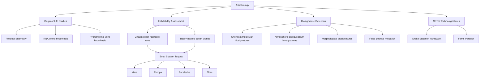

## Astrobiology and the Search for Life

### Overview

Astrobiology is the interdisciplinary study of the origin, evolution, distribution, and future of life in the universe, integrating biology, chemistry, geology, planetary science, and astronomy. It addresses three interconnected core questions: how life begins and evolves, whether life exists elsewhere in the universe, and what the future of life on Earth and beyond may hold. The field is fundamentally constrained by having only a single confirmed example of life (Earth's biosphere) from which to generalize.

### Origin of Life: Chemical Foundations

**Prebiotic chemistry**

The transition from non-living chemistry to living systems (abiogenesis) requires explaining the emergence of self-replicating, information-carrying, metabolically active systems from simpler precursor molecules. Key experimental and theoretical frameworks include:

- **Miller-Urey experiment (1953)**: Demonstrated that amino acids and other organic compounds can form spontaneously from simple inorganic precursors (methane, ammonia, hydrogen, water) under simulated early-Earth reducing atmospheric conditions and electrical discharge (lightning analog). Later reanalysis showed a broader diversity of amino acids formed than originally reported, though the atmospheric composition used is now considered less representative of actual early Earth conditions than originally assumed. [Fact: reanalysis findings well-documented; atmospheric composition critique reflects updated geochemical models]
- **RNA World hypothesis**: Proposes RNA as an early self-replicating, catalytically active (ribozyme) molecule capable of both information storage and catalysis, potentially predating DNA-protein-based biochemistry, addressing the "chicken-and-egg" problem of which came first, genetic material or catalytic enzymes
- **Hydrothermal vent hypothesis**: Proposes that submarine hydrothermal systems (particularly alkaline vents, e.g., analogs to the Lost City hydrothermal field) provided sustained chemical energy gradients, mineral catalytic surfaces, and compartmentalization structures conducive to prebiotic chemistry and early metabolism
- **Panspermia**: Hypothesis that life or its precursor organic molecules originated elsewhere and were transported to Earth via comets, meteorites, or interplanetary dust; distinguished from abiogenesis in that it addresses delivery rather than ultimate origin. [Speculation: interstellar/interplanetary panspermia for actual living organisms remains highly speculative; delivery of prebiotic organic precursor molecules via meteorites/comets is comparatively well-evidenced]

**Chirality and homochirality**

Terrestrial biochemistry exhibits near-universal homochirality (left-handed amino acids, right-handed sugars), the origin of which remains unresolved. Proposed mechanisms include asymmetric photolysis by circularly polarized light in star-forming regions, mineral-surface enantioselective catalysis, and statistical amplification of small initial chiral excesses. [Unverified: no single mechanism has achieved consensus support]

### Defining and Detecting "Life"

No single, universally agreed-upon definition of life exists; astrobiology commonly employs a working, non-exhaustive characterization emphasizing:

- Self-sustaining chemical systems capable of Darwinian evolution (a definition informally associated with NASA's working framework)
- Metabolism (energy and matter processing)
- Reproduction with heritable variation
- Response to environment (homeostasis)

This definitional ambiguity directly complicates biosignature interpretation, since any given definition may exclude non-terrestrial life forms based on unfamiliar biochemistries (the "carbon chauvinism" critique) or alternative solvent systems.

### Habitability Concepts

**Circumstellar habitable zone (CHZ)**: The orbital distance range around a star within which a planet could maintain liquid water on its surface given appropriate atmospheric conditions, bounded by the runaway greenhouse limit (inner edge) and the maximum greenhouse/CO₂ condensation limit (outer edge). Boundaries are model-dependent and vary with stellar spectral type, planetary atmospheric composition, and albedo assumptions. [Inference: exact CHZ boundaries differ meaningfully across published models depending on assumed atmospheric feedback processes]

**Beyond the classical habitable zone**: Subsurface liquid water oceans in icy moons (Europa, Enceladus, Titan, Ganymede) demonstrate that surface insolation is not a strict requirement for habitability, since tidal heating can sustain liquid water far outside the traditional CHZ — a major conceptual expansion of habitability criteria over the past several decades.

**Key habitability requirements** generally considered necessary (though not necessarily sufficient):

- Liquid solvent (typically water, though alternative solvents such as liquid methane/ethane on Titan are considered for non-terrestrial biochemistry)
- Available energy source (photosynthetic or chemosynthetic)
- Bioessential elements (commonly framed as CHNOPS: carbon, hydrogen, nitrogen, oxygen, phosphorus, sulfur)
- Environmental stability over timescales sufficient for evolutionary processes

### Biosignatures: Detection Frameworks

Biosignatures are measurable substances, patterns, or phenomena that provide evidence of past or present life, categorized broadly as:

- **Chemical/molecular biosignatures**: Specific organic molecules (e.g., certain lipid biomarkers), isotopic fractionation patterns (biological processes often preferentially use lighter isotopes, e.g., ¹²C over ¹³C, producing detectable isotopic signatures in carbon-bearing minerals), and chirality/homochirality patterns
- **Atmospheric biosignatures**: Gas-phase disequilibrium combinations that are difficult to sustain abiotically, most notably the co-occurrence of oxygen (O₂) and methane (CH₄) in Earth's atmosphere, which would rapidly react and deplete without continuous biological replenishment
- **Morphological/structural biosignatures**: Microfossils, stromatolites (layered sedimentary structures produced by microbial mat communities), and other biologically mediated sedimentary textures
- **Technosignatures**: Evidence of technology (radio emissions, industrial atmospheric pollutants, megastructures), distinct from biosignatures and specifically associated with the search for intelligent life

**False positive considerations**: A central challenge in biosignature science is ruling out abiotic mechanisms capable of mimicking apparent biosignatures. For example, atmospheric O₂ can be generated abiotically via photolysis of CO₂ or H₂O followed by hydrogen escape on planets around certain stellar types, meaning O₂ detection alone is not conclusive without corroborating context (e.g., co-detected reduced gases, planetary and stellar characteristics). [Inference: false-positive mitigation frameworks are an active area of ongoing methodological development in the exoplanet biosignature community]

### Solar System Astrobiology Targets

- **Mars**: Ancient lacustrine/fluvial deposits (Jezero Crater, Gale Crater) representing past habitable environments; current Mars Sample Return campaign aims to enable laboratory-precision biosignature analysis unattainable via remote/in-situ instruments alone
- **Europa**: Subsurface global ocean in likely contact with a rocky seafloor, potentially supporting chemosynthetic hydrothermal ecosystems analogous to terrestrial deep-sea vent communities; Europa Clipper is characterizing habitability (not directly searching for life)
- **Enceladus**: Direct plume sampling by Cassini confirmed organics, salts, and silica nanoparticles indicating active hydrothermal chemistry at the seafloor-ocean interface, making it one of the most direct, accessible ocean-world targets for future dedicated life-detection missions
- **Titan**: Distinct astrobiology framework based on hypothetical non-aqueous (liquid hydrocarbon solvent) biochemistry, alongside a probable subsurface water ocean providing a conventional aqueous habitability pathway as well; NASA's Dragonfly rotorcraft mission will investigate surface prebiotic chemistry
- **Venus**: Cloud-layer habitability hypothesis (moderate temperature/pressure zone in the upper atmosphere) remains highly speculative and contested, notably following a disputed 2020 phosphine detection claim that has not achieved consensus confirmation upon further analysis and re-observation. [Unverified: phosphine detection and its proposed biological interpretation remain actively disputed in the literature]

### Exoplanet Biosignature Search Strategy

Modern exoplanet astrobiology relies primarily on transmission and emission spectroscopy of exoplanet atmospheres during transit events, using facilities such as JWST, with future dedicated missions (e.g., NASA's planned Habitable Worlds Observatory) aiming for direct imaging and spectroscopic characterization of potentially habitable rocky exoplanets. Key observational targets include:

- Water vapor, CO₂, and CH₄ absorption features
- Disequilibrium gas combinations (O₂/CH₄)
- Surface reflectance features (the "red edge" vegetation analog, based on Earth's chlorophyll reflectance signature, though its universality to non-terrestrial photosynthetic biochemistry is uncertain) [Speculation: red-edge-type surface biosignatures assume convergent photosynthetic pigment evolution, which may not generalize]

Current JWST-era observations of potentially habitable rocky exoplanets (e.g., TRAPPIST-1 system planets) have provided atmospheric constraints but have not yet yielded confirmed biosignature detections as of the most recent published results. [Fact: reflects published status; verify against most recent JWST observational campaigns for real-time updates, given the rapid pace of this subfield]

### The Drake Equation and SETI

For the search for intelligent, communicating life, the **Drake Equation** provides a heuristic (not predictive) framework for estimating the number of detectable civilizations in the galaxy:

$$N = R_* \cdot f_p \cdot n_e \cdot f_l \cdot f_i \cdot f_c \cdot L$$

where $R_*$ is the average star formation rate, $f_p$ is the fraction of stars with planets, $n_e$ is the average number of habitable planets per system with planets, $f_l$ is the fraction of habitable planets that develop life, $f_i$ is the fraction that develop intelligent life, $f_c$ is the fraction that develop detectable technology, and $L$ is the average length of time such civilizations broadcast detectable signals.

Most terms remain highly uncertain or entirely unconstrained by direct evidence, making the equation primarily a tool for organizing discussion of unknowns rather than a quantitatively predictive model. [Inference: this interpretive framing is the standard scientific consensus view of the equation's utility]

**SETI (Search for Extraterrestrial Intelligence)** programs primarily conduct radio and optical searches for artificial signals (technosignatures), operating under assumptions about signal characteristics that may not generalize to genuinely alien communication or technology paradigms.

### Fermi Paradox

The apparent contradiction between the statistically high estimated probability of extraterrestrial civilizations (given the vast number of stars and potentially habitable planets) and the complete absence of confirmed contact or detection evidence. Proposed resolutions span a wide range, including:

- Rarity of abiogenesis or the emergence of intelligence (the "Great Filter" concept, which may lie in the past — meaning intelligent life is genuinely rare — or in the future — meaning it exists but tends to self-destruct or fail to expand)
- Technological, economic, or physical constraints on interstellar communication/travel
- Deliberate non-contact (a highly speculative category including "zoo hypothesis" scenarios)

[Speculation: all Fermi Paradox resolution hypotheses remain fundamentally unfalsifiable given current observational capability, and none has achieved scientific consensus]

### Astrobiology Search Framework Diagram

### Key Points

- Astrobiology integrates multiple disciplines to address origin-of-life chemistry, habitability, biosignature detection, and the search for intelligent life, constrained by a single known example of life (Earth's).
- Habitability criteria have expanded significantly beyond the classical circumstellar habitable zone to include tidally-heated subsurface ocean worlds.
- Biosignature interpretation is fundamentally challenged by abiotic false-positive mechanisms, requiring corroborating contextual evidence rather than single-molecule detections.
- The Drake Equation and Fermi Paradox function as organizing conceptual frameworks for discussing deep uncertainty rather than as predictive or resolved scientific models.
- Current highest-priority direct-evidence targets (Enceladus, Europa, Mars) each offer distinct, complementary pathways for testing habitability and biosignature hypotheses.

### Related Topics

- RNA World hypothesis and ribozyme catalytic chemistry
- Europa Clipper and Enceladus plume sampling mission architectures
- JWST exoplanet atmospheric spectroscopy techniques
- Habitable Worlds Observatory mission concept and direct imaging strategy
- Extremophile biology as an analog for non-terrestrial habitability limits
- Isotopic fractionation as a biosignature detection method
- Great Filter hypothesis and long-term civilization survival modeling
- Venus cloud-layer habitability debate and phosphine detection controversy