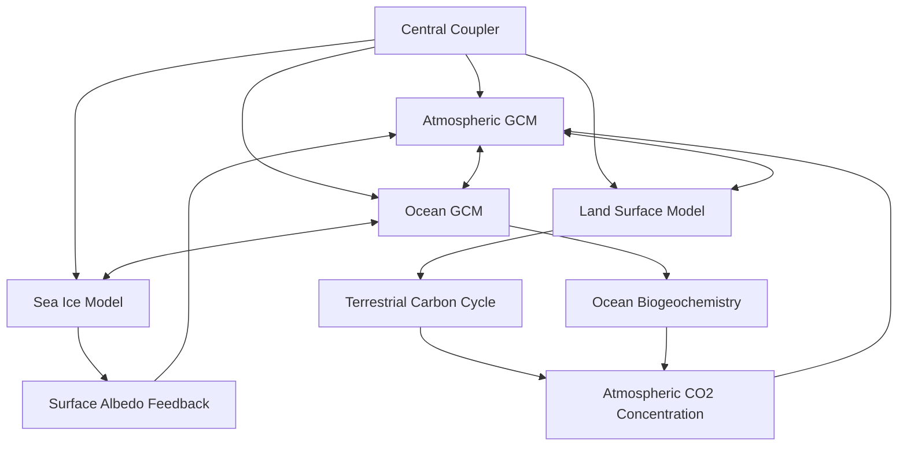

## Integrated Earth System Modeling

### Overview

Integrated Earth System Modeling (ESM) is the practice of numerically coupling the physical climate system (atmosphere, ocean, sea ice, land surface) with biogeochemical, cryospheric, and ecological process components into a unified simulation framework. Unlike earlier general circulation models (GCMs) that simulated physical climate alone, ESMs explicitly represent two-way feedbacks between climate and biogeochemical cycles (carbon, nitrogen, and related elemental cycles), enabling prediction of both physical climate change and its interaction with the biosphere, cryosphere, and human systems.

### Core Architecture

**Coupled component structure**

Based on a physical climate "core," Earth system models simulate numerous complex relationships and feedbacks among the atmosphere, biosphere and cryosphere to model energy and mass transfer across domains. The standard ESM architecture consists of individually developed component models exchanging state variables and fluxes through a central coupling infrastructure: [Copernicus](https://gmd.copernicus.org/articles/19/2849/2026/)

- **Atmospheric General Circulation Model (AGCM)**: Solves primitive fluid dynamics equations on a global grid, handling radiative transfer, cloud microphysics, convection parameterization, and atmospheric chemistry
- **Ocean General Circulation Model (OGCM)**: Simulates ocean circulation, heat and salt transport, and increasingly, ocean biogeochemistry (carbon uptake, nutrient cycling, marine ecosystem dynamics)
- **Land Surface Model (LSM)**: Represents surface energy/water/carbon balance, vegetation dynamics, soil processes, and increasingly dynamic vegetation and land-use change modules
- **Sea Ice Model**: Simulates ice thermodynamics, dynamics (drift, deformation), and its albedo feedback effects on the surface energy budget
- **Coupler**: Software infrastructure (e.g., frameworks such as OASIS or ESMF-based couplers) that regularizes timestep synchronization, grid remapping (regridding between component-specific native grids), and flux exchange between components

**Biogeochemical cycle integration**

The defining feature distinguishing ESMs from earlier physical-climate-only GCMs is the explicit, interactive coupling of biogeochemical cycles: the CMIP7 Earth System data request contains requirements for the analysis of carbon, nitrogen, water, and other cycles and their interactions with the physical climate, the biosphere, and reservoirs. This allows carbon-climate feedbacks (e.g., permafrost carbon release under warming, ocean carbon uptake sensitivity to circulation changes, terrestrial ecosystem carbon storage response to CO₂ fertilization and drought stress) to be simulated prognostically rather than prescribed as fixed boundary conditions. [Copernicus](https://gmd.copernicus.org/articles/19/2849/2026/gmd-19-2849-2026.pdf)

### The Coupled Model Intercomparison Project (CMIP) Framework

**Purpose and structure**

The Coupled Model Intercomparison Project is an international consortium of climate modeling groups that produce coordinated experiments in order to evaluate human influence on the climate and test knowledge of Earth systems. CMIP provides standardized experimental protocols, forcing datasets, and output variable specifications that allow dozens of independently developed ESMs from modeling centers worldwide to be run under common conditions and directly compared, forming the primary evidence base for IPCC assessment reports. [Copernicus](https://gmd.copernicus.org/articles/19/2849/2026/)

**CMIP7 (current generation, as of 2026)**

A new set of scenarios has been published for the seventh phase of the Coupled Model Intercomparison Project, replacing the scenarios that drove the previous generation of climate models featured in the IPCC's sixth assessment report. Key developments include: [Carbon Brief](https://www.carbonbrief.org/explainer-the-cmip7-emissions-scenarios-and-how-they-explore-future-climate-change)

- High-level scenario details were published in Geoscientific Model Development in April 2026, with underlying emissions data released into the public domain by the ScenarioMIP team on September 1, and initial model results expected later in the year. [Carbon Brief](https://www.carbonbrief.org/explainer-the-cmip7-emissions-scenarios-and-how-they-explore-future-climate-change)
- The new scenario set contains seven scenarios formulated as emissions pathways now being run through Earth system models to project future climate outcomes, replacing the SSP (Shared Socioeconomic Pathway) framework used in CMIP6. [Wcrp-cmip](https://wcrp-cmip.org/explainer-scenarios-for-cmip7/)
- Two notable changes from CMIP6: the highest emissions scenario now produces lower emissions than previous high-end scenarios (RCP8.5/SSP5-8.5), while the lowest emissions scenario's preliminary temperature estimate no longer stays below 1.5°C. [Wcrp-cmip](https://wcrp-cmip.org/explainer-scenarios-for-cmip7/)
- The scenario revision was motivated partly because the prior SSP scenarios, finalized using historical data through 2015, had become outdated relative to real-world emissions trajectories by the time of CMIP6/AR6 assessment. [WCRP](https://www.wcrp-climate.org/news/science-highlights/2413-cmip7-scenarios-explainer-2026)
- The CMIP7 Earth System (CMIP7-ES) data request theme centers on tracking flows of energy, carbon, water, and other fluxes across domains, and constraining feedbacks between these cycles and the climate system, expected to serve as a core contribution to the IPCC's seventh assessment cycle (AR7). [Copernicus](https://gmd.copernicus.org/articles/19/2849/2026/gmd-19-2849-2026-discussion.html)

**Forcing datasets**: The CMIP Forcing Task Team develops and documents forcing data for CMIP7-participating models, with updated stratospheric aerosol and historical volcanic sulfur dioxide emission datasets differing substantially from their CMIP6 predecessors, potentially affecting simulated historical climate evolution compared to earlier model generations. [Copernicus](https://essd.copernicus.org/articles/special_issue365_1307.html)

### Key Feedback Mechanisms Represented in ESMs

- **Carbon-climate feedback**: Warming alters natural carbon sink efficiency (ocean solubility, terrestrial photosynthesis/respiration balance), which in turn affects atmospheric CO₂ and further warming — a feedback loop requiring interactive (not prescribed) carbon cycle representation
- **Ice-albedo feedback**: Reduced sea ice/snow cover lowers surface albedo, increasing absorbed solar radiation and amplifying warming, particularly pronounced in Arctic amplification
- **Water vapor feedback**: Warmer atmosphere holds more water vapor (a potent greenhouse gas), amplifying initial warming — the single largest positive feedback in most ESMs
- **Cloud feedbacks**: Represent the largest source of inter-model spread in climate sensitivity estimates, since cloud formation, phase, and radiative properties occur at sub-grid scales requiring parameterization rather than direct resolution
- **Permafrost carbon feedback**: Thawing permafrost releases previously frozen organic carbon as CO₂ and methane, representing a potentially significant but still uncertainly quantified amplifying feedback

### Tipping Points and Nonlinear Dynamics

A growing focus of modern ESM research is the identification and characterization of potential **climate tipping elements** — components of the Earth system capable of abrupt, potentially irreversible transitions once critical thresholds are crossed. Given that Earth system components are complex non-linear systems in their own right, coupled to one another and interacting across many different spatio-temporal scales, precisely characterizing what critical transitions could occur, or when, remains very difficult, though the possibility that such transitions might occur cannot be excluded, as several Earth system components show susceptibility to this kind of behavior. [Inference: specific tipping point thresholds (e.g., for AMOC collapse, ice sheet collapse, Amazon dieback) remain associated with substantial quantitative uncertainty across the modeling literature] [Copernicus](https://gmd.copernicus.org/articles/19/2849/2026/gmd-19-2849-2026.pdf)[Copernicus](https://gmd.copernicus.org/articles/19/2849/2026/gmd-19-2849-2026.pdf)

Commonly discussed candidate tipping elements include:

- Atlantic Meridional Overturning Circulation (AMOC) weakening or collapse
- Greenland and West Antarctic ice sheet destabilization
- Amazon rainforest dieback under combined warming and deforestation stress
- Arctic permafrost abrupt thaw
- Coral reef ecosystem collapse under thermal stress

### Model Evaluation and Uncertainty Quantification

**Climate sensitivity metrics**: Recent scenario frameworks are calibrated to match assessed climate sensitivity ranges, using an ensemble median equilibrium climate sensitivity (ECS) around 3°C with a 5-95% range of approximately 2.0-5.1°C, alongside constraints from historical warming and ocean heat content observations, providing a key benchmark against which individual ESM outputs are evaluated and, in some cases, weighted. [Carbon Brief](https://www.carbonbrief.org/explainer-the-cmip7-emissions-scenarios-and-how-they-explore-future-climate-change)

**Structural uncertainty sources**:

- Parameterization choices for sub-grid processes (convection, cloud microphysics, turbulent mixing) that cannot be explicitly resolved at typical ESM grid resolutions (commonly tens to ~100 km horizontally)
- Divergent representations of carbon cycle processes across modeling centers, producing a wide spread in projected carbon-climate feedback strength
- Initial condition and internal variability spread, addressed through large ensemble simulations (multiple runs of the same model with slightly perturbed initial conditions) to separate forced response from natural variability

**Model hierarchy approach**: ESM development typically employs a hierarchy from simplified energy balance models through intermediate-complexity models to full-complexity coupled ESMs, allowing process-level understanding developed in simpler models to inform and validate more complex model behavior.

### Data Infrastructure and Standardization

CMIP7 data requests are organized into scientific "opportunities" submitted by modelling groups and scientific consortia following an extended public consultation process, with each opportunity containing requests for groups of Climate and Forecasting (CF) standard variables, bundled into variable groups representing all data required to address that opportunity's scientific needs. This standardized variable-naming and metadata framework (building on the CF conventions) enables consistent multi-model comparison and downstream reanalysis across the international modeling community. [EGUsphere](https://egusphere.copernicus.org/preprints/2025/egusphere-2025-3246/)

### Applications Beyond Physical Projection

- **Detection and attribution studies**: Isolating the anthropogenic forcing signal from natural variability in observed climate trends, using large ensembles and counterfactual (pre-industrial control) simulations
- **Impact and adaptation modeling**: Downscaling coarse-resolution ESM output to regional scales for use in agricultural, hydrological, and infrastructure impact assessments
- **Policy-relevant scenario analysis**: Analysis contributing to research on climate impacts, adaptation, and vulnerability, alongside complementary scenario frameworks bridging climate projections with national-level climate action and financial-sector risk assessment. [Wcrp-cmip](https://wcrp-cmip.org/explainer-scenarios-for-cmip7/)

### ESM Coupling Architecture Diagram

### Key Points

- ESMs extend physical climate GCMs by explicitly coupling biogeochemical cycles (carbon, nitrogen) and cryospheric/ecological processes, enabling prognostic simulation of climate-biosphere feedbacks rather than prescribed boundary conditions.
- CMIP provides the international standardization framework enabling direct multi-model comparison; CMIP7 introduces a revised seven-scenario emissions framework replacing the CMIP6-era SSP scenarios, feeding into the IPCC's AR7 assessment cycle.
- Key amplifying feedbacks (carbon-climate, ice-albedo, water vapor, permafrost carbon) and damping feedbacks are represented with varying degrees of confidence, with cloud feedbacks remaining the largest source of inter-model sensitivity spread.
- Tipping point dynamics represent a growing ESM research focus but remain characterized by substantial threshold and timing uncertainty due to the deeply coupled, nonlinear nature of Earth system components.
- Structural and parameterization uncertainty, alongside internal variability, are addressed through model hierarchies, large ensembles, and standardized multi-model intercomparison rather than reliance on any single model.

### Related Topics

- CMIP7 ScenarioMIP emissions pathway framework and AR7 assessment cycle
- Climate tipping elements and early-warning signal detection methods
- Carbon cycle feedback quantification and permafrost carbon release modeling
- Regional downscaling techniques for impact and adaptation assessment
- Large ensemble simulation design for internal variability separation
- Ocean biogeochemistry modeling and marine carbon uptake projections
- Detection and attribution methodology in climate science
- Model hierarchy approaches from energy balance models to full ESMs