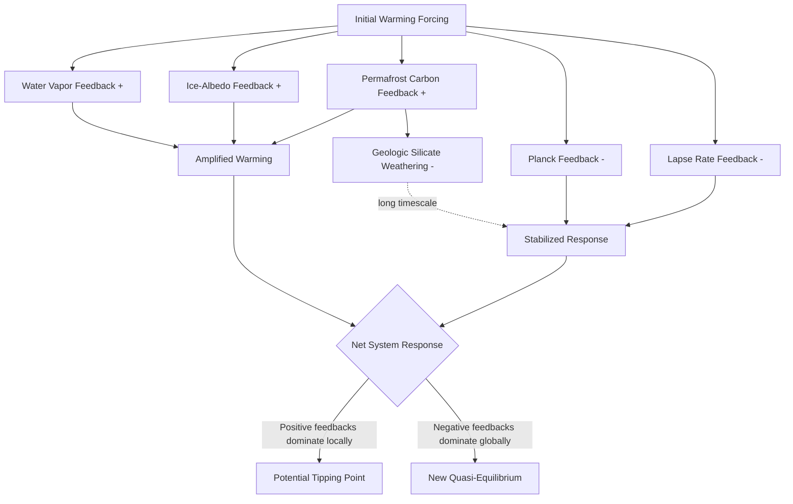

## Feedback Loops Across Earth Systems

### Overview

Feedback loops are mechanisms by which a change in one component of the Earth system produces effects that either amplify (positive/reinforcing feedback) or dampen (negative/balancing feedback) the original change. Earth's climate and biogeochemical stability over geologic time reflect a complex network of interacting feedback loops spanning the atmosphere, hydrosphere, cryosphere, lithosphere, and biosphere, operating across timescales from days to millions of years.

### Fundamental Feedback Concepts

**Positive (reinforcing) feedback**: A perturbation triggers a response that further amplifies the original perturbation in the same direction, potentially leading to runaway or accelerating change if unchecked by other processes.

**Negative (balancing) feedback**: A perturbation triggers a response that counteracts and dampens the original perturbation, tending to stabilize the system around an equilibrium state.

**Feedback strength and climate sensitivity**: Overall system response is quantified using a feedback parameter framework, where the net radiative response to a given forcing determines equilibrium climate sensitivity:

$$\Delta T = \frac{\Delta F}{-\lambda}$$

where $\Delta T$ is the equilibrium temperature change, $\Delta F$ is the radiative forcing (W/m²), and $\lambda$ is the net feedback parameter (W/m²/K), summing contributions from all individual feedback mechanisms (water vapor, lapse rate, albedo, cloud, and others). A more negative $\lambda$ indicates a more stable (strongly damped) system; feedbacks that push $\lambda$ toward zero or positive values indicate runaway instability potential.

### Major Positive (Amplifying) Feedbacks

**Water vapor feedback**

The single largest positive feedback in Earth's climate system. Warmer air holds more water vapor (following the Clausius-Clapeyron relationship), and since water vapor is itself a potent greenhouse gas, this additional vapor further amplifies warming. This feedback alone roughly doubles the direct warming effect of CO₂ forcing in most climate model estimates. [Inference: exact doubling magnitude varies modestly across models but this feedback's dominant amplifying role is well-established consensus science]

**Ice-albedo feedback**

Reduced snow and sea ice cover exposes darker underlying ocean or land surfaces, lowering overall surface albedo and increasing absorbed solar radiation, which drives further warming and further ice loss. This feedback is a primary driver of Arctic amplification, the observed phenomenon of the Arctic warming at a substantially faster rate than the global average.

**Permafrost carbon feedback**

Warming thaws previously frozen permafrost soils, enabling microbial decomposition of long-stored organic carbon, releasing CO₂ and methane back to the atmosphere and further amplifying warming. The magnitude and timing of this feedback remain among the more uncertain quantities in Earth system projections due to complex interactions between thaw depth, soil moisture, and microbial activity rates. [Unverified: precise permafrost carbon feedback magnitude remains an active area of model refinement]

**Cloud feedbacks (net effect uncertain in sign for some cloud types)**

Changes in cloud cover, altitude, and optical properties in response to warming can either amplify or dampen warming depending on cloud type and location. High, thin cirrus clouds tend to trap outgoing longwave radiation (warming effect), while low, thick stratocumulus clouds tend to reflect incoming solar radiation (cooling effect). The net global cloud feedback is currently assessed as likely positive (amplifying) but remains the largest single source of spread across climate model sensitivity estimates. [Inference: sign and magnitude of regional cloud feedback components remain actively debated in the literature]

**Methane hydrate and clathrate destabilization**

Warming ocean and permafrost temperatures could potentially destabilize methane clathrate (hydrate) deposits, releasing additional methane. This mechanism is considered a lower-probability but high-impact feedback on longer timescales, though the magnitude and rate of any large-scale destabilization remains poorly constrained. [Speculation: catastrophic large-scale clathrate release scenarios are not supported by current geologic evidence as an imminent risk, though smaller-scale, localized destabilization is observed]

### Major Negative (Damping) Feedbacks

**Planck (blackbody) feedback**

The most fundamental stabilizing feedback: as a planetary surface warms, it emits more outgoing longwave radiation (following the Stefan-Boltzmann relationship, $\propto T^4$), which acts to restore radiative balance and counteracts further warming. This is the baseline feedback against which all other feedbacks are compared and is negative (stabilizing) by fundamental physical law.

**Lapse rate feedback (partially negative in most regions)**

Changes in the vertical temperature profile of the atmosphere with warming — generally, the upper troposphere warms more than the surface in the tropics (due to moist adiabatic processes), increasing outgoing longwave radiation more effectively than uniform warming would, producing a net negative (stabilizing) contribution in most latitudes, though this varies regionally and is complicated by asymmetric high-latitude behavior.

**Silicate weathering feedback (geologic timescale)**

Operating over 100,000 to millions of years, increased atmospheric CO₂ and warming accelerate chemical weathering of silicate rocks, which consumes atmospheric CO₂ and ultimately sequesters carbon as carbonate minerals via ocean deposition, acting as Earth's primary long-term thermostat regulating atmospheric CO₂ over geologic time. This is the principal mechanism explaining Earth's long-term climate stability despite a steadily increasing solar luminosity over ~4.5 billion years (the "faint young Sun paradox" resolution).

**Ocean carbon uptake (partial negative feedback, weakening over time)**

Oceans absorb a substantial fraction of anthropogenic CO₂ emissions via solubility and biological pumps, providing a damping effect on atmospheric CO₂ accumulation. However, this feedback strength is projected to weaken as ocean warming reduces CO₂ solubility and as surface ocean carbonate chemistry shifts (ocean acidification) reduce buffering capacity, meaning the negative feedback is not constant but degrades under sustained forcing.

### Coupled Multi-System Feedback Chains

Earth system feedbacks frequently operate through coupled chains spanning multiple system domains rather than isolated single-variable loops:

**Example chain — Arctic sea ice loss cascade**:

1. Warming reduces Arctic sea ice extent (cryosphere)
2. Reduced ice-albedo increases ocean heat absorption (ocean-atmosphere coupling)
3. Increased open water enhances atmospheric moisture flux and alters jet stream dynamics (atmosphere)
4. Altered circulation patterns influence mid-latitude weather extremes and potentially accelerate permafrost thaw at lower latitudes (biosphere-lithosphere)
5. Permafrost carbon release further amplifies the original warming forcing (closing the loop)

**Example chain — AMOC-freshwater feedback**:

1. Greenland ice sheet melt introduces freshwater into the North Atlantic (cryosphere-ocean)
2. Freshwater input reduces surface water density, weakening deep water formation (ocean circulation)
3. Weakened Atlantic Meridional Overturning Circulation (AMOC) reduces northward heat transport (ocean-atmosphere)
4. Regional cooling in the North Atlantic contrasts with continued global warming elsewhere, potentially altering precipitation patterns across multiple continents (atmosphere-biosphere impacts)

These multi-domain chains illustrate why isolated single-component feedback analysis is generally insufficient for robust Earth system prediction, motivating the fully coupled Earth System Model approach.

### Feedbacks and Tipping Point Dynamics

When positive feedbacks become sufficiently strong relative to stabilizing (negative) feedbacks within a subsystem, the system can cross a threshold beyond which change becomes self-sustaining even without continued external forcing — a **tipping point**. Candidate Earth system tipping elements associated with strong internal positive feedback loops include:

- **AMOC collapse**: Self-reinforcing freshwater-driven weakening feedback (described above) potentially crossing a bistability threshold
- **Greenland/West Antarctic ice sheet collapse**: Elevation-mass balance feedback, where ice sheet thinning lowers surface elevation into warmer air layers, accelerating further melt
- **Amazon rainforest dieback**: Forest loss reduces regional evapotranspiration and rainfall recycling, potentially triggering further forest die-back and a transition toward savanna-like states
- **Arctic permafrost abrupt thaw**: Thermokarst and abrupt thaw processes can proceed faster than gradual thaw models predict, representing a potential threshold-crossing acceleration

Given that Earth system components are complex non-linear systems in their own right, coupled to one another and interacting across many different spatio-temporal scales, precisely characterizing which critical transitions could occur, or when, remains very difficult — though the possibility that such transitions might occur cannot be excluded, given that several Earth system components demonstrably exhibit this kind of threshold behavior.

### Detection and Modeling Challenges

- **Feedback disentanglement**: Because multiple feedbacks operate simultaneously and interact nonlinearly, isolating the individual contribution of any single feedback mechanism from observational data alone is difficult, motivating controlled climate model experiments (e.g., feedback decomposition techniques such as the Cess/Gregory regression methods)
- **Timescale separation challenges**: Feedbacks operate across vastly different timescales (water vapor: days; ice-albedo: years to decades; permafrost carbon: decades to centuries; silicate weathering: 10⁴–10⁶ years), requiring different modeling and observational approaches for each
- **Early warning signal research**: An active research area seeks statistical indicators (e.g., increasing variance or autocorrelation in system time series, termed "critical slowing down") that might provide advance warning of an approaching tipping point, though the reliability and lead time of such signals for real-world Earth system tipping elements remains an open scientific question. [Unverified: early warning signal detection methods are actively researched but not yet established as reliably predictive for large-scale Earth system tipping elements]

### Feedback Loop Network Diagram

### Key Points

- Feedback loops are classified as positive (amplifying) or negative (damping), with the net sum of all feedback contributions determining overall climate sensitivity via the feedback parameter framework.
- The Planck feedback provides the fundamental stabilizing baseline; water vapor, ice-albedo, and permafrost carbon feedbacks are the dominant amplifying mechanisms on human-relevant timescales, while silicate weathering governs long-term geologic stability.
- Cloud feedbacks remain the largest source of quantitative uncertainty in overall climate sensitivity estimates, with net effect currently assessed as likely positive but regionally variable.
- Feedbacks frequently operate through coupled, cross-domain chains (e.g., ice loss → circulation change → permafrost thaw) rather than in isolation, necessitating fully coupled Earth System Models for robust prediction.
- Sufficiently strong positive feedback dominance within a subsystem can produce tipping point behavior, though precise thresholds and timing remain difficult to characterize given the deeply nonlinear, multi-timescale nature of Earth system interactions.

### Related Topics

- Equilibrium climate sensitivity estimation methods (Cess/Gregory regression techniques)
- Arctic amplification mechanisms and observational trends
- AMOC stability and freshwater forcing thresholds
- Silicate weathering thermostat and the faint young Sun paradox
- Early warning signals and critical slowing down detection methods
- Permafrost carbon feedback quantification and abrupt thaw processes
- Integrated Earth System Modeling architecture and CMIP feedback decomposition experiments
- Ocean acidification and the weakening of oceanic carbon uptake feedback