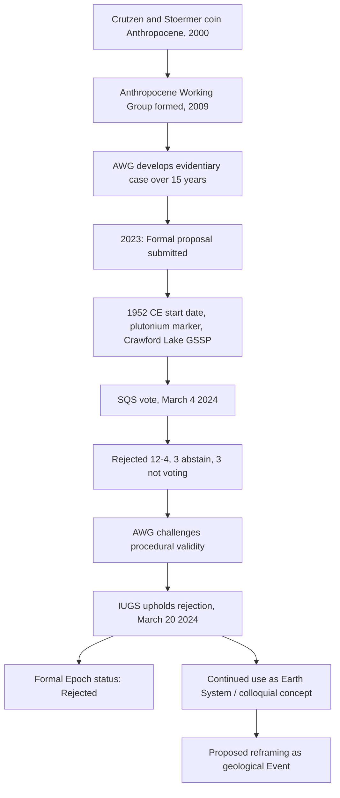

## The Anthropocene Concept

### Overview

The Anthropocene is a proposed and widely used concept describing the current period of Earth history, in which human activity has become a dominant, globally detectable force shaping the planet's atmosphere, oceans, biosphere, and lithosphere. Although the term has achieved broad usage across Earth system science, environmental policy, and popular discourse, it was formally rejected in 2024 as an official geologic epoch on the International Chronostratigraphic Chart, creating an important and often misunderstood distinction between the Anthropocene as a scientifically and colloquially useful descriptive concept versus its status within formal geologic time nomenclature.

### Conceptual Origins

The term was popularized in 2000 by Nobel Laureate atmospheric chemist Paul Crutzen and biologist Eugene Stoermer, who argued that human, or anthropogenic, influence on planetary ecosystems had become so dominant and destabilizing as to warrant recognition as a distinct new phase of Earth history, listing multiple examples of pervasive human impact on the natural environment in the newsletter of the International Geosphere-Biosphere Programme. Crucially, the concept did not originate from the stratigraphic (rock-record) tradition that defines formal geologic time units — it arose instead from Earth system science as a description of a present planetary state significantly diverging from Holocene baseline conditions, a distinction that became central to the later formal geologic debate.

### Formalization Process: The Anthropocene Working Group

**Institutional structure**

The Anthropocene Working Group (AWG) was formally established in 2009 by the Subcommission on Quaternary Stratigraphy (SQS), itself a constituent body of the International Commission on Stratigraphy (ICS), which in turn operates under the International Union of Geological Sciences (IUGS) — the body with final jurisdiction over additions to the official Geologic Time Scale.

**Proposal development**

The AWG's mandate was to develop a formal proposal outlining geological evidence sufficient to support a distinct Anthropocene epoch. In 2023, the AWG submitted a formal proposal defining the Anthropocene epoch as beginning in 1952 CE, using elevated plutonium isotope concentrations (from mid-20th-century nuclear weapons testing) as the primary chronostratigraphic marker, with Crawford Lake in Ontario, Canada selected as the reference site (Global Boundary Stratotype Section and Point, or "golden spike" location) intended to mark the globally synchronous end of the Holocene.

### The 2024 Rejection Decision

**Voting outcome**

On March 4, 2024, the 22-member IUGS Subcommission on Quaternary Stratigraphy voted on the AWG's proposal, rejecting it by a tally of 12 to 4, with three abstaining and three not voting. Following procedural challenges from AWG members alleging irregularities in the voting process, the IUGS reviewed and, on March 20, 2024, formally upheld the rejection as final, with the IUGS and ICS issuing a joint statement declaring their decision to reject the proposal for an Anthropocene Epoch as a formal unit of the Geologic Time Scale.

**Distinction: epoch rejection vs. Anthropocene rejection**

A critical and frequently misunderstood point is that the vote rejected specifically the AWG's proposed formal Epoch definition (with its 1952 start date and plutonium marker) — it did not constitute a rejection of the broader scientific validity of significant, planet-scale anthropogenic impact. Following the decision, some stratigraphers (including Philip Gibbard, who originally proposed the AWG's formation) have suggested reframing the Anthropocene as a geological **"event"** rather than a formal chronostratigraphic epoch — a category used elsewhere in the geologic time scale for significant but non-epoch-defining occurrences, considering the depth and duration of human impact on Earth systems. [Inference: "event" reframing represents one proposed resolution among stratigraphers, not a formally adopted alternative classification as of the most recent reporting]

**Reasons cited for rejection** include disagreements over:

- Whether a single, precise global start date (1952) adequately captures a process of human impact that many argue began earlier and diachronously (varying by region) rather than as a single synchronous event
- Whether the plutonium/mid-20th-century "Great Acceleration" framing adequately represents the full scope of human Earth system impact, including earlier agricultural, industrial, and land-use transformations
- Procedural and jurisdictional questions about the SQS vote's validity, which were raised by AWG members but ultimately did not overturn the outcome

### Continued Scientific and Public Usage

Despite formal rejection as a geologic epoch, geologists inside and outside the AWG continue to investigate and publish on the Anthropocene and its stratigraphic archives, which remains a timely research area for the geosciences and a pressing topic of concern for broader society. The term continues to be widely used across:

- Earth system science literature, where it functions as a diagnosis of the present state of the planet and a forecast for future trajectory, independent of formal stratigraphic status
- Environmental policy and international governance discourse
- Popular science communication and public environmental awareness contexts

### Proposed Evidentiary Markers (Regardless of Formal Status)

The scientific case for anthropogenic Earth system transformation, as compiled by AWG research over more than a decade, rests on multiple converging physical and chemical signal types:

- **Radionuclide markers**: Global fallout of plutonium and other isotopes from mid-20th-century atmospheric nuclear weapons testing, providing a near-instantaneous, globally synchronous signal detectable in sediment, ice cores, and other archives
- **Novel materials ("technofossils")**: Plastics, aluminum, concrete, and other anthropogenic materials increasingly preserved in the sedimentary and geologic record, representing physical markers with no natural analog
- **Geochemical perturbations**: Elevated atmospheric CO₂ and altered carbon/nitrogen isotopic ratios, ocean acidification signatures, and widespread heavy metal and persistent organic pollutant contamination
- **Biostratigraphic signal**: Dramatic, globally correlated shifts in species distributions, extinction rates, and the geographic spread of domesticated and invasive species, sometimes discussed under the framework of a sixth mass extinction
- **Land-use and geomorphic modification**: Large-scale sediment transport alteration via damming, agriculture, and urbanization, along with the sheer physical mass of the "technosphere" (built infrastructure and material goods) now representing a globally significant geological-scale mass accumulation

### The Anthropocene in Earth System Science Framing (Independent of Stratigraphy)

Within Earth system science (as distinct from formal stratigraphy), the Anthropocene concept is typically operationalized through the **Great Acceleration** framework — a set of coupled socioeconomic and Earth system trend graphs (population, GDP, energy use, atmospheric CO₂, biodiversity loss, and others) showing a dramatic, near-simultaneous inflection point beginning around the mid-20th century, used to argue that human systems and Earth systems have become tightly coupled and mutually dependent on human-relevant, rather than purely geologic, timescales.

This framing connects directly to the **planetary boundaries** concept, which identifies a set of Earth system processes (climate change, biosphere integrity, biogeochemical flows, ocean acidification, land-system change, freshwater use, stratospheric ozone depletion, atmospheric aerosol loading, and novel entities/chemical pollution) with proposed safe operating thresholds, several of which are assessed as already transgressed or approaching transgression under current human activity trajectories. [Inference: specific boundary transgression assessments are periodically updated by the planetary boundaries research framework and should be checked against current published assessments for the most recent status]

### Timeline and Governance Structure Diagram

### Key Points

- The Anthropocene concept originated in Earth system science (Crutzen and Stoermer, 2000) as a description of humanity's planetary-scale influence, distinct from and preceding its later formal stratigraphic evaluation.
- The Anthropocene Working Group's 2023 proposal defined a 1952 CE epoch start date using a plutonium isotope marker at Crawford Lake, Canada, but was rejected by SQS vote in March 2024 and upheld as final by the IUGS later that month.
- The rejection applies specifically to formal epoch status on the Geologic Time Scale; it does not negate the underlying scientific evidence for significant, globally detectable anthropogenic Earth system change, and some stratigraphers have proposed reframing it as a geological "event" instead.
- The concept remains in active, widespread scientific and public use through complementary frameworks such as the Great Acceleration and planetary boundaries, which operate independently of formal chronostratigraphic nomenclature.
- Evidentiary markers proposed for the Anthropocene span radionuclide fallout, novel materials ("technofossils"), geochemical perturbations, biostratigraphic shifts, and large-scale geomorphic modification.

### Related Topics

- Great Acceleration framework and coupled socioeconomic-Earth system trend indicators
- Planetary boundaries concept and safe operating space assessments
- Geologic Time Scale structure and formal chronostratigraphic nomenclature (GSSP process)
- Sixth mass extinction hypothesis and biodiversity loss trends
- Technofossils and the stratigraphic signature of the technosphere
- Ocean acidification and anthropogenic biogeochemical cycle perturbation
- Holocene climate stability and its role as the Anthropocene's baseline comparison state
- Integrated Earth System Modeling and its role in projecting Anthropocene trajectories