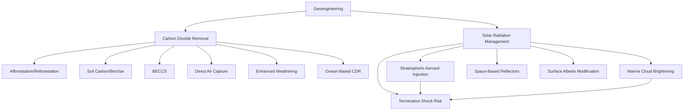

## Geoengineering Approaches

### Overview

Geoengineering (also termed climate engineering or climate intervention) refers to deliberate, large-scale interventions in Earth's climate system intended to counteract anthropogenic climate change. Approaches are conventionally divided into two fundamentally distinct categories: Carbon Dioxide Removal (CDR), which addresses the root cause by extracting greenhouse gases from the atmosphere, and Solar Radiation Management (SRM), which addresses the symptom by reflecting incoming solar radiation to reduce warming without altering atmospheric greenhouse gas concentrations. These categories differ substantially in mechanism, reversibility, risk profile, and governance status.

### Carbon Dioxide Removal (CDR): Overview

CDR methods aim to durably remove CO₂ already present in the atmosphere and store it in stable reservoirs (geologic formations, oceans, biomass, or minerals), directly reducing radiative forcing at its source. CDR is generally considered to carry lower and more localized environmental risk than SRM, since it does not introduce novel, large-scale perturbations to atmospheric radiative or circulation dynamics, but is typically constrained by cost, energy requirements, and storage capacity/permanence considerations.

**Afforestation and Reforestation**

Establishing new forests or restoring degraded forest land to sequester carbon through photosynthesis and biomass accumulation. Advantages include co-benefits for biodiversity and soil health; limitations include land competition with agriculture, sequestration reversibility risk (fire, disease, land-use change), and finite realistic global sequestration potential relative to total emissions.

**Soil Carbon Sequestration**

Agricultural practices (reduced tillage, cover cropping, biochar application) that increase soil organic carbon storage. Biochar — pyrolyzed biomass added to soil — provides relatively stable carbon storage (potentially centuries-scale) alongside soil fertility co-benefits, though total realistic sequestration capacity remains modest relative to global emissions volumes.

**Bioenergy with Carbon Capture and Storage (BECCS)**

Growing biomass (which absorbs atmospheric CO₂ during growth), then combusting it for energy while capturing and geologically storing the resulting CO₂ emissions, producing net-negative emissions in principle. BECCS features prominently in many IPCC mitigation pathway scenarios but faces significant land-use competition concerns (competing with food production and natural ecosystems) and questions about achievable deployment scale. [Inference: BECCS scalability projections vary substantially across studies depending on assumed land-use constraints and biomass yield assumptions]

**Direct Air Capture (DAC)**

Engineered chemical processes that extract CO₂ directly from ambient air using sorbent materials (liquid solvents or solid sorbents), followed by concentrated CO₂ storage (typically geologic injection) or utilization. DAC offers a land-use-efficient CDR pathway independent of biomass growth cycles, but currently carries high energy requirements and cost per ton of CO₂ removed relative to other CDR methods, with cost reduction dependent on technological learning curves and deployment scale-up. [Inference: current cost figures are rapidly evolving with deployment experience and should be checked against current published data for up-to-date estimates]

**Enhanced (Mineral) Weathering**

Accelerating natural silicate rock weathering reactions — the same chemical process underlying the geologic-timescale silicate weathering feedback — by spreading crushed silicate minerals (e.g., basalt) over land or coastal areas, increasing the surface area available for CO₂-consuming weathering reactions and enabling this naturally slow (millennia-scale) process to occur on decadal timescales. Co-benefits may include soil pH buffering and nutrient release for agriculture; limitations include mining and transport energy costs and the need for further field-scale verification of sequestration rates. [Unverified: field-verified sequestration rates and net carbon accounting for enhanced weathering remain an active area of measurement methodology development]

**Ocean-Based CDR**

Includes ocean alkalinity enhancement (adding alkaline minerals to seawater to increase CO₂ absorption capacity and counteract acidification), ocean iron fertilization (stimulating phytoplankton growth to enhance the biological carbon pump), and macroalgae (kelp) cultivation and sinking. These methods remain at earlier stages of research and field trial relative to land-based approaches, with significant open questions regarding measurement/verification of actual carbon sequestration, ecological side effects, and permanence. [Speculation: ocean iron fertilization in particular has shown mixed and sometimes disappointing sequestration efficiency in field trials, and carries notable ecological risk concerns regarding downstream marine ecosystem effects]

### Solar Radiation Management (SRM): Overview

SRM methods aim to increase Earth's albedo or otherwise reduce absorbed solar radiation, producing rapid cooling effects (potentially within months to a few years of deployment) but without addressing atmospheric CO₂ concentrations or associated non-temperature impacts such as ocean acidification. A defining characteristic of SRM is the **termination shock** risk: if deployment were to stop abruptly while atmospheric greenhouse gas concentrations remained elevated, warming would resume rapidly (potentially over a period of years rather than decades), representing a significant governance and continuity risk distinct from CDR approaches.

**Stratospheric Aerosol Injection (SAI)**

The most extensively studied and modeled SRM approach, involving deliberate injection of reflective aerosol particles (commonly modeled using sulfate/sulfur dioxide, analogous to the natural cooling effect observed following large volcanic eruptions such as Mount Pinatubo in 1991) into the stratosphere to scatter incoming solar radiation. Modeling studies suggest potentially significant and rapid global cooling capability, but raise substantial concerns regarding:

- Regional precipitation pattern disruption, particularly potential weakening of monsoon systems affecting billions of people
- Stratospheric ozone depletion interactions
- Termination shock risk if deployment is interrupted
- Governance challenges given the technology's relatively low cost and the potential for unilateral deployment by a single state or actor, creating significant international governance and moral hazard concerns

  [Inference: precise regional climate impacts remain model-dependent and are an active area of climate model intercomparison research, e.g., the Geoengineering Model Intercomparison Project (GeoMIP)]

**Marine Cloud Brightening (MCB)**

Proposes spraying fine seawater aerosol into low-altitude marine stratocumulus clouds to increase cloud droplet number concentration and reflectivity (leveraging the Twomey effect), thereby increasing local albedo over targeted ocean regions. Considered potentially more geographically localized and reversible than SAI (given aerosol lifetimes of days rather than the roughly 1-2 year stratospheric residence time of SAI aerosols), but faces significant uncertainty regarding cloud microphysical response predictability and scalability to climate-relevant effect sizes.

**Space-Based Reflectors**

Proposes placing reflective structures or particle clouds at a stable point between Earth and the Sun (e.g., near the L1 Lagrange point) to reduce total incoming solar radiation before it reaches Earth's atmosphere. Considered technically and economically far less mature than atmospheric SRM approaches, requiring launch costs and space infrastructure well beyond current near-term feasibility. [Speculation: remains a largely theoretical concept with no near-term deployment pathway under current launch cost and space infrastructure constraints]

**Surface Albedo Modification**

Localized approaches such as reflective roofing/pavement materials (urban heat mitigation), cropland albedo enhancement, or Arctic sea ice preservation techniques. Generally considered to have much smaller global climate effect magnitude compared to stratospheric or cloud-based SRM, but with more geographically confined, arguably more manageable, risk profiles.

### Governance and Risk Frameworks

**Termination shock**: A risk specific to SRM (not CDR), arising because SRM masks rather than removes underlying greenhouse forcing; any interruption in sustained deployment (whether due to conflict, funding failure, or technical malfunction) would allow the full, undamped warming trajectory to reassert itself over a much shorter timeframe than the original gradual warming, potentially outpacing ecosystem and societal adaptation capacity.

**Moral hazard concern**: The concept that availability or serious consideration of geoengineering (particularly SRM) could reduce political and social motivation for emissions mitigation, a concern raised prominently in both scientific and policy literature regarding both CDR and SRM research programs. [Inference: empirical evidence for moral hazard effects in practice remains limited and contested, distinct from the well-documented theoretical concern]

**Governance gap**: No comprehensive binding international treaty framework currently governs large-scale climate intervention deployment, though relevant existing instruments include the London Protocol (governing ocean fertilization research/deployment) and the Convention on Biological Diversity's de facto moratorium recommendations on geoengineering activities affecting biodiversity. The mismatch between SRM's relatively low technical/financial deployment barrier and its potentially global, transboundary impact is widely identified as a key unresolved governance challenge. [Fact: governance gap is a well-documented consensus concern in the climate governance literature; specific proposed governance frameworks remain contested and evolving]

**Research governance distinction**: A widely observed norm distinguishes small-scale, contained field research (increasingly conducted with growing but still limited field experimentation, particularly for SAI and MCB) from full-scale climate-altering deployment, though the boundary between the two categories and appropriate oversight mechanisms remains debated within the scientific and policy community.

### Comparative Risk-Benefit Framework

| Dimension | CDR | SRM |
| --- | --- | --- |
| Addresses root cause (atmospheric CO₂) | Yes | No |
| Speed of climate effect | Slow (years-decades) | Fast (months-years) |
| Reversibility | Generally high (can simply stop adding) | Termination shock risk |
| Addresses ocean acidification | Yes (indirectly, via CO₂ reduction) | No |
| Deployment cost/barrier | Generally moderate-high | Potentially low (particularly SAI) |
| Governance maturity | More developed (carbon markets, MRV frameworks) | Largely undeveloped |
| Primary risk category | Land/resource use, scale limits | Regional climate disruption, termination shock, governance |

### Approach Classification Diagram

### Key Points

- Geoengineering divides fundamentally into CDR (addressing atmospheric CO₂ concentration directly) and SRM (offsetting warming via reflectivity without altering greenhouse gas levels), with substantially different risk, reversibility, and governance profiles.
- CDR methods range from mature/lower-tech (afforestation, soil carbon) to emerging/higher-tech (DAC, enhanced weathering, ocean-based approaches), generally constrained by cost, energy, land/ocean use, and storage permanence.
- SRM methods, particularly stratospheric aerosol injection, offer rapid cooling potential at comparatively low deployment cost, but carry termination shock risk, regional precipitation disruption concerns, and largely undeveloped international governance frameworks.
- No approach substitutes for emissions mitigation; all major assessments treat geoengineering as a potential supplementary tool alongside, not instead of, decarbonization.
- The mismatch between SRM's low technical/financial deployment barrier and its potentially global transboundary impact represents one of the most significant unresolved governance challenges in contemporary climate policy.

### Related Topics

- Geoengineering Model Intercomparison Project (GeoMIP) experimental design and findings
- Direct Air Capture technology pathways and cost reduction trajectories
- Ocean alkalinity enhancement measurement, reporting, and verification (MRV) methodologies
- International governance frameworks for climate intervention (London Protocol, CBD moratorium)
- Volcanic eruption analogs for stratospheric aerosol climate response (Mount Pinatubo case study)
- Silicate weathering feedback and its relationship to enhanced weathering CDR
- IPCC mitigation pathway scenarios and BECCS deployment assumptions
- Moral hazard theory in climate policy and geoengineering research ethics