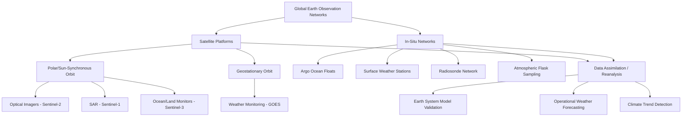

## Global Earth Observation Networks

### Overview

Global Earth observation networks comprise the coordinated system of satellites, in-situ sensor networks, and data infrastructure used to systematically monitor Earth's atmosphere, oceans, land surface, cryosphere, and biosphere. These networks combine remote sensing platforms (polar-orbiting and geostationary satellites) with ground-, ocean-, and air-based in-situ measurement systems, integrated through international coordination frameworks to provide the observational foundation for weather forecasting, climate monitoring, disaster response, and Earth system model validation.

### Satellite Observation Fundamentals

**Orbital regimes**

- **Polar (Sun-synchronous) orbit**: Satellites orbit at roughly 700–850 km altitude, crossing the equator at consistent local solar times on each pass, enabling global coverage with predictable illumination/imaging conditions over a repeat cycle of days; used for most land, ocean color, and radar imaging missions
- **Geostationary orbit**: Satellites positioned at approximately 35,786 km altitude above the equator, matching Earth's rotation to maintain a fixed viewing position, enabling continuous, high-frequency monitoring of a single hemisphere; primarily used for weather and atmospheric monitoring requiring high temporal resolution

**Sensor types**

- **Optical/multispectral imagers**: Measure reflected solar radiation across visible and near-infrared bands, used for land cover classification, vegetation monitoring (via indices such as NDVI), and ocean color/chlorophyll measurement; limited by cloud cover and daylight-only operation
- **Synthetic Aperture Radar (SAR)**: Active microwave sensors providing all-weather, day-and-night imaging capability by transmitting and measuring backscattered radar pulses, used extensively for sea ice mapping, flood monitoring, ground deformation (via interferometric SAR/InSAR), and maritime surveillance
- **Radar altimeters**: Measure precise sea surface height and topography, critical for sea level rise monitoring and ocean circulation studies
- **Thermal infrared radiometers**: Measure surface and atmospheric temperature, used for sea/land surface temperature monitoring and atmospheric profiling
- **Atmospheric sounders and spectrometers**: Measure trace gas concentrations (CO₂, CH₄, ozone, aerosols) and vertical atmospheric temperature/humidity profiles

### Major International Earth Observation Programs

**Copernicus Programme (European Union/ESA)**

The most extensive civilian Earth observation program to date, providing free and open access to Earth observation data through a family of Sentinel satellite missions, each targeting distinct observational domains:

- **Sentinel-1**: C-band SAR constellation providing all-weather radar imagery, supporting Arctic sea-ice extent monitoring, sea-ice mapping, and marine environment surveillance. The constellation has undergone significant recent renewal: Sentinel-1C launched December 2024 and Sentinel-1D launched November 2025 as replacements for the aging original Sentinel-1A/1B pair (1B having failed in 2021). Following a planned transition period, Sentinel-1A concluded operations on June 30, 2026, after 12 years of service, with Sentinel-1C and Sentinel-1D now forming the operational twin-satellite constellation maintaining the nominal 6-day global revisit capability.
- **Sentinel-2**: Optical multispectral land-monitoring constellation supporting agriculture, forestry, and land-cover change detection, with Sentinel-2C launched in September 2024 extending the constellation's optical imaging capacity.
- **Sentinel-3**: Ocean and land monitoring constellation carrying ocean color, sea/land surface temperature, and radar altimetry instruments; a further constellation renewal satellite, Sentinel-3C, launched in September 2026, providing continuity ahead of the S3A/S3B satellites' expected end-of-life.
- **Sentinel-5P and Sentinel-4/5**: Atmospheric composition monitoring missions tracking trace gases (ozone, NO₂, SO₂, CH₄, CO) and air quality parameters from both polar and geostationary vantage points

**NASA Earth Observing System (EOS) and successor missions**

A long-running constellation of polar-orbiting satellites (historically including Terra, Aqua, and Suomi NPP) providing multidecadal continuity records for atmospheric, land, and ocean parameters. Suomi NPP data product delivery is scheduled to cease on November 1, 2026, with data users directed to transition to successor missions NOAA-20 and NOAA-21, reflecting the ongoing generational handover characteristic of long-running Earth observation programs as instruments reach end-of-life and are succeeded by next-generation platforms.

**NOAA Polar and Geostationary Systems**

The Joint Polar Satellite System (JPSS, including NOAA-20 and NOAA-21) provides polar-orbiting weather and environmental monitoring, while the GOES (Geostationary Operational Environmental Satellite) series provides continuous, high-frequency weather monitoring over the Americas, critical for severe weather and hurricane tracking.

**Other major contributing agencies**: JAXA (Japan), including the GOSAT greenhouse gas monitoring series and ALOS radar missions; ESA's non-Copernicus Earth Explorer research missions; China's Fengyun meteorological and Gaofen land-observation series; India's ISRO Earth observation constellation; and numerous commercial constellations increasingly contributing high-resolution and high-revisit-frequency imagery.

### In-Situ Observation Networks

Satellite data is complemented and calibrated by extensive ground-, ocean-, and atmosphere-based in-situ networks:

- **Global surface weather station networks**: Coordinated through the World Meteorological Organization (WMO), providing standardized surface temperature, precipitation, pressure, and wind measurements
- **Argo float network**: A global array of several thousand autonomous profiling floats measuring ocean temperature and salinity through the upper ~2,000 m of the water column, providing the primary basis for ocean heat content and sea level attribution studies
- **Global Atmosphere Watch and flask sampling networks**: Ground and aircraft-based greenhouse gas concentration monitoring stations (e.g., Mauna Loa Observatory's continuous atmospheric CO₂ record, the longest continuous instrumental CO₂ dataset)
- **Radiosonde network**: Balloon-borne atmospheric profiling instruments launched twice daily from hundreds of global stations, providing vertical atmospheric temperature, humidity, and wind profiles used for both weather forecasting and satellite calibration
- **GNSS/GPS geodetic networks**: Ground-based receiver networks measuring crustal deformation, ice sheet mass balance (via gravimetric methods), and atmospheric water vapor content
- **Ocean buoy networks**: Fixed and drifting buoy arrays (e.g., the TAO/TRITON array in the tropical Pacific) providing critical real-time data for El Niño-Southern Oscillation monitoring and forecasting

### Data Integration and Reanalysis

**Reanalysis products**: Combine historical observational data (satellite and in-situ) with numerical weather/climate models through data assimilation techniques to produce spatially and temporally complete, physically consistent estimates of past atmospheric and oceanic states (e.g., ECMWF's ERA5, NASA's MERRA-2), forming a critical bridge between sparse/irregular raw observations and the complete gridded datasets required for climate trend analysis and model evaluation.

**Data assimilation**: The mathematical framework for optimally combining model forecasts with incoming observations, accounting for relative uncertainty in each, to produce best-estimate analyses; a foundational technique shared between operational weather forecasting and Earth system model initialization.

### Coordination Frameworks

**Group on Earth Observations (GEO)**: An intergovernmental partnership coordinating the Global Earth Observation System of Systems (GEOSS), aiming to integrate observation systems across participating countries and organizations into a coherent, interoperable global observing capability.

**Global Climate Observing System (GCOS)**: Defines and maintains the list of Essential Climate Variables (ECVs) — a standardized set of atmospheric, oceanic, and terrestrial parameters (e.g., surface temperature, sea level, sea ice extent, atmospheric CO₂ concentration) considered critical for systematic, sustained climate monitoring, providing a common observational requirements framework across satellite and in-situ networks.

### Applications

- **Weather forecasting**: Real-time satellite and in-situ data assimilation into numerical weather prediction models
- **Climate change detection and attribution**: Long-term, homogenized satellite and in-situ records underpinning global temperature, sea level, and ice extent trend analyses
- **Disaster response**: Rapid-response SAR and optical imagery for flood, wildfire, earthquake, and volcanic eruption monitoring, often coordinated through mechanisms such as the International Charter "Space and Major Disasters"
- **Agricultural and food security monitoring**: Multispectral vegetation monitoring supporting crop yield estimation and drought early warning
- **Earth System Model validation**: Satellite and in-situ observational records provide the essential ground-truth datasets against which coupled Earth System Model output is evaluated and calibrated

### Observation Network Architecture Diagram

### Key Points

- Global Earth observation combines complementary satellite orbital regimes (polar for global coverage, geostationary for continuous regional monitoring) with extensive in-situ networks (Argo floats, radiosondes, surface stations) to provide comprehensive, cross-validated Earth system monitoring.
- The Copernicus Sentinel constellation represents the most extensive open-access civilian Earth observation program, with 2024-2026 marking a major generational renewal across Sentinel-1, -2, and -3 missions as original satellites reach end-of-life and are replaced by next-generation units.
- Reanalysis products and data assimilation techniques integrate heterogeneous observational sources with numerical models to produce spatially/temporally complete datasets essential for both operational forecasting and long-term climate trend analysis.
- International coordination frameworks (GEO/GEOSS, GCOS) aim to ensure interoperability and define standardized Essential Climate Variables across the fragmented multi-agency, multi-national observation landscape.
- Continuity of long-term observational records across satellite generational transitions (e.g., Suomi NPP to NOAA-20/21, Sentinel-1A/B to -1C/1D) is a persistent operational and scientific challenge for maintaining unbroken climate data records.

### Related Topics

- Synthetic Aperture Radar (SAR) interferometry and ground deformation monitoring
- Argo float network design and ocean heat content attribution
- Essential Climate Variables (ECV) framework and GCOS monitoring requirements
- Reanalysis methodology and data assimilation techniques (ERA5, MERRA-2)
- Satellite record homogenization and long-term climate trend detection challenges
- International Charter "Space and Major Disasters" rapid-response coordination
- Commercial satellite constellations and their integration into public observation networks
- Essential ocean and land observing system design (GOOS, GTOS frameworks)