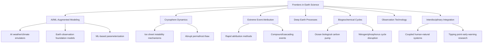

## Frontiers in Earth Science Research

### Overview

Contemporary Earth science research is increasingly defined by cross-disciplinary integration, high-resolution and high-frequency observation, machine learning-augmented modeling, and an urgent policy-relevant focus on understanding and predicting rapid, potentially nonlinear planetary change. Frontier research areas span the deep Earth interior, cryosphere dynamics, biogeochemical cycle feedbacks, extreme event attribution, and the increasing integration of artificial intelligence into Earth system modeling and observation analysis.

### Machine Learning and AI-Augmented Earth Science

**AI weather and climate emulators**

A major recent shift in numerical weather prediction and climate modeling involves machine learning-based emulators trained on reanalysis and observational data, capable of producing forecasts at a small fraction of the computational cost of traditional physics-based numerical models while achieving comparable or, for some metrics, superior accuracy. These systems (exemplified by architectures such as graph neural network and transformer-based weather models developed by major research groups and national weather services) represent a significant methodological shift from purely physics-based to hybrid or fully data-driven forecasting approaches. [Inference: relative performance advantages vary by forecast lead time, variable, and evaluation metric, and remain an active area of comparative benchmarking against traditional numerical weather prediction]

**Foundation models for Earth observation**

Development of large, pretrained "foundation models" trained on massive volumes of multi-sensor satellite imagery, intended to be fine-tuned for diverse downstream tasks (land cover classification, disaster damage assessment, crop monitoring) with substantially reduced task-specific training data requirements, mirroring the foundation-model paradigm shift seen in natural language processing.

**Machine learning in Earth system model parameterization**: Using ML techniques to improve or replace traditional physics-based parameterizations of sub-grid-scale processes (particularly cloud and convection schemes) that remain the dominant source of inter-model climate sensitivity spread, potentially reducing structural uncertainty in future climate projections. [Speculation: the degree to which ML parameterizations will generalize outside their training distribution, particularly under novel future climate states outside historical observation, remains an open and actively debated research question]

### Cryosphere and Ice Sheet Dynamics

**Ice sheet instability mechanisms**: Active research continues to refine understanding of marine ice sheet instability (MISI) and marine ice cliff instability (MICI) mechanisms, which could potentially accelerate West Antarctic and parts of East Antarctic ice sheet mass loss beyond rates captured by earlier-generation ice sheet models, with significant implications for sea level rise projection uncertainty ranges. [Unverified: the magnitude and even the fundamental applicability of MICI as a real-world mechanism remains contested in the glaciological literature]

**Subglacial hydrology and ice sheet basal processes**: Improved observational techniques (including radar sounding and emerging satellite gravimetry methods) are refining understanding of meltwater routing beneath ice sheets and its influence on ice flow velocity, a key uncertainty in projecting future ice discharge rates.

**Permafrost abrupt thaw processes**: Research increasingly focuses on abrupt thaw mechanisms (thermokarst lake formation, retrogressive thaw slumps) that can proceed substantially faster than the gradual, "top-down" thaw assumed in earlier permafrost carbon feedback models, potentially requiring significant revision to projected permafrost carbon release timing and magnitude.

### Extreme Event Attribution Science

**Rapid attribution methodology**: The field of extreme event attribution has matured significantly, now capable of producing near-real-time assessments (in some cases within days of an extreme weather event) of the degree to which anthropogenic climate change altered the probability or intensity of a specific observed event, using ensembles of climate model simulations run with and without anthropogenic forcing. Organizations such as World Weather Attribution have institutionalized this rapid-response analytical capability.

**Compound and cascading extreme events**: Growing research focus on compound events (simultaneous or sequential extreme conditions, such as concurrent heat and drought, or a hurricane followed by extreme rainfall-driven flooding) and cascading impacts across interconnected systems (e.g., an extreme heat event triggering both direct health impacts and secondary agricultural and energy-grid stress), which are generally not well captured by univariate extreme event statistics.

### Deep Earth and Interior Dynamics

**Seismic tomography advances**: Continued refinement of global seismic velocity models, increasingly incorporating dense seismic array data and machine learning-based phase-picking techniques, is improving resolution of deep mantle structure, including large low-shear-velocity provinces (LLSVPs) at the core-mantle boundary and their potential relationship to surface hotspot volcanism and long-term mantle convection patterns.

**Deep carbon cycle**: Research into carbon exchange between Earth's surface and deep interior (via subduction and volcanic outgassing) over geologic timescales, relevant both to understanding long-term climate stability mechanisms (connecting to the silicate weathering thermostat) and to constraining Earth's total carbon budget and its partitioning between mantle, crust, and surface reservoirs.

### Biogeochemical Cycle Frontiers

**Ocean biological carbon pump quantification**: Improved understanding of the mechanisms and efficiency of the ocean's biological carbon pump (the process by which photosynthetically fixed carbon is exported to depth via sinking organic matter), a major uncertainty in projecting future ocean carbon uptake capacity under changing ocean stratification and ecosystem structure.

**Terrestrial ecosystem carbon-climate feedback refinement**: Ongoing efforts to reduce uncertainty in the response of terrestrial carbon sinks (particularly tropical forests) to combined warming, CO₂ fertilization, and drought stress, informed by long-term forest plot networks, eddy covariance flux tower measurements, and satellite-based vegetation productivity monitoring.

**Nitrogen and phosphorus cycle perturbation**: Growing research attention to anthropogenic disruption of the nitrogen and phosphorus biogeochemical cycles (primarily via agricultural fertilizer use), recognized as among the planetary boundary processes assessed as significantly transgressed, with implications for eutrophication, biodiversity loss, and greenhouse gas (N₂O) emissions.

### Integration with Space-Based and Emerging Observation Technology

**Next-generation satellite gravimetry**: Continued development of satellite gravity missions (successors to the GRACE/GRACE-FO mission concept) providing improved spatial and temporal resolution for tracking ice sheet mass balance, groundwater depletion, and large-scale water storage change.

**Hyperspectral and thermal infrared imaging**: Emerging satellite missions with expanded spectral resolution are improving capability for mineral mapping, methane point-source emission detection, and vegetation stress/drought monitoring at finer spectral discrimination than traditional multispectral sensors.

**Autonomous and distributed sensor networks**: Growing deployment of autonomous platforms (ocean gliders, drone-based atmospheric sampling, distributed low-cost sensor networks) to fill observational gaps in traditionally under-sampled regions (polar oceans, remote terrestrial ecosystems, urban air quality micro-monitoring).

### Interdisciplinary Integration Trends

**Coupled human-natural systems modeling**: Increasing integration of socioeconomic, land-use, and human behavioral dynamics directly into Earth system model frameworks, moving beyond treating human activity as an external forcing input toward genuinely coupled feedback representation (e.g., how climate impacts influence land-use decisions, which in turn affect land-atmosphere carbon and energy fluxes).

**Paleoclimate constraint integration**: Growing use of deep-time paleoclimate records (from ice cores, sediment cores, and geologic proxy archives) as out-of-sample tests for climate model performance under climate states substantially different from the historical instrumental record, providing an important check on model reliability for high-warming future scenarios.

**Tipping point early-warning research**: Continued development of statistical early-warning indicators (critical slowing down, rising variance/autocorrelation) intended to provide advance detection of approaching Earth system tipping points, alongside efforts to better constrain the specific thresholds and interaction pathways between candidate tipping elements (AMOC, ice sheets, Amazon forest, permafrost). [Unverified: reliability and practical lead-time of early-warning indicators for real-world, large-scale Earth system transitions remains scientifically unresolved]

### Frontier Research Domains Diagram

### Key Points

- Machine learning is transforming both weather/climate forecasting (via AI emulators) and Earth observation analysis (via foundation models), while also being explored to reduce structural parameterization uncertainty in traditional physics-based Earth system models.
- Cryosphere research increasingly focuses on potentially rapid, threshold-crossing ice sheet and permafrost instability mechanisms that may not be well captured by earlier-generation gradual-change models.
- Extreme event attribution has matured into a near-real-time scientific capability, with growing research attention shifting toward compound and cascading multi-hazard events.
- Deep Earth, ocean biogeochemical, and nitrogen/phosphorus cycle research remain active frontiers directly relevant to long-term climate stability and planetary boundary assessment.
- A cross-cutting trend across frontier research areas is deeper interdisciplinary integration — coupling human socioeconomic dynamics, paleoclimate constraints, and multi-domain tipping point interactions directly into unified Earth system modeling frameworks.

### Related Topics

- AI-based numerical weather prediction architectures and operational forecasting adoption
- Marine ice sheet and ice cliff instability mechanisms and sea level rise projection uncertainty
- World Weather Attribution methodology and rapid climate attribution science
- Large low-shear-velocity provinces and deep mantle-surface coupling
- Ocean biological carbon pump mechanisms and export efficiency quantification
- Coupled human-natural systems modeling approaches
- Paleoclimate proxy reconstruction methods and model out-of-sample validation
- Critical slowing down and statistical early-warning signal research for tipping points