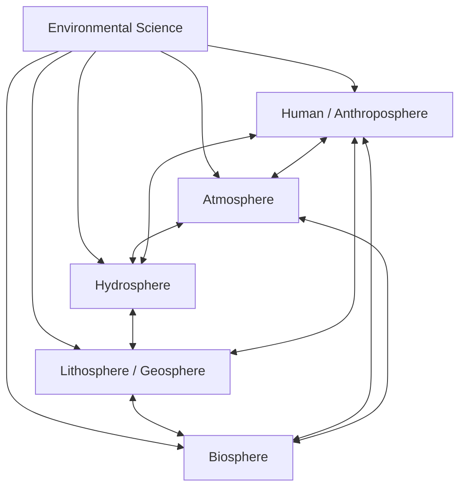

## Definition and Scope of Environmental Science

### Definition

Environmental science is the interdisciplinary study of the physical, chemical, and biological processes that govern natural systems, and of how human activity interacts with, alters, and depends on those systems. It integrates natural sciences (biology, chemistry, geology, physics, atmospheric science) with social sciences (economics, policy, sociology, ethics) to understand environmental problems and develop solutions.

A widely used working definition: **Environmental science is the quantitative study of the interactions between the physical, chemical, biological, and human components of the environment, with emphasis on understanding and solving environmental problems.**

Key distinctions from related fields:

- **Ecology** is a subset of environmental science focused specifically on interactions among organisms and between organisms and their physical environment. Environmental science is broader and explicitly solution- and policy-oriented.
- **Environmental studies** typically emphasizes the social, political, and humanities-based dimensions (law, ethics, economics) with less quantitative/laboratory science content.
- **Environmentalism** is a social and political movement advocating for environmental protection; it is not itself a scientific discipline, though it is often informed by environmental science.

### Historical Development

- **Early natural history (18th–19th century):** Naturalists such as Alexander von Humboldt and Charles Darwin documented relationships between organisms and physical environments, laying groundwork for ecological thinking.
- **Conservation era (late 19th–early 20th century):** Figures like George Perkins Marsh (*Man and Nature*, 1864) and Aldo Leopold (*A Sand County Almanac*, 1949) articulated early concepts of resource stewardship and land ethics.
- **Post-WWII industrial expansion:** Rapid industrialization, pesticide use, and pollution prompted scientific scrutiny of ecological harm.
- **1962 — Rachel Carson's *Silent Spring*:** Documented bioaccumulation of DDT and its ecological effects; widely credited as a catalyst for the modern environmental movement.
- **1969–1970 — Institutional formation:** The U.S. National Environmental Policy Act (NEPA) was signed in 1970; the U.S. Environmental Protection Agency (EPA) was established the same year; the first Earth Day occurred on April 22, 1970. These events mark environmental science's emergence as a formal, policy-relevant discipline.
- **1972 — Stockholm Conference:** First major UN conference on the human environment, internationalizing environmental concern.
- **1980s–1990s — Global-scale problems recognized:** Stratospheric ozone depletion, acid rain, and anthropogenic climate change shifted the field toward global, systems-level analysis.
- **21st century:** Emphasis on climate change, biodiversity loss, planetary boundaries, and sustainability science, supported by satellite remote sensing, big data, and computational modeling.

### Scope of Environmental Science

Environmental science draws on and integrates multiple disciplines. Its scope is commonly organized into interacting spheres and subfields.

**Core disciplinary contributions:**

- **Ecology** – species interactions, population dynamics, ecosystem energy flow
- **Geology and soil science** – earth materials, soil formation, natural hazards
- **Atmospheric science/meteorology** – weather, climate, air quality
- **Hydrology** – water cycle, watersheds, groundwater
- **Chemistry** – pollutant behavior, biogeochemical cycles, toxicology
- **Biology** – organismal and molecular responses to environmental stressors
- **Economics** – resource valuation, externalities, cost-benefit analysis
- **Policy and law** – regulatory frameworks, environmental governance
- **Ethics and philosophy** – moral frameworks for human-nature relationships
- **Geography and GIS** – spatial analysis of environmental patterns

**Earth system spheres commonly studied:**

- **Atmosphere** – gaseous envelope; air quality, climate
- **Hydrosphere** – all water reservoirs (oceans, rivers, lakes, groundwater, ice)
- **Lithosphere/geosphere** – solid earth, soils, minerals
- **Biosphere** – all living organisms and their interactions

These spheres are not independent; environmental science emphasizes their coupling through biogeochemical cycles (carbon, nitrogen, phosphorus, water).

**Major subfields within environmental science:**

- **Environmental chemistry** – fate and transport of pollutants
- **Environmental toxicology** – effects of contaminants on organisms
- **Conservation biology** – biodiversity preservation
- **Environmental policy and law** – regulatory design and enforcement
- **Environmental economics** – valuing ecosystem services, market failures
- **Restoration ecology** – rehabilitating degraded ecosystems
- **Climatology and climate science** – long-term atmospheric patterns
- **Environmental health** – human health impacts of environmental exposures
- **Sustainability science** – long-term resource and system viability
- **Industrial ecology** – material and energy flows through industrial systems

### Core Themes and Unifying Concepts

- **Interconnectedness:** Environmental systems are governed by feedback loops; a change in one component (e.g., deforestation) propagates through others (soil erosion, altered local climate, biodiversity loss).
- **Matter and energy flow:** Governed by conservation laws — energy flows in one direction (per the second law of thermodynamics, with entropy increasing), while matter cycles through biogeochemical pathways.
- **Sustainability:** Meeting present needs without compromising the ability of future generations to meet their own needs, per the 1987 Brundtland Commission definition.
- **Carrying capacity:** The maximum population size an environment can sustain indefinitely given available resources, commonly denoted $K$ in population models such as the logistic growth equation:

$$\frac{dN}{dt} = rN\left(1 - \frac{N}{K}\right)$$

where $N$ is population size, $r$ is the intrinsic growth rate, and $K$ is carrying capacity.

- **Anthropogenic impact:** Human activity is treated as a driving variable in environmental systems, not external to them — reflected in concepts like the Anthropocene (a proposed, not yet formally ratified, geological epoch marked by dominant human influence on Earth systems).
- **Scale:** Problems are analyzed across spatial scales (local, regional, global) and temporal scales (episodic events to geologic time).

### Methodological Approaches

- **Field observation and monitoring:** Long-term ecological research (LTER) sites, water quality sampling, air quality monitoring stations.
- **Laboratory experimentation:** Controlled studies of toxicity, chemical reactions, microbial processes.
- **Remote sensing and GIS:** Satellite and aerial data for land-use change, deforestation tracking, and climate monitoring.
- **Modeling and simulation:** Mathematical and computational models (climate models, population models, pollutant dispersion models) used to project future states under different scenarios.
- **Environmental impact assessment (EIA):** Structured procedure for evaluating likely environmental consequences of proposed projects before approval, mandated in many jurisdictions (e.g., under NEPA in the U.S.).
- **Risk assessment:** Systematic evaluation combining hazard identification, dose-response assessment, exposure assessment, and risk characterization.

**Key Points**

- Environmental science is inherently interdisciplinary, combining natural and social sciences.
- Its scope spans four interacting spheres (atmosphere, hydrosphere, lithosphere, biosphere) plus human systems.
- The field is applied and solution-oriented, distinguishing it from purely descriptive natural history or ecology alone.
- Core unifying concepts include interconnectedness, matter/energy flow, sustainability, and carrying capacity.
- Methodologically, it relies on field data, lab experiments, remote sensing, and modeling, often synthesized through environmental impact and risk assessments.

### Example

A watershed contamination case illustrates the field's integrative scope: a chemist analyzes pollutant concentrations in groundwater; a hydrologist models flow paths from the contamination source to drinking water wells; a toxicologist assesses human health risk from exposure levels; an economist estimates cleanup costs versus health-cost savings; and a policy analyst evaluates which regulatory mechanism (permitting, fines, remediation mandates) is most effective. No single traditional discipline addresses the full problem — the value of environmental science lies precisely in this synthesis.

### Diagram: Scope of Environmental Science (svg_diagram)

<svg xmlns="http://www.w3.org/2000/svg" viewBox="0 0 800 480" font-family="Helvetica, Arial, sans-serif">
<text x="400" y="30" text-anchor="middle" font-size="18" font-weight="bold" fill="#1a1a1a">Scope of Environmental Science (svg_diagram)</text>
<circle cx="400" cy="250" r="80" fill="#e8f4ea" stroke="#2e7d32" stroke-width="2" />
<text x="400" y="245" text-anchor="middle" font-size="14" font-weight="bold" fill="#1b5e20">Environmental</text>
<text x="400" y="263" text-anchor="middle" font-size="14" font-weight="bold" fill="#1b5e20">Science</text>
<circle cx="220" cy="140" r="70" fill="#e3f2fd" stroke="#1565c0" stroke-width="2" opacity="0.9" />
<text x="220" y="135" text-anchor="middle" font-size="13" font-weight="bold" fill="#0d47a1">Natural</text>
<text x="220" y="153" text-anchor="middle" font-size="13" font-weight="bold" fill="#0d47a1">Sciences</text>
<circle cx="580" cy="140" r="70" fill="#fff3e0" stroke="#e65100" stroke-width="2" opacity="0.9" />
<text x="580" y="135" text-anchor="middle" font-size="13" font-weight="bold" fill="#bf360c">Social</text>
<text x="580" y="153" text-anchor="middle" font-size="13" font-weight="bold" fill="#bf360c">Sciences</text>
<circle cx="220" cy="380" r="70" fill="#f3e5f5" stroke="#6a1b9a" stroke-width="2" opacity="0.9" />
<text x="220" y="375" text-anchor="middle" font-size="13" font-weight="bold" fill="#4a148c">Earth</text>
<text x="220" y="393" text-anchor="middle" font-size="13" font-weight="bold" fill="#4a148c">System Spheres</text>
<circle cx="580" cy="380" r="70" fill="#fce4ec" stroke="#ad1457" stroke-width="2" opacity="0.9" />
<text x="580" y="375" text-anchor="middle" font-size="13" font-weight="bold" fill="#880e4f">Applied</text>
<text x="580" y="393" text-anchor="middle" font-size="13" font-weight="bold" fill="#880e4f">Practice</text>

<text x="120" y="90" font-size="11" fill="#333">Biology, Chemistry,</text>

<text x="120" y="105" font-size="11" fill="#333">Geology, Physics</text>

<text x="500" y="90" font-size="11" fill="#333">Economics, Policy,</text>

<text x="500" y="105" font-size="11" fill="#333">Ethics, Law</text>

<text x="90" y="440" font-size="11" fill="#333">Atmosphere, Hydrosphere,</text>

<text x="90" y="455" font-size="11" fill="#333">Lithosphere, Biosphere</text>

<text x="510" y="440" font-size="11" fill="#333">EIA, Risk Assessment,</text>

<text x="510" y="455" font-size="11" fill="#333">Conservation, Restoration</text>

</svg>

### Applications and Relevance

- **Environmental regulation:** Scientific findings underpin standards such as air quality thresholds (e.g., EPA National Ambient Air Quality Standards) and water quality criteria.
- **Climate policy:** Assessments like those from the Intergovernmental Panel on Climate Change (IPCC) synthesize climate science to inform international agreements (e.g., the Paris Agreement).
- **Natural resource management:** Fisheries quotas, forestry practices, and water allocation rely on environmental science to set sustainable extraction limits.
- **Corporate sustainability:** Life-cycle assessment and environmental, social, and governance (ESG) reporting draw on environmental science methods.
- **Public health:** Environmental epidemiology links pollutant exposure to disease outcomes (e.g., particulate matter and respiratory illness).

### Common Misconceptions

- **Misconception:** Environmental science is the same as environmentalism or advocacy. **Clarification:** Environmental science is a descriptive and analytical discipline; it can inform advocacy but is methodologically distinct from it.
- **Misconception:** Environmental science only concerns pollution and conservation. **Clarification:** It also encompasses resource economics, energy systems, urban planning, and human health.
- **Misconception:** Environmental problems can be solved by a single discipline (e.g., "just better technology" or "just better policy"). **Clarification:** Most environmental problems are multi-causal and require coordinated technical, economic, and policy interventions. [Inference: the degree of coordination needed varies by problem and is a matter of ongoing scholarly and political debate.]

### Related Topics

- Ecosystem structure and function
- Biogeochemical cycles (carbon, nitrogen, phosphorus, water)
- Earth's spheres: atmosphere, hydrosphere, lithosphere, biosphere
- Sustainability and the Brundtland definition
- Environmental impact assessment (EIA) methodology
- Population ecology and carrying capacity models
- History of environmental policy (NEPA, EPA, Stockholm Conference)
- Environmental ethics and philosophy
- Climate science fundamentals
- Environmental economics and ecosystem service valuation