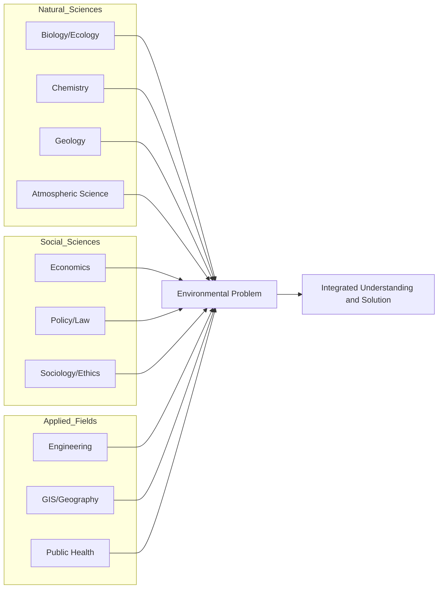

## Interdisciplinary Nature of the Field

### Definition

Interdisciplinarity in environmental science refers to the structural integration of methods, data, theories, and conceptual frameworks from multiple traditionally separate disciplines to analyze environmental phenomena that cannot be fully understood or resolved within any single field. This is distinct from **multidisciplinarity**, where several disciplines contribute independently to a shared topic without integration, and from **transdisciplinarity**, which additionally integrates non-academic stakeholder knowledge (e.g., indigenous knowledge, community input, industry practice) into the research process.

| Term | Characteristic | Example |
| --- | --- | --- |
| Multidisciplinary | Disciplines work in parallel; findings compiled but not synthesized | A report with separate chapters by a chemist, an economist, and a biologist |
| Interdisciplinary | Disciplines integrated methodologically to produce unified analysis | A watershed model combining hydrology, chemistry, and economics into one framework |
| Transdisciplinary | Integrates academic and non-academic knowledge systems | A climate adaptation plan co-developed with scientists and local communities |

### Why Environmental Problems Require Multiple Disciplines

Environmental problems typically exhibit properties that resist single-discipline analysis:

- **Systemic coupling:** Physical, chemical, biological, and human subsystems are linked by feedback loops, so altering one variable (e.g., emissions) cascades through others (temperature, precipitation, crop yield, migration).
- **Multi-causality:** Most environmental issues (e.g., biodiversity loss) arise from combined drivers — habitat destruction (ecology/geography), pollution (chemistry), climate shifts (atmospheric science), and economic incentives (economics) — none of which alone explains the outcome.
- **Value-laden trade-offs:** Deciding how to respond to environmental risk involves ethical and economic judgments (e.g., discount rates for future generations) that natural science alone cannot resolve.
- **Scale mismatch:** Ecological processes, political jurisdictions, and economic markets often operate at different spatial and temporal scales, requiring geography, policy science, and systems modeling to reconcile them.

### Disciplinary Contributions

**Natural sciences:**

- **Biology/ecology** – species interactions, population dynamics, biodiversity assessment
- **Chemistry** – pollutant behavior, biogeochemical cycling, analytical detection methods
- **Geology** – earth materials, natural hazards, resource formation
- **Physics** – energy transfer, radiative forcing, fluid dynamics underlying climate and pollutant transport
- **Atmospheric science** – weather systems, climate dynamics, air chemistry

**Social sciences and humanities:**

- **Economics** – externalities, resource valuation, cost-benefit analysis, market-based instruments (e.g., carbon pricing)
- **Political science/policy studies** – governance structures, regulatory design, international negotiation
- **Law** – environmental statutes, liability, enforcement mechanisms
- **Sociology and anthropology** – human behavior, environmental justice, cultural relationships to land and resources
- **Ethics/philosophy** – normative frameworks for obligations to future generations, non-human life, and ecosystems

**Applied and technical fields:**

- **Engineering** – pollution control technology, renewable energy systems, waste treatment
- **Geography/GIS** – spatial analysis, land-use mapping, remote sensing integration
- **Public health** – exposure assessment, epidemiology, risk communication
- **Statistics and data science** – modeling, uncertainty quantification, large-dataset analysis (satellite, sensor networks)

### Illustrative Case: Acid Rain

The acid rain problem of the mid-to-late 20th century demonstrates disciplinary integration in practice:

- **Chemistry** identified the reactions converting sulfur dioxide ($SO_2$) and nitrogen oxides ($NO_x$) into sulfuric and nitric acid in the atmosphere.
- **Atmospheric science** modeled long-range transport, showing pollutants crossed political borders (e.g., U.S. Midwest emissions affecting Canadian and northeastern U.S. ecosystems).
- **Ecology** documented impacts on lake acidification, fish kills, and forest decline.
- **Economics** analyzed the cost-effectiveness of a cap-and-trade system versus command-and-control regulation.
- **Policy science and law** designed the U.S. Acid Rain Program under the 1990 Clean Air Act Amendments, implementing a sulfur dioxide emissions trading market.
- **Political science** addressed the international dimension through agreements such as the 1991 U.S.–Canada Air Quality Agreement.

The resulting policy — a market-based cap-and-trade system — could not have been designed from chemistry or ecology alone; it required economic mechanism design and legal-political implementation.

**Key Points**

- Interdisciplinarity is definitionally distinct from multidisciplinarity (parallel) and transdisciplinarity (includes non-academic knowledge).
- Environmental problems are typically systemic, multi-causal, value-laden, and scale-mismatched, which is why single-discipline approaches are insufficient.
- Effective environmental science integrates natural sciences, social sciences, and applied/technical fields into unified analytical and policy frameworks.
- Real-world cases (e.g., acid rain, ozone depletion, climate change) historically required this integration to move from diagnosis to workable solutions.

### Methodological Integration Approaches

- **Systems thinking and modeling:** Integrated assessment models (IAMs) such as those used in IPCC scenario work combine climate physics, economic growth projections, and policy scenarios into unified computational frameworks.
- **Life-cycle assessment (LCA):** Quantifies environmental impacts of a product or process across its full life cycle, requiring engineering data, chemistry (emissions factors), and economics (cost allocation) simultaneously.
- **Cost-benefit and risk-based decision frameworks:** Combine toxicological/ecological risk data with economic valuation to guide regulatory thresholds.
- **Participatory and co-design methods:** Used in transdisciplinary work to incorporate stakeholder and indigenous knowledge alongside formal scientific data, particularly in natural resource management and climate adaptation planning.

### Institutional and Educational Reflections

- University environmental science programs typically require coursework spanning biology, chemistry, geology, statistics, economics, and policy — structurally embedding interdisciplinarity into training.
- Research funding bodies (e.g., the U.S. National Science Foundation's environmental programs) increasingly require interdisciplinary team composition as a condition of major grants.
- Professional environmental work (e.g., environmental consulting, EIA preparation) routinely assembles teams of specialists (hydrologists, ecologists, engineers, planners) rather than relying on a single expert. [Inference: the specific composition of such teams varies by project scope and regulatory jurisdiction.]

### Common Misconceptions

- **Misconception:** Interdisciplinary work simply means "using a bit of everything." **Clarification:** Genuine interdisciplinarity requires methodological integration — reconciling different disciplinary assumptions, units, and epistemologies — not just juxtaposing separate analyses.
- **Misconception:** Natural science provides the "real" answers while social science is secondary. **Clarification:** Many environmental problems are fundamentally governance and behavioral problems once the natural science is established (e.g., climate change mitigation is now largely a policy, economic, and political challenge).
- **Misconception:** Interdisciplinary training produces generalists without depth. **Clarification:** Most environmental science programs pair a broad interdisciplinary foundation with disciplinary specialization at advanced levels (e.g., a concentration in toxicology or environmental economics).

### Related Topics

- Systems thinking and feedback loops in environmental systems
- Integrated assessment models (IAMs)
- Life-cycle assessment (LCA) methodology
- Environmental policy-making processes
- Environmental justice and social dimensions of environmental science
- Case study: ozone layer depletion and the Montreal Protocol
- Case study: acid rain and cap-and-trade policy design
- Risk assessment and cost-benefit analysis frameworks
- Transdisciplinary research and indigenous knowledge integration