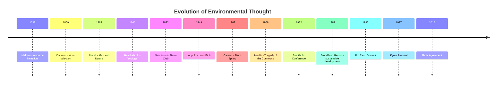

## History and Evolution of Environmental Thought

### Definition

Environmental thought is the evolving body of ideas concerning the relationship between humans and the natural world — encompassing philosophical worldviews, scientific understanding, and ethical frameworks that have shaped how societies perceive, use, and manage natural resources. Its history traces a shift from utilitarian resource exploitation toward ecological interdependence, systems thinking, and global sustainability frameworks.

### Pre-Modern and Early Foundations

- **Indigenous and traditional knowledge systems:** Many indigenous cultures worldwide developed longstanding resource-management practices grounded in reciprocity and long-term stewardship (e.g., rotational land use, sacred groves, communal resource governance). [Inference: the specific ecological outcomes of these practices vary widely by culture and context and are the subject of ongoing scholarship rather than a single settled record.]
- **Classical antiquity:** Greek and Roman writers (e.g., Plato, Aristotle) observed deforestation and soil erosion around the Mediterranean, though systematic environmental theory did not yet exist.
- **Religious and philosophical traditions:** Various traditions (e.g., certain readings of Judeo-Christian stewardship doctrine, Buddhist and Taoist concepts of harmony with nature) shaped early normative views of human-nature relationships, though interpretations and influence differ across scholarship.

### 18th–19th Century: Naturalism and Early Warnings

- **Carl Linnaeus (1707–1778):** Developed binomial taxonomy, establishing a systematic framework for classifying living organisms that underpins later ecological science.
- **Alexander von Humboldt (1769–1859):** Pioneered the idea of nature as an interconnected web of physical and biological forces through extensive fieldwork in the Americas; his synthesis is widely regarded as a precursor to ecological and Earth-systems thinking.
- **Thomas Malthus (1766–1834):** In *An Essay on the Principle of Population* (1798), argued that population growth would outpace food supply, introducing resource-limitation concepts that later influenced ecological carrying-capacity theory.
- **Charles Darwin (1809–1882):** *On the Origin of Species* (1859) established natural selection, providing the theoretical foundation for understanding species-environment interactions.
- **George Perkins Marsh (1801–1882):** *Man and Nature* (1864) documented how human activity (deforestation, drainage) degraded landscapes, and is considered one of the first works to systematically argue that humans could permanently damage the environment.
- **Ernst Haeckel (1834–1919):** Coined the term "oecologie" (ecology) in 1866, defining it as the study of organisms' relationships to their environment.

### Late 19th–Early 20th Century: Conservation Movement

Two competing philosophies emerged in the U.S. conservation movement, still influential in environmental policy debates:

- **Utilitarian conservationism (Gifford Pinchot, 1865–1946):** Advocated "wise use" of natural resources for sustained human benefit; as first Chief of the U.S. Forest Service, he framed forests as resources to be scientifically managed for long-term yield.
- **Preservationism (John Muir, 1838–1914):** Argued nature held intrinsic value beyond utility and should be preserved largely untouched; founded the Sierra Club (1892) and was influential in establishing U.S. national parks (e.g., Yosemite).
- **Aldo Leopold (1887–1948):** In *A Sand County Almanac* (1949, published posthumously), articulated the **land ethic** — extending moral consideration to soils, waters, plants, and animals collectively as "the land," reframing humans as members of a biotic community rather than its conquerors.

### Mid-20th Century: Scientific Alarm and Environmentalism

- **Rachel Carson (1907–1964), *Silent Spring* (1962):** Documented bioaccumulation and ecological harm from synthetic pesticides, particularly DDT; widely credited with catalyzing the modern environmental movement and directly influencing the eventual U.S. ban on DDT (1972) and the creation of the EPA (1970).
- **Garrett Hardin, "The Tragedy of the Commons" (1968):** Argued that shared, unregulated resources tend toward overexploitation because individual rational actors bear only a fraction of the cost of their own resource use. This became a foundational (and later contested) framework in environmental economics and governance theory.
- **Paul Ehrlich, *The Population Bomb* (1968):** Revived Malthusian concerns, predicting mass famine from population growth; its specific predictions are widely regarded by later scholarship as having been overstated, though it significantly shaped public environmental discourse. [Inference: assessments of the book's predictive accuracy and lasting influence vary among historians and are not uniformly agreed upon.]
- **Buckminster Fuller's "Spaceship Earth" (1960s):** Popularized the metaphor of Earth as a closed system with finite resources, reinforcing systems-based environmental thinking.
- **1970 — Institutionalization:** The U.S. National Environmental Policy Act (NEPA) was enacted; the U.S. EPA was created; the first Earth Day was held on April 22, 1970, marking environmentalism's transition into mainstream policy and public consciousness.

### Late 20th Century: Globalization of Environmental Concern

- **1972 — UN Conference on the Human Environment (Stockholm):** First major international conference to treat environmental protection as a global political concern, resulting in the Stockholm Declaration and the creation of the UN Environment Programme (UNEP).
- **1972 — *Limits to Growth* (Club of Rome):** Used systems-dynamics modeling to argue that continued exponential economic and population growth would exceed planetary resource limits; the report's methodology and conclusions have been debated but it significantly shaped early systems-based environmental analysis.
- **1987 — Brundtland Report (*Our Common Future*):** Formally defined **sustainable development** as development that meets present needs without compromising the ability of future generations to meet their own needs — now the most widely cited definition of sustainability.
- **1985 — Discovery of the Antarctic ozone hole:** Prompted rapid international scientific and political response.
- **1987 — Montreal Protocol:** International treaty phasing out ozone-depleting substances (e.g., chlorofluorocarbons); widely cited as one of the most successful examples of coordinated global environmental governance.
- **1992 — UN Conference on Environment and Development (Rio Earth Summit):** Produced the UN Framework Convention on Climate Change (UNFCCC), the Convention on Biological Diversity, and Agenda 21, formally linking environment and development policy at the global scale.

### Late 20th–21st Century: Climate Science and Deep Ecology

- **Deep ecology (Arne Næss, 1970s):** Proposed that all living beings have intrinsic value independent of their utility to humans, contrasting with "shallow ecology," which addresses pollution and resource depletion primarily for human benefit.
- **Ecofeminism:** Linked patterns of environmental domination to social structures of gender-based domination, contributing a distinct ethical lens to environmental philosophy.
- **Environmental justice movement (1980s–present):** Originated substantially from U.S. grassroots activism (e.g., the 1982 Warren County, North Carolina protests against a PCB landfill), highlighting that environmental harms disproportionately affect marginalized and low-income communities; now a core framework in environmental policy analysis.
- **Intergovernmental Panel on Climate Change (IPCC), established 1988:** Institutionalized international scientific consensus-building on climate change, producing periodic assessment reports that underpin global climate policy.
- **1997 — Kyoto Protocol:** First binding international treaty setting greenhouse gas emissions reduction targets for developed nations.
- **2015 — Paris Agreement:** Established a framework for nationally determined contributions to limit global warming, with widespread near-universal country participation.
- **Planetary boundaries framework (Rockström et al., 2009):** Proposed nine Earth-system processes (e.g., climate change, biodiversity loss, nitrogen cycle disruption) with defined thresholds beyond which the risk of destabilizing the Earth system increases substantially.
- **Anthropocene concept (popularized ~2000, Paul Crutzen and Eugene Stoermer):** Proposes a new geological epoch defined by dominant human influence on Earth systems; as of 2024, the International Union of Geological Sciences' relevant working body voted against formally ratifying it as an official epoch, though the term remains in wide scientific and public use as an informal descriptor. [Unverified: formal geological classification status may be subject to further review or change beyond this reference point.]

**Key Points**

- Environmental thought evolved from utilitarian resource management (Pinchot) and preservationism (Muir) toward ecological interdependence (Leopold's land ethic) and global systems thinking.
- Rachel Carson's *Silent Spring* (1962) is widely regarded as the catalytic event for the modern environmental movement, leading to institutional changes (EPA, NEPA) by 1970.
- The late 20th century saw environmental concern become formally globalized through treaties (Montreal Protocol, UNFCCC, Kyoto, Paris Agreement) and international scientific bodies (IPCC).
- Contemporary environmental thought incorporates justice, ethics (deep ecology, ecofeminism), and Earth-systems science (planetary boundaries, Anthropocene) as core dimensions, not peripheral concerns.

### Comparative Table: Major Philosophical Positions

| Framework | Core Claim | Key Proponent(s) |
| --- | --- | --- |
| Utilitarian conservation | Manage resources scientifically for sustained human use | Gifford Pinchot |
| Preservationism | Protect nature for its own sake, largely untouched | John Muir |
| Land ethic | Humans are members of, not conquerors of, the biotic community | Aldo Leopold |
| Deep ecology | All life has intrinsic value regardless of human utility | Arne Næss |
| Ecofeminism | Environmental domination is linked to social/gender domination | Multiple (e.g., Val Plumwood) |
| Environmental justice | Environmental harms and benefits should be equitably distributed | Grassroots U.S. movement, 1980s onward |
| Sustainable development | Meet present needs without compromising future generations | Brundtland Commission (1987) |

### Common Misconceptions

- **Misconception:** Environmentalism began with the 1970 Earth Day. **Clarification:** Institutional environmentalism crystallized around 1970, but its intellectual roots extend through 19th-century conservation, 20th-century ecology, and earlier natural philosophy.
- **Misconception:** Conservationism and preservationism are the same. **Clarification:** They represent historically distinct and sometimes opposed philosophies — resource management for use (Pinchot) versus protection from use (Muir).
- **Misconception:** The Anthropocene is a formally adopted geological epoch. **Clarification:** As of the most recent formal review, it has not been ratified as an official unit of the geologic time scale, though it remains widely used descriptively.

### Related Topics

- Aldo Leopold's land ethic and its influence on conservation biology
- The Tragedy of the Commons and common-pool resource governance
- Montreal Protocol as a model of international environmental cooperation
- Brundtland Report and the concept of sustainable development
- Planetary boundaries framework
- Environmental justice: origins and contemporary applications
- Deep ecology versus anthropocentric environmental ethics
- IPCC structure and assessment report process
- The Anthropocene debate in Earth systems science