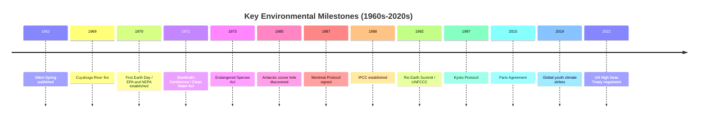

## Key Environmental Movements and Milestones

### Definition

Environmental movements are organized social, political, and scientific efforts aimed at protecting natural systems, mitigating human-caused environmental harm, and reforming policy and behavior toward sustainability. Milestones refer to the specific events, publications, treaties, and institutional developments that mark turning points in the trajectory of environmental awareness and governance. Together they document how environmental concern moved from localized conservation efforts to a globally coordinated, science-driven policy domain.

### Foundational Movements (Pre-1960s)

- **Conservation movement (late 19th–early 20th century, U.S.-centered):** Focused on scientific management of natural resources for sustained human use; led to the creation of the U.S. Forest Service (1905) under Gifford Pinchot and the U.S. National Park Service (1916).
- **Preservationist movement:** Advocated protecting wilderness for its intrinsic and aesthetic value; the Sierra Club, founded by John Muir in 1892, remains one of the oldest continuously operating environmental organizations.
- **Dust Bowl response (1930s, U.S.):** Severe soil erosion from drought and poor agricultural practices led to the creation of the U.S. Soil Conservation Service (1935), an early example of policy responding directly to an environmental crisis with a scientific agency.

### The Modern Environmental Movement (1960s–1970s)

- **1962 — *Silent Spring* published (Rachel Carson):** Documented ecological harm from pesticide bioaccumulation, particularly DDT; widely regarded as the single most influential catalyst for the modern environmental movement.
- **1968 — "Earthrise" photograph (Apollo 8):** Image of Earth from lunar orbit is widely credited with reshaping public perception of Earth as a single, finite, interconnected system.
- **1969 — Cuyahoga River fire (Cleveland, Ohio):** A heavily polluted river caught fire, becoming a highly visible symbol of industrial water pollution and galvanizing public support for water quality legislation.
- **1969 — Santa Barbara oil spill:** A major offshore oil spill drew national U.S. attention to petroleum industry environmental risk and is frequently cited as a direct catalyst for the first Earth Day.
- **1970 — First Earth Day (April 22):** Organized in the United States; widely cited as mobilizing an estimated 20 million participants and catalyzing sustained environmental political organizing.
- **1970 — U.S. National Environmental Policy Act (NEPA) signed:** Required environmental impact assessments for major federal actions, establishing a now widely-emulated regulatory model.
- **1970 — U.S. Environmental Protection Agency (EPA) established:** Consolidated federal pollution-control authority into a single agency.
- **1972 — U.S. Clean Water Act:** Regulated pollutant discharges into U.S. waters.
- **1970/1972 — U.S. Clean Air Act and amendments:** Established national air quality standards.
- **1973 — U.S. Endangered Species Act:** Created legal protections for threatened and endangered species and their habitats.
- **1972 — UN Conference on the Human Environment (Stockholm):** First major international environmental summit; resulted in the Stockholm Declaration and creation of the UN Environment Programme (UNEP).

### Global Institutionalization (1980s–1990s)

- **1985 — Discovery of the Antarctic ozone hole:** British Antarctic Survey scientists documented severe stratospheric ozone depletion, prompting rapid scientific and diplomatic response.
- **1987 — Montreal Protocol on Substances that Deplete the Ozone Layer:** International treaty phasing out chlorofluorocarbons (CFCs) and related compounds; widely cited by atmospheric scientists as substantially reducing further ozone depletion, and frequently referenced as one of the most successful examples of international environmental cooperation.
- **1986 — Chernobyl nuclear disaster:** Major radioactive contamination event that reshaped global debate on nuclear energy safety and environmental risk governance.
- **1987 — Brundtland Report (*Our Common Future*):** Formally defined sustainable development, providing the conceptual foundation for subsequent international sustainability frameworks.
- **1988 — Intergovernmental Panel on Climate Change (IPCC) established:** Created jointly by the World Meteorological Organization and UNEP to provide periodic scientific consensus assessments on climate change.
- **1989 — Exxon Valdez oil spill (Alaska):** Major tanker spill causing extensive marine and coastal ecological damage; led to the U.S. Oil Pollution Act of 1990.
- **1992 — UN Conference on Environment and Development (Rio Earth Summit):** Produced the UN Framework Convention on Climate Change (UNFCCC), the Convention on Biological Diversity, and Agenda 21.
- **1997 — Kyoto Protocol:** First binding international treaty setting greenhouse gas emissions reduction targets for developed (Annex I) countries; entered into force in 2005.

### 21st Century: Climate-Centered Governance

- **2006 — *An Inconvenient Truth* (documentary, Al Gore):** Significantly raised mainstream public awareness of climate change; contributed to the 2007 Nobel Peace Prize awarded jointly to Gore and the IPCC.
- **2009 — Copenhagen Climate Summit (COP15):** High-profile UN climate conference that failed to produce a binding successor treaty to Kyoto, widely viewed as a setback in international climate negotiations.
- **2015 — Paris Agreement (COP21):** Established a framework of nationally determined contributions (NDCs) aiming to limit global warming to well below $2°C$ above pre-industrial levels, with an aspirational target of $1.5°C$; achieved near-universal country participation.
- **2018 — IPCC Special Report on Global Warming of 1.5°C:** Highlighted substantially greater risks between $1.5°C$ and $2°C$ of warming, intensifying policy urgency.
- **2018–2019 — Global youth climate strikes ("Fridays for Future"):** Youth-led protest movement, associated with activist Greta Thunberg, that significantly elevated climate activism in global public discourse.
- **2019–2021 — Extinction Rebellion and related direct-action movements:** Used civil disobedience tactics to demand accelerated government climate action in multiple countries.
- **2021 — COP26 (Glasgow):** Produced the Glasgow Climate Pact, marking the first COP decision to explicitly reference phasing down (not phasing out) coal power.
- **2022 — UN High Seas Treaty (BBNJ Agreement) negotiated:** Established a legal framework for conserving marine biodiversity in international waters beyond national jurisdiction; formally adopted in 2023.
- **2023 — First Global Stocktake concluded (COP28):** First formal assessment of collective progress toward Paris Agreement goals, concluding that current commitments were insufficient to meet the $1.5°C$ target. [Inference: characterizations of "insufficient" reflect the stocktake's own findings relative to stated targets, not a claim about future outcomes.]

**Key Points**

- The modern environmental movement is commonly dated to the early 1970s, catalyzed by *Silent Spring* (1962) and visible pollution crises (Cuyahoga River fire, Santa Barbara spill).
- Institutional milestones (EPA, NEPA, Clean Air/Water Acts) established the U.S. regulatory model widely referenced internationally.
- The Montreal Protocol (1987) is frequently cited as the most successful global environmental treaty to date, due to its measurable reduction of ozone-depleting substances.
- Climate governance has evolved through successive treaties — UNFCCC (1992), Kyoto Protocol (1997), Paris Agreement (2015) — each addressing shortcomings of its predecessor.
- Youth-led and grassroots movements (Fridays for Future, environmental justice organizing) have become significant forces in shaping 21st-century environmental policy discourse.

### Environmental Justice as a Parallel Movement

- **1982 — Warren County, North Carolina protests:** Grassroots opposition to a PCB-contaminated soil landfill sited in a predominantly Black community is widely cited as a founding event of the U.S. environmental justice movement.
- **1987 — "Toxic Wastes and Race in the United States" report (United Church of Christ):** Provided early empirical documentation of correlations between race and proximity to hazardous waste sites in the U.S.
- **1991 — First National People of Color Environmental Leadership Summit:** Adopted the "Principles of Environmental Justice," a foundational document for the movement.
- **1994 — U.S. Executive Order 12898:** Directed federal agencies to identify and address disproportionate environmental effects on minority and low-income populations.

### Common Misconceptions

- **Misconception:** Environmentalism is a single unified movement. **Clarification:** It comprises multiple, sometimes philosophically distinct strands — conservationism, preservationism, environmental justice, deep ecology, and climate activism — that have overlapped and diverged over time.
- **Misconception:** International treaties like Kyoto and Paris are legally identical in structure. **Clarification:** Kyoto set binding targets only for developed nations, whereas Paris uses a bottom-up structure of nationally determined, non-punitively-enforced contributions from all participating countries.
- **Misconception:** The Montreal Protocol and Paris Agreement address the same problem. **Clarification:** The Montreal Protocol targets ozone-depleting substances; the Paris Agreement targets greenhouse gas emissions driving climate change — related but chemically and physically distinct atmospheric issues (though some ozone-depleting substances are also potent greenhouse gases).

### Related Topics

- The Montreal Protocol: mechanism and measured outcomes
- UNFCCC, Kyoto Protocol, and Paris Agreement compared
- Environmental justice: origins, principles, and policy application
- IPCC assessment report structure and process
- U.S. environmental regulatory framework (EPA, NEPA, Clean Air/Water Acts)
- Youth climate activism and its policy influence
- Major environmental disasters as policy catalysts (Cuyahoga River, Exxon Valdez, Chernobyl)
- Global Stocktake process under the Paris Agreement