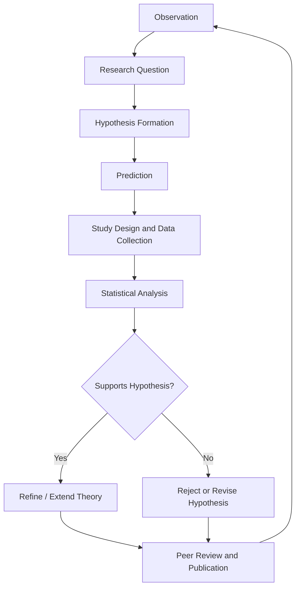

## The Scientific Method in Environmental Research

### Definition

The scientific method is a systematic process for acquiring knowledge through observation, hypothesis formation, testing, and iterative refinement. In environmental research, this general framework is adapted to address systems that are typically large-scale, long-timescale, non-experimental in the strict sense (many environmental systems cannot be manipulated in controlled laboratory conditions), and characterized by multiple interacting variables and inherent uncertainty.

### The Standard Scientific Method: Core Steps

1. **Observation:** Identify a pattern, anomaly, or phenomenon in the natural or human-environment system (e.g., declining amphibian populations near agricultural runoff).
2. **Question formulation:** Pose a specific, answerable question (e.g., "Does pesticide runoff concentration correlate with amphibian mortality rates?").
3. **Hypothesis generation:** Propose a testable explanation, typically framed as a **null hypothesis** ($H_0$, no effect/no relationship) versus an **alternative hypothesis** ($H_1$, an effect/relationship exists).
4. **Prediction:** Derive specific, falsifiable predictions from the hypothesis (e.g., "sites with higher pesticide concentrations will show higher tadpole mortality").
5. **Experimentation/data collection:** Design and conduct a study — field sampling, controlled experiment, or observational survey — to test the prediction.
6. **Analysis:** Apply statistical methods to determine whether observed data support or refute the hypothesis.
7. **Conclusion:** Accept, reject, or refine the hypothesis based on the evidence; report uncertainty and limitations.
8. **Communication and peer review:** Publish results for scrutiny, replication, and integration into the broader scientific literature.
9. **Iteration:** Refined hypotheses generate new questions, restarting the cycle.

### Adaptations for Environmental Systems

Environmental research frequently departs from the idealized laboratory model of the scientific method due to the nature of its subject systems:

- **Limited experimental control:** Many environmental phenomena (climate systems, watersheds, regional ecosystems) cannot be manipulated experimentally at scale for ethical, logistical, or physical reasons. Researchers instead rely on **observational studies**, **natural experiments** (where an external event creates comparable treatment/control conditions), and **quasi-experimental designs**.
- **Multi-causality and confounding variables:** Environmental outcomes typically result from multiple interacting drivers, requiring statistical control (e.g., multivariate regression, mixed-effects models) to isolate variable-specific effects.
- **Long time horizons:** Processes like climate change, forest succession, or soil formation occur over years to millennia, necessitating long-term monitoring programs (e.g., Long-Term Ecological Research (LTER) sites) rather than short-duration experiments.
- **Spatial heterogeneity and scale:** Findings from one location or ecosystem often do not generalize directly to others, requiring replication across sites and explicit consideration of spatial scale in study design.
- **Irreversibility and precaution:** Some environmental risks (species extinction, ecosystem collapse, certain pollution effects) are irreversible, which has led to the development of the **precautionary principle** — the position that a lack of full scientific certainty should not be used as a reason to postpone cost-effective measures to prevent environmental degradation, particularly where the potential harm is serious or irreversible.

### Research Design Types in Environmental Science

| Design type | Description | Example |
| --- | --- | --- |
| Controlled laboratory experiment | Manipulates a single variable in a controlled setting | Testing pesticide toxicity on lab-reared fish populations |
| Field experiment | Manipulates variables in a natural setting with some control | Fertilization plots in a manipulated grassland study |
| Natural experiment | Exploits a naturally occurring event as a quasi-controlled comparison | Comparing ecosystem recovery before/after a wildfire |
| Observational/correlational study | Measures variables without manipulation | Correlating urban heat island intensity with land-use type |
| Longitudinal/monitoring study | Repeated measurements over extended time | Decadal water quality monitoring of a river system |
| Meta-analysis | Statistical synthesis of results across multiple studies | Combining global studies on deforestation-driven biodiversity loss |
| Modeling and simulation | Computational representation of system dynamics under varying inputs | General circulation models (GCMs) projecting future climate scenarios |

### Statistical and Analytical Foundations

- **Hypothesis testing:** Uses a significance threshold (commonly $\alpha = 0.05$) to determine whether observed patterns are unlikely to have arisen by chance alone under the null hypothesis.
- **p-values:** Represent the probability of observing data as extreme as, or more extreme than, the collected data, assuming the null hypothesis is true. A result is typically termed "statistically significant" if $p < \alpha$. [Note: a low p-value indicates evidence against the null hypothesis; it does not by itself indicate the size or practical importance of an effect.]
- **Confidence intervals:** Provide a range of plausible values for a parameter (e.g., mean pollutant concentration), commonly reported at the 95% confidence level.
- **Regression models:** Used extensively to quantify relationships between environmental variables (e.g., temperature as a function of $CO_2$ concentration), expressed generally as:

$$Y = \beta_0 + \beta_1 X_1 + \beta_2 X_2 + \dots + \varepsilon$$

where $Y$ is the response variable, $X_i$ are predictor variables, $\beta_i$ are estimated coefficients, and $\varepsilon$ is the error term.

- **Uncertainty quantification:** Environmental models (especially climate models) report uncertainty ranges reflecting parameter uncertainty, model structural uncertainty, and scenario uncertainty (e.g., IPCC likelihood language: "likely," "very likely," corresponding to defined probability ranges).
- **Replication and meta-analysis:** Given site-specific variability, single studies are rarely treated as conclusive; systematic reviews and meta-analyses aggregate findings across studies to establish robust patterns.

**Key Points**

- The scientific method in environmental research follows the standard observation-hypothesis-testing cycle but is adapted for systems with limited experimental control, long time horizons, and high spatial variability.
- Natural experiments, long-term monitoring, and modeling substitute for controlled experiments where direct manipulation is impossible or unethical.
- Statistical significance (p-values) and confidence intervals are standard tools, but practical/ecological significance must be assessed separately from statistical significance.
- The precautionary principle is a distinct decision-making framework used when scientific certainty is incomplete but potential harm is severe or irreversible.
- Peer review, replication, and meta-analysis are essential for validating findings given the high variability inherent in environmental systems.

### Example: Testing a Hypothesis on Stream Eutrophication

**Question:** Does agricultural fertilizer runoff increase algal bloom frequency in adjacent streams?

- **$H_0$:** Fertilizer runoff concentration has no relationship with algal bloom frequency.
- **$H_1$:** Higher fertilizer runoff concentration is associated with increased algal bloom frequency.
- **Study design:** Observational study across 20 stream sites with varying adjacent land use (agricultural vs. forested), measuring nitrogen/phosphorus concentrations and bloom frequency over two growing seasons.
- **Analysis:** Linear regression of bloom frequency against nutrient concentration, controlling for confounding variables (stream flow rate, temperature, sunlight exposure).
- **Result interpretation:** A statistically significant positive coefficient ($p < 0.05$) for nutrient concentration would support $H_1$, though researchers would additionally assess effect size, alternative explanations, and consistency with existing eutrophication literature (e.g., established links between phosphorus loading and cyanobacterial bloom formation) before drawing causal conclusions.
- **Limitation acknowledgment:** As an observational (non-manipulated) study, this design supports correlational rather than definitive causal conclusions unless paired with experimental or mechanistic evidence.

### Common Misconceptions

- **Misconception:** A statistically significant result proves causation. **Clarification:** Statistical significance indicates the observed relationship is unlikely under the null hypothesis; establishing causation typically requires additional criteria (e.g., mechanism, temporal precedence, experimental manipulation, or established causal criteria such as those associated with Bradford Hill).
- **Misconception:** Environmental science cannot be truly scientific because it lacks controlled experiments. **Clarification:** Observational, quasi-experimental, and modeling approaches are well-established, rigorous scientific methods suited to systems where controlled manipulation is impractical or unethical; they are not lesser substitutes but appropriately matched tools.
- **Misconception:** A single study settles a scientific question. **Clarification:** Scientific consensus in environmental science, as in other fields, typically builds through replication, meta-analysis, and convergence of evidence across multiple independent studies and methods.

### Common Sources of Error and Bias

- **Confounding variables:** Unmeasured or uncontrolled variables that correlate with both predictor and outcome, potentially producing spurious associations.
- **Selection bias:** Non-representative sampling of sites, time periods, or populations.
- **Publication bias:** Tendency for studies with statistically significant or "positive" findings to be published more frequently than null results, potentially skewing the perceived weight of evidence in meta-analyses.
- **Measurement error:** Instrument calibration issues, especially relevant in field-based environmental sampling (e.g., water quality sensors, air quality monitors).
- **Temporal and spatial autocorrelation:** Environmental data points collected close in time or space are often not statistically independent, violating assumptions of many standard statistical tests unless explicitly modeled (e.g., via spatial or time-series statistical methods).

### Related Topics

- Experimental design: controlled, quasi-experimental, and observational studies
- Statistical methods in ecology and environmental data analysis
- The precautionary principle in environmental decision-making
- Long-Term Ecological Research (LTER) networks
- Climate model uncertainty and IPCC likelihood language
- Meta-analysis and systematic review methodology
- Peer review process and scientific consensus formation
- Environmental monitoring and sensor network design