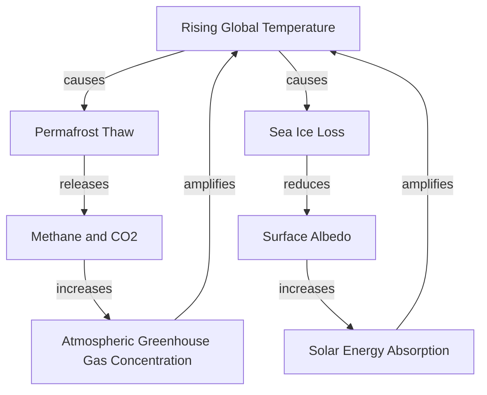

## Systems Thinking in Environmental Science

### Definition

Systems thinking is an analytical approach that examines phenomena as interconnected components within a bounded whole, emphasizing relationships, feedback loops, emergent behavior, and dynamic change over time, rather than analyzing components in isolation. In environmental science, systems thinking is foundational because ecological, atmospheric, hydrological, and human systems are tightly coupled: a change in one component propagates through others via interconnected pathways, often producing outcomes that would not be predictable from studying any single component alone.

### Core Concepts of Systems

- **System:** A set of interacting or interdependent components forming an integrated whole, bounded by a defined system boundary that separates it from its surrounding environment.
- **Components/stocks:** The measurable quantities within a system (e.g., atmospheric $CO_2$ concentration, forest biomass, population size).
- **Flows:** The rates at which stocks change — inflows (additions) and outflows (removals) (e.g., carbon emissions as an inflow to atmospheric $CO_2$, photosynthetic uptake as an outflow).
- **Feedback loops:** Mechanisms by which a system's output influences its own future behavior.
  - **Negative (balancing) feedback:** Counteracts change, tending to stabilize a system around an equilibrium (e.g., predator-prey population regulation).
  - **Positive (reinforcing) feedback:** Amplifies change, tending to push a system away from equilibrium (e.g., permafrost thaw releasing methane, which increases warming, which accelerates further thaw).
- **Emergent properties:** System-level characteristics that arise from component interactions and are not present in, or predictable from, any individual component alone (e.g., ecosystem resilience emerging from species diversity and functional redundancy).
- **Thresholds and tipping points:** Critical levels beyond which a system shifts to a qualitatively different state, often abruptly and sometimes irreversibly (e.g., coral reef collapse past a thermal stress threshold).
- **Resilience:** A system's capacity to absorb disturbance and reorganize while retaining essentially the same function, structure, and feedbacks.
- **Open vs. closed systems:** Open systems exchange both matter and energy with their surroundings (most ecosystems); closed systems exchange energy but not matter (Earth as a whole, to a close approximation, exchanges energy with space but not significant matter).

*The diagram above illustrates two positive (reinforcing) feedback loops in the climate system: the permafrost-carbon feedback and the ice-albedo feedback, both of which amplify initial warming.*

### Feedback Loop Classification

| Feedback type | Effect on system | Environmental examples |
| --- | --- | --- |
| Negative (balancing) | Stabilizes, resists change | Predator-prey cycles; thermostatic ocean carbon buffering (up to saturation limits) |
| Positive (reinforcing) | Amplifies, destabilizes | Ice-albedo feedback; permafrost-carbon feedback; water vapor feedback |

[Note: "positive" and "negative" in feedback terminology refer to the direction of the loop's effect on the original change, not to whether the outcome is desirable.]

### Systems-Level Analytical Tools

- **Systems diagrams / causal loop diagrams:** Visual representations mapping causal relationships and feedback structures among system variables, used to communicate and analyze complex interdependencies before quantitative modeling.
- **Stock-and-flow modeling:** Quantitative simulation modeling representing stocks (accumulations) and flows (rates of change) mathematically, often implemented in software such as STELLA, Vensim, or custom differential equation models.
- **System dynamics modeling:** A modeling methodology (developed by Jay Forrester in the 1950s–60s) using coupled differential/difference equations to simulate feedback-driven system behavior over time; famously applied in the 1972 *Limits to Growth* study modeling global population, resource, and pollution interactions.
- **Earth system models (ESMs) / general circulation models (GCMs):** Coupled computational models integrating atmosphere, ocean, land surface, ice, and biogeochemical cycle subsystems to simulate and project climate behavior.
- **Network analysis:** Applied to food webs, trophic cascades, and ecological interaction networks to study connectivity, stability, and vulnerability to node/species loss.
- **Agent-based modeling (ABM):** Simulates systems as collections of autonomous, interacting agents (e.g., individual organisms, land parcels, or human decision-makers) to study emergent system-level patterns from individual-level rules.

### Mathematical Representation of System Dynamics

A general stock-flow relationship is expressed as a differential equation:

$$\frac{dS}{dt} = I(t) - O(t)$$

where $S$ is the stock (e.g., atmospheric carbon), $I(t)$ is the inflow rate (e.g., emissions), and $O(t)$ is the outflow rate (e.g., natural carbon sequestration), both potentially time-dependent.

For coupled feedback systems, this generalizes to systems of differential equations. The classic **Lotka-Volterra predator-prey model**, a foundational example of negative feedback dynamics in ecology, is expressed as:

$$\frac{dx}{dt} = \alpha x - \beta xy$$

$$\frac{dy}{dt} = \delta xy - \gamma y$$

where $x$ is prey population, $y$ is predator population, $\alpha$ is prey growth rate, $\beta$ is predation rate, $\delta$ is predator growth efficiency from predation, and $\gamma$ is predator death rate.

**Key Points**

- Systems thinking treats environmental phenomena as interconnected wholes governed by stocks, flows, and feedback loops, rather than isolated linear cause-effect chains.
- Negative feedback stabilizes systems; positive feedback amplifies change and can drive systems toward tipping points.
- Emergent properties (e.g., ecosystem resilience) arise from component interactions and cannot be fully understood by studying components in isolation.
- Quantitative tools — system dynamics models, Earth system models, agent-based models — operationalize systems thinking for prediction and scenario analysis.
- Climate change is a canonical example of systems thinking in practice, involving multiple interacting reinforcing feedback loops (ice-albedo, permafrost-carbon, water vapor).

### Applied Example: The Carbon Cycle as a System

The global carbon cycle illustrates core systems concepts in an integrated way:

- **Stocks:** Atmospheric carbon, terrestrial biomass, soil carbon, ocean dissolved inorganic carbon, fossil fuel reserves, sedimentary rock carbon.
- **Flows:** Photosynthesis (atmosphere → biomass), respiration and decomposition (biomass/soil → atmosphere), ocean-atmosphere gas exchange (bidirectional), fossil fuel combustion (geologic reserve → atmosphere), weathering (rock → ocean, over geologic timescales).
- **Negative feedback example:** Increased atmospheric $CO_2$ can enhance plant photosynthetic uptake (the "$CO_2$ fertilization effect"), partially buffering atmospheric concentration increases — though this effect is subject to other limiting factors (nutrients, water availability) and does not fully offset anthropogenic emissions. [Inference: the magnitude and persistence of the CO2 fertilization effect at ecosystem scale remains an active area of scientific research with meaningfully varying estimates across studies.]
- **Positive feedback example:** Warming-driven permafrost thaw releases stored soil carbon as $CO_2$ and methane, further amplifying atmospheric greenhouse gas concentrations and warming.
- **System boundary consideration:** Whether a given carbon pool is treated as "external" (e.g., fossil fuel reserves, historically outside the actively cycling system on human timescales) or "internal" depends on the timescale of analysis — a key systems-thinking consideration.

### Applications in Environmental Management

- **Ecosystem-based management:** Manages resources (e.g., fisheries) by accounting for interspecies and habitat interdependencies rather than managing single species in isolation.
- **Integrated water resources management (IWRM):** Coordinates management of water, land, and related resources across a watershed as a coupled system rather than through fragmented sectoral approaches.
- **Climate scenario planning:** Uses coupled Earth system models to project outcomes under different emissions pathways (e.g., IPCC Shared Socioeconomic Pathways, SSPs), explicitly incorporating feedback dynamics.
- **Circular economy design:** Applies systems thinking to industrial and material flows, aiming to minimize waste by closing material loops (analogous to natural nutrient cycling).
- **Disaster and resilience planning:** Uses systems concepts (thresholds, resilience, adaptive capacity) to design infrastructure and policy responses that anticipate cascading failures rather than isolated point failures.

### Common Misconceptions

- **Misconception:** "Positive feedback" means a good or beneficial outcome. **Clarification:** In systems terminology, "positive" refers to the loop's mathematical/directional effect of amplifying an initial change, regardless of whether the outcome is desirable — e.g., the ice-albedo feedback is a positive feedback with an undesirable outcome (accelerated warming).
- **Misconception:** Environmental systems always return to a single stable equilibrium. **Clarification:** Many systems exhibit multiple stable states (multistability) and can shift permanently to an alternative state after crossing a threshold (e.g., lake eutrophication regime shifts, coral reef to algae-dominated state transitions).
- **Misconception:** More complex models are always more accurate. **Clarification:** Model utility depends on matching model complexity and structure to the research question and available data; overly complex models can introduce compounding uncertainty and reduce interpretability. [Inference: the appropriate balance between model complexity and interpretability is a matter of ongoing methodological discussion rather than a fixed rule.]

### Related Topics

- Feedback loops in the climate system (ice-albedo, permafrost-carbon, water vapor)
- Biogeochemical cycles (carbon, nitrogen, phosphorus, water) as coupled systems
- Earth system models and climate scenario modeling (IPCC SSPs)
- Ecological resilience and regime shifts
- System dynamics modeling and the *Limits to Growth* study
- Agent-based modeling in environmental and social-ecological systems
- Planetary boundaries framework as an applied systems concept
- Integrated water resources management (IWRM)