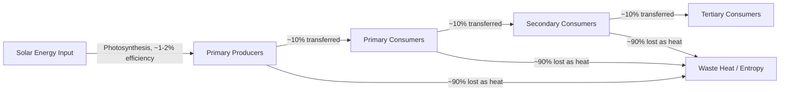

## Matter, Energy, and the Laws of Thermodynamics

### Definition

Matter and energy are the fundamental physical quantities governing all environmental processes — from chemical cycling of nutrients to the flow of solar radiation through ecosystems. The laws of thermodynamics describe how energy behaves during transformation and transfer, and together with the law of conservation of mass, they establish the non-negotiable physical constraints within which all environmental systems — biological, chemical, and industrial — must operate.

### Matter and Conservation of Mass

- **Matter:** Anything that has mass and occupies space, existing in solid, liquid, gas, or plasma states.
- **Law of conservation of mass:** In any closed system, matter is neither created nor destroyed, only transformed or relocated. In environmental science, this underlies materials-balance approaches to tracking pollutants, nutrients, and resources through systems (e.g., mass-balance models used to track contaminant fate in a watershed).
- **Practical implication:** Waste and pollution are not eliminated by natural or engineered processes — they are transformed (e.g., chemically altered) or relocated (e.g., dispersed to another environmental medium such as air, water, or soil). This principle underlies the environmental science maxim often summarized as "everything must go somewhere."
- **Matter cycling:** Because Earth is (to a close approximation) a materially closed system exchanging negligible matter with space, elements essential to life (carbon, nitrogen, phosphorus, sulfur, water) must be continuously recycled through biogeochemical cycles rather than replenished from an external source.

### Energy: Definitions and Forms

- **Energy:** The capacity to do work or transfer heat, existing in multiple interconvertible forms: kinetic, potential, thermal, chemical, radiant (electromagnetic), nuclear, and electrical.
- **Primary energy source for Earth's environmental systems:** Solar radiation, which drives photosynthesis, atmospheric circulation, the hydrological cycle, and (indirectly, via fossil fuels) most human energy use.
- **Units:** Energy is measured in joules (J) in the SI system; environmental and ecological contexts also commonly use calories, kilocalories (food energy), and kilowatt-hours (electrical energy).

### The First Law of Thermodynamics (Conservation of Energy)

**Statement:** Energy cannot be created or destroyed, only converted from one form to another or transferred from one system to another. The total energy of an isolated system remains constant.

$$\Delta U = Q - W$$

where $\Delta U$ is the change in internal energy of a system, $Q$ is heat added to the system, and $W$ is work done by the system.

**Environmental applications:**

- **Energy flow through ecosystems:** Solar energy captured by primary producers via photosynthesis is converted into chemical energy (biomass), which is then transferred through trophic levels via consumption, but the total energy is conserved across all transformations (though usable, or "high-quality," energy decreases at each transfer — see the second law below).
- **Climate energy balance:** Earth's climate system operates on an energy balance in which incoming solar radiation must, over the long term, balance outgoing reflected and thermal radiation; an imbalance (e.g., from increased greenhouse gas concentrations trapping outgoing longwave radiation) results in net energy accumulation, manifesting as warming.
- **Energy accounting in engineered systems:** Power plant efficiency calculations, building energy audits, and industrial energy balances all rely on first-law accounting of energy inputs, outputs, and losses.

### The Second Law of Thermodynamics (Entropy)

**Statement:** In any energy transfer or transformation, the total entropy (a measure of disorder or energy dispersal) of an isolated system tends to increase over time; equivalently, no energy transformation is 100% efficient — some usable energy is always converted to lower-quality, typically thermal, energy that is less available to do further work.

$$\Delta S_{universe} \geq 0$$

where $\Delta S$ represents the change in entropy.

**Environmental applications:**

- **Trophic energy loss:** At each trophic level in a food chain, only approximately 10% of energy (the commonly cited "ten percent rule," though actual values vary by ecosystem and taxa) is transferred to the next level as biomass; the remainder is lost primarily as metabolic heat, consistent with the second law. [Inference: the "ten percent rule" is a widely used ecological approximation rather than a precise universal constant; actual trophic transfer efficiencies vary by ecosystem type and trophic level.]
- **Explains why food chains are limited in length:** Because usable energy diminishes substantially at each trophic transfer, most ecosystems support only 4–5 trophic levels before available energy becomes insufficient to support additional levels.
- **No perpetual motion or 100% efficient energy systems:** All real energy conversion processes (combustion engines, power plants, even biological metabolism) release waste heat, setting fundamental upper limits on the efficiency of any energy technology, renewable or otherwise.
- **Directionality of natural processes:** The second law explains why certain processes (e.g., diffusion of a pollutant through water, dispersal of heat from a warm object) proceed spontaneously in one direction and require energy input to reverse.

### Energy Flow vs. Matter Cycling: A Key Distinction

| Property | Matter | Energy |
| --- | --- | --- |
| Conservation | Conserved (total mass constant in closed system) | Conserved (total energy constant, per first law) |
| Movement pattern | Cycles (biogeochemical cycles: carbon, nitrogen, water) | Flows unidirectionally (solar input → dissipated heat output) |
| Reusability | Can be indefinitely recycled through ecosystems | Cannot be recycled once dissipated as low-grade heat (per second law) |
| Ecosystem implication | Elements like carbon and nitrogen are reused by successive organisms | Ecosystems require continuous solar energy input; energy is not reused |

This distinction — **matter cycles, energy flows** — is one of the most fundamental organizing principles in ecosystem ecology.

**Key Points**

- The law of conservation of mass ensures matter is transformed or relocated, never created or destroyed, underlying all pollutant fate and biogeochemical cycling analysis.
- The first law of thermodynamics establishes that energy is conserved across transformations, forming the basis for ecosystem energy budgets and climate energy balance calculations.
- The second law of thermodynamics establishes that every energy transformation loses usable energy as heat (entropy increases), explaining trophic energy loss, the ~10% ecological transfer efficiency, and fundamental limits on all energy technology efficiency.
- Matter cycles through ecosystems (biogeochemical cycles), while energy flows through them unidirectionally and cannot be recycled once dissipated.

### Example: Energy Flow Through a Simple Food Chain

Consider a grassland ecosystem receiving $1,000,000$ kcal of solar energy input per year:

- **Primary producers (grasses):** Capture roughly 1–2% of incident solar energy via photosynthesis — approximately $10,000–20,000$ kcal converted to biomass.
- **Primary consumers (herbivores, e.g., grasshoppers):** Consume producer biomass but retain only approximately 10% as new biomass — roughly $1,000–2,000$ kcal — with the remainder lost as metabolic heat, undigested material, or used for the herbivore's own respiration.
- **Secondary consumers (carnivores, e.g., small birds):** Retain approximately 10% of the herbivore biomass energy — roughly $100–200$ kcal.
- **Tertiary consumers (top predators):** Retain approximately 10% further — roughly $10–20$ kcal.

This progressive energy loss, consistent with the second law of thermodynamics, explains both why biomass pyramids narrow sharply at higher trophic levels and why top predators are typically far less numerous and more vulnerable to energy-supply disruption than primary producers.

### Applications in Environmental Technology and Policy

- **Renewable energy system design:** Even renewable technologies (solar panels, wind turbines) are bound by thermodynamic efficiency limits (e.g., the Shockley-Queisser limit constrains maximum theoretical efficiency of single-junction photovoltaic cells at approximately 33.7% under standard solar spectrum conditions).
- **Energy return on investment (EROI):** A ratio comparing energy obtained from a resource to the energy expended to obtain it; declining EROI in some fossil fuel extraction contexts (e.g., deepwater drilling, oil sands) reflects the increasing thermodynamic cost of extracting lower-quality resources.
- **Climate change mechanism:** The enhanced greenhouse effect is fundamentally a first-law energy-balance phenomenon: added greenhouse gases increase the atmosphere's absorption and re-emission of outgoing longwave radiation, altering the balance between incoming and outgoing energy and producing net planetary energy accumulation.
- **Waste heat and industrial ecology:** Recognizing that all industrial processes generate waste heat (per the second law) has driven interest in combined heat and power (CHP) systems and industrial symbiosis, which aim to capture and reuse waste heat that would otherwise be dissipated.

### Common Misconceptions

- **Misconception:** Recycling and composting "destroy" waste. **Clarification:** Consistent with conservation of mass, these processes transform materials into different chemical or physical forms; matter is relocated and restructured, not eliminated.
- **Misconception:** Renewable energy systems can theoretically achieve 100% efficiency since they don't burn fuel. **Clarification:** All energy conversion processes, including renewable technologies, are subject to the second law of thermodynamics and inevitably lose some usable energy as heat; "renewable" refers to the resource's replenishment rate, not to thermodynamic efficiency.
- **Misconception:** Energy is "used up" in ecosystems. **Clarification:** Energy is conserved (first law) but converted into progressively lower-quality, less usable forms (increased entropy, per the second law) — it is degraded in quality, not destroyed in quantity.
- **Misconception:** The "10% rule" is an exact universal law. **Clarification:** It is a widely cited ecological approximation; actual trophic transfer efficiencies vary by ecosystem, taxa, and environmental conditions.

### Related Topics

- Biogeochemical cycles (carbon, nitrogen, phosphorus, water) as matter-cycling systems
- Trophic levels, food chains, and ecological pyramids
- Earth's energy balance and the greenhouse effect
- Renewable energy technology and thermodynamic efficiency limits
- Energy return on investment (EROI) in resource extraction
- Ecosystem productivity: gross vs. net primary production
- Industrial ecology and waste heat recovery
- Entropy and the arrow of time in natural processes