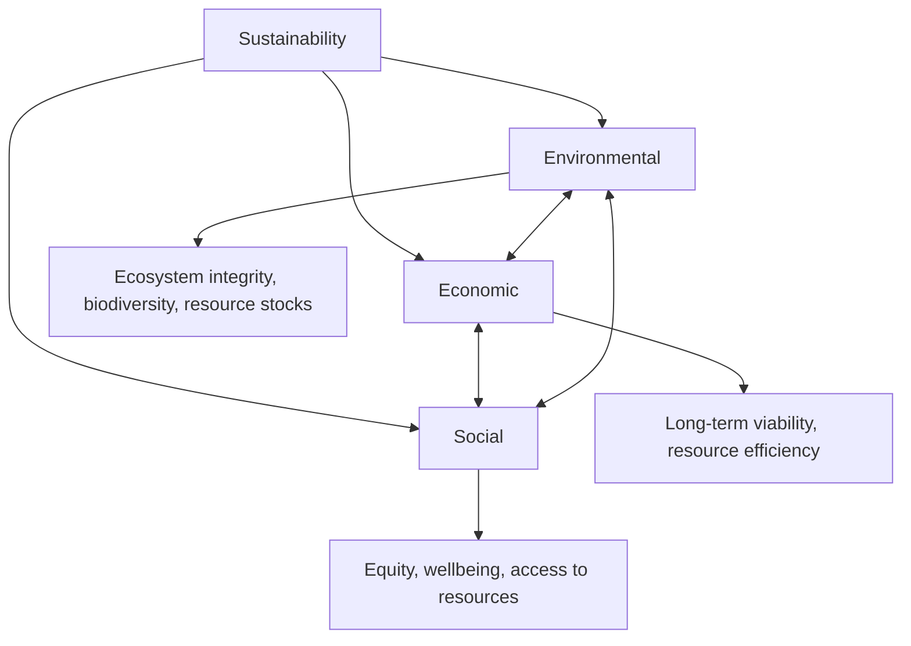

## Core Principles of Sustainability

### Definition

Sustainability is the capacity to meet present needs without compromising the ability of future generations to meet their own needs — the most widely cited formulation being that of the 1987 Brundtland Report (*Our Common Future*). As a scientific and policy concept, sustainability provides a framework for evaluating whether current patterns of resource use, production, and consumption can persist indefinitely without degrading the ecological, social, and economic systems on which they depend.

### The Three Pillars (Triple Bottom Line) Framework

Sustainability is most commonly operationalized through three interdependent dimensions:

- **Environmental sustainability:** Maintaining the integrity, productivity, and resilience of ecological systems, including biodiversity, resource stocks, and ecosystem services.
- **Economic sustainability:** Maintaining long-term economic viability and resource efficiency without depleting the natural or social capital required for future economic activity.
- **Social sustainability:** Ensuring equitable access to resources, opportunities, and quality of life across current and future populations, including considerations of justice and human wellbeing.

A common critique of the three-pillar model is that it presents the pillars as equally weighted and separable, when in practice the economy and society are fully embedded within, and dependent upon, the environment (a "nested" or "embedded" model is often used as an alternative representation, with the economy inside society, and society inside the environment/biosphere).

### Core Principles

- **Intergenerational equity:** The principle that present generations should not use resources or degrade environmental quality in ways that unfairly limit the options and wellbeing of future generations. This is the ethical core of the Brundtland definition.
- **Intragenerational equity:** The principle that resources and environmental burdens should be distributed fairly among people currently living, across nations, income groups, and communities — closely linked to environmental justice.
- **Carrying capacity:** The maximum level of resource use or population that an ecological system can sustain indefinitely without degradation, expressed in population models (e.g., the logistic growth equation) as the parameter $K$:

$$\frac{dN}{dt} = rN\left(1 - \frac{N}{K}\right)$$

- **The precautionary principle:** Where an activity raises threats of serious or irreversible harm to the environment or human health, lack of full scientific certainty should not be used as a reason to postpone cost-effective preventive measures.
- **Polluter pays principle:** The party responsible for producing pollution should bear the costs of managing it to prevent damage to human health or the environment, internalizing what would otherwise be an external cost.
- **Renewable resource management within regeneration rates:** Renewable resources (fisheries, forests, groundwater) should be harvested at or below their natural regeneration rate to avoid depletion; exceeding this rate constitutes unsustainable use even for theoretically renewable resources.
- **Non-renewable resource stewardship:** Since non-renewable resources (fossil fuels, minerals) cannot be regenerated on human timescales, sustainability principles call for minimizing consumption rates, maximizing efficiency, and investing extraction revenues into renewable substitutes or long-term capital (sometimes termed "weak sustainability" when substitution between natural and manufactured capital is considered acceptable, versus "strong sustainability," which holds that certain forms of natural capital are non-substitutable).
- **Waste minimization and closed-loop design:** Modeling human production systems on natural nutrient cycling, minimizing waste generation and maximizing material reuse and recycling (foundational to circular economy principles).
- **Ecosystem services valuation:** Recognizing and, where possible, economically valuing the benefits ecosystems provide to humans (provisioning, regulating, supporting, and cultural services) to ensure these benefits are accounted for in decision-making rather than treated as free and inexhaustible.

### Weak vs. Strong Sustainability

| Concept | Core claim | Implication |
| --- | --- | --- |
| Weak sustainability | Natural capital and manufactured/human capital are substitutable; what matters is maintaining total capital stock | Depleting a forest is acceptable if the economic returns are reinvested in equivalent value-generating capital |
| Strong sustainability | Certain forms of natural capital (e.g., climate stability, biodiversity, critical ecosystem functions) are non-substitutable | Some natural capital must be preserved regardless of economic compensation, due to irreplaceability or irreversibility |

[Note: the weak/strong sustainability distinction remains a live debate in ecological economics, with disagreement over which specific forms of natural capital, if any, should be considered strictly non-substitutable.]

### Planetary Boundaries as a Scientific Sustainability Framework

The planetary boundaries framework (Rockström et al., 2009, updated in subsequent years) identifies nine Earth-system processes with defined thresholds beyond which the risk of destabilizing the Earth system into a less hospitable state increases substantially:

1. Climate change
2. Biosphere integrity (genetic and functional diversity)
3. Land-system change
4. Freshwater use
5. Biogeochemical flows (nitrogen and phosphorus cycles)
6. Ocean acidification
7. Stratospheric ozone depletion
8. Atmospheric aerosol loading
9. Introduction of novel entities (e.g., synthetic chemicals, plastics, radioactive materials)

As of recent assessments, several of these boundaries (including climate change, biosphere integrity, land-system change, biogeochemical flows, and novel entities) have been assessed by the framework's proponents as already exceeded. [Unverified: the precise number of boundaries considered "exceeded" varies slightly across published updates to the framework and is subject to ongoing scientific revision.]

**Key Points**

- Sustainability's most widely used definition (Brundtland, 1987) centers on intergenerational equity: meeting present needs without compromising future generations' ability to meet theirs.
- The three-pillar model (environmental, economic, social) is the standard operational framework, though critics favor a "nested" model emphasizing the economy and society's full dependence on environmental systems.
- Core operational principles include the precautionary principle, polluter pays principle, carrying capacity limits, and harvesting renewable resources within regeneration rates.
- The weak/strong sustainability distinction addresses whether natural capital can be substituted with manufactured capital — a foundational and unresolved debate in sustainability theory.
- The planetary boundaries framework provides a scientific, quantified approach to defining safe operating limits for human activity within Earth system processes.

### Applied Example: Sustainable Fisheries Management

A fishery illustrates core sustainability principles in practice:

- **Carrying capacity application:** Total allowable catch is set based on estimates of the fish stock's **maximum sustainable yield (MSY)** — the largest catch that can be harvested indefinitely without depleting the stock, generally corresponding to harvesting near the point of maximum population growth rate in a logistic growth model.
- **Precautionary principle application:** Given uncertainty in stock assessments, catch limits are often set conservatively below the estimated MSY to buffer against overestimation and environmental variability.
- **Intragenerational equity consideration:** Allocation of catch quotas among commercial, small-scale, and subsistence fishers raises direct equity questions.
- **Intergenerational equity consideration:** Overfishing beyond MSY provides short-term economic gain at the cost of long-term stock collapse, directly trading off current versus future access to the resource.
- **Failure case:** The collapse of the Atlantic northern cod fishery off Newfoundland in 1992, following decades of harvesting substantially above sustainable levels, is widely cited as a canonical example of unsustainable renewable-resource management resulting in long-term ecological and economic loss, with the stock still not fully recovered to prior levels decades later. [Inference: current stock recovery status changes over time as new assessments are published, and readers should consult current fisheries data for the latest status.]

### Sustainability Metrics and Assessment Tools

- **Ecological footprint:** Measures the area of biologically productive land and water required to produce the resources a population consumes and absorb its waste, compared against biocapacity (available productive area), commonly expressed in global hectares per capita.
- **Life-cycle assessment (LCA):** Quantifies environmental impacts of a product or service across its full life cycle (raw material extraction, manufacturing, use, disposal).
- **Sustainable Development Goals (SDGs):** A UN framework of 17 goals (adopted 2015) covering poverty, health, education, clean water, climate action, and biodiversity, providing an internationally adopted operational structure for sustainability targets through 2030.
- **Genuine Progress Indicator (GPI) and Gross National Happiness (GNH):** Alternative wellbeing-based metrics proposed as more holistic complements or alternatives to GDP, which does not account for environmental degradation or resource depletion.

### Common Misconceptions

- **Misconception:** Sustainability means halting all resource use or economic activity. **Clarification:** Sustainability concerns the rate and manner of resource use relative to regenerative and absorptive capacity, not the cessation of use altogether.
- **Misconception:** Sustainability and environmentalism are identical. **Clarification:** Sustainability explicitly integrates economic and social equity dimensions alongside environmental protection; a policy could be environmentally protective but not sustainable if it is economically or socially untenable, and vice versa.
- **Misconception:** All experts agree sustainability requires an end to economic growth. **Clarification:** This is contested — perspectives range from "green growth" (decoupling economic growth from environmental impact via efficiency and technology) to steady-state and degrowth positions (holding that decoupling is insufficient); which position is correct remains actively debated in economics and policy circles.

### Related Topics

- The Brundtland Report and the origin of sustainable development
- Planetary boundaries framework in detail
- Maximum sustainable yield (MSY) and fisheries/forestry management
- Ecological footprint and biocapacity accounting
- UN Sustainable Development Goals (SDGs)
- Weak versus strong sustainability in ecological economics
- Circular economy principles and closed-loop design
- Ecosystem services classification and valuation methods