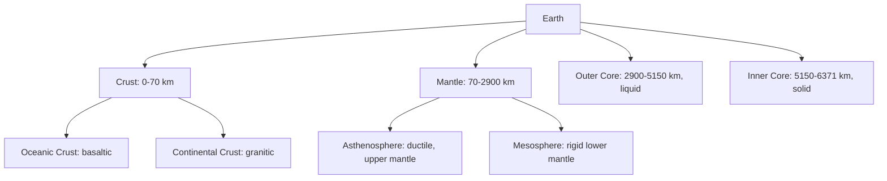

## Structure and Composition of the Earth

### Definition

Earth's structure refers to the layered internal and external organization of the planet, differentiated by composition (chemical makeup) and mechanical properties (physical behavior under stress). Understanding this structure is foundational to environmental science because it governs plate tectonics, volcanic and seismic activity, the distribution of natural resources, soil formation, and the long-term geochemical cycling of elements essential to the biosphere.

### Compositional Layers

Earth is compositionally differentiated into three primary layers based on chemical composition, a structure established early in Earth's history through gravitational differentiation as denser materials sank toward the center while lighter materials rose toward the surface.

- **Crust:** The outermost, thinnest layer, composed primarily of silicate rocks.
  - **Oceanic crust:** Thinner (approximately 5–10 km), denser, basaltic composition (rich in magnesium and iron silicates, informally termed "sima").
  - **Continental crust:** Thicker (approximately 30–70 km, thickest under mountain ranges), less dense, granitic composition (rich in silicon and aluminum silicates, informally termed "sial").
- **Mantle:** Extends from the base of the crust to approximately 2,900 km depth, composed primarily of silicate minerals rich in iron and magnesium (peridotite); constitutes roughly 84% of Earth's total volume.
- **Core:** Composed primarily of iron and nickel, extending from approximately 2,900 km to Earth's center at approximately 6,371 km depth.
  - **Outer core:** Liquid, extending from approximately 2,900 km to 5,150 km depth; convective motion of this electrically conductive liquid iron-nickel material is understood to generate Earth's magnetic field through the geodynamo process.
  - **Inner core:** Solid, extending from approximately 5,150 km to Earth's center, remaining solid despite extreme temperature due to immense pressure.

### Mechanical Layers

Earth is also divided by mechanical (rheological) behavior, a classification critical to understanding plate tectonics:

- **Lithosphere:** The rigid, brittle outer layer comprising the crust and the uppermost portion of the mantle, extending to approximately 100–200 km depth; broken into tectonic plates that move relative to one another.
- **Asthenosphere:** The underlying, more ductile and partially molten layer of the upper mantle (extending to roughly 700 km depth) over which lithospheric plates move; its plastic, slowly-flowing behavior facilitates plate tectonic motion.
- **Mesosphere (lower mantle):** The more rigid, though still slowly deforming, lower portion of the mantle beneath the asthenosphere.
- **Outer core and inner core:** As described above, distinguished mechanically by liquid versus solid state.

### Comparative Table: Earth's Layers

| Layer | Approximate depth range | State | Primary composition | Approx. thickness |
| --- | --- | --- | --- | --- |
| Crust (oceanic) | 0–10 km | Solid, rigid | Basaltic silicates | 5–10 km |
| Crust (continental) | 0–70 km | Solid, rigid | Granitic silicates | 30–70 km |
| Mantle | ~7–2,900 km | Solid (ductile in asthenosphere) | Iron-magnesium silicates (peridotite) | ~2,890 km |
| Outer core | 2,900–5,150 km | Liquid | Iron-nickel alloy | ~2,250 km |
| Inner core | 5,150–6,371 km | Solid | Iron-nickel alloy | ~1,220 km |

### Elemental Composition of the Earth (Bulk and Crust)

- **Bulk Earth composition (by mass):** Dominated by iron (~32%), oxygen (~30%), silicon (~15%), and magnesium (~14%), reflecting the heavy concentration of iron and nickel in the core.
- **Crustal composition (by mass):** Dominated by oxygen (~46%) and silicon (~28%), followed by aluminum, iron, calcium, sodium, potassium, and magnesium — together comprising the vast majority of crustal rock-forming minerals, predominantly silicates.
- [Note: precise percentage values vary slightly across geochemical reference sources depending on sampling methodology and estimation model; figures above reflect commonly cited approximate ranges.]

### Formation and Differentiation

- **Accretion (~4.6 billion years ago):** Earth formed through gravitational accumulation of planetesimals and dust within the early solar system's protoplanetary disk.
- **Differentiation:** Early Earth underwent substantial melting (from accretional heat, radioactive decay, and the energy of the Moon-forming giant impact), allowing denser iron and nickel to sink toward the center (forming the core) while lighter silicate materials rose to form the mantle and crust — a process fundamental to explaining Earth's compositional layering.
- **Ongoing differentiation processes:** Plate tectonics, volcanism, and crustal recycling continue to redistribute material between the crust and mantle over geologic time, though at rates vastly slower than the initial differentiation event.

### Plate Tectonics as a Structural Consequence

The division between rigid lithosphere and ductile asthenosphere directly enables plate tectonics — the theory that Earth's lithosphere is divided into large rigid plates that move relative to one another, driven primarily by mantle convection.

- **Divergent boundaries:** Plates move apart, generating new crust (e.g., mid-ocean ridges such as the Mid-Atlantic Ridge).
- **Convergent boundaries:** Plates collide; one may subduct beneath another (subduction zones, associated with deep ocean trenches and volcanic arcs) or, in continent-continent collisions, crust may thicken to form mountain ranges (e.g., the Himalayas).
- **Transform boundaries:** Plates slide horizontally past one another, generating significant seismic activity (e.g., the San Andreas Fault).

Plate tectonics is environmentally significant because it governs the long-term (geologic-timescale) carbon cycle via processes such as volcanic outgassing and silicate weathering, shapes the distribution of natural hazards (earthquakes, volcanic eruptions, tsunamis), and influences long-term climate stability.

**Key Points**

- Earth is compositionally layered into crust, mantle, and core, and mechanically layered into lithosphere, asthenosphere, mesosphere, and inner/outer core — these are related but distinct classification schemes.
- The outer core's liquid, convecting iron-nickel material generates Earth's magnetic field via the geodynamo process, which shields the planet from harmful solar and cosmic radiation.
- Silicate minerals dominate the crust and mantle, while iron and nickel dominate the core, reflecting gravitational differentiation during Earth's early molten history.
- The rigid lithosphere moving over the ductile asthenosphere is the mechanical basis for plate tectonics, which governs seismic/volcanic hazard distribution and long-term geologic carbon cycling.

### Environmental Relevance of Earth's Structure

- **Natural hazard distribution:** Plate boundary locations directly determine global patterns of earthquake and volcanic risk, critically informing land-use planning, building codes, and disaster preparedness.
- **Geothermal energy potential:** Regions with elevated heat flow from the mantle (e.g., near plate boundaries, hotspots) offer viable geothermal energy resources.
- **Mineral and resource distribution:** Ore deposits, fossil fuel formation, and groundwater aquifer characteristics are directly shaped by crustal geology and tectonic history.
- **Long-term climate regulation:** The geologic carbon cycle — volcanic $CO_2$ outgassing balanced over long timescales by silicate rock weathering (which consumes atmospheric $CO_2$) — operates on timescales of hundreds of thousands to millions of years and represents Earth's primary long-term climate thermostat, distinct from the much faster biological/atmospheric carbon cycle relevant to contemporary climate change.
- **Soil formation:** Weathering of parent rock material (a product of crustal mineralogy) is the foundational first stage of soil formation, directly influencing regional soil fertility and land-use capacity.
- **Magnetic field protection:** The geodynamo-generated magnetosphere deflects most incoming solar wind and cosmic radiation, protecting the atmosphere from erosion and shielding surface life from harmful radiation exposure.

### Common Misconceptions

- **Misconception:** The crust and lithosphere are the same thing. **Clarification:** The crust is a compositional layer (defined by chemical makeup); the lithosphere is a mechanical layer that includes the entire crust plus the uppermost, rigid part of the mantle.
- **Misconception:** The mantle is entirely liquid, like the outer core. **Clarification:** The mantle is predominantly solid rock that deforms slowly (plastically) over geologic timescales in the asthenosphere; it is not molten liquid in the way the outer core is, though localized partial melting does occur in specific regions (e.g., beneath mid-ocean ridges).
- **Misconception:** Tectonic plates move at negligible, unmeasurable rates. **Clarification:** Plate motion, while imperceptible on human timescales for direct observation, is precisely measurable using modern GPS geodesy, with typical rates on the order of a few centimeters per year — roughly comparable to the rate of human fingernail growth.

### Related Topics

- Plate tectonics: boundary types and driving mechanisms
- The rock cycle and rock-forming mineral classification
- The geologic carbon cycle and long-term climate regulation
- Earth's magnetic field and the geodynamo process
- Volcanic and seismic hazard assessment
- Soil formation and parent material weathering
- Mineral resources and ore deposit formation
- Geologic time scale and Earth's formation history