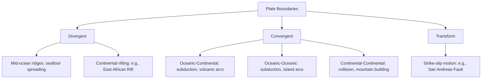

## Plate Tectonics and Geologic Processes

### Definition

Plate tectonics is the unifying geological theory describing Earth's lithosphere as divided into a mosaic of large, rigid plates that move relative to one another over the underlying ductile asthenosphere. This movement, driven primarily by mantle convection and gravitational forces acting on the plates themselves, accounts for the global distribution of earthquakes, volcanic activity, mountain building, ocean basin formation, and the long-term configuration of continents.

### Theoretical Foundation and Historical Development

- **Continental drift hypothesis (Alfred Wegener, 1912):** Proposed that continents were once joined in a single landmass ("Pangaea") and have since drifted apart, based on evidence including matching coastlines, fossil distributions across now-separated continents, and correlating rock formations. The hypothesis was initially rejected by most geologists due to the lack of a plausible physical mechanism for continental movement.
- **Seafloor spreading (Harry Hess, early 1960s):** Proposed that new oceanic crust forms at mid-ocean ridges and spreads outward, providing the missing mechanistic explanation for continental drift.
- **Paleomagnetic striping evidence (1960s):** Symmetric patterns of magnetic polarity reversal recorded in oceanic crust on either side of mid-ocean ridges provided strong, quantifiable confirmation of seafloor spreading.
- **Plate tectonic theory synthesis (mid-to-late 1960s):** Integrated continental drift, seafloor spreading, and earthquake/volcano distribution data into the unified theory of plate tectonics, now considered a cornerstone of modern geology.

### Driving Mechanisms

- **Mantle convection:** Heat from Earth's core and radioactive decay in the mantle drives large-scale convective circulation of mantle material, exerting drag forces on the overlying lithosphere. [Inference: the precise relative contribution of different convective and gravitational driving forces remains an active area of geophysical research.]
- **Ridge push:** Gravitational sliding of lithosphere away from elevated mid-ocean ridges, where newly formed crust is hot, buoyant, and topographically elevated.
- **Slab pull:** The dominant driving force in most current models; the leading edge of a subducting (sinking) oceanic plate, being cooler and denser than surrounding mantle, pulls the rest of the plate along behind it as it sinks into the mantle.
- **Basal drag/mantle traction:** Friction between the base of the moving lithosphere and the underlying flowing asthenosphere, which may either drive or resist plate motion depending on relative flow directions. [Inference: the net contribution of basal drag as a driving versus resisting force is debated and may vary by region.]

### Plate Boundary Types

- **Divergent boundaries:** Plates move apart; magma rises to fill the gap, creating new lithosphere. Occurs at mid-ocean ridges (e.g., the Mid-Atlantic Ridge, spreading at a few centimeters per year) and in continental rift zones (e.g., the East African Rift, where a continent is actively splitting).
- **Convergent boundaries:** Plates move toward one another, producing three subtypes depending on the crust types involved:
  - **Oceanic-continental convergence:** The denser oceanic plate subducts beneath the continental plate, generating volcanic arcs (e.g., the Andes) and deep oceanic trenches.
  - **Oceanic-oceanic convergence:** One oceanic plate subducts beneath the other, producing volcanic island arcs (e.g., the Mariana Islands, Japan) and associated deep trenches (e.g., the Mariana Trench, Earth's deepest known point).
  - **Continental-continental convergence:** Neither plate readily subducts due to comparable low density; crust instead thickens and folds, producing major mountain ranges (e.g., the Himalayas, formed by the ongoing collision of the Indian and Eurasian plates).
- **Transform boundaries:** Plates slide horizontally past each other without significant creation or destruction of crust, generating substantial shear stress and associated seismic activity (e.g., the San Andreas Fault in California, the North Anatolian Fault in Turkey).

### Associated Geologic Processes

- **Volcanism:** Occurs predominantly (though not exclusively) at plate boundaries — divergent boundaries (effusive, basaltic volcanism at mid-ocean ridges) and convergent subduction zones (explosive, silica-rich volcanism in volcanic arcs, driven by water-flux melting of the mantle wedge above the subducting slab). **Hotspot volcanism** (e.g., the Hawaiian Islands) occurs away from plate boundaries, resulting from stationary mantle plumes beneath moving plates, producing characteristic linear island/seamount chains that record plate motion direction and rate over time.
- **Earthquakes:** Concentrated along plate boundaries due to accumulated stress from plate interaction; transform and convergent boundaries typically generate the most significant seismic hazard, with subduction zones capable of producing the largest recorded earthquakes (magnitude 9+) due to the large rupture areas involved.
- **Mountain building (orogeny):** Results from continental-continental collision (fold-and-thrust mountain belts, e.g., Himalayas, Alps) or from prolonged subduction-related volcanic and tectonic activity along continental margins (e.g., the Andes).
- **Metamorphism:** Convergent boundary conditions (elevated heat and pressure from collision and subduction) transform existing rocks into metamorphic rocks (e.g., regional metamorphism producing gneiss and schist in collision zones).
- **Rock cycle integration:** Plate tectonic processes drive the rock cycle by generating new igneous rock at divergent boundaries and volcanic arcs, subjecting rocks to metamorphism at convergent boundaries, and recycling crustal material into the mantle via subduction.

### The Rock Cycle in Relation to Plate Tectonics

$$\text{Igneous} \rightleftharpoons \text{Sedimentary} \rightleftharpoons \text{Metamorphic}$$

- **Igneous rocks** form from cooling and solidification of magma or lava, generated primarily at divergent boundaries (basaltic, e.g., basalt, gabbro) and convergent subduction zones (typically more silica-rich, e.g., andesite, granite).
- **Sedimentary rocks** form from the compaction and cementation of weathered and eroded rock fragments, or from chemical/biological precipitation (e.g., limestone); tectonic uplift exposes rock to weathering, feeding this process.
- **Metamorphic rocks** form when existing rock is subjected to heat and pressure without melting, characteristically occurring in convergent boundary zones.
- **Subduction and recycling:** Oceanic crust subducted at convergent boundaries is ultimately recycled into the mantle, completing a long-term material cycle operating over tens to hundreds of millions of years.

**Key Points**

- Plate tectonics unifies continental drift and seafloor spreading into a single theory explaining the large-scale movement of Earth's rigid lithospheric plates over the ductile asthenosphere.
- Slab pull (the sinking of dense, subducting oceanic lithosphere) is generally considered the dominant force driving plate motion, supplemented by ridge push and mantle convection/drag.
- The three boundary types (divergent, convergent, transform) each produce characteristic and predictable patterns of volcanism, seismicity, and landform development.
- Plate tectonic activity drives the rock cycle, long-term geologic carbon cycling, and the global distribution of natural hazards, mineral resources, and mountain-building processes.

### Environmental and Human Relevance

- **Natural hazard risk assessment:** Precise mapping of plate boundaries and fault systems underlies seismic hazard maps, volcanic risk zoning, and building code requirements in tectonically active regions (e.g., the Pacific "Ring of Fire," which hosts a substantial majority of the world's active volcanoes and a large share of major earthquakes).
- **Tsunami generation:** Large subduction zone earthquakes can displace the seafloor, generating tsunamis; this mechanism underlies major historical events such as the 2004 Indian Ocean earthquake and tsunami and the 2011 Tōhoku earthquake and tsunami in Japan.
- **Geothermal energy resources:** Regions of active or recent volcanism and elevated crustal heat flow (commonly associated with plate boundaries and hotspots) provide viable geothermal energy extraction sites (e.g., Iceland, situated on the Mid-Atlantic Ridge).
- **Long-term climate regulation:** Volcanic $CO_2$ outgassing at divergent and convergent boundaries, balanced over geologic timescales by silicate weathering (which consumes atmospheric $CO_2$ during the breakdown of exposed rock), constitutes Earth's primary long-term ("geologic") climate thermostat, operating over hundreds of thousands to millions of years.
- **Soil and mineral resource distribution:** Volcanic regions often develop highly fertile soils (from mineral-rich volcanic ash weathering); tectonically active zones also host significant ore mineral deposits formed through hydrothermal and magmatic processes associated with subduction and volcanism.

### Common Misconceptions

- **Misconception:** All earthquakes and volcanoes occur at plate boundaries. **Clarification:** While the vast majority do, intraplate seismicity (e.g., the New Madrid Seismic Zone in the central United States) and hotspot volcanism (e.g., Hawaii, Yellowstone) occur away from plate boundaries due to other geologic mechanisms, such as mantle plumes or ancient zones of crustal weakness.
- **Misconception:** Plate tectonic motion is too slow to matter for human timescales. **Clarification:** While plate motion itself (a few centimeters per year) is imperceptible directly, the cumulative stress it generates is released episodically and abruptly as earthquakes, and its long-term effects (mountain building, ocean basin evolution) are directly measurable via modern GPS geodesy over just years to decades.
- **Misconception:** Subduction zones and transform boundaries produce similar hazard profiles. **Clarification:** Subduction zones are associated with the largest earthquakes and with volcanism and tsunami risk, whereas transform boundaries generate significant shallow seismicity but are not typically associated with volcanic activity.

### Related Topics

- Continental drift and seafloor spreading: historical development of plate tectonic theory
- Volcanic hazard types and monitoring (effusive vs. explosive eruptions)
- Earthquake magnitude, seismic waves, and hazard assessment
- The rock cycle: igneous, sedimentary, and metamorphic rock formation
- The geologic (long-term) carbon cycle and silicate weathering
- Mantle convection and geophysical modeling of plate driving forces
- The Pacific Ring of Fire and global hazard distribution
- Geothermal energy resource assessment and extraction