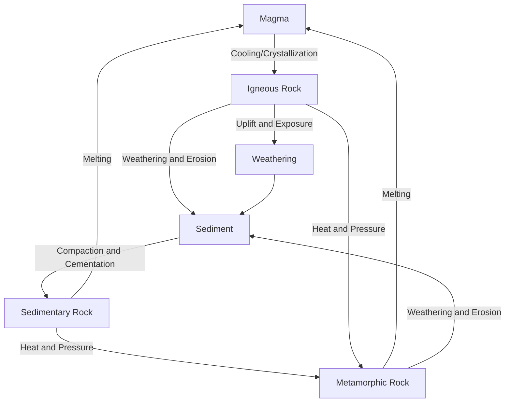

## The Rock Cycle and Mineral Resources

### Definition

The rock cycle is the continuous set of geologic processes by which the three major rock types — igneous, sedimentary, and metamorphic — are formed, transformed, and interconverted over geologic time through weathering, erosion, deposition, compaction, heat, pressure, and melting. Mineral resources are the naturally occurring, economically valuable elements or compounds extracted from rock formations, whose distribution, formation, and extraction are directly governed by rock cycle processes and plate tectonic activity.

### The Three Major Rock Types

- **Igneous rocks:** Form from the cooling and solidification of molten rock (magma below the surface or lava above it).
  - **Intrusive (plutonic) igneous rocks:** Cool slowly beneath the surface, producing large, visible mineral crystals (e.g., granite, gabbro).
  - **Extrusive (volcanic) igneous rocks:** Cool rapidly at or near the surface, producing small or no visible crystals (e.g., basalt, obsidian, pumice).
- **Sedimentary rocks:** Form from the accumulation, compaction, and cementation of weathered and eroded rock fragments (clastic sedimentary rocks), or from chemical precipitation or biological accumulation (chemical/biogenic sedimentary rocks).
  - **Clastic examples:** Sandstone (from sand), shale (from clay/mud), conglomerate (from gravel).
  - **Chemical/biogenic examples:** Limestone (from calcium carbonate, often biologically derived from marine organism shells), rock salt (from evaporation of saline water), coal (from compressed organic plant material).
- **Metamorphic rocks:** Form when existing rock (igneous, sedimentary, or previously metamorphic) is subjected to heat, pressure, or chemically active fluids without fully melting, causing recrystallization and structural change.
  - **Foliated examples** (mineral grains aligned under directional pressure): Slate, schist, gneiss.
  - **Non-foliated examples** (no directional alignment): Marble (from limestone), quartzite (from sandstone).

### The Rock Cycle: Process Pathways

Any rock type can, in principle, be transformed into any other rock type depending on the geologic process it undergoes — there is no fixed or required sequence, making the "cycle" more accurately understood as a network of interconvertible pathways rather than a strict linear loop.

### Key Processes Driving the Rock Cycle

- **Weathering:** The physical breakdown (mechanical weathering, e.g., freeze-thaw cracking) and chemical alteration (chemical weathering, e.g., dissolution of limestone by acidic water) of rock at or near Earth's surface.
- **Erosion and transport:** The physical removal and movement of weathered rock material by water, wind, ice, or gravity.
- **Deposition:** The settling of eroded sediment in a new location (e.g., river deltas, ocean basins, desert dunes).
- **Compaction and cementation (lithification):** The processes by which loose sediment is compressed and bound together (often by mineral cement such as calcite or silica precipitating between grains) to form solid sedimentary rock.
- **Heat and pressure (metamorphism):** Applied without melting, typically in convergent tectonic settings, causing recrystallization and, in many cases, mineral alignment (foliation).
- **Melting:** Sufficient heat causes rock to melt into magma, typically occurring in subduction zones (flux melting from water release), mid-ocean ridges (decompression melting), and mantle hotspots.
- **Uplift and exposure:** Tectonic forces raise rock to the surface, where it becomes subject to weathering, restarting surface-level cycle processes.

### Classification of Mineral Resources

Mineral resources are broadly divided by use category:

- **Metallic minerals:** Extracted primarily for their metal content.
  - **Ferrous metals:** Iron and iron-alloying metals (e.g., iron ore, manganese, chromium), used predominantly in steel production.
  - **Non-ferrous metals:** Copper, aluminum (from bauxite ore), lead, zinc, tin.
  - **Precious metals:** Gold, silver, platinum-group metals, valued for rarity, chemical inertness, and industrial/monetary uses.
  - **Critical/strategic minerals:** Elements essential to modern technology (e.g., lithium, cobalt, rare earth elements) used in batteries, electronics, and renewable energy technologies; increasingly significant in geopolitical and supply-chain policy discussions.
- **Non-metallic minerals:** Extracted for properties other than metal content.
  - **Construction materials:** Sand, gravel, limestone (for cement), gypsum.
  - **Industrial minerals:** Salt, sulfur, phosphate rock (for fertilizer), potash.
  - **Gemstones:** Diamond, ruby, sapphire, emerald.
- **Energy minerals/fossil fuels:** Coal, petroleum, natural gas — though technically organic-derived sedimentary deposits rather than minerals in the strict crystallographic sense, they are conventionally grouped with mineral resources in resource economics and policy contexts.

### Ore Formation and Plate Tectonic Controls

Most economically significant metallic ore deposits form through concentration processes linked to specific tectonic and geologic settings:

- **Magmatic segregation:** Dense metal-bearing minerals settle out of cooling magma (e.g., some platinum and chromium deposits).
- **Hydrothermal processes:** Hot, mineral-rich fluids circulating through fractured rock (often associated with subduction zone magmatism or mid-ocean ridge activity) precipitate concentrated ore minerals as they cool (e.g., many copper, gold, and silver deposits, including "porphyry copper" deposits commonly found along convergent plate margins such as the Andes).
- **Sedimentary/placer processes:** Weathering and erosion concentrate dense, resistant minerals in stream beds or beaches through gravity sorting (e.g., placer gold deposits, some diamond deposits).
- **Evaporite deposits:** Evaporation of enclosed saline water bodies concentrates dissolved minerals (e.g., rock salt, potash, borates).
- **Weathering/residual concentration:** Intense chemical weathering in tropical climates concentrates resistant minerals in residual soil layers (e.g., bauxite, the primary aluminum ore, and some laterite nickel deposits).

**Key Points**

- The rock cycle describes the continuous, non-linear interconversion of igneous, sedimentary, and metamorphic rock through weathering, erosion, deposition, lithification, metamorphism, and melting.
- No fixed sequence governs rock cycle pathways; any rock type can transform into any other depending on the specific geologic process it undergoes.
- Mineral resources are classified as metallic, non-metallic, or energy minerals, and their formation is closely tied to specific tectonic settings — hydrothermal processes at subduction zones and mid-ocean ridges are especially significant for metallic ore deposits.
- Understanding rock cycle processes and plate tectonic context is essential for locating, extracting, and sustainably managing mineral resources.

### Environmental Impacts of Mineral Extraction

- **Habitat destruction and land disturbance:** Surface mining (open-pit, strip mining, mountaintop removal) causes direct and often extensive disturbance to landscapes, ecosystems, and hydrology.
- **Acid mine drainage:** Exposure of sulfide-bearing minerals (common in many metal ores) to air and water generates sulfuric acid and mobilizes heavy metals, a major and often long-lasting source of water pollution near mining sites.
- **Tailings and waste management:** Mineral processing generates large volumes of waste rock and tailings (fine-grained processing residue), which pose risks of dam failure, dust generation, and heavy metal leaching if inadequately managed.
- **Water consumption:** Many extraction and processing methods (e.g., ore flotation, heap leaching) require substantial water inputs, creating resource competition in water-stressed regions.
- **Energy intensity and carbon footprint:** Mineral extraction and refining (particularly for metals like aluminum, which require substantial electrolytic energy input) are energy-intensive processes with associated greenhouse gas emissions.
- **Reclamation and remediation:** Many jurisdictions now require post-mining land reclamation (regrading, revegetation, water treatment) to mitigate long-term ecological damage, though outcomes vary depending on regulatory enforcement and site-specific conditions. [Inference: the effectiveness of reclamation efforts varies considerably by jurisdiction, mineral type, and enforcement rigor, and is not uniformly successful.]

### Mineral Resource Sustainability Considerations

- **Non-renewability:** Mineral resources form over geologic timescales (thousands to millions of years) and are effectively non-renewable on human timescales, distinguishing them from biological renewable resources.
- **Reserve vs. resource distinction:** A **mineral reserve** refers to the portion of a known deposit that is economically and technically extractable under current conditions, whereas a **mineral resource** encompasses all known and inferred deposits regardless of current economic viability — reserve estimates can increase over time due to new discoveries, improved extraction technology, or price changes, independent of the total finite quantity of the resource in Earth's crust.
- **Recycling and circular economy approaches:** Many metals (notably aluminum, copper, steel, and precious metals) can be recycled with substantially lower energy input than primary extraction, making recycling a significant strategy for reducing the environmental footprint of mineral resource use.
- **Critical minerals and renewable energy transition:** The expansion of renewable energy and battery technologies has substantially increased demand for specific critical minerals (lithium, cobalt, nickel, rare earth elements), raising new sustainability, supply-chain, and geopolitical considerations. [Inference: specific demand projections and supply-chain risk assessments for critical minerals vary across studies and are subject to revision as technology and markets evolve.]

### Common Misconceptions

- **Misconception:** The rock cycle proceeds in a fixed, sequential order (igneous → sedimentary → metamorphic → back to igneous). **Clarification:** Any rock type can transform directly into any other rock type depending on the specific process applied; there is no mandatory sequence.
- **Misconception:** "Reserves" represent the total amount of a mineral resource remaining on Earth. **Clarification:** Reserves specifically denote the economically and technically extractable known portion under current conditions; total resources (including undiscovered or currently uneconomic deposits) are typically far larger and less precisely known.
- **Misconception:** Fossil fuels are true minerals in the geologic sense. **Clarification:** Coal, oil, and natural gas are organic-derived sedimentary deposits, not minerals in the strict crystallographic definition (a mineral is a naturally occurring, inorganic solid with a defined chemical composition and crystal structure), though they are conventionally grouped with mineral resources in economic and policy contexts.

### Related Topics

- Weathering and erosion processes (mechanical vs. chemical)
- Plate tectonics and ore deposit formation (hydrothermal, magmatic, placer)
- Soil formation and parent rock material
- Acid mine drainage and water quality impacts of mining
- Mineral reserve versus resource classification systems
- Critical minerals and the renewable energy supply chain
- Recycling and circular economy approaches to metal resources
- Mining regulation, land reclamation, and environmental remediation