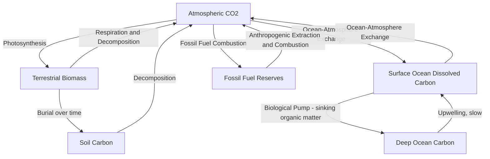

## The Carbon Cycle

### Definition

The carbon cycle is the biogeochemical cycle by which carbon atoms circulate among Earth's major reservoirs — the atmosphere, oceans, terrestrial biosphere, soils, and the geologic (lithospheric) reservoir — through a combination of biological, chemical, physical, and geologic processes. Carbon is the fundamental structural element of all known life and, in its atmospheric gaseous forms (primarily carbon dioxide and methane), a key determinant of Earth's climate through the greenhouse effect.

### Major Carbon Reservoirs

| Reservoir | Approximate carbon stock | Turnover timescale |
| --- | --- | --- |
| Atmosphere | ~870 gigatons carbon (GtC) [pre-industrial ~590 GtC] | Years to decades |
| Terrestrial biosphere (vegetation, soils) | ~2,000–3,000 GtC | Years to centuries (soils can extend to millennia) |
| Surface ocean | ~900 GtC | Years to decades |
| Deep ocean | ~37,000 GtC | Centuries to millennia |
| Fossil fuel reserves | ~5,000+ GtC (estimated, varies by source) | Effectively static without extraction; released on human timescales once combusted |
| Sedimentary rock (carbonates, kerogen) | Estimated in the range of tens of millions of GtC | Hundreds of thousands to millions of years |

[Note: reservoir size estimates vary somewhat across sources depending on methodology, measurement year, and reservoir boundary definitions; figures above reflect commonly cited approximate orders of magnitude.]

The lithosphere (sedimentary rock) constitutes by far the largest carbon reservoir, but its exchange rate with other reservoirs is extremely slow, making it functionally significant primarily for the long-term ("geologic") carbon cycle rather than short-term climate dynamics.

### The Fast (Biological) Carbon Cycle

Operates on timescales of days to centuries, involving exchange between the atmosphere, terrestrial biosphere, and ocean surface:

- **Photosynthesis:** Plants, algae, and cyanobacteria convert atmospheric $CO_2$ and water into organic carbon compounds (glucose) using solar energy, releasing oxygen as a byproduct:

$$6CO_2 + 6H_2O + \text{light energy} \rightarrow C_6H_{12}O_6 + 6O_2$$

- **Respiration:** Organisms (plants, animals, decomposers) metabolize organic carbon compounds to release energy, returning $CO_2$ to the atmosphere:

$$C_6H_{12}O_6 + 6O_2 \rightarrow 6CO_2 + 6H_2O + \text{energy}$$

- **Decomposition:** Microbial breakdown of dead organic matter releases stored carbon back to the atmosphere (as $CO_2$ under aerobic conditions, or methane $CH_4$ under anaerobic conditions, e.g., in wetlands and landfills).
- **Ocean-atmosphere gas exchange:** $CO_2$ dissolves into and outgasses from ocean surface waters based on the partial pressure gradient between atmosphere and ocean, following Henry's Law; this exchange is a major component of the ocean's role as a carbon sink.
- **Ocean biological pump:** Marine phytoplankton photosynthesis fixes dissolved inorganic carbon into organic matter; a fraction sinks to the deep ocean upon death, effectively transferring carbon from the surface to deep ocean reservoir on sinking.

### The Slow (Geologic) Carbon Cycle

Operates on timescales of hundreds of thousands to millions of years, involving exchange between the atmosphere/ocean system and the lithosphere:

- **Silicate weathering:** Atmospheric $CO_2$ dissolves in rainwater to form weak carbonic acid, which chemically weathers silicate rocks, consuming atmospheric $CO_2$ and releasing dissolved calcium and bicarbonate ions that are transported to the ocean via rivers. This process is often summarized by the generalized reaction:

$$CaSiO_3 + CO_2 \rightarrow CaCO_3 + SiO_2$$

- **Carbonate formation and burial:** Marine organisms use dissolved calcium and bicarbonate to build calcium carbonate shells and skeletons; upon death, these accumulate on the ocean floor and are gradually lithified into limestone, sequestering carbon in sedimentary rock over geologic time.
- **Subduction and metamorphism:** Carbonate-rich oceanic sediment can be carried into the mantle via subduction, where heat and pressure can release $CO_2$ back toward the surface through associated volcanic activity.
- **Volcanic outgassing:** Volcanic eruptions and mid-ocean ridge activity release $CO_2$ stored in the mantle back into the atmosphere, completing the long-term cycle and acting as the primary natural counterbalance to $CO_2$ removal via silicate weathering.
- **Fossil fuel formation:** Under specific geologic conditions (anoxic burial of organic matter under sufficient heat and pressure over millions of years), organic carbon is converted into coal, oil, and natural gas — effectively an extremely slow branch of the geologic carbon cycle, now being reversed on a vastly accelerated (decades-scale) timescale through anthropogenic extraction and combustion.

This slow cycle constitutes Earth's primary natural long-term climate stabilization mechanism (the "silicate weathering thermostat"): higher temperatures increase weathering rates, drawing down $CO_2$ and cooling the climate over long timescales, while lower temperatures slow weathering, allowing volcanic outgassing to gradually rebuild atmospheric $CO_2$ — though this negative feedback operates far too slowly (hundreds of thousands of years) to meaningfully offset the current, much faster pace of anthropogenic emissions.

**Key Points**

- The carbon cycle comprises a fast biological cycle (photosynthesis, respiration, ocean-atmosphere exchange, operating over years to centuries) and a slow geologic cycle (weathering, carbonate burial, volcanic outgassing, operating over hundreds of thousands to millions of years).
- The largest carbon reservoir by far is sedimentary rock, but its extremely slow exchange rate means it is functionally irrelevant to near-term climate dynamics compared to the atmosphere, ocean, and biosphere.
- Anthropogenic fossil fuel combustion effectively transfers carbon from the slow geologic reservoir into the fast atmospheric cycle at a rate far exceeding natural removal processes, driving the observed rapid rise in atmospheric $CO_2$ concentration.
- Silicate rock weathering acts as Earth's natural long-term climate thermostat but operates on timescales far too slow to counteract current anthropogenic emission rates.

### The Anthropogenic Perturbation

- **Fossil fuel combustion:** The dominant anthropogenic carbon flux, transferring carbon stored in geologic reservoirs (coal, oil, natural gas) over hundreds of millions of years into the atmosphere within a period of roughly two centuries since the Industrial Revolution.
- **Land-use change and deforestation:** Converting forests (a significant terrestrial carbon stock) to agricultural or urban land releases stored biomass and soil carbon to the atmosphere and reduces future carbon sequestration capacity.
- **Cement production:** The calcination of limestone (calcium carbonate) to produce cement releases $CO_2$ as a direct chemical byproduct, independent of the fossil fuel energy used to power the process.
- **Observed atmospheric concentration increase:** Atmospheric $CO_2$ concentration has risen from a pre-industrial level of approximately 280 parts per million (ppm) to over 420 ppm as of recent measurement records, an increase directly attributable to anthropogenic emissions based on isotopic and mass-balance evidence. [Note: exact current concentration figures continue to rise and should be checked against current monitoring data, such as the Mauna Loa Observatory record, for the most up-to-date value.]
- **Carbon sinks and their limits:** Approximately half of anthropogenic $CO_2$ emissions are currently absorbed by natural sinks (roughly split between the ocean and terrestrial biosphere), with the remainder accumulating in the atmosphere; the long-term capacity and stability of these sinks under continued warming remains an active area of scientific research. [Inference: the precise long-term partitioning and stability of the ocean and terrestrial carbon sinks under sustained warming and elevated CO2 involves substantial scientific uncertainty and is subject to ongoing revision.]

### Ocean Acidification as a Related Consequence

Increased atmospheric $CO_2$ drives increased oceanic $CO_2$ absorption, which reacts with seawater to form carbonic acid, lowering ocean pH:

$$CO_2 + H_2O \rightleftharpoons H_2CO_3 \rightleftharpoons H^+ + HCO_3^-$$

This process, termed ocean acidification, reduces the availability of carbonate ions needed by marine calcifying organisms (corals, mollusks, some plankton) to build calcium carbonate shells and skeletons, representing a distinct but carbon-cycle-linked environmental consequence of rising atmospheric $CO_2$.

### Applications and Management Relevance

- **Carbon accounting and climate policy:** National greenhouse gas inventories, carbon pricing mechanisms (carbon taxes, cap-and-trade systems), and international climate agreements (e.g., the Paris Agreement) are built on quantified carbon cycle accounting.
- **Nature-based carbon sequestration:** Reforestation, afforestation, wetland restoration, and improved agricultural soil management are promoted as strategies to enhance natural carbon sink capacity within the fast biological cycle.
- **Carbon capture and storage (CCS) technologies:** Engineered approaches to capture $CO_2$ from point sources (power plants, industrial facilities) or directly from ambient air (direct air capture) and inject it into stable geologic formations, effectively creating an artificial, accelerated pathway into the slow geologic carbon reservoir.
- **Blue carbon ecosystems:** Coastal ecosystems (mangroves, seagrasses, salt marshes) are increasingly recognized for disproportionately high carbon sequestration rates and stocks per unit area relative to many terrestrial ecosystems, informing coastal conservation and restoration policy.

### Common Misconceptions

- **Misconception:** All atmospheric $CO_2$ increase comes from volcanic activity. **Clarification:** Current scientific assessment attributes the observed rapid rise in atmospheric $CO_2$ primarily to anthropogenic fossil fuel combustion and land-use change; global volcanic $CO_2$ emissions are estimated to be substantially smaller in magnitude than current anthropogenic emissions.
- **Misconception:** The ocean and forests will indefinitely absorb any amount of additional $CO_2$ emitted. **Clarification:** Natural carbon sinks have finite absorption capacity and can be affected by factors such as warming, ocean acidification, and ecosystem disturbance (e.g., deforestation, wildfire), potentially reducing their future effectiveness. [Inference: the degree to which sink capacity may change under future warming scenarios remains actively researched.]
- **Misconception:** The fast and slow carbon cycles operate independently. **Clarification:** They are coupled — for example, fossil fuel combustion moves carbon from the slow (geologic) reservoir into the fast (atmospheric/biological) cycle, and carbon capture and storage technologies attempt to reverse this by artificially moving carbon back into geologic storage.

### Related Topics

- Biogeochemical cycles: nitrogen, phosphorus, and sulfur cycles
- The greenhouse effect and radiative forcing
- Ocean acidification and impacts on marine calcifying organisms
- Carbon capture and storage (CCS) technology and geologic sequestration
- Nature-based climate solutions: reforestation and blue carbon ecosystems
- Global carbon budget and carbon accounting methodologies
- Silicate weathering and long-term climate stabilization
- Fossil fuel formation and the geologic carbon reservoir