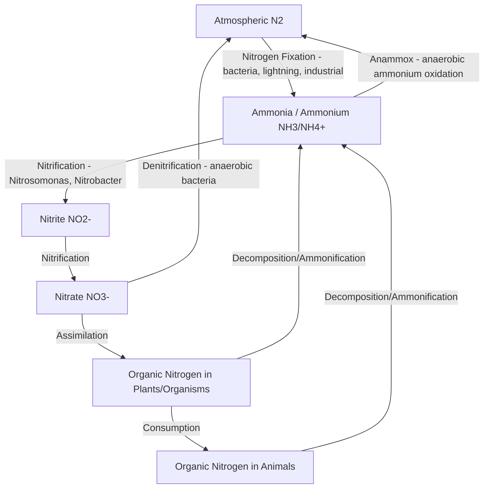

## The Nitrogen Cycle

### Definition

The nitrogen cycle is the biogeochemical cycle by which nitrogen circulates among the atmosphere, soil, water, and living organisms through a series of microbially mediated chemical transformations. Nitrogen is an essential structural component of amino acids, proteins, and nucleic acids in all living organisms, but the atmosphere's dominant form, molecular nitrogen gas ($N_2$), is chemically inert and unusable by most organisms without conversion into biologically reactive forms — making nitrogen transformation processes a critical bottleneck for biological productivity.

### Nitrogen Reservoirs

- **Atmosphere:** The dominant nitrogen reservoir, comprising approximately 78% of Earth's atmosphere by volume as molecular nitrogen gas ($N_2$); this form is largely biologically unavailable due to the strong triple covalent bond between the two nitrogen atoms.
- **Soil and sediments:** Contains nitrogen in organic forms (within living and dead organic matter) and inorganic forms (ammonium $NH_4^+$, nitrite $NO_2^-$, nitrate $NO_3^-$).
- **Ocean and freshwater systems:** Contains dissolved inorganic and organic nitrogen compounds, cycling among phytoplankton, other organisms, and sediment.
- **Living biomass:** Nitrogen incorporated into proteins, nucleic acids, and other biomolecules within organisms.

### Key Nitrogen Transformation Processes

- **Nitrogen fixation:** The conversion of inert atmospheric $N_2$ into biologically usable ammonia ($NH_3$) or ammonium ($NH_4^+$).
  - **Biological fixation:** Performed by specialized nitrogen-fixing bacteria (e.g., *Rhizobium* species in symbiotic association with legume root nodules; free-living bacteria such as *Azotobacter*; cyanobacteria in aquatic systems), which use the enzyme nitrogenase to catalyze the reaction:

$$N_2 + 8H^+ + 8e^- + 16ATP \rightarrow 2NH_3 + H_2 + 16ADP + 16P_i$$

- **Abiotic/atmospheric fixation:** Lightning provides sufficient energy to break the $N_2$ triple bond, producing nitrogen oxides that dissolve in precipitation as nitrates, though this contributes a comparatively minor share of total fixation.
- **Industrial fixation (Haber-Bosch process):** A human-engineered high-temperature, high-pressure catalytic process converting atmospheric $N_2$ and hydrogen into ammonia for synthetic fertilizer production:

$$N_2 + 3H_2 \xrightarrow{\text{catalyst, heat, pressure}} 2NH_3$$

- **Nitrification:** The two-step microbial oxidation of ammonium to nitrite and then nitrate, performed by distinct groups of nitrifying bacteria (and archaea) under aerobic conditions:
  - $NH_4^+ \rightarrow NO_2^-$ (performed by ammonia-oxidizing bacteria/archaea, e.g., *Nitrosomonas*)
  - $NO_2^- \rightarrow NO_3^-$ (performed by nitrite-oxidizing bacteria, e.g., *Nitrobacter*)
- **Assimilation:** Plants and other primary producers absorb nitrate or ammonium from soil or water and incorporate it into organic molecules (amino acids, proteins, nucleic acids); animals obtain organic nitrogen by consuming plants or other organisms.
- **Ammonification (mineralization):** Decomposer organisms (bacteria and fungi) break down nitrogen-containing organic matter from dead organisms and waste products, releasing ammonium back into the soil or water.
- **Denitrification:** Anaerobic bacteria (e.g., *Pseudomonas* species) reduce nitrate back into gaseous nitrogen forms (primarily $N_2$, with nitrous oxide $N_2O$ as an intermediate/byproduct), returning fixed nitrogen to the atmosphere and completing the cycle. This process typically occurs in oxygen-poor environments such as waterlogged soils, wetlands, and sediments.
- **Anaerobic ammonium oxidation (anammox):** A more recently characterized microbial process in which ammonium is directly oxidized using nitrite as the electron acceptor, producing $N_2$ gas without passing through the full nitrate stage; recognized as a significant nitrogen loss pathway in marine and some engineered wastewater treatment systems.

**Key Points**

- The nitrogen cycle converts atmospheric, chemically inert $N_2$ into biologically usable forms (fixation) and back again (denitrification), mediated primarily by specialized microorganisms.
- Nitrification (ammonium → nitrite → nitrate) and ammonification (organic nitrogen → ammonium) are the core processes cycling nitrogen between inorganic and organic forms within ecosystems.
- The industrial Haber-Bosch process has become a dominant anthropogenic nitrogen fixation pathway, roughly doubling the rate of biologically available nitrogen entering the global cycle compared to pre-industrial natural fixation rates. [Inference: precise comparative estimates of anthropogenic versus natural fixation rates vary somewhat across studies but consistently indicate a substantial anthropogenic increase.]
- Excess reactive nitrogen from agricultural and industrial sources drives eutrophication, harmful algal blooms, and other significant water quality and ecosystem impacts.

### The Anthropogenic Nitrogen Cycle Perturbation

- **Synthetic fertilizer production and application:** The Haber-Bosch process has enabled large-scale synthetic nitrogen fertilizer production, which has been critical to supporting global food production for a substantially larger human population than pre-industrial agriculture could sustain, but has also introduced large quantities of reactive nitrogen into the environment beyond what crops can absorb.
- **Fossil fuel combustion:** High-temperature combustion converts atmospheric $N_2$ and oxygen into nitrogen oxides ($NO_x$), contributing to air pollution, acid rain formation, and ground-level ozone formation.
- **Livestock agriculture:** Concentrated animal waste generates substantial ammonia emissions and nitrogen runoff.
- **Nitrogen runoff and eutrophication:** Excess nitrate and ammonium from agricultural runoff, wastewater, and atmospheric deposition entering water bodies stimulates excessive algal growth (eutrophication); subsequent algal die-off and decomposition consumes dissolved oxygen, potentially creating hypoxic "dead zones" (e.g., the seasonal hypoxic zone in the Gulf of Mexico, linked substantially to nitrogen and phosphorus runoff from the Mississippi River watershed).
- **Nitrous oxide ($N_2O$) as a greenhouse gas:** A byproduct of nitrification and denitrification processes, particularly from agricultural soils receiving nitrogen fertilizer; $N_2O$ is a potent greenhouse gas with a global warming potential substantially higher than $CO_2$ on a per-molecule basis over a 100-year time horizon, and also contributes to stratospheric ozone depletion.
- **Human alteration of the global nitrogen cycle** is frequently cited within the planetary boundaries framework as one of the Earth system processes assessed as having been pushed beyond its proposed safe operating threshold, based on estimates of anthropogenic reactive nitrogen flows relative to pre-industrial baseline conditions. [Inference: specific quantitative estimates of the degree of boundary transgression vary across published updates to the planetary boundaries framework.]

### Applied Example: Agricultural Nitrogen Management

A corn farming system illustrates practical nitrogen cycle management:

- **Fertilizer application:** Synthetic nitrogen fertilizer (ammonium nitrate or urea) is applied to supply crop nitrogen needs beyond what natural soil mineralization and any legume rotation crops can provide.
- **Crop uptake efficiency:** Typically, only a fraction of applied nitrogen fertilizer is taken up by the intended crop in a given season, with the remainder subject to loss via leaching (as nitrate, particularly vulnerable to loss due to its high water solubility), volatilization (as ammonia), or denitrification (as $N_2O$ or $N_2$) — the precise efficiency varies considerably with soil type, crop, timing, and management practice. [Inference: nitrogen use efficiency figures vary substantially across specific studies, crops, and regional management conditions.]
- **Cover cropping and crop rotation:** Planting nitrogen-fixing legume cover crops (e.g., clover, soybeans) between main crop seasons can supply biologically fixed nitrogen, reducing synthetic fertilizer requirements.
- **Precision agriculture:** Technologies enabling more precise, timed, and localized fertilizer application aim to improve nitrogen use efficiency and reduce runoff losses.
- **Buffer strips and wetland restoration:** Vegetated buffer zones and constructed or restored wetlands along waterways can intercept and process nitrogen runoff before it reaches larger water bodies, leveraging natural denitrification processes.

### Common Misconceptions

- **Misconception:** Plants can directly use atmospheric nitrogen gas ($N_2$). **Clarification:** Most plants cannot directly metabolize $N_2$; they require nitrogen in fixed forms (ammonium or nitrate) made available through biological fixation, industrial fixation, or atmospheric deposition.
- **Misconception:** Nitrogen fertilizer use is inherently harmful and should be eliminated. **Clarification:** Synthetic nitrogen fertilizer has been critical to supporting global food security for a large human population; the environmental concern centers on excess application, inefficient use, and inadequate management practices leading to runoff and emissions, not the existence of fertilizer use itself.
- **Misconception:** Denitrification and nitrogen fixation are simply reverse versions of the same single process. **Clarification:** They are distinct microbial processes performed by different organisms under different environmental conditions (fixation generally requires specific enzymes and often symbiotic relationships; denitrification is performed by different anaerobic bacteria under oxygen-poor conditions) and involve different chemical intermediates.

### Related Topics

- Eutrophication and hypoxic "dead zone" formation
- The Haber-Bosch process and industrial fertilizer production
- Biogeochemical cycles: carbon, phosphorus, and sulfur cycles compared
- Planetary boundaries: the nitrogen and phosphorus flow boundary
- Nitrous oxide as a greenhouse gas and ozone-depleting substance
- Sustainable agriculture: cover cropping and precision fertilizer application
- Symbiotic nitrogen fixation in legume agriculture
- Acid rain formation from nitrogen oxide emissions