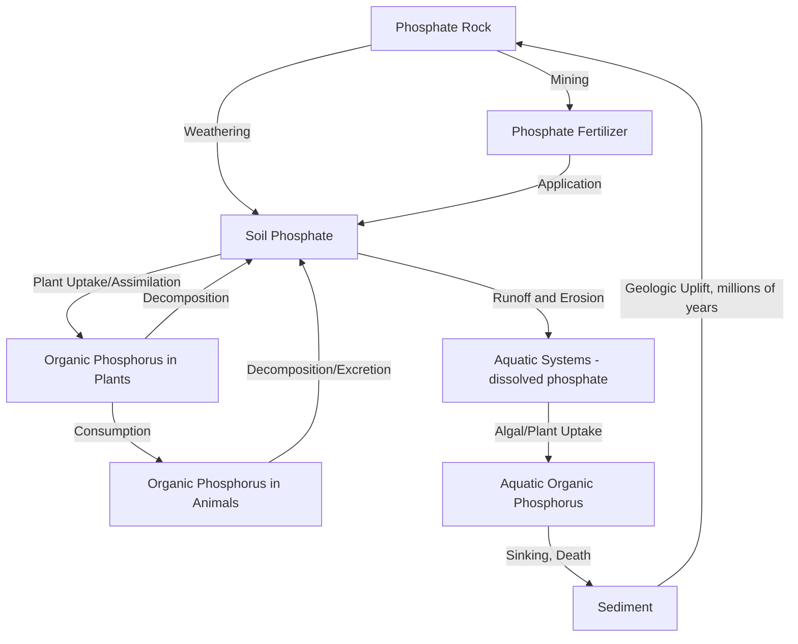
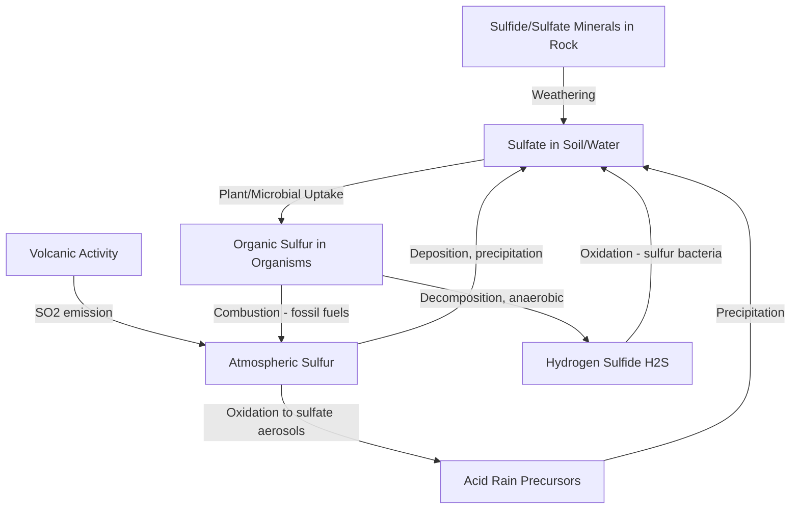

## The Phosphorus and Sulfur Cycles

### Definition

The phosphorus and sulfur cycles are biogeochemical cycles governing the movement of these essential elements among rock, soil, water, atmosphere, and living organisms. Both elements are essential for life (phosphorus in nucleic acids, ATP, and cell membranes; sulfur in certain amino acids and proteins), but they differ fundamentally in cycling dynamics: phosphorus lacks a significant atmospheric gas phase and cycles primarily through rock weathering and sedimentation (a largely "sedimentary" cycle), while sulfur has both significant atmospheric and sedimentary cycling pathways (a "sedimentary-atmospheric hybrid" cycle).

### The Phosphorus Cycle

**Key characteristic:** Unlike carbon, nitrogen, or sulfur, phosphorus has no biologically significant gaseous phase under normal environmental conditions; it exists almost entirely as phosphate ($PO_4^{3-}$) in solid or dissolved forms, making rock weathering — a slow geologic process — the primary source of new phosphorus entering biological systems.

**Reservoirs and processes:**

- **Rock and mineral reservoir:** The largest phosphorus reservoir, contained in phosphate-bearing rocks (e.g., apatite), representing phosphorus accumulated over geologic time.
- **Weathering:** Physical and chemical weathering of phosphate-bearing rock gradually releases phosphate ions into soil and water — the rate-limiting step of the entire phosphorus cycle due to its slow, geologically-paced nature.
- **Soil phosphorus:** Weathered phosphate is taken up by plant roots (assimilation) and incorporated into organic molecules.
- **Biological cycling:** Phosphorus moves through food webs via consumption (plants → herbivores → carnivores) and is returned to soil/water through excretion and decomposition of dead organic matter.
- **Aquatic cycling:** Dissolved phosphate in water bodies is taken up by algae and aquatic plants, cycling through aquatic food webs; phosphorus can also precipitate and settle into sediment, where it may be incorporated into new sedimentary rock over geologic time, effectively removing it from active biological cycling for extended periods.
- **Runoff and erosion:** Surface runoff carries phosphorus (as dissolved phosphate or attached to eroded soil particles) from land into aquatic systems, representing a key natural but often anthropogenically accelerated transport pathway.

### The Anthropogenic Phosphorus Cycle Perturbation

- **Phosphate mining:** Humans extract phosphate rock (a finite, non-renewable resource concentrated in relatively few global locations) to manufacture synthetic phosphorus fertilizers, dramatically accelerating the natural weathering-release rate.
- **Agricultural runoff:** Excess phosphorus fertilizer not absorbed by crops washes into waterways, contributing (often jointly with nitrogen) to eutrophication and harmful algal blooms.
- **Detergents and wastewater:** Historically, phosphate-based detergents were a significant point source of phosphorus pollution in many regions; many jurisdictions have since restricted or banned phosphates in household detergents, though phosphorus in municipal and agricultural wastewater remains a significant concern.
- **Peak phosphorus concerns:** Because phosphate rock is a finite, geographically concentrated, non-renewable resource, some researchers have raised concerns about long-term supply availability relative to agricultural demand, though the timeline and severity of potential future scarcity remain debated and estimates vary considerably across studies. [Inference: peak phosphorus timing and severity projections differ substantially across published analyses and should be treated as an area of ongoing scientific and economic uncertainty rather than settled fact.]

### The Sulfur Cycle

**Key characteristic:** Sulfur cycles through both atmospheric (gaseous) and sedimentary (rock/mineral) pathways, giving it intermediate characteristics between the fast atmospheric-biological cycles (carbon, nitrogen) and the purely sedimentary phosphorus cycle.

**Reservoirs and processes:**

- **Lithosphere:** The largest sulfur reservoir, contained in sulfate minerals (e.g., gypsum) and sulfide minerals (e.g., pyrite) within rock and sediment.
- **Atmosphere:** Contains sulfur primarily as sulfur dioxide ($SO_2$) and other sulfur oxides, released through volcanic activity, fossil fuel combustion, and biological processes.
- **Volcanic and geothermal emissions:** A significant natural source of atmospheric sulfur, particularly sulfur dioxide, released during volcanic eruptions and from geothermal vents.
- **Weathering:** Chemical weathering of sulfide and sulfate minerals releases sulfate ions ($SO_4^{2-}$) into soil and water.
- **Biological assimilation:** Plants and microorganisms take up sulfate and incorporate sulfur into sulfur-containing amino acids (e.g., cysteine, methionine) and proteins; sulfur then moves through food webs via consumption.
- **Decomposition:** Breakdown of organic matter by decomposers releases sulfur compounds, including hydrogen sulfide gas ($H_2S$) under anaerobic conditions (responsible for the characteristic odor of some wetland and marine sediments).
- **Microbial oxidation/reduction:** Specialized bacteria mediate key sulfur transformations — sulfur-oxidizing bacteria convert reduced sulfur compounds (e.g., $H_2S$) to sulfate under aerobic conditions, while sulfate-reducing bacteria perform the reverse under anaerobic conditions, using sulfate as a terminal electron acceptor in respiration.
- **Ocean-atmosphere exchange:** Marine phytoplankton produce dimethyl sulfide (DMS), a volatile organic sulfur compound that enters the atmosphere and oxidizes to form sulfate aerosols, which can act as cloud condensation nuclei — a process with potential feedback implications for cloud formation and climate.

### The Anthropogenic Sulfur Cycle Perturbation

- **Fossil fuel combustion:** Historically the dominant anthropogenic source of atmospheric sulfur dioxide, particularly from sulfur-containing coal and oil combustion in power generation and industry.
- **Acid rain formation:** Atmospheric $SO_2$ oxidizes and combines with water vapor to form sulfuric acid, which returns to the surface as acid precipitation, historically causing significant lake acidification, forest damage, and infrastructure corrosion, particularly in regions downwind of major industrial emission sources.
- **Regulatory success case:** Sulfur dioxide emissions have been substantially reduced in many industrialized regions since the late 20th century through regulatory programs (e.g., the U.S. Acid Rain Program under the 1990 Clean Air Act Amendments, which introduced a cap-and-trade system for $SO_2$), widely cited as a successful example of market-based environmental regulation achieving significant measured emission reductions.
- **Metal smelting:** Processing of sulfide ores (common for many metal ores, e.g., copper, nickel, lead) releases significant sulfur dioxide unless emission controls are applied.
- **Aerosol climate effects:** Anthropogenic sulfate aerosols reflect incoming solar radiation and influence cloud properties, producing a net cooling effect that partially offsets greenhouse gas warming; this effect is considered in climate science as a significant but highly uncertain component of the overall radiative forcing balance, and its rapid removal (e.g., through air quality improvements) can produce comparatively fast, though temporary, warming effects as this masking cooling diminishes. [Inference: the precise magnitude of aerosol cooling effects and their interaction with greenhouse gas warming remains one of the largest sources of uncertainty in climate sensitivity estimates.]

**Key Points**

- The phosphorus cycle lacks a significant atmospheric gas phase, making rock weathering the rate-limiting, geologically slow source of new phosphorus for biological systems.
- The sulfur cycle involves both atmospheric (volcanic, combustion-driven) and sedimentary (rock weathering, mineral) pathways, giving it characteristics intermediate between fast atmospheric cycles and the purely sedimentary phosphorus cycle.
- Both cycles are significantly perturbed by human activity: phosphorus through mining and fertilizer application (driving eutrophication), and sulfur through fossil fuel combustion and smelting (driving acid rain, though substantially mitigated by regulation in many regions).
- Phosphorus and nitrogen are jointly considered within the planetary boundaries framework's "biogeochemical flows" boundary, reflecting their combined role in eutrophication and aquatic ecosystem disruption.

### Comparative Table: Phosphorus vs. Sulfur Cycling

| Characteristic | Phosphorus cycle | Sulfur cycle |
| --- | --- | --- |
| Atmospheric phase | Effectively absent under normal conditions | Present (SO2, H2S, sulfate aerosols) |
| Primary natural source | Rock weathering (slow, geologic) | Volcanic emissions and rock weathering |
| Rate-limiting step | Weathering release from rock | Variable; weathering and combustion both significant |
| Main anthropogenic perturbation | Mining and fertilizer application; eutrophication | Fossil fuel combustion and smelting; acid rain |
| Regulatory success example | Detergent phosphate bans (partial, region-dependent) | U.S. Acid Rain Program cap-and-trade (substantial documented success) |

### Applied Example: Eutrophication and the Phosphorus-Nitrogen Link

Freshwater lake eutrophication frequently illustrates joint phosphorus-nitrogen cycle disruption:

- **Limiting nutrient concept:** In many freshwater systems, phosphorus is typically the limiting nutrient for algal growth (following Liebig's Law of the Minimum), meaning even modest phosphorus increases can trigger disproportionate algal bloom responses; in many marine and estuarine systems, nitrogen is more commonly the limiting nutrient. [Inference: the specific limiting nutrient varies by water body type, regional characteristics, and season, and should not be assumed uniformly.]
- **Bloom and collapse cycle:** Excess nutrient input triggers rapid algal population growth (bloom); subsequent algal die-off provides substrate for decomposer bacteria, whose aerobic respiration consumes dissolved oxygen, potentially producing hypoxic or anoxic conditions lethal to fish and other aquatic organisms.
- **Management response:** Many watershed management programs specifically target phosphorus reduction (e.g., through detergent phosphate bans, agricultural buffer strips, and wastewater treatment upgrades for phosphorus removal) as a primary lever for controlling eutrophication in phosphorus-limited freshwater systems.

### Common Misconceptions

- **Misconception:** Phosphorus and nitrogen cycle in fundamentally the same way. **Clarification:** Nitrogen has a dominant, biologically significant atmospheric gas phase and cycles relatively quickly; phosphorus lacks this atmospheric pathway entirely and cycles primarily through much slower rock weathering and sedimentation processes.
- **Misconception:** Acid rain is no longer an environmental concern. **Clarification:** While substantially reduced in regions with strong regulatory programs (e.g., North America, much of Europe) since the late 20th century, sulfur dioxide emissions and associated acid deposition remain significant concerns in some rapidly industrializing regions with less stringent emissions controls. [Inference: current regional acid rain severity varies considerably and should be assessed against up-to-date regional air quality data.]
- **Misconception:** All eutrophication is caused by the same limiting nutrient. **Clarification:** Whether phosphorus or nitrogen (or both) is the primary limiting and controlling nutrient varies by specific water body, requiring site-specific assessment for effective management.

### Related Topics

- Eutrophication and harmful algal bloom formation
- The nitrogen cycle and its interaction with phosphorus in aquatic systems
- Acid rain: formation, historical impact, and regulatory response
- Planetary boundaries: the biogeochemical flows boundary
- Peak phosphorus and long-term fertilizer resource sustainability
- Sulfate aerosols and their role in climate radiative forcing
- Liebig's Law of the Minimum and limiting nutrient concepts
- Watershed nutrient management and buffer strip design