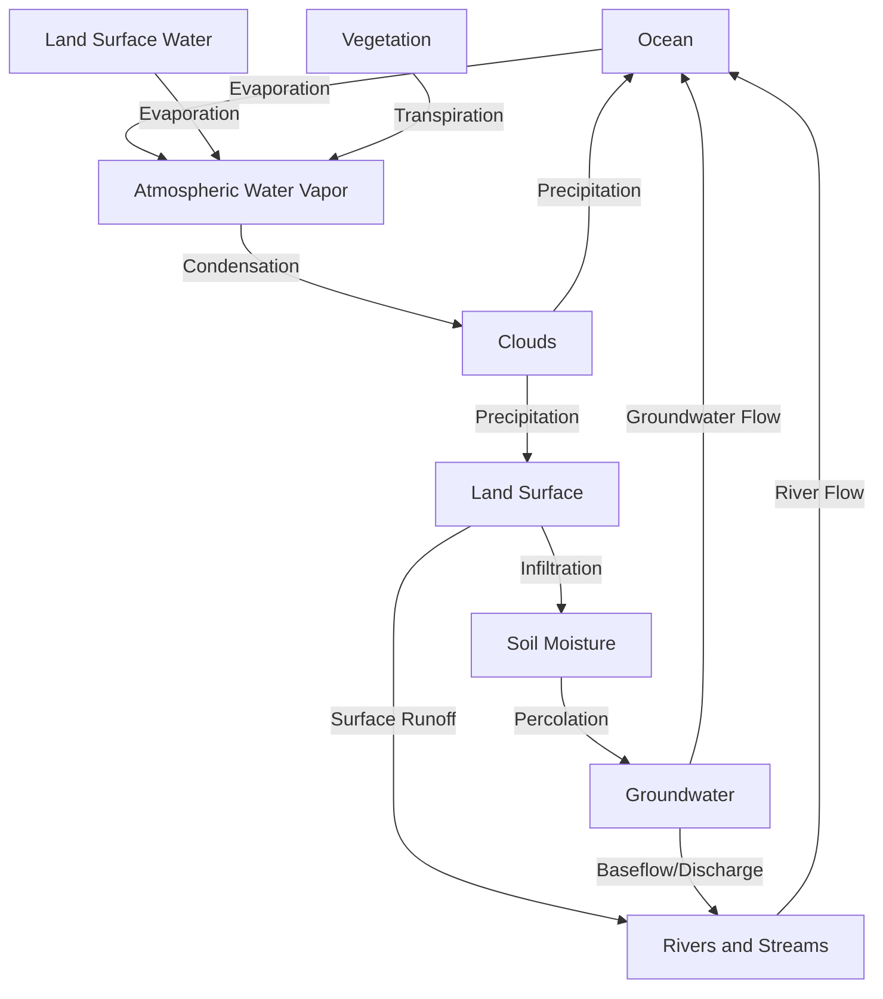

## The Hydrologic Cycle

### Definition

The hydrologic cycle (water cycle) is the continuous movement of water among Earth's major reservoirs — oceans, atmosphere, land surface, groundwater, and ice — driven primarily by solar energy and gravity. It is the fundamental physical process linking climate, weather, freshwater availability, ecosystem function, and geologic processes, making it one of the most consequential biogeochemical-physical cycles for both natural systems and human water resource management.

### Water Reservoirs

| Reservoir | Approximate share of Earth's total water | Typical residence time |
| --- | --- | --- |
| Oceans | ~96.5% | ~3,000+ years |
| Ice caps, glaciers, permafrost | ~1.7% | Decades to tens of thousands of years |
| Groundwater | ~1.7% | Days to tens of thousands of years (highly variable by aquifer) |
| Lakes | <0.01% | Years to decades |
| Soil moisture | <0.01% | Weeks to months |
| Atmosphere | <0.001% | ~9–10 days |
| Rivers | <0.0002% | Days to weeks |
| Living organisms (biological water) | <0.0001% | Hours to days |

[Note: precise percentage figures vary slightly across hydrological reference sources depending on measurement methodology; figures above reflect commonly cited approximate values. Despite oceans holding the overwhelming majority of Earth's water, freshwater accessible for direct human use — primarily surface water and shallow groundwater — represents a very small fraction of total global water.]

### Core Hydrologic Cycle Processes

- **Evaporation:** Solar energy converts liquid water at the surface (oceans, lakes, rivers, soil) into water vapor; oceans account for the substantial majority of global evaporation due to their vast surface area.
- **Transpiration:** Water absorbed by plant roots is released as vapor through stomata on leaves; combined with direct surface evaporation, this is often termed **evapotranspiration**, a key metric in hydrology and agriculture.
- **Sublimation:** Direct phase transition of ice or snow to water vapor without passing through a liquid phase, significant in polar, alpine, and glacial environments.
- **Condensation:** Water vapor cools and transitions back into liquid droplets (or ice crystals) around microscopic particles (condensation nuclei), forming clouds.
- **Precipitation:** Condensed water falls to Earth's surface as rain, snow, sleet, or hail when droplets/crystals become sufficiently large to overcome updraft forces.
- **Infiltration:** Precipitation that reaches land soaks into the soil, moving into the subsurface; the infiltration rate depends on soil type, vegetation cover, land use, and existing soil moisture (e.g., saturated soils infiltrate more slowly, increasing surface runoff).
- **Percolation:** Water continues moving downward through soil and rock layers until reaching the water table, recharging groundwater aquifers.
- **Surface runoff:** Precipitation that does not infiltrate flows over the land surface into streams, rivers, and eventually larger water bodies, following topographic gradients within a watershed.
- **Groundwater flow and discharge:** Groundwater moves slowly through porous and fractured rock/soil (aquifers) and can discharge into rivers, lakes, wetlands, or directly into oceans, sustaining baseflow in surface water systems, particularly during dry periods.

### Watershed Concepts

- **Watershed (drainage basin):** The land area within which all precipitation and surface runoff drains to a common outlet point (a specific river, lake, or ocean entry point); watersheds are hierarchically nested, with smaller sub-watersheds feeding into progressively larger ones.
- **Divide:** The topographic boundary separating adjacent watersheds, typically following ridgelines or elevated terrain.
- **Aquifer types:**
  - **Unconfined aquifer:** Directly overlain by permeable material connecting it to the surface, generally more vulnerable to contamination and more responsive to precipitation changes.
  - **Confined aquifer:** Overlain by an impermeable layer (aquiclude), isolating it from direct surface recharge and contamination but also typically recharging much more slowly.
- **Recharge and discharge zones:** Recharge zones are areas where water enters an aquifer (often permeable surface areas); discharge zones are where groundwater exits to the surface (springs, wetlands, baseflow contributions to streams).

**Key Points**

- The hydrologic cycle moves water among ocean, atmospheric, land surface, and groundwater reservoirs through evaporation, transpiration, condensation, precipitation, infiltration, and runoff, driven by solar energy and gravity.
- Despite oceans holding the vast majority of Earth's total water, directly accessible freshwater (surface water and shallow groundwater) represents a very small fraction of the total, making freshwater a comparatively scarce and unevenly distributed resource.
- Watersheds are the fundamental spatial unit for understanding surface water flow and are used extensively in water resource management and pollution control planning.
- Groundwater and surface water are hydrologically connected systems (through infiltration, percolation, and baseflow discharge), meaning contamination or overuse of one commonly affects the other.

### Human Impacts on the Hydrologic Cycle

- **Groundwater depletion:** Extraction rates exceeding natural aquifer recharge rates (common in intensive agricultural regions) lead to declining water tables, land subsidence, and, in coastal areas, saltwater intrusion into freshwater aquifers.
- **Land-use change and impervious surfaces:** Urbanization replaces permeable soil and vegetation with impervious surfaces (pavement, roofing), sharply reducing infiltration and increasing surface runoff volume and velocity, contributing to urban flooding and reduced groundwater recharge.
- **Deforestation:** Removing vegetation reduces transpiration and interception of precipitation, typically increasing surface runoff, soil erosion, and downstream flooding risk, while potentially reducing regional atmospheric moisture recycling.
- **Dam construction and water diversion:** Alters natural river flow timing and volume, affects sediment transport, and can significantly change downstream ecosystem dynamics (e.g., reduced sediment delivery to river deltas).
- **Climate change effects:** Rising global temperatures are understood to intensify the hydrologic cycle overall (higher evaporation rates and atmospheric water-holding capacity, per the Clausius-Clapeyron relationship, generally increasing precipitation intensity in many regions), while simultaneously altering the geographic and seasonal distribution of precipitation, contributing to increased frequency or severity of both flooding and drought in different regions. [Inference: specific regional precipitation change projections vary across climate models and remain an active area of climate science research with meaningful regional uncertainty.]
- **Water pollution transport:** Because groundwater and surface water are interconnected, contaminants (agricultural runoff, industrial discharge, wastewater) can move readily between surface and subsurface water systems, complicating remediation efforts.

### Quantitative Hydrologic Relationships

A basic watershed water balance equation is commonly expressed as:

$$P = ET + R + \Delta S$$

where $P$ is precipitation, $ET$ is evapotranspiration, $R$ is runoff (including both surface runoff and groundwater discharge), and $\Delta S$ is the change in water storage (soil moisture, groundwater, surface water storage) over the accounting period.

The **Clausius-Clapeyron relationship** describes the approximately exponential relationship between atmospheric temperature and its maximum water vapor-holding capacity, providing the physical basis for expectations of intensified precipitation extremes under warming: atmospheric water-holding capacity increases by approximately 7% per degree Celsius of warming, though actual regional precipitation changes depend on many additional atmospheric and geographic factors beyond this thermodynamic relationship alone.

### Applications in Environmental Management

- **Integrated water resources management (IWRM):** A coordinated approach to managing water, land, and related resources across an entire watershed, explicitly accounting for hydrologic interconnections rather than managing water uses (agricultural, municipal, industrial, ecological) in isolation.
- **Stormwater management and green infrastructure:** Urban planning techniques (permeable pavement, rain gardens, bioswales, green roofs) designed to restore natural infiltration processes disrupted by impervious urban surfaces, reducing runoff volume and improving water quality.
- **Watershed-based pollution control:** Regulatory frameworks (e.g., total maximum daily load, TMDL, programs under the U.S. Clean Water Act) manage pollutant inputs at the watershed scale, recognizing that water quality at any point reflects the cumulative influence of the entire upstream drainage area.
- **Aquifer recharge and managed aquifer recharge (MAR) programs:** Deliberate efforts to enhance groundwater recharge (e.g., through infiltration basins, injection wells) to counteract depletion from extraction exceeding natural recharge rates.
- **Floodplain management:** Recognizing floodplains as a natural component of the hydrologic cycle's runoff pathway, land-use policies increasingly aim to preserve floodplain function (temporary water storage during high-flow events) rather than developing within high-risk flood zones.

### Common Misconceptions

- **Misconception:** Groundwater exists in vast, freely flowing underground rivers or lakes. **Clarification:** Groundwater typically occupies pore spaces and fractures within rock and sediment (an aquifer), moving slowly (often measured in meters per year rather than the rapid flow rates of surface rivers) through the connected pore network rather than through open underground channels, except in specific geologic settings such as karst limestone terrain.
- **Misconception:** Water is a renewable resource that cannot be depleted. **Clarification:** While the total global water volume is effectively constant, locally accessible freshwater (particularly groundwater in specific aquifers) can be depleted faster than natural recharge replenishes it, functioning as a non-renewable resource on human-relevant timescales in many regions experiencing groundwater overdraft.
- **Misconception:** Climate change will uniformly increase or uniformly decrease precipitation everywhere. **Clarification:** Climate change is expected to intensify the hydrologic cycle overall, but its regional effects are heterogeneous — some regions are projected to experience increased precipitation and flooding risk, while others face increased drought risk, depending on regional atmospheric circulation and geographic factors.

### Related Topics

- Watershed management and total maximum daily load (TMDL) regulation
- Groundwater hydrology, aquifer types, and depletion
- Urban stormwater management and green infrastructure design
- Climate change effects on precipitation patterns and extreme events
- Floodplain management and natural flood mitigation
- Water scarcity and freshwater resource allocation
- Karst hydrology and groundwater contamination vulnerability
- Evapotranspiration measurement and agricultural water management