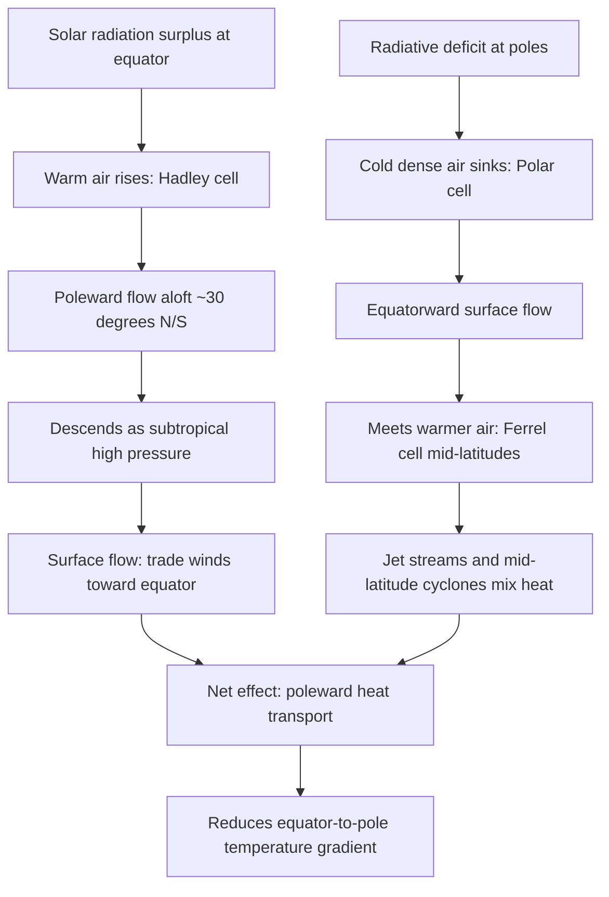
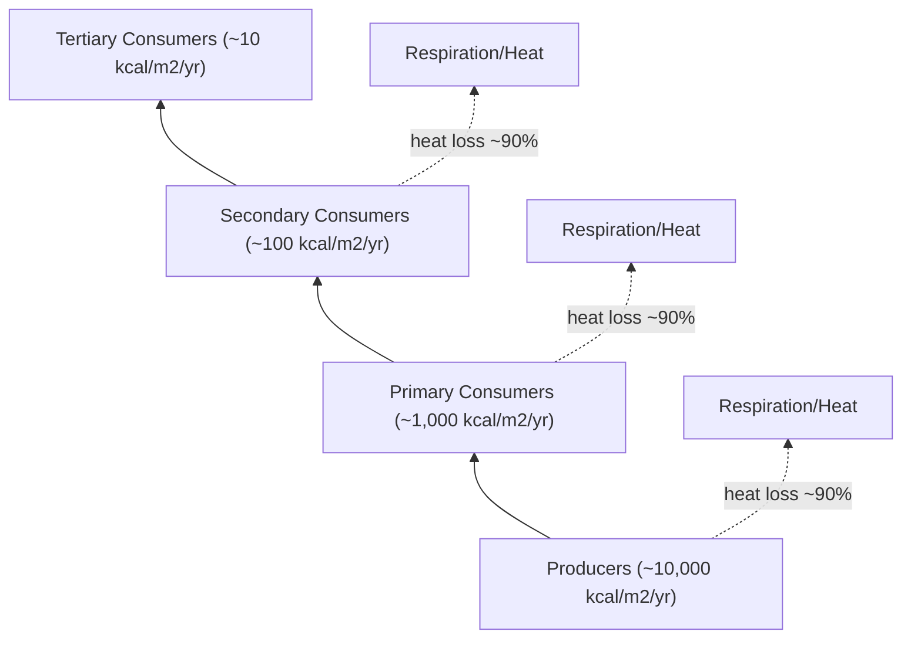

## Energy Flow Through Earth Systems

### Overview

Energy flow through Earth systems describes how radiant, thermal, chemical, and mechanical energy moves through and between the atmosphere, hydrosphere, lithosphere, biosphere, and cryosphere. Unlike matter, which cycles and is conserved within the Earth system (biogeochemical cycling), energy flows largely one-directionally: it enters primarily as solar shortwave radiation, is transformed through multiple pathways, and ultimately exits as longwave infrared radiation to space. This distinction — matter cycles, energy flows — is foundational to systems-level environmental science.

### First Principles: Conservation and Transformation

Energy flow obeys the first law of thermodynamics: energy is neither created nor destroyed, only transformed between forms (radiant → thermal → kinetic → chemical → potential, etc.). It also obeys the second law: each transformation loses usable (low-entropy) energy as waste heat, meaning energy transfer efficiency decreases at each step. This underlies the 10% rule in trophic energy transfer and the general inefficiency of converting Earth's energy inputs into biologically or economically useful work.

$$\Delta U = Q - W$$

Where $\Delta U$ is the change in internal energy of a system, $Q$ is heat added, and $W$ is work done by the system.

### The Earth's Energy Budget

**Key Points**

- Earth receives approximately 340 W/m² of solar radiation averaged over its surface (accounting for the sphere-to-disk geometry).
- Roughly 30% is reflected back to space (albedo), primarily by clouds, ice, and aerosols.
- The remaining ~70% is absorbed by the atmosphere, oceans, and land, driving virtually all surface processes.
- At equilibrium, outgoing longwave radiation (OLR) balances absorbed shortwave radiation; imbalance drives climate change.

The global energy budget can be simplified as:

$$S(1 - \alpha) = \sigma T_e^4$$

Where $S$ is the solar constant divided by 4 (accounting for Earth's spherical geometry), $\alpha$ is planetary albedo, $\sigma$ is the Stefan-Boltzmann constant, and $T_e$ is the effective radiating temperature.

<svg viewBox="0 0 800 480" xmlns="http://www.w3.org/2000/svg" font-family="Helvetica, Arial, sans-serif">
<text x="400" y="28" text-anchor="middle" font-size="18" font-weight="bold" fill="#1a1a1a">Earth's Global Energy Budget (svg_diagram)</text>
<!-- Sun -->
<circle cx="60" cy="120" r="35" fill="#f2b705"/>
<text x="60" y="125" text-anchor="middle" font-size="12" fill="#1a1a1a">Sun</text>
<text x="60" y="170" text-anchor="middle" font-size="11" fill="#1a1a1a">100 units</text>
<!-- Space layer -->
<line x1="0" y1="60" x2="800" y2="60" stroke="#999" stroke-dasharray="4,4"/>
<text x="770" y="50" font-size="11" fill="#555">Top of Atmosphere</text>
<!-- Atmosphere band -->
<rect x="0" y="60" width="800" height="220" fill="#d6e8f7" opacity="0.5"/>
<text x="20" y="80" font-size="12" fill="#1a1a1a">Atmosphere</text>
<!-- Surface band -->
<rect x="0" y="280" width="800" height="140" fill="#dcd0b0" opacity="0.6"/>
<text x="20" y="300" font-size="12" fill="#1a1a1a">Earth's Surface</text>
<!-- Incoming solar -->
<line x1="110" y1="120" x2="300" y2="280" stroke="#f2b705" stroke-width="4"/>
<text x="150" y="180" font-size="10" fill="#8a6d00">Incoming solar 100</text>
<!-- Reflected by atmosphere/clouds -->
<line x1="220" y1="150" x2="130" y2="60" stroke="#87b7d9" stroke-width="3"/>
<text x="130" y="100" font-size="10" fill="#2b6690">Reflected 20</text>
<!-- Reflected by surface -->
<line x1="300" y1="280" x2="380" y2="60" stroke="#87b7d9" stroke-width="2"/>
<text x="340" y="200" font-size="10" fill="#2b6690">Reflected 10</text>
<!-- Absorbed by atmosphere -->
<line x1="260" y1="200" x2="260" y2="270" stroke="#e07b39" stroke-width="3"/>
<text x="215" y="240" font-size="10" fill="#a0501c">Absorbed 20</text>
<!-- Absorbed by surface -->
<circle cx="300" cy="280" r="6" fill="#e07b39"/>
<text x="310" y="300" font-size="10" fill="#a0501c">Absorbed 50</text>
<!-- Outgoing longwave from surface -->
<line x1="450" y1="280" x2="450" y2="60" stroke="#c23b22" stroke-width="4"/>
<text x="460" y="170" font-size="10" fill="#7a2415">Surface LW emission 117</text>
<!-- Back radiation -->
<line x1="500" y1="150" x2="530" y2="280" stroke="#c23b22" stroke-width="3" stroke-dasharray="6,3"/>
<text x="500" y="220" font-size="10" fill="#7a2415">Back radiation 96</text>
<!-- Latent + sensible heat -->
<line x1="600" y1="280" x2="600" y2="150" stroke="#3a9d5d" stroke-width="3"/>
<text x="610" y="220" font-size="10" fill="#256b3f">Latent + sensible heat 30</text>
<!-- Outgoing to space -->
<line x1="450" y1="60" x2="500" y2="20" stroke="#c23b22" stroke-width="3"/>
<text x="480" y="15" font-size="10" fill="#7a2415">OLR to space</text>
<line x1="600" y1="150" x2="650" y2="20" stroke="#3a9d5d" stroke-width="2"/>
<!-- Legend -->
<rect x="600" y="330" width="12" height="12" fill="#f2b705"/>
<text x="618" y="341" font-size="10" fill="#1a1a1a">Shortwave (solar)</text>
<rect x="600" y="350" width="12" height="12" fill="#c23b22"/>
<text x="618" y="361" font-size="10" fill="#1a1a1a">Longwave (IR)</text>
<rect x="600" y="370" width="12" height="12" fill="#3a9d5d"/>
<text x="618" y="381" font-size="10" fill="#1a1a1a">Latent/sensible heat flux</text>
<rect x="600" y="390" width="12" height="12" fill="#87b7d9"/>
<text x="618" y="401" font-size="10" fill="#1a1a1a">Reflected shortwave</text>

<text x="400" y="450" text-anchor="middle" font-size="10" fill="#555">Values are approximate global-mean percentages of incoming solar radiation (Kiehl & Trenberth-style budget)</text>

</svg>

### Pathways of Energy Transfer

**Radiation**

Electromagnetic energy transfer requiring no medium. Solar shortwave radiation (~0.2–4 μm) drives surface heating; the Earth re-emits longwave infrared radiation (~4–100 μm) governed by the Stefan-Boltzmann law, $j = \sigma T^4$. Greenhouse gases (H₂O, CO₂, CH₄, N₂O, O₃) selectively absorb and re-emit longwave radiation, producing the greenhouse effect.

**Conduction**

Direct molecule-to-molecule heat transfer, dominant in solids and significant at the soil–atmosphere and ocean floor–water interfaces, though generally a minor term in the global atmospheric budget compared to radiation and convection.

**Convection**

Bulk fluid motion transporting heat, central to atmospheric circulation (Hadley, Ferrel, Polar cells) and oceanic circulation (thermohaline circulation). Convection redistributes energy from the tropics (net radiative surplus) toward the poles (net radiative deficit).

**Latent Heat Transfer**

Energy absorbed or released during phase changes of water (evaporation, condensation, sublimation, freezing) without a temperature change. Evaporation at the tropical ocean surface absorbs enormous energy, which is released as latent heat when water vapor condenses in storm systems — a primary mechanism for poleward and vertical energy transport, and the energy source for tropical cyclones.

$$Q_{latent} = mL$$

Where $m$ is mass of water undergoing phase change and $L$ is the latent heat coefficient (e.g., ~2260 kJ/kg for vaporization at 100°C, ~2501 kJ/kg at 0°C).

### Latitudinal Energy Imbalance and Circulation

Because Earth is a sphere, incoming solar radiation is concentrated near the equator (low incidence angle → high energy flux per unit area) and dispersed near the poles (high incidence angle → low energy flux per unit area). The tropics run a net radiative surplus; polar regions run a net radiative deficit. This imbalance is the fundamental driver of:

- **Atmospheric circulation**: Hadley, Ferrel, and Polar cells transport heat poleward
- **Oceanic circulation**: Wind-driven surface currents and density-driven thermohaline circulation ("global conveyor belt")
- **Storm systems**: Mid-latitude cyclones and jet streams arise partly to mechanically mix and transport heat across the strong meridional temperature gradient

### Energy Flow Through the Biosphere: Trophic Dynamics

Solar energy captured by primary producers via photosynthesis enters the biological energy pathway, converting radiant energy to chemical (bond) energy in glucose:

$$6CO_2 + 6H_2O + \text{light energy} \rightarrow C_6H_{12}O_6 + 6O_2$$

This chemical energy flows unidirectionally through trophic levels (producers → primary consumers → secondary consumers → tertiary consumers → decomposers), with substantial loss at each transfer as metabolic heat (respiration), locomotion, and incomplete consumption/digestion.

**Key Points**

- The **10% rule** (Lindeman's trophic efficiency) approximates that only ~10% of energy at one trophic level is available to the next; the remaining ~90% is lost as heat (second law of thermodynamics).
- Gross Primary Productivity (GPP) is total energy fixed by producers; Net Primary Productivity (NPP) subtracts producer respiration: $NPP = GPP - R_a$.
- Energy pyramids are always upright (unlike biomass or numbers pyramids, which can be inverted in some aquatic systems) because energy cannot be recycled — it is a flow, not a cycle.

### Geothermal and Internal Energy Flow

While solar radiation dominates surface energy flow (~99.98% of total input), Earth also has an internal energy source: geothermal heat from radioactive decay (primarily U-238, U-235, Th-232, K-40) in the mantle and crust, plus residual primordial heat from planetary accretion. Average geothermal heat flux is ~0.087 W/m², roughly four orders of magnitude smaller than solar input, but it drives plate tectonics, mantle convection, volcanism, and hydrothermal systems, and is locally significant (geothermal energy extraction, hydrothermal vent ecosystems that support chemosynthetic primary production independent of sunlight).

### Feedback Mechanisms

**Positive Feedbacks** (amplify initial change)

- Ice-albedo feedback: warming melts ice → lower albedo → more absorption → more warming
- Water vapor feedback: warming increases atmospheric water vapor (itself a greenhouse gas) → more warming
- Permafrost carbon feedback: warming releases stored CH₄/CO₂ → more warming

**Negative Feedbacks** (dampen initial change)

- Stefan-Boltzmann (Planck) feedback: warmer surfaces radiate more energy ($\propto T^4$), acting as the primary stabilizing feedback
- Cloud feedbacks: can be net positive or negative depending on cloud type/altitude [Inference — cloud feedback sign and magnitude remain among the largest sources of uncertainty in climate sensitivity estimates]

### Anthropogenic Perturbation of Energy Flow

**Key Points**

- Greenhouse gas emissions alter the atmosphere's longwave absorption/re-emission properties, increasing radiative forcing (measured in W/m²) and disrupting the pre-industrial energy balance.
- Land-use change (deforestation, urbanization) alters surface albedo and evapotranspiration, changing local and regional energy partitioning between sensible and latent heat.
- Aerosols (from combustion, industry) can exert cooling (reflective aerosols) or warming (black carbon) effects, complicating net radiative forcing estimates.
- The current radiative imbalance (Earth's Energy Imbalance, EEI) is estimated at roughly +0.9 to +1.0 W/m² based on ocean heat content and satellite measurements. [Unverified — exact EEI value is actively refined with each assessment cycle and varies slightly by measurement method and reporting period]

### Worked Example

**Example**

A lake ecosystem receives 20,000 kcal/m²/yr of usable solar energy fixed by phytoplankton (NPP). Using the 10% trophic transfer rule, estimate energy available to zooplankton (primary consumers) and small fish (secondary consumers).

- Producers (phytoplankton): 20,000 kcal/m²/yr
- Primary consumers (zooplankton): $20,000 \times 0.10 = 2,000$ kcal/m²/yr
- Secondary consumers (small fish): $2,000 \times 0.10 = 200$ kcal/m²/yr

This illustrates why top predators require vastly larger supporting ecosystem area/productivity and why food chains rarely exceed 4–5 trophic levels — available energy becomes limiting.

### Measurement and Monitoring Tools

- **Satellite radiometry**: CERES (Clouds and the Earth's Radiant Energy System) measures top-of-atmosphere radiative flux
- **Eddy covariance towers**: Measure sensible/latent heat and CO₂ flux at the land-atmosphere interface (e.g., FLUXNET network)
- **Argo float network**: Measures ocean heat content, a key indicator of Earth's energy imbalance
- **Pyranometers/pyrgeometers**: Ground-based instruments measuring shortwave and longwave radiation respectively

### Common Misconceptions

- Energy is *not* recycled through ecosystems the way matter (carbon, nitrogen, water) is — it flows one way and is ultimately lost as low-grade heat.
- The greenhouse effect is a natural, necessary process (without it, Earth's mean surface temperature would be roughly -18°C rather than ~15°C); the environmental concern is the anthropogenic *enhancement* of this effect, not its existence.
- Albedo and greenhouse forcing are distinct mechanisms: albedo affects how much energy enters the system, while greenhouse gases affect how efficiently energy exits.

**Related Topics**

- Biogeochemical Cycling (Carbon, Nitrogen, Phosphorus, Water Cycles)
- Radiative Forcing and Climate Sensitivity
- Atmospheric and Oceanic Circulation Patterns
- Trophic Dynamics and Ecological Pyramids
- Albedo and Surface Energy Balance
- Thermohaline Circulation
- Earth's Energy Imbalance and Climate Change Detection
- Photosynthesis and Primary Productivity
- Geothermal Energy and Plate Tectonics
- Remote Sensing of Earth's Radiation Budget