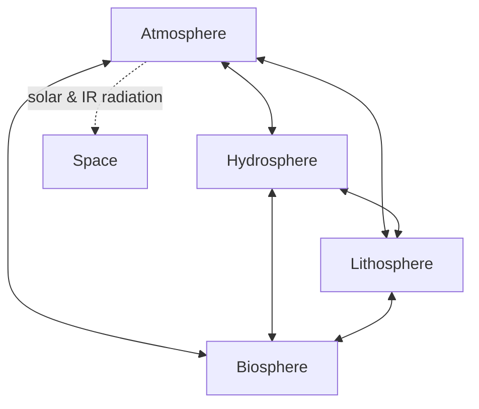
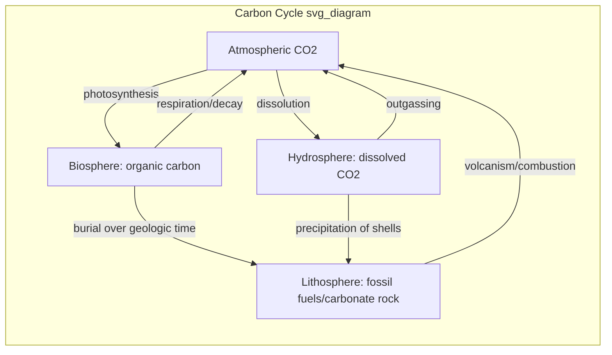

## Interactions Among Atmosphere, Hydrosphere, Lithosphere, and Biosphere

### Overview

Earth functions as a coupled system of four major spheres: the **atmosphere** (gaseous envelope), **hydrosphere** (all water reservoirs), **lithosphere** (solid crust and upper mantle), and **biosphere** (all living organisms and their organic products). No sphere operates in isolation — matter and energy continuously cycle across their boundaries through physical, chemical, and biological processes. This systems-level coupling explains phenomena ranging from weather patterns to soil formation to long-term climate regulation.

### Conceptual Framework: Earth as a System

**Key Points**

- Earth is treated as a set of open, interacting subsystems exchanging mass and energy, bounded by the near-vacuum of space (no significant mass exchange there, though energy exchange via solar radiation and infrared emission is continuous).
- Interactions are typically studied through **cycles** (biogeochemical cycles) and **fluxes** (rates of transfer between reservoirs).
- Feedback loops — **positive** (amplifying) and **negative** (dampening) — govern system stability and are essential to understanding climate and ecological responses.
- Timescales vary enormously: atmospheric mixing occurs in days to years; ocean circulation in decades to centuries; lithospheric processes (plate tectonics, rock weathering) in millions of years.

### Atmosphere–Hydrosphere Interactions

**Key Points**

- **Evaporation and condensation** drive the water cycle: solar heating evaporates ocean/surface water into the atmosphere; condensation forms clouds and precipitation, returning water to hydrosphere and lithosphere.
- **Ocean–atmosphere heat exchange** redistributes solar energy via ocean currents (e.g., thermohaline circulation) and atmospheric circulation (Hadley, Ferrel, Polar cells), moderating regional climates.
- **Gas exchange**: oceans absorb and release CO₂ and O₂ across the air–sea interface, governed by partial pressure gradients (Henry's Law); the ocean is a major carbon sink, currently absorbing roughly a quarter of anthropogenic CO₂ emissions [Inference: exact fraction varies by year and estimation method].
- **El Niño–Southern Oscillation (ENSO)** exemplifies tightly coupled ocean-atmosphere feedback, where sea surface temperature anomalies in the equatorial Pacific alter global atmospheric circulation and precipitation patterns.
- **Storm systems** (hurricanes, typhoons) form only where ocean surface temperatures exceed approximately 26.5°C, illustrating direct energy transfer from hydrosphere to atmosphere.

**Example**

Hurricane formation: warm ocean water (hydrosphere) evaporates, transferring latent heat to the atmosphere. As moist air rises and condenses, it releases latent heat, powering the storm's circulation. The storm then draws more moisture from the ocean surface, a positive feedback loop that intensifies the system until it moves over cooler water or land, cutting off its energy source.

$$Q_{latent} = m \cdot L_v$$

where $Q_{latent}$ is latent heat released, $m$ is mass of water vapor condensed, and $L_v$ is the latent heat of vaporization (~2.5 × 10⁶ J/kg).

### Atmosphere–Lithosphere Interactions

**Key Points**

- **Weathering**: atmospheric gases (CO₂, O₂) and precipitation chemically and physically break down rock. Carbonic acid weathering ($CO_2 + H_2O \rightarrow H_2CO_3$) dissolves silicate and carbonate minerals, releasing ions into runoff.
- **Volcanic outgassing** releases CO₂, SO₂, water vapor, and ash into the atmosphere, influencing both short-term climate (aerosol-driven cooling) and long-term atmospheric composition.
- **Silicate weathering feedback**: a long-term negative feedback stabilizing Earth's climate over geologic time — increased atmospheric CO₂ raises temperature, accelerating weathering, which consumes CO₂ and draws down greenhouse warming (the Walker–Hays–Kasting feedback, operating over ~100,000 to 1,000,000-year timescales) [Inference: timescale estimates vary across models].
- **Aeolian processes**: wind erodes, transports, and deposits sediment (loess, dunes), reshaping landforms.
- **Albedo effects**: land surface color and texture (deserts, ice, vegetation-covered soil) affect how much solar radiation is reflected versus absorbed, feeding back into atmospheric heating.

**Example**

Volcanic eruptions such as Mount Pinatubo (1991) injected sulfur dioxide into the stratosphere, forming sulfate aerosols that reflected incoming sunlight and cooled global average surface temperature by approximately 0.5°C for roughly two years [Unverified: precise magnitude and duration are drawn from historical climate records and subject to measurement uncertainty].

### Atmosphere–Biosphere Interactions

**Key Points**

- **Photosynthesis and respiration** form the core exchange: plants and phytoplankton absorb atmospheric CO₂ and release O₂; organisms consume O₂ and release CO₂ through respiration.

  $$6CO_2 + 6H_2O + \text{light energy} \rightarrow C_6H_{12}O_6 + 6O_2$$
- **Evapotranspiration**: plants release water vapor to the atmosphere through stomata, contributing significantly to regional and global hydrological cycles (forests can generate 50-80% of regional precipitation in some tropical systems) [Inference: figure is region- and study-specific].
- **Biogenic aerosols and trace gases**: vegetation emits volatile organic compounds (VOCs) that influence cloud formation and atmospheric chemistry; wetlands and ruminants emit methane (CH₄).
- **Seasonal CO₂ oscillation**: the Keeling Curve shows an annual sawtooth pattern driven by Northern Hemisphere plant growth (drawing down CO₂ in summer) and dormancy (release in winter).
- **Oxygenation history**: the Great Oxidation Event (~2.4 billion years ago) demonstrates biosphere-driven transformation of atmospheric composition via cyanobacterial photosynthesis.

**Example**

Amazon rainforest "flying rivers": moisture evapotranspired from the forest canopy is transported by atmospheric circulation and re-precipitated thousands of kilometers away, sustaining agriculture in southern South America. Deforestation disrupts this atmosphere-biosphere coupling, reducing downwind precipitation.

### Hydrosphere–Lithosphere Interactions

**Key Points**

- **Erosion and sediment transport**: rivers, glaciers, and waves erode rock and soil, transporting sediment to depositional basins (deltas, floodplains, ocean floors).
- **Groundwater–rock interactions**: infiltrating water dissolves soluble rock (limestone, gypsum), forming karst landscapes, caves, and sinkholes.
- **Hydrothermal circulation**: seawater percolates through oceanic crust at mid-ocean ridges, chemically exchanging ions with hot rock and venting as mineral-rich hydrothermal fluids.
- **Isostatic adjustment**: mass loading/unloading by water (ice sheets, sediment) causes lithospheric flexure and rebound (glacial isostatic adjustment).
- **Coastal processes**: wave action, longshore drift, and sea-level change continuously reshape coastlines.

**Example**

Karst topography formation: slightly acidic groundwater (carbonic acid from dissolved atmospheric/soil CO₂) infiltrates limestone bedrock, dissolving calcium carbonate along fractures over thousands of years, producing caves, sinkholes, and underground drainage systems characteristic of regions like the Yucatán Peninsula or parts of Slovenia.

### Hydrosphere–Biosphere Interactions

**Key Points**

- **Water as a physiological requirement**: all known life depends on liquid water for metabolic processes, making the hydrosphere a fundamental constraint on biosphere distribution.
- **Nutrient cycling in aquatic systems**: rivers transport dissolved nutrients (nitrogen, phosphorus) from land to lakes and oceans, fueling primary productivity; excessive nutrient loading causes eutrophication.
- **Ocean primary production**: phytoplankton form the base of marine food webs and contribute an estimated 50% of global photosynthetic oxygen production [Inference: commonly cited estimate, varies by source and methodology].
- **Bioerosion and biogenic sediment**: coral reefs, shellfish, and other calcifying organisms build and erode carbonate structures, shaping coastal hydrosphere-lithosphere-biosphere boundaries.
- **Riparian and wetland ecosystems**: vegetation stabilizes stream banks, filters pollutants, and moderates flood dynamics.

**Example**

Coral reef ecosystems: coral polyps (biosphere) extract calcium and carbonate ions from seawater (hydrosphere) to build calcium carbonate skeletons, simultaneously altering local water chemistry and constructing reef structures that influence coastal hydrodynamics and sediment deposition (lithosphere).

### Lithosphere–Biosphere Interactions

**Key Points**

- **Soil formation (pedogenesis)**: a direct product of lithosphere-biosphere interaction — parent rock material is broken down by physical/chemical weathering while organic matter from decomposing organisms mixes in, creating soil horizons.
- **Bioweathering**: root growth physically fractures rock; organic acids from roots and fungi (mycorrhizae) chemically dissolve minerals, accelerating weathering rates beyond purely abiotic processes.
- **Fossil fuel formation**: ancient biospheric carbon, buried and subjected to lithospheric heat and pressure over geologic time, transforms into coal, oil, and natural gas.
- **Nutrient uptake**: plant roots extract essential minerals (phosphorus, potassium, micronutrients) from weathered rock and soil, linking geologic substrate to ecosystem productivity.
- **Bioturbation**: burrowing organisms (earthworms, termites, burrowing mammals) physically mix and aerate soil, influencing infiltration and weathering rates.

**Example**

Lichen succession on bare rock: lichens (a symbiotic fungus-algae organism) colonize exposed rock surfaces, secreting organic acids that chemically weather the mineral substrate. This is typically the pioneer stage of primary ecological succession, initiating soil formation that eventually supports vascular plants.

### Integrated Biogeochemical Cycles

**Key Points**

Biogeochemical cycles are the clearest expression of four-sphere coupling, since each major element cycle passes through all four reservoirs.

| Cycle | Atmosphere Reservoir | Hydrosphere Reservoir | Lithosphere Reservoir | Biosphere Reservoir |
| --- | --- | --- | --- | --- |
| Carbon | CO₂, CH₄ | Dissolved CO₂/carbonate in oceans | Carbonate rock, fossil fuels | Organic tissue, soil organic matter |
| Nitrogen | N₂, N₂O | Dissolved nitrate/ammonium | Sedimentary nitrogen (minor) | Proteins, nucleic acids |
| Phosphorus | Negligible (no significant gas phase) | Dissolved phosphate | Phosphate rock (primary reservoir) | Bone, DNA, ATP |
| Sulfur | SO₂, H₂S | Dissolved sulfate | Pyrite, gypsum | Amino acids (cysteine, methionine) |
| Water | Vapor, clouds | Oceans, ice, groundwater (primary reservoir) | Bound in minerals (minor) | Cellular water |

### Feedback Mechanisms Across Spheres

**Key Points**

- **Positive feedback example — Ice-albedo feedback**: warming melts ice/snow (lithosphere/hydrosphere surface), exposing darker land or ocean, which absorbs more solar radiation, causing further warming (atmosphere) and further melting.
- **Negative feedback example — Silicate weathering thermostat**: described above; stabilizes long-term atmospheric CO₂ and temperature.
- **Negative feedback example — Cloud formation**: increased evaporation (atmosphere-hydrosphere) can increase low cloud cover, which increases albedo and reflects sunlight, partially offsetting warming [Inference: cloud feedback sign and magnitude remain an active area of climate science research and differ by cloud type and altitude].
- Feedbacks frequently span three or four spheres simultaneously, which is why isolating single-sphere causes for phenomena like climate change is scientifically inadequate — models must be coupled (Earth System Models, ESMs) to capture realistic behavior.

### Human Impacts on Sphere Interactions

**Key Points**

- **Fossil fuel combustion** transfers lithospheric carbon (long-term storage) to the atmosphere at a rate far exceeding natural outgassing, disrupting the carbon cycle's equilibrium.
- **Deforestation** simultaneously reduces atmospheric CO₂ uptake, alters evapotranspiration-driven precipitation patterns, and increases soil erosion (lithosphere-hydrosphere link).
- **Agricultural nutrient runoff** intensifies hydrosphere-biosphere coupling abnormally, driving eutrophication and hypoxic "dead zones" in coastal waters (e.g., the Gulf of Mexico dead zone linked to Mississippi River nutrient loading).
- **Urbanization** alters albedo, reduces infiltration (increasing runoff), and modifies local atmosphere-lithosphere-hydrosphere interactions (urban heat islands).
- **Ocean acidification**: absorbed atmospheric CO₂ lowers ocean pH via carbonic acid formation, impairing calcifying organisms' (biosphere) ability to build carbonate shells and skeletons — a direct atmosphere-hydrosphere-biosphere cascade.

**Example**

Ocean acidification chemistry:

$$CO_2 + H_2O \rightleftharpoons H_2CO_3 \rightleftharpoons H^+ + HCO_3^-$$

The added hydrogen ions reduce carbonate ion ($CO_3^{2-}$) availability, making it energetically costlier for organisms like corals, mollusks, and some plankton to precipitate calcium carbonate ($CaCO_3$).

### Diagram: Four-Sphere Interaction Map

<svg xmlns="http://www.w3.org/2000/svg" viewBox="0 0 700 560">
<text x="350" y="30" text-anchor="middle" font-size="18" font-weight="bold" fill="#1a1a1a">Four-Sphere Interaction Map (svg_diagram)</text>
<circle cx="220" cy="150" r="90" fill="#bcd9f0" stroke="#2b6ca3" stroke-width="2" />
<text x="220" y="150" text-anchor="middle" font-size="16" font-weight="bold" fill="#123a5c">Atmosphere</text>
<circle cx="480" cy="150" r="90" fill="#a9d6c2" stroke="#2a7a54" stroke-width="2" />
<text x="480" y="150" text-anchor="middle" font-size="16" font-weight="bold" fill="#0f3c28">Hydrosphere</text>
<circle cx="220" cy="400" r="90" fill="#e0c9a6" stroke="#8a5a2b" stroke-width="2" />
<text x="220" y="400" text-anchor="middle" font-size="16" font-weight="bold" fill="#4a3115">Lithosphere</text>
<circle cx="480" cy="400" r="90" fill="#cfe0a6" stroke="#5f7a2b" stroke-width="2" />
<text x="480" y="400" text-anchor="middle" font-size="16" font-weight="bold" fill="#33420f">Biosphere</text>
<line x1="300" y1="150" x2="400" y2="150" stroke="#444" stroke-width="2" />
<text x="350" y="140" text-anchor="middle" font-size="11" fill="#333">evaporation / precip.</text>
<line x1="220" y1="240" x2="220" y2="320" stroke="#444" stroke-width="2" />
<text x="230" y="285" font-size="11" fill="#333">weathering / outgassing</text>
<line x1="480" y1="240" x2="480" y2="320" stroke="#444" stroke-width="2" />
<text x="490" y="285" font-size="11" fill="#333">erosion / sedimentation</text>
<line x1="300" y1="400" x2="400" y2="400" stroke="#444" stroke-width="2" />
<text x="350" y="425" text-anchor="middle" font-size="11" fill="#333">soil / nutrients</text>
<line x1="290" y1="200" x2="420" y2="350" stroke="#888" stroke-width="1.5" stroke-dasharray="5,4" />
<text x="400" y="260" font-size="11" fill="#555">gas exchange (photosynthesis/respiration)</text>
<line x1="420" y1="200" x2="290" y2="350" stroke="#888" stroke-width="1.5" stroke-dasharray="5,4" />
<text x="270" y="260" font-size="11" fill="#555">nutrient transport (rivers)</text>

<text x="350" y="520" text-anchor="middle" font-size="12" fill="#666" font-style="italic">Solid lines: direct physical/chemical exchange | Dashed lines: cross-diagonal coupling</text>

</svg>

### Common Misconceptions

**Key Points**

- Treating spheres as independent systems that can be studied in isolation, rather than as a coupled network with feedback loops.
- Assuming feedback effects are instantaneous — many operate over geologic (silicate weathering) or decadal (ocean heat uptake) timescales.
- Confusing weather (short-term atmospheric state) with climate (long-term statistical pattern shaped by all four spheres).
- Overlooking the biosphere's active geochemical role, viewing it as a passive passenger rather than a driver of atmospheric and lithospheric change (e.g., the Great Oxidation Event, soil formation).

### Related Topics

- Biogeochemical cycles (carbon, nitrogen, phosphorus, sulfur) in individual depth
- Plate tectonics and the rock cycle
- Climate feedback loops and Earth System Models (ESMs)
- Ocean-atmosphere coupling: ENSO, thermohaline circulation
- Soil science and pedogenesis
- Ecological succession and biosphere-lithosphere colonization
- Anthropogenic climate change and the enhanced greenhouse effect
- Ocean acidification chemistry and marine calcification
- Paleoclimatology: using ice cores and sediment records to reconstruct past sphere interactions
- Earth system resilience, tipping points, and planetary boundaries