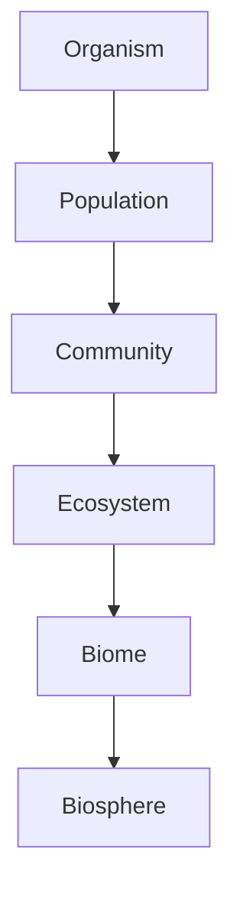
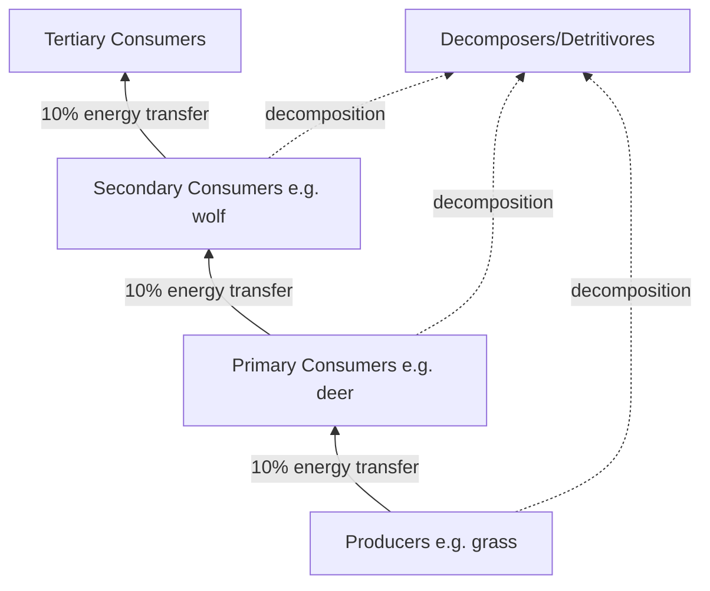

## Levels of Ecological Organization

### Overview

Ecology studies life across a hierarchy of organization, from individual organisms to the entire biosphere. Each level builds on the one below it, introducing emergent properties that cannot be predicted solely from studying lower levels in isolation. Understanding this hierarchy is foundational to nearly all subsequent ecological concepts, since population dynamics, community interactions, and ecosystem processes are studied using distinct methods and metrics appropriate to their scale.

### The Ecological Hierarchy

**Key Points**

- The hierarchy proceeds: **Organism → Population → Community → Ecosystem → Biome → Biosphere**.
- Some frameworks insert **species** between organism and population, and some separate **landscape** as an intermediate level between ecosystem and biome.
- Each level exhibits **emergent properties** — characteristics that arise only at that scale (e.g., a population has a growth rate, but a single organism does not).
- Movement up the hierarchy generally corresponds to increasing spatial scale, increasing complexity, and longer characteristic timescales of change.

### Organism Level

**Key Points**

- The **organism** is the basic unit of ecological study — a single living individual capable of independent physiological function.
- Ecological study at this level focuses on **autecology**: how an individual interacts with its abiotic (non-living) and biotic (living) environment.
- Key concepts include **adaptation** (structural, physiological, behavioral), **tolerance ranges** for environmental factors (temperature, salinity, pH), and the organism's **niche** — the full range of conditions and resources it uses.
- Physiological ecology examines mechanisms such as thermoregulation, osmoregulation, and metabolic rate as they relate to environmental constraints.

**Example**

A desert kangaroo rat exhibits organism-level adaptations: it produces highly concentrated urine to minimize water loss, is nocturnal to avoid peak daytime heat, and derives metabolic water from dry seed digestion rather than drinking free water — illustrating physiological adaptation to an arid abiotic environment.

### Population Level

**Key Points**

- A **population** is a group of individuals of the same species occupying a defined geographic area at the same time, capable of interbreeding.
- Key population-level metrics: **population size (N)**, **density** (individuals per unit area/volume), **dispersion pattern** (clumped, uniform, random), **age structure**, **sex ratio**, and **growth rate**.
- Population dynamics are modeled using **exponential growth** (unlimited resources) and **logistic growth** (resource-limited, approaching carrying capacity $K$).
- **Emergent properties** at this level: birth rate, death rate, and growth rate are meaningless for a single organism but well-defined for a population.

**Example**

Exponential growth model:

$$\frac{dN}{dt} = rN$$

Logistic growth model, incorporating carrying capacity:

$$\frac{dN}{dt} = rN\left(1 - \frac{N}{K}\right)$$

where $N$ is population size, $r$ is the intrinsic growth rate, and $K$ is the carrying capacity of the environment.

A classic case: a deer population introduced to an island with abundant forage grows exponentially at first, then growth rate slows as the population approaches the island's carrying capacity, eventually stabilizing or oscillating around $K$.

### Community Level

**Key Points**

- A **community** consists of all populations of different species that interact within a defined area.
- Studied through **synecology**, focusing on species interactions: **competition**, **predation**, **herbivory**, **parasitism**, **mutualism**, and **commensalism**.
- Key structural concepts: **species richness** (number of species), **species diversity** (richness combined with relative abundance, often measured via the Shannon diversity index), **dominant species**, and **keystone species**.
- **Community structure** is shaped by processes including **competitive exclusion**, **resource partitioning**, **succession** (primary and secondary), and **trophic cascades**.
- **Emergent properties**: species diversity indices, food web structure, and successional trajectories only exist at the community level.

**Example**

Shannon diversity index:

$$H' = -\sum_{i=1}^{S} p_i \ln(p_i)$$

where $S$ is species richness and $p_i$ is the proportional abundance of species $i$.

Keystone species example: sea otters in Pacific kelp forest communities prey on sea urchins; removal of otters allows urchin populations to explode, leading to overgrazing of kelp ("urchin barrens") — demonstrating how a single species' interactions can structure an entire community.

### Ecosystem Level

**Key Points**

- An **ecosystem** comprises a community together with the **abiotic environment** (soil, water, air, sunlight, nutrients) with which it interacts.
- Ecosystem ecology emphasizes **energy flow** (unidirectional, following the laws of thermodynamics) and **nutrient cycling** (biogeochemical cycles, which are cyclical/conservative).
- Key concepts: **trophic levels** (producers, primary/secondary/tertiary consumers, decomposers), **food chains** and **food webs**, **energy pyramids**, **primary productivity** (gross vs. net), and the **10% rule** of energy transfer efficiency between trophic levels.
- **Emergent properties**: net primary productivity, nutrient cycling rates, and energy pyramid shape are ecosystem-scale phenomena.

**Example**

Energy transfer efficiency (approximate, ecological rule of thumb):

$$\text{Energy available to trophic level } n+1 \approx 0.10 \times \text{Energy at trophic level } n$$

[Inference: the 10% figure is a widely-used pedagogical approximation; actual transfer efficiencies vary by ecosystem type and range roughly from 5% to 20%.]

### Landscape Level (Intermediate, Optional Framework)

**Key Points**

- A **landscape** is a mosaic of interacting ecosystems across a broader geographic area, connected by flows of energy, matter, and organisms.
- Central concepts: **habitat patches**, **corridors** (connective habitat allowing organism movement), **edge effects** (altered conditions at ecosystem boundaries), and **fragmentation** (breaking of continuous habitat into isolated patches).
- **Landscape ecology** examines how spatial configuration influences species persistence, gene flow, and disturbance spread (e.g., fire, disease).
- Not all curricula include this as a distinct formal level, but it is increasingly standard in conservation-focused ecology coursework.

**Example**

A forested landscape fragmented by agricultural development into isolated woodland patches connected by narrow hedgerow corridors: species requiring large contiguous territory (e.g., large carnivores) may experience reduced viable populations, while edge-adapted species (e.g., certain generalist birds) may increase in abundance along patch boundaries.

### Biome Level

**Key Points**

- A **biome** is a large-scale community type characterized by distinctive climate conditions and dominant vegetation/animal life, occurring in multiple, often disjunct, geographic locations globally.
- Major terrestrial biomes: **tropical rainforest, temperate deciduous forest, taiga (boreal forest), tundra, desert, grassland (temperate and tropical/savanna), chaparral**.
- Major aquatic biomes (sometimes classified separately as "aquatic life zones"): **freshwater** (lakes, rivers, wetlands) and **marine** (ocean, coral reef, estuary).
- Biome distribution is primarily determined by **climate** — specifically temperature and precipitation patterns — visualized using **climate diagrams (Walter climate diagrams)** or the **Whittaker biome classification model**.
- **Emergent properties**: characteristic vegetation structure, biodiversity patterns, and climate-vegetation feedback operate at the biome scale.

**Example**

The taiga (boreal forest) biome occurs across northern Russia/Siberia, Canada, and Scandinavia — geographically disjunct regions unified by shared climate characteristics (cold winters, short growing seasons, moderate precipitation) and dominant coniferous vegetation, despite differing in specific species composition between continents.

### Biosphere Level

**Key Points**

- The **biosphere** is the sum of all life on Earth plus the physical environments it inhabits — encompassing all biomes, ecosystems, and the parts of the atmosphere, hydrosphere, and lithosphere that support life.
- It is the broadest and most integrative level of ecological organization, where **global biogeochemical cycles** (carbon, nitrogen, water) and planetary-scale energy balance are studied.
- **Emergent properties**: global climate regulation, planetary albedo, global biodiversity patterns, and large-scale biogeochemical fluxes exist only at this scale.
- Global-scale ecological study increasingly relies on **Earth System Science** approaches, integrating ecological data with atmospheric and oceanic models.

**Example**

The global carbon cycle operates at the biosphere level: carbon fixed by photosynthesis in terrestrial and marine ecosystems worldwide, released through respiration and decomposition, and exchanged with the atmosphere and oceans, represents a planet-wide flux that cannot be meaningfully studied at the ecosystem level alone.

### Comparative Summary Table

| Level | Basic Unit | Key Metrics | Example Emergent Property |
| --- | --- | --- | --- |
| Organism | Single individual | Tolerance range, fitness, behavior | Physiological adaptation |
| Population | Same-species group | Density, growth rate, age structure | Population growth rate |
| Community | Multi-species assemblage | Species richness, diversity index | Trophic interaction network |
| Ecosystem | Community + abiotic environment | Primary productivity, nutrient cycling | Energy flow pathway |
| Landscape | Mosaic of ecosystems | Patch size, connectivity, fragmentation | Metapopulation dynamics |
| Biome | Climate-defined community type | Dominant vegetation, climate envelope | Global distribution pattern |
| Biosphere | All life + supporting environment | Global biogeochemical flux | Planetary climate regulation |

### Diagram: Nested Hierarchy of Ecological Organization

<svg xmlns="http://www.w3.org/2000/svg" viewBox="0 0 700 500">
<text x="350" y="30" text-anchor="middle" font-size="18" font-weight="bold" fill="#1a1a1a">Nested Levels of Ecological Organization (svg_diagram)</text>
<ellipse cx="350" cy="270" rx="320" ry="200" fill="#dcefe0" stroke="#2a7a54" stroke-width="2" />
<text x="350" y="90" text-anchor="middle" font-size="14" font-weight="bold" fill="#0f3c28">Biosphere</text>
<ellipse cx="350" cy="280" rx="260" ry="160" fill="#c9e4d0" stroke="#2a7a54" stroke-width="2" />
<text x="350" y="135" text-anchor="middle" font-size="14" font-weight="bold" fill="#0f3c28">Biome</text>
<ellipse cx="350" cy="290" rx="200" ry="120" fill="#b6d9c0" stroke="#2a7a54" stroke-width="2" />
<text x="350" y="185" text-anchor="middle" font-size="13" font-weight="bold" fill="#0f3c28">Ecosystem</text>
<ellipse cx="350" cy="300" rx="140" ry="85" fill="#a3ceb0" stroke="#2a7a54" stroke-width="2" />
<text x="350" y="230" text-anchor="middle" font-size="13" font-weight="bold" fill="#0f3c28">Community</text>
<ellipse cx="350" cy="320" rx="85" ry="55" fill="#90c3a0" stroke="#2a7a54" stroke-width="2" />
<text x="350" y="290" text-anchor="middle" font-size="12" font-weight="bold" fill="#0f3c28">Population</text>
<ellipse cx="350" cy="345" rx="40" ry="28" fill="#7db890" stroke="#2a7a54" stroke-width="2" />
<text x="350" y="350" text-anchor="middle" font-size="10" font-weight="bold" fill="#0f2c1c">Organism</text>

<text x="350" y="480" text-anchor="middle" font-size="12" fill="#666" font-style="italic">Each outer level contains and integrates all levels within it</text>

</svg>

### Common Misconceptions

**Key Points**

- Treating "population" and "community" as interchangeable — a population is single-species, a community is multi-species.
- Assuming an ecosystem is only the living components — it explicitly includes abiotic factors (soil, water, climate) as integral, interacting parts.
- Confusing "biome" with "ecosystem" — a biome is a broad climate-vegetation category occurring in multiple locations, whereas an ecosystem is a specific, localized functional unit.
- Believing the hierarchy is strictly linear with no feedback — higher levels (e.g., ecosystem nutrient cycling) directly influence lower levels (e.g., individual organism nutrient availability), making the system bidirectionally interactive.

### Related Topics

- Population growth models and carrying capacity
- Species interactions: competition, predation, mutualism, symbiosis
- Ecological succession (primary and secondary)
- Trophic dynamics, food webs, and energy pyramids
- Biogeochemical cycles (carbon, nitrogen, phosphorus)
- Biome classification systems (Whittaker model, Köppen climate classification)
- Landscape ecology and habitat fragmentation
- Biodiversity indices and measurement methods
- Earth System Science and global ecological modeling
- Conservation biology and ecosystem management