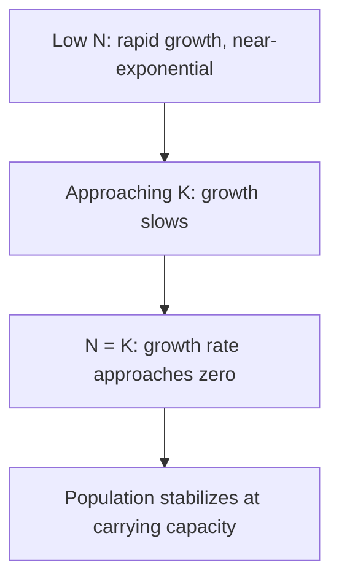
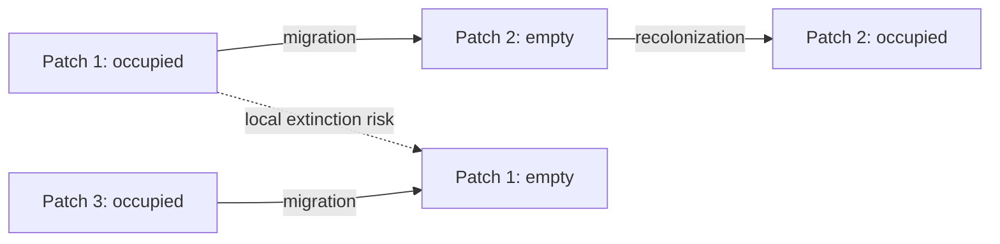

## Population Ecology and Growth Models

### Overview

Population ecology examines the size, density, distribution, and dynamics of groups of individuals from the same species occupying a shared area. Central to this field are mathematical growth models that describe how populations change over time under different resource and environmental constraints — providing the quantitative foundation for predicting extinction risk, managing wildlife and fisheries, understanding invasive species spread, and projecting human population trends.

### Fundamental Population Parameters

**Key Points**

- **Population size (N)**: total number of individuals in a defined area.
- **Population density**: individuals per unit area or volume (e.g., individuals/km²).
- **Natality (birth rate)** and **mortality (death rate)**: fundamental drivers of population change, often expressed as per capita rates.
- **Immigration** and **emigration**: movement of individuals into and out of the population, respectively.
- **Dispersion patterns**: spatial arrangement of individuals — **clumped** (most common, resources/social behavior concentrate individuals), **uniform** (territoriality or resource competition spaces individuals evenly), and **random** (rare in nature; occurs when resources are uniform and no strong social interactions).
- **Age structure**: the distribution of individuals across age classes, often visualized as an **age-structure pyramid**, which predicts future growth trends (expansive, stable, or contracting).
- **Sex ratio**: proportion of males to females, influencing reproductive potential.

### The Population Growth Equation

**Key Points**

- The general rate of population change combines births, deaths, immigration, and emigration:

  $$\frac{dN}{dt} = (B + I) - (D + E)$$

  where $B$ = births, $I$ = immigrants, $D$ = deaths, $E$ = emigrants.
- For closed populations (no migration), this simplifies to net births minus deaths.
- The **per capita growth rate** $r$ is defined as:

  $$r = b - d$$

  where $b$ is the per capita birth rate and $d$ is the per capita death rate.

### Exponential Growth Model

**Key Points**

- Describes growth under **unlimited resources** — an idealized scenario with no environmental resistance.
- Produces a characteristic **J-shaped curve**.
- Applicable to populations colonizing new/unoccupied habitat, recovering from a crash, or in laboratory conditions with abundant resources (e.g., bacterial cultures in fresh media).
- The **intrinsic rate of increase** $r_{max}$ (also called biotic potential) represents the maximum possible per capita growth rate under ideal conditions, and varies enormously by species life-history strategy (bacteria: very high; large mammals: very low).

**Example**

Continuous exponential growth (differential form):

$$\frac{dN}{dt} = rN$$

Integrated form, giving population size at time $t$:

$$N_t = N_0 e^{rt}$$

where $N_0$ is initial population size, $r$ is the intrinsic growth rate, and $t$ is elapsed time.

A bacterial colony with $N_0 = 100$ cells and $r = 0.5$ per hour would reach:

$$N_1 = 100 \cdot e^{0.5 \times 1} \approx 164.9 \text{ cells after 1 hour}$$

### Logistic Growth Model

**Key Points**

- Incorporates **environmental resistance** and a finite **carrying capacity (K)** — the maximum population size an environment can sustainably support given available resources.
- Produces a characteristic **S-shaped (sigmoid) curve**: growth is near-exponential at low density, slows as density approaches $K$, and levels off at $K$.
- The term $\left(1 - \frac{N}{K}\right)$ acts as a "braking" factor: it approaches 1 (minimal restriction) when $N$ is much smaller than $K$, and approaches 0 (growth halts) as $N$ approaches $K$.
- Growth rate is theoretically maximized at $N = K/2$, an important concept in **maximum sustainable yield (MSY)** calculations for fisheries and wildlife harvest management.

**Example**

$$\frac{dN}{dt} = rN\left(1 - \frac{N}{K}\right)$$

If $K = 1000$ and current $N = 900$, the braking factor $\left(1 - \frac{900}{1000}\right) = 0.1$, meaning growth rate is reduced to only 10% of its unrestricted exponential value — illustrating strong density-dependent suppression as the population nears capacity.

### Density-Dependent vs. Density-Independent Factors

**Key Points**

- **Density-dependent factors**: their effect on population growth intensifies as population density increases. Examples: competition for resources, predation, disease/parasitism transmission, and accumulation of waste/toxins. These factors regulate populations toward $K$ and are central to the logistic model.
- **Density-independent factors**: affect population growth regardless of density. Examples: natural disasters (fire, flood, drought), extreme weather events, and habitat destruction. These can cause population crashes unrelated to how crowded the population is.
- Most real populations are regulated by a **combination** of both factor types, and the relative importance of each often shifts with population size and environmental context.

### r-Selected vs. K-Selected Life History Strategies

**Key Points**

- **r-selected species**: favor traits that maximize growth rate ($r$) under unstable or unpredictable environments — small body size, early reproductive maturity, large number of offspring, minimal parental care, short lifespan. Examples: insects, rodents, weedy plants, many marine invertebrates.
- **K-selected species**: favor traits that maximize competitive ability near carrying capacity ($K$) in stable environments — large body size, delayed reproductive maturity, fewer offspring, extensive parental care, longer lifespan. Examples: elephants, whales, primates, large trees.
- This is a **continuum** rather than a strict binary; most species fall somewhere between the two extremes. [Inference: the r/K framework, while pedagogically useful, has been critiqued in the primary ecological literature as an oversimplification relative to more nuanced life-history theory frameworks.]

| Trait | r-selected | K-selected |
| --- | --- | --- |
| Body size | Small | Large |
| Maturation | Early/fast | Late/slow |
| Offspring number | Many | Few |
| Parental care | Minimal | Extensive |
| Lifespan | Short | Long |
| Population stability | Fluctuating (boom-bust) | Stable, near K |

### Population Regulation and Carrying Capacity Dynamics

**Key Points**

- **Carrying capacity is not static** — it fluctuates with resource availability, climate, and habitat quality over time.
- **Overshoot and die-back**: populations can temporarily exceed $K$ due to time lags in feedback (e.g., reproductive lag), followed by a sharp population crash as resources become depleted.
- **Time-lag logistic models** incorporate a delay $\tau$ to account for the fact that population responses to resource limitation are not instantaneous:

  $$\frac{dN}{dt} = rN(t)\left(1 - \frac{N(t-\tau)}{K}\right)$$
- Time-lag models can produce **oscillations** or even chaotic dynamics depending on the magnitude of $r\tau$, rather than smooth approach to $K$. [Inference: the qualitative behavior (damped oscillation vs. stable limit cycle vs. chaos) is sensitive to specific parameter values and is an established result from discrete-time and delay-differential population models.]

**Example**

The Kaibab Plateau deer irruption (Arizona, early 20th century) is a frequently cited historical case: predator removal (wolves, cougars) allowed the deer population to overshoot carrying capacity, followed by a severe population crash from starvation and habitat degradation. [Unverified: the exact magnitude of the historical population figures reported in popular textbook accounts has been questioned by some wildlife biologists as likely exaggerated relative to original survey data.]

### Metapopulation Dynamics

**Key Points**

- A **metapopulation** is a "population of populations" — a set of spatially separated subpopulations of the same species that interact via occasional migration between habitat patches.
- Key concepts: **local extinction** (a subpopulation dies out in one patch) and **recolonization** (migrants from other patches re-establish a population in an empty patch).
- Metapopulation persistence depends on the balance between local extinction rate and recolonization rate across the network of patches.
- Highly relevant to conservation biology in fragmented landscapes, where habitat patches are connected (or disconnected) by corridors.

### Human Population Growth as an Applied Case

**Key Points**

- Human population growth historically followed a near-exponential trajectory accelerated by agricultural and industrial revolutions, medical advances, and reduced mortality.
- **Demographic transition model**: describes the shift from high birth/death rates (Stage 1) through declining death rates (Stage 2), declining birth rates (Stage 3), to low birth/death rates (Stage 4), and in some cases below-replacement fertility (Stage 5) — associated with industrialization and socioeconomic development.
- **Ecological footprint** and **carrying capacity for humans** are debated concepts, since human carrying capacity is strongly mediated by technology, resource consumption patterns, and distribution — unlike fixed biological carrying capacities for other species. [Inference: quantitative estimates of Earth's human carrying capacity vary enormously across published studies depending on assumed consumption levels and technological scenarios, and remain a genuinely contested area of research rather than a settled figure.]

### Comparative Summary: Growth Models

| Model | Equation | Curve Shape | Key Assumption |
| --- | --- | --- | --- |
| Exponential | $\frac{dN}{dt} = rN$ | J-shaped | Unlimited resources |
| Logistic | $\frac{dN}{dt} = rN(1 - N/K)$ | S-shaped (sigmoid) | Finite carrying capacity |
| Time-lag logistic | $\frac{dN}{dt} = rN(t)(1 - N(t-\tau)/K)$ | Oscillating/damped | Delayed density-dependent response |

### Diagram: Exponential vs. Logistic Growth Curves

<svg xmlns="http://www.w3.org/2000/svg" viewBox="0 0 700 420">
<text x="350" y="30" text-anchor="middle" font-size="18" font-weight="bold" fill="#1a1a1a">Exponential vs. Logistic Growth (svg_diagram)</text>
<line x1="60" y1="360" x2="650" y2="360" stroke="#333" stroke-width="2" />
<line x1="60" y1="360" x2="60" y2="60" stroke="#333" stroke-width="2" />
<text x="355" y="395" text-anchor="middle" font-size="13" fill="#333">Time</text>
<text x="25" y="210" text-anchor="middle" font-size="13" fill="#333" transform="rotate(-90 25 210)">Population Size (N)</text>
<path d="M 60,355 Q 300,340 400,250 Q 500,120 600,70" fill="none" stroke="#c0392b" stroke-width="3" />
<text x="560" y="60" font-size="12" fill="#c0392b" font-weight="bold">Exponential (J-curve)</text>
<path d="M 60,355 C 200,350 280,330 350,220 C 420,120 500,100 650,95" fill="none" stroke="#2a7a54" stroke-width="3" />
<line x1="60" y1="95" x2="650" y2="95" stroke="#2a7a54" stroke-width="1" stroke-dasharray="6,4" />
<text x="600" y="88" font-size="12" fill="#2a7a54" font-weight="bold">K (carrying capacity)</text>
<text x="440" y="150" font-size="12" fill="#2a7a54" font-weight="bold">Logistic (S-curve)</text>
</svg>

### Common Misconceptions

**Key Points**

- Assuming exponential growth is realistic long-term — it is only sustained briefly under unusually favorable, resource-unlimited conditions.
- Believing carrying capacity ($K$) is a fixed, permanent number for a given species — it fluctuates with environmental and resource conditions.
- Treating r-selected and K-selected as a strict dichotomy rather than a continuum with substantial variation and exceptions across taxa.
- Confusing density-dependent and density-independent factors, or assuming only one type operates in any given ecosystem.

### Related Topics

- Survivorship curves (Type I, II, III) and life tables
- Age-structure pyramids and demographic transition
- Predator-prey population models (Lotka-Volterra equations)
- Metapopulation theory and habitat connectivity
- Carrying capacity and maximum sustainable yield in fisheries/wildlife management
- Community ecology: competition and the competitive exclusion principle
- Conservation biology: minimum viable population size
- Human population growth and ecological footprint analysis