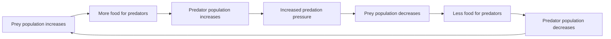

## Community Ecology and Species Interactions

### Overview

Community ecology examines how populations of different species coexist, interact, and collectively structure the biological communities they form. Species interactions — competition, predation, herbivory, parasitism, mutualism, and commensalism — determine which species persist together, how energy and resources are partitioned, and how communities respond to disturbance. These interactions are the mechanistic link between population-level dynamics and ecosystem-level function.

### Types of Species Interactions

**Key Points**

Interactions are classified by their effect (+, -, 0) on each participating species.

| Interaction | Species A | Species B | Description |
| --- | --- | --- | --- |
| Competition | − | − | Both harmed; shared limiting resource |
| Predation | + | − | Predator benefits, prey harmed (killed) |
| Herbivory | + | − | Herbivore benefits, plant harmed |
| Parasitism | + | − | Parasite benefits, host harmed (not usually killed) |
| Mutualism | + | + | Both species benefit |
| Commensalism | + | 0 | One benefits, other unaffected |
| Amensalism | 0 | − | One harmed, other unaffected |
| Neutralism | 0 | 0 | No significant effect on either |

### Competition

**Key Points**

- **Intraspecific competition**: occurs between individuals of the same species; typically more intense since individuals share identical resource needs.
- **Interspecific competition**: occurs between individuals of different species over shared limiting resources (food, water, light, space, nesting sites).
- **Competitive exclusion principle (Gause's principle)**: two species competing for the exact same limiting resource in the exact same way cannot coexist indefinitely — one will eventually outcompete and exclude the other.
- **Resource partitioning (niche differentiation)**: species reduce competition by evolving to use resources differently (in space, time, or type), allowing coexistence — a common outcome of past competitive pressure.
- **Character displacement**: an evolutionary consequence where competing species diverge in morphology/behavior over time to reduce niche overlap.

**Example**

Robert MacArthur's classic study of five North American warbler species (*Dendroica*) foraging in the same spruce trees demonstrated resource partitioning: each species concentrated its foraging activity in different vertical zones and used different foraging behaviors within the tree canopy, reducing direct competitive overlap despite occupying the same trees.

### Predation

**Key Points**

- Predation directly shapes prey population dynamics and can drive **coevolutionary arms races** — reciprocal adaptations between predator and prey (e.g., increased prey speed/camouflage countered by improved predator hunting ability).
- **Predator-prey population cycles**: classically modeled by the **Lotka-Volterra equations**, producing oscillating, out-of-phase population cycles between predator and prey.
- **Top-down control**: predators regulate prey and, indirectly, lower trophic levels — evident in **trophic cascades**.
- **Anti-predator adaptations**: camouflage, mimicry (Batesian and Müllerian), chemical defenses, warning coloration (aposematism), group vigilance, and rapid escape responses.

**Example**

Lotka-Volterra predator-prey equations:

$$\frac{dN}{dt} = rN - aNP$$

$$\frac{dP}{dt} = baNP - mP$$

where $N$ = prey population, $P$ = predator population, $r$ = prey intrinsic growth rate, $a$ = predation rate coefficient, $b$ = conversion efficiency of consumed prey into predator offspring, and $m$ = predator mortality rate.

The classic Canada lynx–snowshoe hare population cycle (documented via Hudson's Bay Company fur trapping records over nearly a century) shows regular ~10-year oscillations consistent with predator-prey dynamics, though [Inference: subsequent research indicates hare population cycles are also strongly influenced by food availability and plant chemical defenses, not solely predation, making the system more complex than the classic two-species model alone].

### Herbivory

**Key Points**

- Analogous to predation but involving consumption of plant (or algal) tissue rather than whole-animal prey; the plant is typically not killed outright.
- Plants have evolved extensive **defense mechanisms**: physical (thorns, spines, tough leaves, trichomes) and chemical (secondary metabolites such as alkaloids, tannins, terpenoids).
- Herbivores have coevolved **counter-adaptations**: detoxification enzymes, specialized digestive systems (e.g., ruminant fermentation), and behavioral avoidance of highly defended plant parts.
- Herbivory intensity influences plant community composition, succession trajectories, and can regulate primary productivity.

### Parasitism

**Key Points**

- Parasites live in or on a host, deriving nutrients at the host's expense, typically without immediately killing it (distinguishing parasitism from predation).
- **Ectoparasites** live on the host's exterior (fleas, ticks); **endoparasites** live within host tissues (tapeworms, malaria-causing *Plasmodium*).
- **Parasitoids** (e.g., certain wasps) occupy a functional middle ground — they develop within/on a host and ultimately kill it, behaviorally resembling parasites but functionally acting as specialized predators.
- Parasites can regulate host population dynamics and, in some cases, drive evolutionary arms races in host immune defenses (an application of the **Red Queen hypothesis**).

### Mutualism

**Key Points**

- Both interacting species derive a net fitness benefit; can be **obligate** (neither species can survive/reproduce without the other) or **facultative** (beneficial but not essential).
- **Types of mutualism**: pollination (plant-pollinator), seed dispersal (plant-frugivore), nutritional (mycorrhizal fungi-plant roots; gut microbiota-host), and defensive (ant-acacia protection mutualisms).
- Mutualisms are foundational to many ecosystem functions, including nutrient uptake efficiency in plants and reproductive success across countless flowering plant species.

**Example**

Mycorrhizal symbiosis: fungal hyphae associate with plant roots, extending the effective root surface area and improving water/phosphorus uptake for the plant; in exchange, the fungus receives carbohydrates produced through plant photosynthesis — an obligate or near-obligate mutualism present in the majority of vascular plant species. [Inference: exact prevalence estimates vary by study and plant taxa surveyed, though mycorrhizal associations are widely documented as common across most plant families.]

### Commensalism

**Key Points**

- One species benefits while the other experiences no significant measurable effect.
- Often involves use of another organism as habitat, transport, or byproduct resource rather than direct nutritional exchange.

**Example**

Epiphytic plants (such as many orchids and bromeliads) grow on the branches of large trees to access sunlight in the forest canopy, without extracting nutrients from or otherwise harming the host tree — the epiphyte benefits from physical support and light access while the tree is largely unaffected.

### Community Structure

**Key Points**

- **Species richness**: the number of distinct species present in a community.
- **Species diversity**: incorporates both richness and evenness (relative abundance distribution); commonly quantified with the **Shannon diversity index** or **Simpson's diversity index**.
- **Dominant species**: species with the highest relative abundance or biomass, exerting strong influence through sheer numbers.
- **Keystone species**: species whose ecological influence on community structure is disproportionately large relative to their abundance/biomass.
- **Foundation species**: species (often but not always abundant) that create or substantially modify habitat structure for the rest of the community (e.g., reef-building corals, kelp, forest-forming trees).
- **Trophic levels and food webs**: describe the network of feeding relationships linking producers, consumers, and decomposers within the community.

**Example**

Simpson's diversity index:

$$D = 1 - \sum_{i=1}^{S} p_i^2$$

where $p_i$ is the proportional abundance of species $i$ and $S$ is total species richness. Values closer to 1 indicate higher diversity (more even, more species-rich community).

### Ecological Succession

**Key Points**

- **Primary succession**: colonization of a previously lifeless substrate with no pre-existing soil (e.g., bare rock following glacial retreat or volcanic lava flow); begins with **pioneer species** (often lichens and mosses) that initiate soil formation.
- **Secondary succession**: recolonization of an area following disturbance where soil and some biological legacy remain (e.g., after fire, flood, or agricultural abandonment); proceeds considerably faster than primary succession since soil development is not required from scratch.
- Succession proceeds through recognizable stages toward a relatively stable **climax community**, though modern ecological theory recognizes that many communities exist in dynamic, disturbance-influenced states rather than a single fixed endpoint. [Inference: the classical Clementsian "climax community" concept has been substantially revised in contemporary ecology in favor of more dynamic, non-equilibrium models of community change.]

### Trophic Cascades and Indirect Effects

**Key Points**

- A **trophic cascade** occurs when a change at one trophic level propagates indirect effects through multiple lower or higher levels of the food web.
- **Top-down cascades**: driven by predator/consumer effects rippling downward (e.g., predator removal → herbivore increase → vegetation decline).
- Indirect effects can also occur through **non-trophic pathways**, such as ecosystem engineering or habitat modification.

**Example**

The reintroduction of gray wolves to Yellowstone National Park (1995) is frequently cited as a trophic cascade case study: wolf presence altered elk behavior and reduced elk browsing pressure in riparian zones, associated with subsequent willow and aspen recovery in some areas. [Unverified: the magnitude and universality of this cascade — particularly the popularized claim that wolves single-handedly "changed the rivers" — has been debated and partially challenged in the peer-reviewed literature, with some researchers attributing vegetation changes to multiple co-occurring factors including climate and hydrology rather than wolves alone.]

### Diagram: Interaction Types by Fitness Effect

<svg xmlns="http://www.w3.org/2000/svg" viewBox="0 0 700 460">
<text x="350" y="30" text-anchor="middle" font-size="18" font-weight="bold" fill="#1a1a1a">Species Interaction Matrix (svg_diagram)</text>
<rect x="60" y="70" width="580" height="360" fill="none" stroke="#333" stroke-width="2" />
<line x1="350" y1="70" x2="350" y2="430" stroke="#333" stroke-width="1.5" />
<line x1="60" y1="250" x2="640" y2="250" stroke="#333" stroke-width="1.5" />

<text x="205" y="60" text-anchor="middle" font-size="13" font-weight="bold">Species B: +</text>

<text x="495" y="60" text-anchor="middle" font-size="13" font-weight="bold">Species B: −</text>

<text x="20" y="165" font-size="13" font-weight="bold" transform="rotate(-90 20 165)">Species A: +</text>

<text x="20" y="345" font-size="13" font-weight="bold" transform="rotate(-90 20 345)">Species A: −</text>

<text x="205" y="160" text-anchor="middle" font-size="14" fill="`#2a7a54`" font-weight="bold">Mutualism</text>

<text x="205" y="180" text-anchor="middle" font-size="11" fill="#555">(+/+)</text>

<text x="495" y="160" text-anchor="middle" font-size="14" fill="`#8a5a2b`" font-weight="bold">Predation/</text>

<text x="495" y="180" text-anchor="middle" font-size="14" fill="`#8a5a2b`" font-weight="bold">Parasitism</text>

<text x="495" y="200" text-anchor="middle" font-size="11" fill="#555">(+/−)</text>

<text x="205" y="340" text-anchor="middle" font-size="14" fill="`#2b6ca3`" font-weight="bold">Commensalism</text>

<text x="205" y="360" text-anchor="middle" font-size="11" fill="#555">(+/0, shown +/−&gt;0 zone)</text>

<text x="495" y="340" text-anchor="middle" font-size="14" fill="`#c0392b`" font-weight="bold">Competition</text>

<text x="495" y="360" text-anchor="middle" font-size="11" fill="#555">(−/−)</text>

</svg>

### Common Misconceptions

**Key Points**

- Assuming predation always benefits ecosystem "balance" uniformly — effects are context-dependent and can produce cascading, sometimes counterintuitive, outcomes.
- Treating the competitive exclusion principle as always immediately observable in nature — resource partitioning and environmental fluctuation often allow apparent long-term coexistence despite competitive overlap.
- Confusing parasitism with parasitoidism, or predation with parasitism — the key distinction is whether the host/prey is killed and how nutrients are obtained.
- Viewing succession as a strictly deterministic, one-way march toward a fixed "climax" — contemporary ecology treats succession as more variable and disturbance-contingent.

### Related Topics

- Population growth models and carrying capacity
- Levels of ecological organization
- Trophic dynamics and food web structure
- Biodiversity indices and community sampling methods
- Coevolution and the Red Queen hypothesis
- Ecosystem engineering and foundation species
- Island biogeography and species-area relationships
- Disturbance ecology and resilience theory