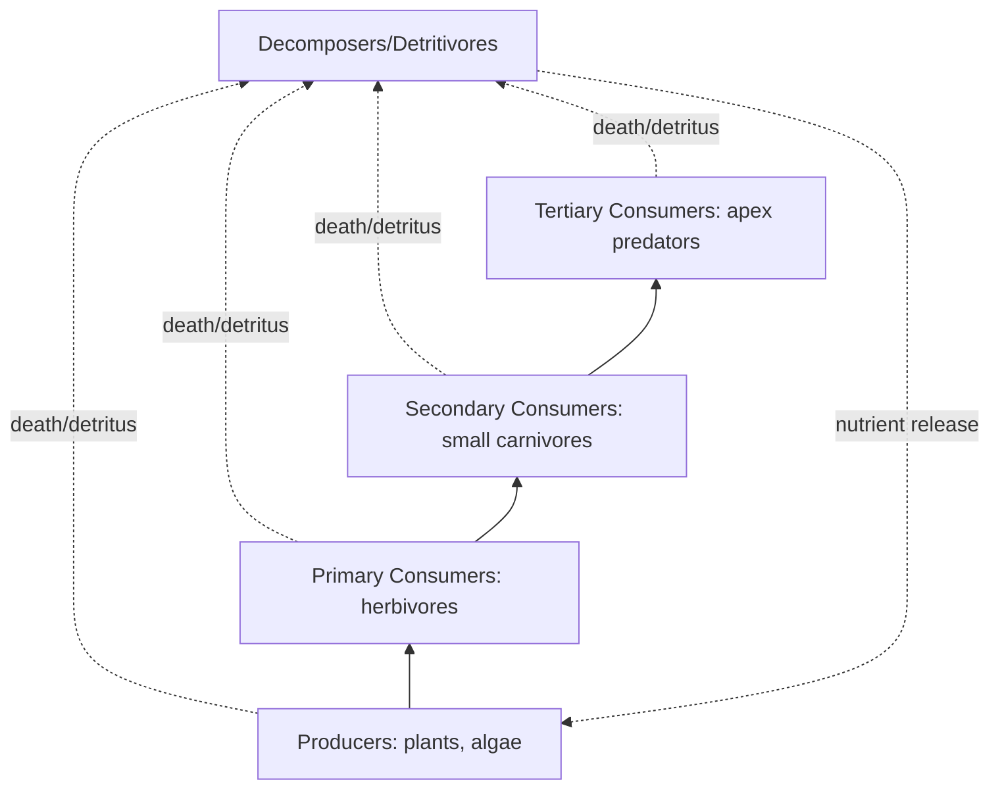
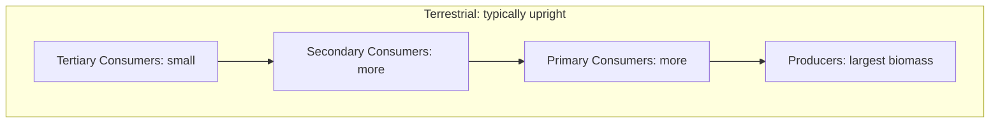

## Ecosystem Structure and Function

### Overview

An ecosystem comprises all living organisms (the biotic community) interacting with each other and with their non-living physical environment (abiotic factors) within a defined area. Ecosystem ecology examines two interlinked dimensions: **structure** (the composition and organization of biotic and abiotic components) and **function** (the processes — primarily energy flow and nutrient cycling — that sustain the system). Together, structure and function determine an ecosystem's productivity, stability, and resilience to disturbance.

### Ecosystem Structure: Biotic Components

**Key Points**

- **Producers (autotrophs)**: organisms that synthesize organic compounds from inorganic sources, forming the energetic base of the ecosystem. Includes photosynthetic organisms (plants, algae, cyanobacteria) and chemosynthetic organisms (certain bacteria at hydrothermal vents).
- **Consumers (heterotrophs)**: obtain energy by consuming other organisms. Subdivided into **primary consumers** (herbivores, eating producers), **secondary consumers** (eating primary consumers), and **tertiary/apex consumers** (eating secondary consumers).
- **Decomposers (saprotrophs)**: fungi and bacteria that break down dead organic matter, releasing nutrients back into the abiotic environment for reuse by producers.
- **Detritivores**: organisms (earthworms, millipedes, dung beetles) that physically consume and fragment dead organic matter, facilitating subsequent microbial decomposition.

### Ecosystem Structure: Abiotic Components

**Key Points**

- **Climatic factors**: temperature, precipitation, humidity, wind, and solar radiation, which govern productivity limits and species distribution.
- **Edaphic (soil) factors**: soil texture, pH, mineral composition, and organic content, directly affecting plant nutrient availability.
- **Topographic factors**: elevation, slope, and aspect, which influence microclimate and drainage.
- **Chemical factors**: availability of essential nutrients (nitrogen, phosphorus, potassium, trace elements), dissolved oxygen (in aquatic systems), and pH/salinity.
- Abiotic factors set the **fundamental constraints** within which biotic communities can establish and persist (Liebig's Law of the Minimum: growth is limited by the scarcest necessary resource, not the total resources available).

### Trophic Structure

**Key Points**

- **Trophic levels** organize organisms by their feeding position: Producers (Trophic Level 1) → Primary Consumers (TL2) → Secondary Consumers (TL3) → Tertiary Consumers (TL4).
- **Food chains**: linear sequences of energy transfer through successive trophic levels.
- **Food webs**: realistic, interconnected networks of multiple overlapping food chains, since most consumers feed at more than one trophic level or on multiple prey species.
- **Trophic position** can be non-integer in real food webs, since many organisms are omnivorous and feed across multiple levels simultaneously.

### Energy Flow Through Ecosystems

**Key Points**

- Energy flow is **unidirectional and non-cyclical** — unlike matter, energy is not recycled; it is progressively transformed and lost as heat according to the second law of thermodynamics.
- **Primary productivity**: the rate at which producers convert solar (or chemical) energy into organic biomass.
  - **Gross Primary Productivity (GPP)**: total energy fixed by photosynthesis.
  - **Net Primary Productivity (NPP)**: energy remaining after subtracting the producers' own respiration ($NPP = GPP - R$), representing biomass available to consumers.
- **Secondary productivity**: rate of biomass accumulation by consumers.
- **Ecological efficiency**: the proportion of energy transferred from one trophic level to the next, commonly approximated at ~10% (the "10% rule"), though actual values vary considerably by ecosystem type and taxa involved.
- Energy loss between trophic levels occurs primarily through **respiration** (metabolic heat loss), **incomplete digestion/egestion**, and **energy not consumed** (biomass that dies and enters the decomposer pathway rather than being eaten).

**Example**

$$NPP = GPP - R_{producers}$$

Ecological efficiency between trophic levels:

$$\text{Ecological Efficiency} = \frac{\text{Energy available at trophic level } n+1}{\text{Energy available at trophic level } n} \times 100\%$$

If a grassland ecosystem fixes 20,000 kcal/m²/yr as GPP, uses 7,500 kcal/m²/yr for producer respiration, the remaining NPP available to herbivores is 12,500 kcal/m²/yr. If herbivores transfer roughly 10% of consumed energy to the next level, only approximately 1,250 kcal/m²/yr becomes available to primary carnivores — illustrating why food chains are typically limited to 4-5 trophic levels before available energy becomes ecologically negligible.

### Ecological Pyramids

**Key Points**

- **Pyramid of energy**: always upright (each level narrower than the one below), since energy is progressively lost at each transfer — this is the only pyramid type with no theoretical exceptions.
- **Pyramid of numbers**: can be inverted in some systems (e.g., a single large tree supporting many herbivorous insects).
- **Pyramid of biomass**: usually upright in terrestrial ecosystems but can be inverted in some aquatic ecosystems, where a small standing biomass of rapidly reproducing phytoplankton supports a much larger biomass of longer-lived zooplankton and fish (because phytoplankton turnover rate is very high, standing biomass at any instant appears low relative to consumer biomass).

### Biogeochemical Cycling (Nutrient Flow)

**Key Points**

- Unlike energy, **matter is cycled** — nutrients move between biotic and abiotic pools in a continuous, largely closed loop (the ecosystem, unlike energy, does not require constant external nutrient input, though open ecosystems do exchange some nutrients across boundaries).
- **Carbon cycle**: CO₂ fixed via photosynthesis, released via respiration/decomposition/combustion; involves atmospheric, oceanic, and lithospheric reservoirs.
- **Nitrogen cycle**: involves **nitrogen fixation** (atmospheric N₂ converted to usable ammonia by bacteria, e.g., *Rhizobium*), **nitrification** (ammonia → nitrite → nitrate), **assimilation** (uptake by producers), and **denitrification** (nitrate returned to atmospheric N₂).
- **Phosphorus cycle**: unique among major cycles for lacking a significant atmospheric gas phase; phosphorus moves primarily through weathering of phosphate rock, uptake by organisms, and sedimentation — making it typically the most limiting nutrient in many ecosystems, particularly freshwater and terrestrial systems.
- **Water (hydrologic) cycle**: evaporation, transpiration, condensation, precipitation, and runoff, linking atmosphere, biosphere, hydrosphere, and lithosphere.

**Example**

Nitrogen fixation reaction (simplified, biologically catalyzed by nitrogenase enzyme in bacteria such as *Rhizobium* in leguminous plant root nodules):

$$N_2 + 8H^+ + 8e^- \rightarrow 2NH_3 + H_2$$

### Ecosystem Function: Stability and Resilience

**Key Points**

- **Resistance**: an ecosystem's capacity to remain unchanged despite disturbance.
- **Resilience**: an ecosystem's capacity to recover its original structure/function after disturbance.
- **Ecological redundancy**: multiple species performing similar functional roles, providing a buffer if one species declines (linked to the "insurance hypothesis" of biodiversity).
- **Regime shift / alternative stable states**: some ecosystems can shift to a fundamentally different, self-reinforcing structural and functional state following sufficient disturbance, and may not readily return to the original state even if the disturbance is removed (hysteresis).
- Higher biodiversity is generally associated with greater ecosystem stability and productivity, though the precise mechanistic relationship (and its universality across ecosystem types) remains an active area of ecological research. [Inference: the diversity-stability relationship is empirically well-supported in many systems but the strength and generality of the relationship is still debated for specific ecosystem types and disturbance regimes.]

**Example**

Shallow lake ecosystems can exist in two alternative stable states: a **clear-water state** dominated by submerged aquatic vegetation, or a **turbid state** dominated by phytoplankton. Excess nutrient loading (eutrophication) can push a lake past a tipping point into the turbid state, which then persists due to self-reinforcing feedbacks (reduced light limits vegetation recovery) even if nutrient input is subsequently reduced — a classic example of hysteresis in ecosystem function.

### Ecosystem Services

**Key Points**

- **Provisioning services**: direct products obtained from ecosystems (food, timber, fresh water, medicinal compounds).
- **Regulating services**: benefits from ecosystem process regulation (climate regulation, water purification, pollination, flood control, disease regulation).
- **Supporting services**: underlying processes necessary for all other services (nutrient cycling, soil formation, primary production).
- **Cultural services**: non-material benefits (recreation, aesthetic value, spiritual/cultural significance, scientific/educational value).
- This four-category framework originates from the Millennium Ecosystem Assessment and is widely used in environmental policy and valuation contexts.

### Diagram: Energy Flow and Nutrient Cycling Compared

<svg xmlns="http://www.w3.org/2000/svg" viewBox="0 0 700 460">
<text x="350" y="30" text-anchor="middle" font-size="18" font-weight="bold" fill="#1a1a1a">Energy Flow vs. Nutrient Cycling (svg_diagram)</text>

<text x="180" y="65" text-anchor="middle" font-size="14" font-weight="bold" fill="`#c0392b`">Energy: One-Way Flow</text>

<rect x="80" y="90" width="90" height="45" fill="`#f5d6bc`" stroke="`#8a5a2b`" stroke-width="2" />

<text x="125" y="117" text-anchor="middle" font-size="11">Sun</text>

<line x1="170" y1="112" x2="220" y2="112" stroke="`#c0392b`" stroke-width="2" marker-end="url(#arrow1)" />

<rect x="220" y="90" width="90" height="45" fill="`#cfe0a6`" stroke="`#5f7a2b`" stroke-width="2" />

<text x="265" y="117" text-anchor="middle" font-size="11">Producers</text>

<line x1="310" y1="112" x2="360" y2="112" stroke="`#c0392b`" stroke-width="2" />

<rect x="360" y="90" width="90" height="45" fill="`#bcd9f0`" stroke="`#2b6ca3`" stroke-width="2" />

<text x="405" y="117" text-anchor="middle" font-size="11">Consumers</text>

<text x="200" y="160" text-anchor="middle" font-size="10" fill="`#c0392b`">(heat lost at each step, no return)</text>

<text x="180" y="230" text-anchor="middle" font-size="14" font-weight="bold" fill="`#2a7a54`">Matter: Cyclical Flow</text>

<ellipse cx="180" cy="320" rx="150" ry="100" fill="none" stroke="`#2a7a54`" stroke-width="2" stroke-dasharray="6,4" />

<rect x="130" y="270" width="100" height="40" fill="`#cfe0a6`" stroke="`#5f7a2b`" stroke-width="2" />

<text x="180" y="295" text-anchor="middle" font-size="10">Producers</text>

<rect x="60" y="360" width="100" height="40" fill="`#bcd9f0`" stroke="`#2b6ca3`" stroke-width="2" />

<text x="110" y="385" text-anchor="middle" font-size="10">Consumers</text>

<rect x="200" y="360" width="100" height="40" fill="`#e0c9a6`" stroke="`#8a5a2b`" stroke-width="2" />

<text x="250" y="385" text-anchor="middle" font-size="10">Decomposers</text>

</svg>

### Common Misconceptions

**Key Points**

- Believing energy, like matter, is recycled through ecosystems — energy flows one-way and is progressively lost as heat, never cycled back to producers.
- Assuming the 10% rule of energy transfer is a strict biological law — it is a useful approximation; real ecological efficiencies vary widely (roughly 5-20%) depending on organism physiology and ecosystem type.
- Treating inverted biomass pyramids as errors — they are a real and expected phenomenon in ecosystems where primary producers have very high turnover rates (e.g., phytoplankton-based aquatic systems).
- Assuming all ecosystems will always return to their original state after disturbance — alternative stable states and hysteresis effects demonstrate this is not universally true.

### Related Topics

- Biogeochemical cycles in depth (carbon, nitrogen, phosphorus, water)
- Trophic dynamics and food web modeling
- Primary productivity measurement methods
- Biodiversity-ecosystem function relationships
- Ecosystem services valuation and environmental policy
- Disturbance ecology, resilience, and regime shifts
- Interactions among atmosphere, hydrosphere, lithosphere, and biosphere
- Community ecology and species interactions