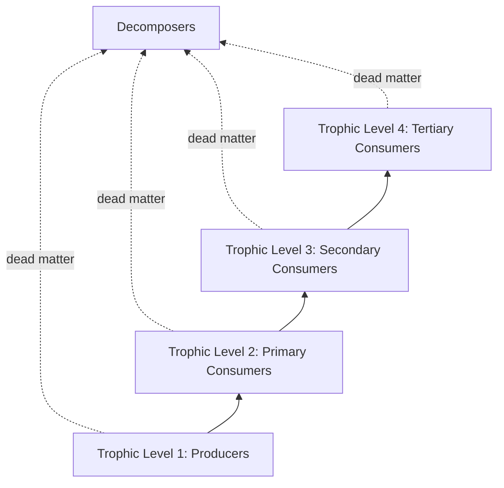
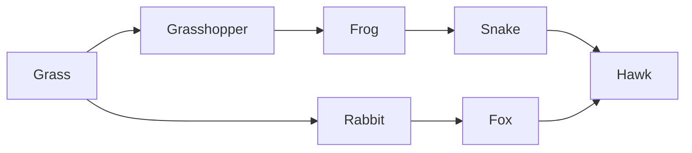

## Energy Flow and Trophic Levels

### Overview

Energy flow describes how solar (or chemical) energy enters an ecosystem, is transformed into biomass, and moves through successive feeding relationships before ultimately dissipating as heat. Trophic levels organize organisms according to their position in this energy pathway. Unlike matter, which cycles repeatedly through biotic and abiotic pools, energy moves through ecosystems in a single, irreversible direction — governed by the laws of thermodynamics — making energy flow one of the most fundamental constraints on ecosystem structure, food chain length, and biomass distribution.

### Thermodynamic Foundations

**Key Points**

- **First Law of Thermodynamics (conservation of energy)**: energy cannot be created or destroyed, only transformed from one form to another (e.g., light energy → chemical bond energy via photosynthesis).
- **Second Law of Thermodynamics**: every energy transformation involves some loss of usable energy as heat, increasing overall entropy. No energy transfer is 100% efficient.
- These two laws jointly explain why energy flow through ecosystems is **unidirectional** and why the total energy available progressively decreases at each successive trophic level.

### Trophic Levels Defined

**Key Points**

- **Trophic Level 1 (Producers/Autotrophs)**: organisms that convert inorganic energy sources into organic compounds. **Photoautotrophs** (plants, algae, cyanobacteria) use solar energy; **chemoautotrophs** (certain bacteria, e.g., at hydrothermal vents) oxidize inorganic compounds (H₂S, NH₃) for energy.
- **Trophic Level 2 (Primary Consumers)**: herbivores that consume producers directly.
- **Trophic Level 3 (Secondary Consumers)**: carnivores/omnivores that consume primary consumers.
- **Trophic Level 4 (Tertiary Consumers)**: carnivores that consume secondary consumers; often apex predators occupy this or higher levels.
- **Decomposers/Detritivores**: operate across all trophic levels, breaking down dead organic matter from any level and returning nutrients (not energy) to the abiotic environment.
- Many organisms are **omnivorous** and feed at multiple trophic levels simultaneously, meaning real trophic position is often better represented as a continuous value rather than a discrete integer category.

### Primary Productivity

**Key Points**

- **Gross Primary Productivity (GPP)**: the total rate at which producers convert light (or chemical) energy into chemical energy via photosynthesis (or chemosynthesis), measured as energy or biomass per unit area per unit time (e.g., kcal/m²/yr or g/m²/yr).
- **Net Primary Productivity (NPP)**: GPP minus the energy producers use for their own cellular respiration ($R$):

  $$NPP = GPP - R$$
- NPP represents the actual biomass/energy available to be consumed by heterotrophs (herbivores) or to accumulate as new plant biomass.
- **Standing crop biomass**: the total mass of living producer material present at a given time — distinct from productivity, which is a rate.
- Productivity varies enormously across ecosystem types: tropical rainforests and coral reefs exhibit some of the highest NPP values, while deserts and open ocean exhibit some of the lowest, driven primarily by water availability, temperature, light, and nutrient limitation. [Inference: relative productivity rankings across biome types are well-documented in ecological literature, though exact NPP figures vary across studies and measurement methodologies.]

**Example**

A net primary productivity calculation: if a forest ecosystem fixes 25,000 kcal/m²/yr of solar energy as GPP, and producers use 10,000 kcal/m²/yr for their own respiration:

$$NPP = 25{,}000 - 10{,}000 = 15{,}000 \text{ kcal/m}^2/\text{yr}$$

This remaining 15,000 kcal/m²/yr is the energy pool available to primary consumers and to net biomass accumulation.

### Secondary Productivity and Ecological Efficiency

**Key Points**

- **Secondary productivity**: the rate at which consumers (heterotrophs) convert consumed energy into their own biomass.
- **Assimilation efficiency**: the proportion of ingested energy that is actually absorbed across the gut wall (rather than egested as waste).
- **Production efficiency**: the proportion of assimilated energy converted into new biomass/growth (versus lost to respiration).
- **Ecological efficiency (trophic transfer efficiency)**: the overall proportion of energy at one trophic level that is successfully transferred to and incorporated into the next trophic level, commonly approximated as ~10% (the **"10% rule"**), though it typically ranges from roughly 5% to 20% depending on organism physiology (e.g., ectotherms are generally more energy-efficient than endotherms, since endotherms expend substantial energy on thermoregulation).

**Example**

If primary consumers in a grassland ecosystem have access to 12,500 kcal/m²/yr of plant NPP, and ecological efficiency to the next trophic level is approximately 10%:

$$\text{Energy available to secondary consumers} \approx 12{,}500 \times 0.10 = 1{,}250 \text{ kcal/m}^2/\text{yr}$$

Applying the same approximate efficiency again for tertiary consumers yields roughly 125 kcal/m²/yr — illustrating why very little usable energy remains after 3-4 trophic transfers, which is the primary reason food chains rarely exceed 4-5 trophic levels in most ecosystems.

### Food Chains vs. Food Webs

**Key Points**

- A **food chain** is a single, linear pathway of energy transfer from producer through a sequence of consumers.
- A **food web** is the realistic, interconnected network formed by multiple overlapping food chains within a community, since most consumers have multiple food sources and are themselves prey to multiple predators.
- **Grazing food chains** begin with living plant material consumed by herbivores; **detrital food chains** begin with dead organic matter consumed by decomposers/detritivores. In many ecosystems (e.g., temperate forests), the detrital pathway processes a larger fraction of total NPP than the grazing pathway. [Inference: the relative proportion of energy flowing through grazing versus detrital pathways is ecosystem-specific and has been documented to vary substantially across terrestrial and aquatic system types.]

### Why Food Chains Are Limited in Length

**Key Points**

- The **energy transfer limitation hypothesis** proposes that food chains rarely exceed 4-5 links because each transfer loses roughly 90% of available energy, leaving insufficient energy to support additional trophic levels at higher positions.
- Alternative/complementary hypotheses include **ecosystem stability constraints** (longer chains may be less dynamically stable and more vulnerable to perturbation) and **predator size/foraging constraints** (physical and behavioral limits on how efficiently top predators can locate and capture sufficiently abundant prey).
- [Inference: the relative explanatory power of the energy-limitation hypothesis versus stability-based and other hypotheses for food chain length remains a genuinely debated topic within theoretical ecology, without full scientific consensus on a single dominant mechanism.]

### Ecological Pyramids

**Key Points**

- **Pyramid of Energy**: always upright, with no known ecological exceptions, since energy dissipates at every transfer.
- **Pyramid of Numbers**: counts individual organisms at each trophic level; can be inverted (e.g., one large tree supporting thousands of insect herbivores).
- **Pyramid of Biomass**: measures total living mass at each level; typically upright in terrestrial ecosystems, but can be inverted in some aquatic/marine ecosystems where phytoplankton (low standing biomass, extremely fast reproduction/turnover) support much larger standing biomass of zooplankton and fish.

| Pyramid Type | Typical Shape | Can Be Inverted? |
| --- | --- | --- |
| Energy | Always upright | No |
| Numbers | Usually upright | Yes (e.g., single tree + many insects) |
| Biomass | Usually upright | Yes (e.g., phytoplankton-based marine systems) |

### Diagram: The 10% Rule Across Trophic Levels

<svg xmlns="http://www.w3.org/2000/svg" viewBox="0 0 700 460">
<text x="350" y="30" text-anchor="middle" font-size="18" font-weight="bold" fill="#1a1a1a">Energy Pyramid: The 10% Rule (svg_diagram)</text>
<polygon points="350,80 420,80 460,160 240,160" fill="#c0392b" stroke="#7a2418" stroke-width="2" />
<text x="350" y="125" text-anchor="middle" font-size="11" fill="white" font-weight="bold">Tertiary Consumers</text>
<text x="350" y="145" text-anchor="middle" font-size="10" fill="white">~12.5 kcal/m2/yr</text>
<polygon points="240,160 460,160 520,240 180,240" fill="#e67e22" stroke="#a35b17" stroke-width="2" />
<text x="350" y="205" text-anchor="middle" font-size="11" fill="white" font-weight="bold">Secondary Consumers</text>
<text x="350" y="225" text-anchor="middle" font-size="10" fill="white">~125 kcal/m2/yr</text>
<polygon points="180,240 520,240 580,320 120,320" fill="#f1c40f" stroke="#a3890b" stroke-width="2" />
<text x="350" y="285" text-anchor="middle" font-size="11" fill="#4a3115" font-weight="bold">Primary Consumers</text>
<text x="350" y="305" text-anchor="middle" font-size="10" fill="#4a3115">~1,250 kcal/m2/yr</text>
<polygon points="120,320 580,320 640,400 60,400" fill="#27ae60" stroke="#1a7a40" stroke-width="2" />
<text x="350" y="365" text-anchor="middle" font-size="11" fill="white" font-weight="bold">Producers</text>
<text x="350" y="385" text-anchor="middle" font-size="10" fill="white">~12,500 kcal/m2/yr</text>

<text x="350" y="430" text-anchor="middle" font-size="11" fill="#666" font-style="italic">Each level retains roughly 10% of the energy available at the level below</text>

</svg>

### Human Implications of Trophic Energy Loss

**Key Points**

- Because energy is lost at each trophic transfer, consuming food from **lower trophic levels** (e.g., plant-based diets) captures more of the original solar energy input per unit land area than consuming animal products derived from herbivores, which is a foundational concept in discussions of food system land-use efficiency. [Inference: this is a well-established thermodynamic principle in ecological and food-systems literature, though real-world land-use and dietary efficiency comparisons involve additional variables such as land suitability for crops versus grazing, which can affect specific practical conclusions.]
- Fisheries management uses trophic level concepts to understand why harvesting apex predator fish species is generally less energetically/ecologically sustainable per unit biomass than harvesting lower-trophic-level species.

### Common Misconceptions

**Key Points**

- Believing energy is "recycled" like nutrients — energy flows one-way through an ecosystem and is ultimately lost as heat; it is never returned to producers for reuse.
- Treating the 10% rule as an exact universal constant — it is a widely used approximation; actual ecological efficiencies vary meaningfully by organism type, ecosystem, and trophic level.
- Assuming trophic levels are always clean, discrete categories — many real organisms (omnivores) feed across multiple levels, making trophic position a continuum in practice.
- Assuming an inverted biomass or number pyramid indicates an unhealthy or abnormal ecosystem — inverted pyramids are a normal and expected feature of certain ecosystem types, particularly those based on fast-turnover primary producers like phytoplankton.

### Related Topics

- Ecosystem structure and function
- Biogeochemical cycling versus energy flow
- Primary productivity measurement techniques
- Ecological pyramids and biomass distribution
- Food web modeling and detrital versus grazing pathways
- Trophic cascades and top-down/bottom-up ecosystem control
- Community ecology and species interactions