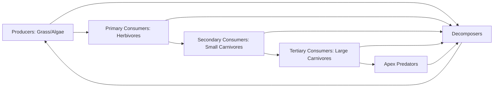
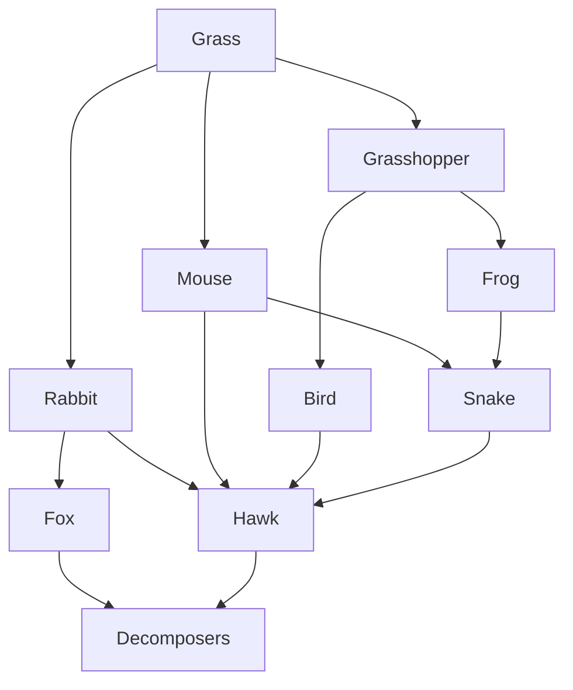

## Food Webs and Food Chains

### Overview

Food chains and food webs are conceptual models describing the transfer of energy and nutrients between organisms through feeding relationships. A food chain represents a single, linear pathway of energy transfer; a food web is the realistic, interconnected network of multiple overlapping food chains within an ecosystem, reflecting the fact that most organisms consume and are consumed by multiple species.

### Core Definitions

**Key Points**

- **Food chain**: A linear sequence showing a single pathway of energy transfer, e.g., grass → grasshopper → frog → snake → hawk.
- **Food web**: The full network of interconnected food chains in an ecosystem, capturing the reality that consumers typically feed at multiple trophic levels or on multiple species.
- **Trophic level**: An organism's position in a food chain, defined by the number of energy transfer steps from the primary energy source.
- **Trophic structure**: The organization of an ecosystem's species into feeding hierarchies, often visualized as pyramids of energy, biomass, or numbers.

### Trophic Levels

1. **Primary Producers (Autotrophs)** — Organisms that convert inorganic energy (sunlight or chemical energy) into organic compounds. Includes photosynthetic plants, algae, cyanobacteria, and chemosynthetic bacteria (e.g., at hydrothermal vents).
2. **Primary Consumers (Herbivores)** — Organisms that feed directly on producers (e.g., grasshoppers, deer, zooplankton).
3. **Secondary Consumers** — Carnivores or omnivores that feed on primary consumers (e.g., frogs, small fish).
4. **Tertiary Consumers** — Predators that feed on secondary consumers (e.g., snakes, larger fish).
5. **Apex/Quaternary Consumers** — Top predators with no natural predators of their own (e.g., hawks, orcas, large sharks).
6. **Decomposers/Detritivores** — Fungi, bacteria, and detritus feeders (earthworms, some insects) that break down dead organic matter, returning nutrients to the abiotic environment and linking back to producers.

### Food Chains: Types

**Grazing Food Chain**

Begins with living green plants consumed by herbivores, energy then passing to carnivores. This is the dominant, most visible pathway in terrestrial and many aquatic systems (e.g., grass → rabbit → fox).

**Detrital Food Chain**

Begins with dead organic matter (detritus) consumed by decomposers and detritivores, energy then passing to their predators. In many ecosystems — particularly forests, wetlands, and benthic marine environments — the detrital pathway processes more energy and biomass than the grazing pathway. [Inference — the relative dominance of detrital vs. grazing pathways is ecosystem-specific and varies with productivity, climate, and disturbance regime]

### From Chains to Webs: Why Webs Are More Realistic

Real ecosystems rarely contain isolated linear chains because:

- Most consumers are **polyphagous** (feed on multiple prey species), not restricted to a single food source.
- Species often occupy **multiple trophic levels** depending on life stage or context (omnivory), e.g., bears consuming both berries (primary consumer role) and salmon (secondary/tertiary consumer role).
- **Intraguild predation** and **cannibalism** further complicate strict hierarchical models.

A food web therefore aggregates all food chains in a community into a directed network graph, where nodes represent species (or functional groups) and edges represent feeding (predator-prey) relationships.

### Quantifying Energy Flow: Ecological Pyramids

**Pyramid of Energy**

Always upright, since energy dissipates as heat at each transfer (second law of thermodynamics) and cannot be recycled. Approximated by the 10% rule (Lindeman efficiency): roughly 10% of energy at one trophic level transfers to the next, with ~90% lost primarily to respiration.

$$E_{n+1} \approx 0.10 \times E_n$$

Where $E_n$ is energy available at trophic level $n$.

**Pyramid of Biomass**

Usually upright in terrestrial ecosystems (large standing plant biomass supporting smaller consumer biomass) but can be **inverted** in some aquatic systems, where phytoplankton have low standing biomass but extremely high turnover rates, supporting proportionally larger consumer biomass at any given snapshot in time.

**Pyramid of Numbers**

Can be upright, inverted, or irregular depending on organism size — e.g., a single large tree (one producer) can support thousands of insect herbivores, inverting the typical pyramid shape at the base.

<svg xmlns="http://www.w3.org/2000/svg" viewBox="0 0 700 420" font-family="Helvetica, Arial, sans-serif">
<text x="350" y="28" text-anchor="middle" font-size="18" font-weight="bold" fill="#1a1a1a">Ecological Pyramid of Energy (svg_diagram)</text>

<polygon points="330,60 370,60 350,110" fill="#c23b22" />
<text x="400" y="90" font-size="12" fill="#1a1a1a">Apex Predators (~10 kcal/m2/yr)</text>

<polygon points="300,110 400,110 370,170 330,170" fill="#e07b39" />
<text x="420" y="145" font-size="12" fill="#1a1a1a">Tertiary Consumers (~100 kcal/m2/yr)</text>

<polygon points="260,170 440,170 400,240 300,240" fill="#f2b705" />
<text x="460" y="210" font-size="12" fill="#1a1a1a">Secondary Consumers (~1,000 kcal/m2/yr)</text>

<polygon points="210,240 490,240 440,320 260,320" fill="#8fb339" />
<text x="510" y="285" font-size="12" fill="#1a1a1a">Primary Consumers (~10,000 kcal/m2/yr)</text>

<polygon points="150,320 550,320 490,400 210,400" fill="#3a9d5d" />
<text x="570" y="365" font-size="12" fill="#1a1a1a">Producers (~100,000 kcal/m2/yr)</text>

<text x="350" y="415" text-anchor="middle" font-size="10" fill="#555">Approximate 10% energy transfer efficiency between successive levels</text>

</svg>

### Keystone Species and Trophic Cascades

**Key Points**

- A **keystone species** exerts disproportionate influence on food web structure relative to its abundance/biomass; its removal triggers cascading changes throughout the web.
- A **trophic cascade** occurs when changes at one trophic level propagate through multiple levels, often via predator-mediated control of herbivore populations, which in turn affects producer abundance.
- Classic example: sea otters (keystone predator) control sea urchin populations, which in turn control kelp forest abundance. Removal of otters allows urchin overgrazing ("urchin barrens"), collapsing kelp ecosystems.
- Another documented example: reintroduction of wolves to Yellowstone National Park correlated with reduced elk browsing pressure, associated with recovery of riparian vegetation (willow, aspen) — though the magnitude and primary drivers of this cascade remain actively debated among ecologists. [Inference — while widely cited as a textbook trophic cascade, the relative contributions of wolf reintroduction versus other factors like climate and elk population dynamics are contested in the primary literature]

### Bioaccumulation and Biomagnification in Food Webs

Because food webs channel energy and matter through successive consumers, certain persistent, fat-soluble pollutants (e.g., DDT, mercury, PCBs) that are not efficiently metabolized or excreted become increasingly concentrated at higher trophic levels — a process called **biomagnification**, distinct from **bioaccumulation** (the buildup of a substance within a single organism over its lifetime).

$$C_{n+1} > C_n$$

Where $C_n$ is contaminant concentration at trophic level $n$; unlike energy, which decreases up the food chain, certain contaminant concentrations increase up the food chain. This is why apex predators (e.g., tuna, eagles, polar bears, humans) often carry the highest body burdens of such pollutants despite being furthest from the contamination source.

### Food Web Connectivity and Stability

**Key Points**

- **Connectance**: The proportion of realized feeding links out of all possible links in a food web; higher connectance is often (though not universally) associated with greater resilience to species loss.
- **Redundancy**: Multiple species performing similar trophic roles can buffer a food web against the loss of any single species.
- **Omnivory** and **weak interaction links** (species with low-frequency feeding interactions) tend to stabilize food webs by dampening oscillations that would otherwise arise from strong, tightly coupled predator-prey pairs.
- Highly simplified or linear food chains (low connectance) are generally more vulnerable to trophic cascades and secondary extinctions following species loss. [Inference — food web stability theory is an active research area, and empirical support varies by ecosystem type and disturbance regime]

### Worked Example

**Example**

In a freshwater pond food web: algae are consumed by mayfly larvae and daphnia; mayfly larvae and daphnia are both consumed by small fish; small fish are consumed by herons and bass; bass also consume small fish directly and occasionally juvenile herons.

- This scenario cannot be represented as a single food chain, since small fish have two predators (herons, bass) and bass exhibit both secondary consumer behavior (eating small fish) and potential tertiary/intraguild predation (eating juvenile herons).
- Constructing this as a food web reveals bass occupying two trophic positions simultaneously, illustrating why real trophic structure is a network property rather than a strict hierarchy.

### Human Impacts on Food Webs

- **Overfishing**: Selective removal of top predators (e.g., cod, tuna) can trigger trophic cascades, releasing mid-level predator or prey populations from top-down control ("fishing down the food web").
- **Invasive species**: Introduce novel feeding links or outcompete native species at a given trophic level, restructuring web topology.
- **Habitat fragmentation**: Reduces species diversity and connectance, simplifying food webs and potentially reducing resilience.
- **Pollution and eutrophication**: Alters producer-level dynamics (e.g., algal blooms), which propagate through the web and can cause hypoxic "dead zones" as decomposer activity spikes.

### Common Misconceptions

- Food chains and food webs are not interchangeable terms: a food chain is a simplification used for illustrating linear energy flow, while a food web is the more accurate representation of actual community feeding relationships.
- Energy pyramids are always upright; biomass and number pyramids are not always upright — conflating these three pyramid types is a frequent source of error.
- Decomposers are not merely "the end" of a food chain — they form a critical link back to primary producers by mineralizing nutrients, making the overall system a nutrient *cycle* even though energy itself does not cycle.

**Related Topics**

- Trophic Cascades and Keystone Species
- Biomagnification and Bioaccumulation of Pollutants
- Energy Flow Through Earth Systems
- Ecological Pyramids (Energy, Biomass, Numbers)
- Nutrient Cycling and Decomposition
- Predator-Prey Population Dynamics (Lotka-Volterra Models)
- Community Ecology and Species Interactions
- Ecosystem Resilience and Stability Theory