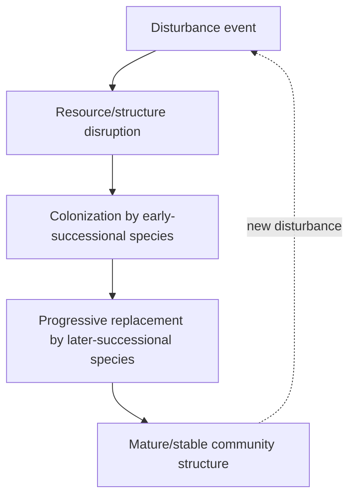

## Ecological Succession and Disturbance

### Overview

Ecological succession describes the predictable, sequential change in species composition and community structure over time following the creation of new habitat or a disturbance event. Disturbance — any discrete event that disrupts community structure and alters resource availability — is the primary trigger initiating successional processes. Together, succession and disturbance ecology explain how communities recover from disruption, why landscapes exist as shifting mosaics of different successional stages, and how disturbance regimes shape long-term biodiversity patterns.

### Primary Succession

**Key Points**

- **Primary succession** occurs on newly exposed substrate that has never previously supported life, or where all pre-existing soil and organic material has been completely removed — for example, bare rock exposed by glacial retreat, cooled volcanic lava flows, or newly formed sand dunes.
- Because no soil exists initially, primary succession begins with **pioneer species** capable of colonizing bare mineral substrate — typically **lichens** (symbiotic fungus-algae associations) and **mosses**, which secrete organic acids that chemically weather rock and begin accumulating organic matter.
- Primary succession is a **slow process**, often requiring centuries to millennia to develop mature soil profiles and vegetation, since soil formation from scratch is the rate-limiting step.
- Typical successional sequence: bare rock → lichens/mosses → herbaceous plants → shrubs → fast-growing pioneer trees → shade-tolerant climax-stage trees.

**Example**

Glacier Bay, Alaska, provides a well-documented case of primary succession: as glaciers have retreated over the past roughly 200 years, exposed till has been colonized sequentially by pioneer species (mosses, fireweed, dryas), followed by nitrogen-fixing alder shrubs that build soil nitrogen content, eventually enabling colonization by spruce and hemlock forest in the oldest deglaciated areas. [Inference: specific successional timelines and species sequences at Glacier Bay are documented in long-term ecological studies, though exact rates vary by specific site conditions such as slope, drainage, and local microclimate.]

### Secondary Succession

**Key Points**

- **Secondary succession** occurs in an area where a disturbance has removed most or all of the existing community, but **soil and some biological legacy remain intact** (seed banks, root systems, soil microbiota).
- Because soil is already present, secondary succession proceeds considerably **faster** than primary succession — often reaching a mature community structure within decades rather than centuries.
- Common triggers: wildfire, hurricane/windthrow, agricultural land abandonment, logging, flooding, and disease outbreak.
- Typical successional sequence (e.g., abandoned agricultural field in temperate regions): bare/disturbed soil → annual weeds/grasses → perennial herbaceous plants → shrubs → fast-growing pioneer trees → shade-tolerant late-successional forest.

**Example**

Old-field succession in the eastern United States: an abandoned farm field is first colonized within 1-2 years by fast-growing annual weeds (e.g., crabgrass, ragweed), followed within several years by perennial grasses and forbs, then by shrubs and pioneer trees such as pines within 10-25 years, eventually transitioning toward a hardwood-dominated forest (e.g., oak-hickory) over many decades. [Inference: specific timelines and dominant species vary regionally and depend on soil type, climate, seed source proximity, and land-use history.]

### Facilitation, Inhibition, and Tolerance Models

**Key Points**

- **Facilitation model**: early-successional (pioneer) species modify the environment in ways that make conditions more favorable for later-successional species (e.g., nitrogen-fixing plants enriching soil for subsequent species), actively promoting succession forward.
- **Inhibition model**: early-successional species may actively resist replacement by pre-empting resources (space, light, nutrients), and later species can only establish once early colonizers die or are disturbed/removed.
- **Tolerance model**: species composition changes based on which species can tolerate lower resource levels as competition intensifies over time; early species neither strongly facilitate nor inhibit later species, but later species simply outcompete them under resource-limited conditions.
- Real successional sequences frequently reflect a **combination** of all three mechanisms operating simultaneously or at different points in the sequence, rather than a single mechanism operating in isolation.

### The Climax Community Concept and Its Revision

**Key Points**

- The classical **Clementsian model** (early 20th century) proposed that succession proceeds deterministically toward a single, stable **climax community** determined primarily by regional climate — analogous to a superorganism reaching a mature, self-perpetuating endpoint.
- This view has been substantially revised in modern ecology. Contemporary theory recognizes that:
  - Multiple stable end-states (**polyclimax** concept) can occur within the same climate zone depending on local soil, disturbance history, and topography.
  - Communities are better understood as **individualistic assemblages** of species responding independently to environmental gradients (the Gleasonian view) rather than as tightly integrated, superorganism-like units.
  - Many ecosystems exist as **shifting, disturbance-dependent mosaics** rather than converging toward one fixed climax state — an idea central to modern **non-equilibrium ecology**.
- [Inference: while the historical shift away from strict Clementsian climax theory toward more dynamic, non-equilibrium models is well documented in the history of ecological thought, the degree to which any given specific ecosystem exhibits "climax" stability versus perpetual disturbance-driven flux remains actively studied on a case-by-case basis.]

### Disturbance Ecology: Types and Regimes

**Key Points**

- A **disturbance** is any relatively discrete event in time that disrupts ecosystem, community, or population structure and alters resources, substrate availability, or the physical environment.
- **Natural disturbances**: wildfire, windthrow/hurricanes, flooding, volcanic eruption, landslide, disease/pest outbreak, drought.
- **Anthropogenic disturbances**: logging, agricultural conversion, urban development, pollution events, introduced invasive species.
- A **disturbance regime** describes the characteristic pattern of disturbance in a given ecosystem, defined by:
  - **Frequency**: how often disturbances occur.
  - **Intensity/severity**: the magnitude of impact (e.g., proportion of biomass removed).
  - **Extent**: the spatial area affected.
  - **Predictability/seasonality**: whether disturbances follow regular patterns.

**Example**

Many North American fire-adapted ecosystems (e.g., longleaf pine savannas, chaparral shrublands) depend on a **characteristic fire return interval** to maintain their structure and species composition; fire suppression policies that disrupt this natural disturbance regime can paradoxically increase long-term wildfire severity by allowing fuel accumulation, and can also permit encroachment by fire-intolerant species that would otherwise be periodically removed. [Inference: the specific magnitude of fuel accumulation and altered fire behavior resulting from suppression varies by region and forest type, and is documented across a substantial body of fire ecology research rather than being a single universal figure.]

### The Intermediate Disturbance Hypothesis

**Key Points**

- The **Intermediate Disturbance Hypothesis (IDH)**, associated with Joseph Connell's work, proposes that species diversity is maximized at **intermediate levels of disturbance frequency/intensity**, rather than at very low or very high disturbance levels.
- Rationale: at very low disturbance, competitively dominant species tend to exclude subordinate species over time (approaching competitive exclusion); at very high disturbance, only fast-colonizing, disturbance-tolerant species can persist; intermediate disturbance prevents any single strategy from dominating, allowing both early- and late-successional species to coexist within the same landscape mosaic.
- [Inference: while IDH remains a widely taught conceptual framework, subsequent empirical and theoretical work has produced substantial debate about its generality — several meta-analyses and reviews have found mixed or inconsistent empirical support for a strict unimodal (hump-shaped) diversity-disturbance relationship across ecosystems, making it a contested rather than universally confirmed principle in contemporary ecology.]

### Resilience, Resistance, and Recovery Trajectories

**Key Points**

- **Resistance**: the capacity of a community/ecosystem to withstand disturbance without substantial structural change.
- **Resilience**: the capacity of a community/ecosystem to return to its pre-disturbance state/trajectory following disturbance.
- **Recovery trajectory**: the specific successional pathway and timeline a community follows after disturbance; trajectories can vary even within similar ecosystems depending on disturbance severity, residual biological legacies, and subsequent environmental conditions.
- **Alternative stable states**: sufficiently severe or repeated disturbance can push a community past a threshold into a fundamentally different, self-reinforcing state that does not readily revert even if conditions return to pre-disturbance levels (hysteresis).

### Comparative Summary: Primary vs. Secondary Succession

| Feature | Primary Succession | Secondary Succession |
| --- | --- | --- |
| Starting substrate | No pre-existing soil | Soil present, biological legacies remain |
| Typical triggers | Glacial retreat, lava flow, new sand dune | Fire, agriculture abandonment, logging, storm |
| Pioneer species | Lichens, mosses | Fast-growing weeds, grasses, resprouting plants |
| Timescale to maturity | Centuries to millennia | Years to decades |
| Rate-limiting step | Soil formation from scratch | Recolonization/regrowth from existing propagules |

### Diagram: Succession Trajectory and Species Diversity

<svg xmlns="http://www.w3.org/2000/svg" viewBox="0 0 700 420">
<text x="350" y="30" text-anchor="middle" font-size="18" font-weight="bold" fill="#1a1a1a">Successional Trajectory Over Time (svg_diagram)</text>
<line x1="60" y1="360" x2="650" y2="360" stroke="#333" stroke-width="2" />
<line x1="60" y1="360" x2="60" y2="60" stroke="#333" stroke-width="2" />
<text x="355" y="395" text-anchor="middle" font-size="13" fill="#333">Time Since Disturbance</text>
<text x="25" y="210" text-anchor="middle" font-size="13" fill="#333" transform="rotate(-90 25 210)">Biomass / Structural Complexity</text>
<path d="M 60,350 C 150,340 200,280 280,220 C 380,150 480,110 650,95" fill="none" stroke="#2a7a54" stroke-width="3" />
<circle cx="90" cy="345" r="5" fill="#c0392b" />
<text x="90" y="330" text-anchor="middle" font-size="10" fill="#c0392b">Disturbance</text>
<circle cx="200" cy="295" r="5" fill="#e67e22" />
<text x="200" y="280" text-anchor="middle" font-size="10" fill="#e67e22">Pioneer stage</text>
<circle cx="380" cy="180" r="5" fill="#f1c40f" />
<text x="380" y="165" text-anchor="middle" font-size="10" fill="#a3890b">Intermediate stage</text>
<circle cx="580" cy="105" r="5" fill="#27ae60" />
<text x="580" y="90" text-anchor="middle" font-size="10" fill="#1a7a40">Mature/late-successional stage</text>
</svg>

### Common Misconceptions

**Key Points**

- Assuming succession always terminates in a single, fixed "climax" community — modern ecology recognizes multiple possible stable states and ongoing disturbance-driven dynamics rather than one deterministic endpoint.
- Confusing primary and secondary succession — the defining distinction is the presence or absence of pre-existing soil and biological legacy, not simply the severity of the initiating event.
- Treating disturbance purely as destructive — many ecosystems and species are adapted to, and functionally dependent on, periodic natural disturbance (e.g., fire-adapted plant communities).
- Assuming the Intermediate Disturbance Hypothesis is a universally confirmed law — it remains a debated framework with mixed empirical support across different ecosystem studies.

### Related Topics

- Community ecology and species interactions
- Ecosystem structure and function
- Fire ecology and disturbance regimes
- Biodiversity-stability relationships
- Alternative stable states and ecological hysteresis
- Habitat restoration and rewilding practices
- Climate change effects on disturbance frequency and severity