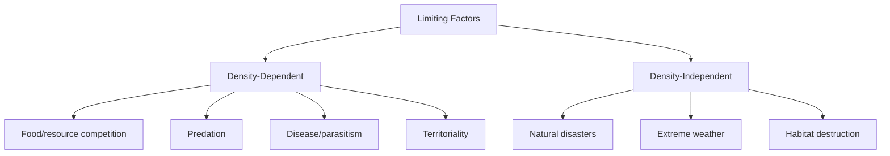
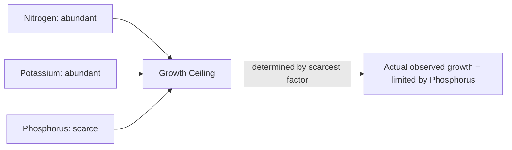

## Carrying Capacity and Limiting Factors

### Overview

Carrying capacity and limiting factors together explain why populations cannot grow indefinitely in any real environment. **Carrying capacity ($K$)** represents the maximum population size an environment can sustainably support given available resources, while **limiting factors** are the specific environmental variables — resources, physical conditions, or biological pressures — that constrain growth by becoming scarce or restrictive relative to demand. These concepts underpin population regulation, resource management, agriculture, conservation planning, and the broader study of how ecosystems set boundaries on biological abundance.

### Carrying Capacity: Core Concept

**Key Points**

- **Carrying capacity ($K$)** is the maximum population size that a given environment can sustain indefinitely without degrading the resource base needed for that population's long-term persistence.
- $K$ is not a fixed, universal constant for a species — it varies by habitat quality, resource availability, climate, and can fluctuate seasonally or over longer timescales as environmental conditions change.
- In the **logistic growth model**, $K$ appears as the asymptote toward which population size stabilizes:

  $$\frac{dN}{dt} = rN\left(1 - \frac{N}{K}\right)$$
- As population size ($N$) approaches $K$, the term $\left(1 - \frac{N}{K}\right)$ approaches zero, progressively slowing net growth rate until it theoretically reaches zero at $N = K$.
- Populations can temporarily **overshoot** $K$ due to time lags in feedback (e.g., reproductive delays), often followed by a population crash ("die-off") as the resource base becomes degraded or depleted below its original sustainable level.

**Example**

If a lake ecosystem has a carrying capacity of $K = 5{,}000$ fish and the current population is $N = 4{,}500$, the logistic braking factor is:

$$\left(1 - \frac{4{,}500}{5{,}000}\right) = 0.10$$

meaning population growth rate is reduced to only 10% of its unconstrained exponential value — reflecting strong density-dependent resource limitation as the population nears capacity.

### Types of Limiting Factors

**Key Points**

Limiting factors are broadly categorized as **density-dependent** or **density-independent**, based on whether their impact scales with population density.

**Density-Dependent Limiting Factors:**

- **Food/resource availability**: as population density increases, per capita food availability decreases, intensifying competition.
- **Predation**: predator encounter rates often increase with prey density, increasing per capita predation risk.
- **Disease and parasitism**: transmission rates typically increase with population density due to higher contact rates between individuals.
- **Competition (intraspecific and interspecific)**: intensifies as more individuals compete for the same finite resources.
- **Waste accumulation**: metabolic waste products can reach toxic concentrations at high population densities (particularly relevant in constrained environments, e.g., laboratory cultures or enclosed aquatic systems).
- **Territoriality**: limits the number of individuals/breeding pairs an area can support, regardless of total resource abundance.

**Density-Independent Limiting Factors:**

- **Natural disasters**: fire, flood, drought, storms, and volcanic eruptions can affect population size regardless of density.
- **Extreme weather/climate events**: unusually severe temperatures or precipitation extremes.
- **Habitat destruction**: anthropogenic land-use change that eliminates suitable habitat irrespective of current population density.
- **Seasonal abiotic extremes**: temperature or moisture conditions outside a species' tolerance range.

### Liebig's Law of the Minimum

**Key Points**

- Formulated originally by agricultural chemist Justus von Liebig, this principle states that growth is not limited by the total quantity of resources available, but specifically by whichever essential resource is in **shortest supply relative to demand** — the single scarcest necessary factor.
- Commonly summarized as: "growth is limited by the scarcest resource," even when all other required resources are abundant.
- Originally applied to plant nutrient limitation (e.g., nitrogen, phosphorus, potassium) but has since been extended more broadly across ecology to describe limiting factors in general.
- A key implication: adding more of an already-abundant resource will not increase growth if a different resource remains the limiting one — only addressing the actual limiting factor produces a growth response.

**Example**

If a crop field has abundant nitrogen and potassium but very limited phosphorus, adding more nitrogen fertilizer will not increase crop yield — Liebig's Law predicts that yield remains constrained by phosphorus until phosphorus availability itself is increased.

### Shelford's Law of Tolerance

**Key Points**

- Extends Liebig's Law by recognizing that organisms have both a **minimum and maximum tolerable level** for any given environmental factor — not just a lower threshold.
- Growth/survival is optimal within a specific **range of tolerance**, declining toward either extreme (too little or too much of a factor), and ceasing entirely beyond the organism's tolerance limits.
- Applies to abiotic factors such as temperature, pH, salinity, and moisture, as well as certain resource concentrations.
- The width of an organism's tolerance range (narrow vs. broad) affects its geographic distribution and ecological niche breadth; **stenotopic** species have narrow tolerance ranges for specific factors, while **eurytopic** species tolerate a broad range.

**Example**

Many freshwater fish species exhibit a tolerance curve for water temperature: growth and reproduction are optimal within a specific mid-range, decline at both unusually cold and unusually warm temperatures, and cease entirely (or cause mortality) beyond upper and lower lethal thresholds — illustrating why climate warming can push some cold-adapted species beyond their upper tolerance limit even without any change in food or predation pressure.

### Carrying Capacity Dynamics and Fluctuation

**Key Points**

- $K$ can shift due to changes in resource base, habitat quality, climate variability, or human land-use change — it is best understood as a **dynamic ceiling**, not a permanent fixed number.
- **Seasonal carrying capacity variation**: many environments support higher population densities during resource-rich seasons (e.g., summer for many temperate herbivores) and lower densities during resource-scarce seasons (e.g., winter).
- **Time-lag effects**: population responses to changes in $K$ are rarely instantaneous, since reproduction, mortality, and migration all take time to adjust population size to a new resource ceiling — this delay is part of why populations can temporarily overshoot or undershoot the current carrying capacity.
- **Human-modified carrying capacity**: technology, agriculture, and resource extraction can artificially raise the local or global carrying capacity for a species (notably humans), though this can come with trade-offs in long-term resource sustainability and ecosystem degradation. [Inference: quantitative estimates of any adjusted or theoretical human carrying capacity vary enormously across published studies and remain a genuinely debated and unsettled figure in the scientific literature, rather than a precisely known value.]

### Applied Contexts: Carrying Capacity in Resource Management

**Key Points**

- **Wildlife management**: carrying capacity estimates inform hunting/harvest quotas intended to maintain populations at sustainable levels without overexploitation.
- **Fisheries management**: the concept underlies **Maximum Sustainable Yield (MSY)**, theoretically achieved when a population is maintained near $N = K/2$, where the logistic growth rate is maximized — allowing the largest sustainable harvest without long-term population decline. [Inference: while $K/2$ is the theoretical MSY point under the simple logistic model, real-world fisheries management incorporates substantial additional complexity — including age structure, environmental variability, and uncertainty in $K$ estimation — meaning applied MSY targets often diverge from this simplified theoretical value.]
- **Rangeland/livestock management**: carrying capacity concepts guide stocking rate recommendations to prevent overgrazing and long-term degradation of pasture land.
- **Conservation biology**: understanding a species' carrying capacity in a given habitat informs minimum viable population calculations and habitat restoration targets.

### Comparative Summary

| Concept | Definition | Key Distinction |
| --- | --- | --- |
| Carrying capacity (K) | Maximum sustainable population size for a given environment | A population-level ceiling |
| Density-dependent factor | Limiting factor whose effect intensifies with population density | Regulates population toward K |
| Density-independent factor | Limiting factor affecting population regardless of density | Can cause crashes unrelated to density |
| Liebig's Law of the Minimum | Growth limited by the scarcest necessary resource | Focuses on resource scarcity only (lower limit) |
| Shelford's Law of Tolerance | Growth limited by both insufficient and excessive levels of a factor | Adds an upper tolerance limit |

### Diagram: Liebig's Barrel Model of Limiting Factors

<svg xmlns="http://www.w3.org/2000/svg" viewBox="0 0 700 420">
<text x="350" y="30" text-anchor="middle" font-size="18" font-weight="bold" fill="#1a1a1a">Liebig's Barrel: The Scarcest Resource Limits Growth (svg_diagram)</text>
<path d="M 150,80 L 150,340 Q 150,360 175,360 L 525,360 Q 550,360 550,340 L 550,80" fill="none" stroke="#5a3d2b" stroke-width="4" />
<line x1="150" y1="80" x2="230" y2="80" stroke="#5a3d2b" stroke-width="6" />
<text x="190" y="70" text-anchor="middle" font-size="10">Nitrogen</text>
<line x1="230" y1="80" x2="310" y2="80" stroke="#5a3d2b" stroke-width="6" />
<text x="270" y="70" text-anchor="middle" font-size="10">Potassium</text>
<line x1="310" y1="220" x2="390" y2="220" stroke="#c0392b" stroke-width="6" />
<text x="350" y="210" text-anchor="middle" font-size="10" fill="#c0392b">Phosphorus (short stave)</text>
<line x1="390" y1="80" x2="470" y2="80" stroke="#5a3d2b" stroke-width="6" />
<text x="430" y="70" text-anchor="middle" font-size="10">Water</text>
<line x1="470" y1="80" x2="550" y2="80" stroke="#5a3d2b" stroke-width="6" />
<text x="510" y="70" text-anchor="middle" font-size="10">Sunlight</text>
<rect x="155" y="220" width="390" height="140" fill="#bcd9f0" opacity="0.6" />
<text x="350" y="300" text-anchor="middle" font-size="12" fill="#123a5c" font-weight="bold">Water level (= achievable growth) capped by shortest stave</text>

<text x="350" y="395" text-anchor="middle" font-size="11" fill="#666" font-style="italic">Growth cannot exceed the level set by the scarcest resource, regardless of surplus in others</text>

</svg>

### Common Misconceptions

**Key Points**

- Believing carrying capacity is a fixed, permanent number for a species — it fluctuates with environmental conditions, resource availability, and habitat quality over time.
- Assuming adding more of any resource always improves growth — Liebig's Law demonstrates that only increasing the specific limiting (scarcest) resource produces a growth response.
- Overlooking Shelford's upper tolerance limit — assuming "more is always better" for a given factor ignores that excess levels of many factors (heat, moisture, certain nutrients) can also become limiting or harmful.
- Treating density-dependent and density-independent factors as mutually exclusive — real populations are typically regulated by a combination of both factor types simultaneously.

### Related Topics

- Population ecology and growth models
- Levels of ecological organization
- Community ecology and species interactions
- Fisheries and wildlife management (maximum sustainable yield)
- Niche theory and habitat tolerance ranges
- Human population growth and ecological footprint
- Ecosystem structure and function