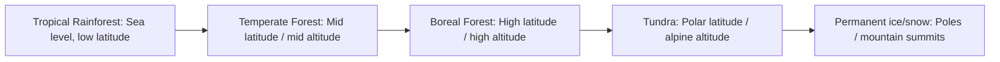

## Major Terrestrial Biomes

### Overview

Terrestrial biomes are large-scale ecological regions defined by characteristic climate conditions (primarily temperature and precipitation patterns), dominant vegetation structure, and associated animal communities. Biome classification abstracts away species-level detail to capture functional and structural convergence — geographically separated regions with similar climate regimes tend to develop structurally similar vegetation (e.g., grasslands on different continents), even when the specific species involved are unrelated (convergent evolution at the ecosystem level).

### Determinants of Biome Distribution

**Key Points**

- **Temperature** and **precipitation** (amount and seasonality) are the two dominant climatic variables determining biome type; these are typically visualized using a Whittaker biome diagram.
- **Latitude** drives large-scale temperature gradients via solar insolation angle (see Energy Flow Through Earth Systems).
- **Altitude** produces analogous zonation to latitude over much shorter distances (montane life zones).
- **Continentality** (distance from moderating ocean influence) affects seasonal temperature range and precipitation patterns.
- **Soil type and disturbance regime** (fire frequency, herbivory) further refine biome boundaries and can maintain alternative stable states (e.g., fire-maintained savanna vs. forest at similar climate values).

$$\text{Biome type} = f(\bar{T}, P, \sigma_T, \sigma_P, \text{disturbance})$$

Where $\bar{T}$ is mean annual temperature, $P$ is mean annual precipitation, and $\sigma_T$, $\sigma_P$ represent seasonal variability in each.

<svg xmlns="http://www.w3.org/2000/svg" viewBox="0 0 750 480" font-family="Helvetica, Arial, sans-serif">
<text x="375" y="28" text-anchor="middle" font-size="18" font-weight="bold" fill="#1a1a1a">Whittaker Biome Diagram (svg_diagram)</text>

<line x1="80" y1="420" x2="700" y2="420" stroke="#333" stroke-width="2" />
<line x1="80" y1="420" x2="80" y2="60" stroke="#333" stroke-width="2" />
<text x="390" y="455" text-anchor="middle" font-size="13" fill="#1a1a1a">Mean Annual Precipitation (mm) →</text>
<text x="30" y="240" text-anchor="middle" font-size="13" fill="#1a1a1a" transform="rotate(-90 30 240)">Mean Annual Temperature (°C) →</text>

<polygon points="80,420 200,420 160,340 80,340" fill="#d9c98a" opacity="0.8" />
<text x="110" y="390" font-size="10" fill="#5a4a1a">Tundra</text>
<polygon points="80,340 160,340 220,220 80,220" fill="#4a6b3a" opacity="0.8" />
<text x="95" y="290" font-size="10" fill="#fff">Boreal Forest</text>
<polygon points="200,420 350,420 320,340 160,340" fill="#c9d97a" opacity="0.8" />
<text x="220" y="400" font-size="10" fill="#4a4a1a">Temperate Grassland</text>
<polygon points="220,220 320,340 450,300 380,150 220,150" fill="#3a8a4a" opacity="0.8" />
<text x="260" y="240" font-size="10" fill="#fff">Temperate Forest</text>
<polygon points="350,420 500,420 480,340 320,340" fill="#e0c060" opacity="0.8" />
<text x="370" y="400" font-size="10" fill="#4a3a1a">Savanna</text>
<polygon points="500,420 620,420 600,380 480,380" fill="#e8a04a" opacity="0.8" />
<text x="510" y="405" font-size="10" fill="#4a2a1a">Desert</text>
<polygon points="450,300 600,340 650,150 380,150" fill="#2a6b2a" opacity="0.8" />
<text x="480" y="230" font-size="10" fill="#fff">Tropical Seasonal Forest</text>
<polygon points="600,340 700,420 700,60 600,60 650,150" fill="#1a5a1a" opacity="0.9" />
<text x="610" y="380" font-size="10" fill="#fff">Tropical Rainforest</text>

<text x="375" y="470" text-anchor="middle" font-size="10" fill="#555">Schematic representation; boundaries in real Whittaker diagrams are drawn from empirical climate-biome data</text>

</svg>

### Major Biome Types

**Tropical Rainforest**

- **Climate**: High, consistent temperature (~20–34°C year-round); high precipitation (>2000 mm/yr), evenly distributed.
- **Vegetation**: Highest biodiversity and net primary productivity (NPP) of any terrestrial biome; multi-layered canopy structure (emergent, canopy, understory, forest floor); nutrient-poor soils with rapid nutrient cycling (nutrients stored in biomass, not soil).
- **Examples**: Amazon Basin, Congo Basin, Southeast Asian rainforests.
- **Threats**: Deforestation for agriculture/logging is the primary anthropogenic pressure; loss disproportionately affects global biodiversity given the biome's species richness.

**Tropical Seasonal Forest / Savanna**

- **Climate**: Warm year-round; pronounced wet/dry seasonality.
- **Vegetation**: Savanna features grassland with scattered trees, maintained partly by fire and large herbivore grazing; seasonal forests are deciduous/semi-deciduous, shedding leaves in the dry season.
- **Examples**: African savanna (Serengeti), Cerrado (Brazil), monsoon forests of South Asia.

**Desert**

- **Climate**: Low precipitation (<250 mm/yr typically), can be hot (subtropical deserts) or cold (temperate/polar deserts); high diurnal temperature variation due to low humidity/cloud cover limiting heat retention.
- **Vegetation**: Sparse, adapted to water scarcity (CAM photosynthesis, succulence, deep or extensive root systems, drought-deciduous behavior); low NPP but often high species-level physiological specialization.
- **Examples**: Sahara, Sonoran, Gobi, Atacama.

**Temperate Grassland (Steppe/Prairie)**

- **Climate**: Moderate precipitation (250–800 mm/yr) insufficient to support forest; cold winters, warm summers.
- **Vegetation**: Dominated by grasses and forbs; fire and grazing (historically by large herbivores like bison) maintain grassland state against woody encroachment.
- **Examples**: North American prairie, Eurasian steppe, South American pampas.
- **Note**: Among the most heavily converted biomes globally for agriculture due to fertile soils (e.g., Mollisols).

**Temperate Forest**

- **Climate**: Moderate temperature with distinct seasons; moderate-to-high precipitation (750–1500 mm/yr) distributed across the year.
- **Vegetation**: Deciduous broadleaf forest (temperate deciduous) in regions with cold winters, or temperate rainforest/mixed forest in wetter, milder regions; moderate biodiversity relative to tropical forest.
- **Examples**: Eastern North American deciduous forest, European temperate forest, Pacific Northwest temperate rainforest.

**Boreal Forest (Taiga)**

- **Climate**: Long, severe winters; short, mild summers; moderate precipitation, much of it as snow.
- **Vegetation**: Dominated by coniferous evergreen trees (spruce, fir, pine) adapted to cold and low-nutrient, acidic soils; low species diversity relative to temperate/tropical forests but represents one of the largest terrestrial biomes by area.
- **Examples**: Canadian and Siberian taiga — together comprising the largest contiguous forest biome on Earth.

**Tundra**

- **Climate**: Extremely cold; very low precipitation (often <250 mm/yr, effectively a "cold desert"); short growing season.
- **Vegetation**: Low-growing plants (mosses, lichens, sedges, dwarf shrubs); underlain by **permafrost** (permanently frozen subsoil), which restricts root depth and drainage.
- **Examples**: Arctic tundra (northern North America, Eurasia), alpine tundra (high-elevation zones at any latitude).
- **Note**: Permafrost thaw due to climate warming is a significant concern due to potential release of stored soil carbon (see Energy Flow Through Earth Systems — permafrost carbon feedback).

### Biome Comparison Table

| Biome | Mean Annual Temp | Mean Annual Precip | Dominant Vegetation | Relative NPP |
| --- | --- | --- | --- | --- |
| Tropical Rainforest | ~25–30°C | >2000 mm | Broadleaf evergreen, multi-canopy | Highest |
| Tropical Savanna | ~20–30°C | 500–1500 mm (seasonal) | Grasses, scattered trees | High-Moderate |
| Desert | Variable (hot or cold) | <250 mm | Sparse xerophytic vegetation | Lowest |
| Temperate Grassland | ~0–20°C | 250–800 mm | Grasses, forbs | Moderate |
| Temperate Forest | ~5–20°C | 750–1500 mm | Deciduous/mixed broadleaf | High |
| Boreal Forest | Below 0 to ~15°C | 300–850 mm | Coniferous evergreen | Moderate |
| Tundra | Below 0°C average | <250 mm | Mosses, lichens, dwarf shrubs | Lowest (with desert) |

### Latitudinal and Altitudinal Zonation

Because temperature declines both with increasing latitude and increasing altitude, biome sequences often mirror each other along both gradients — ascending a tropical mountain can pass through vegetation zones analogous to traveling from equator to pole at sea level (life zone concept, formalized in the Holdridge life zone system).

### Biome vs. Ecosystem vs. Biosphere

**Key Points**

- **Ecosystem**: A localized community of organisms interacting with their physical environment (e.g., a specific forest stand, a single lake).
- **Biome**: A large-scale classification grouping many structurally/climatically similar ecosystems, often spanning multiple continents (e.g., "temperate grassland" as a category, not a single place).
- **Biosphere**: The global sum of all ecosystems and biomes — the entirety of Earth's regions supporting life.
- Biomes are primarily a terrestrial classification framework; aquatic systems (freshwater, marine) are typically classified separately using different criteria (depth, salinity, flow), though some frameworks extend "biome" terminology to major aquatic zones as well.

### Anthropogenic Biome Modification

- **Land conversion**: Grasslands and temperate forests have experienced the highest historical conversion rates for agriculture due to fertile soils and favorable climate.
- **Climate-driven biome shifts**: Rising temperatures are causing documented poleward and upslope shifts in biome boundaries (e.g., treeline advancement into tundra, savanna expansion into some forest margins), though rates and mechanisms vary regionally. [Inference — biome boundary shift rates are actively monitored and vary substantially by region, making precise global generalizations difficult]
- **Fragmentation**: Even biomes with low overall conversion (e.g., boreal forest) face increasing fragmentation from resource extraction (logging, mining, oil/gas), altering disturbance regimes and connectivity.
- **Novel/anthropogenic biomes ("anthromes")**: Some researchers classify human-dominated landscapes (urban, agricultural) as a distinct category alongside traditional "natural" biomes, reflecting the scale of land-use transformation.

### Common Misconceptions

- Biome boundaries are not sharp lines but gradual transition zones called **ecotones**, where characteristics of adjacent biomes blend.
- "Biome" and "habitat" are not synonymous — habitat refers to the specific environment of a particular species or population, while biome is a broad climate-vegetation classification independent of any single species.
- Savanna is not simply "degraded forest" — in many regions it represents a distinct, fire- and herbivory-maintained alternative stable state rather than a successional stage toward forest.

**Related Topics**

- Energy Flow Through Earth Systems
- Biogeochemical Cycling and Nutrient Limitation
- Climate Classification Systems (Köppen, Holdridge)
- Succession and Disturbance Ecology
- Aquatic Biomes and Freshwater/Marine Zonation
- Biodiversity Patterns and Latitudinal Gradients
- Permafrost and Climate Feedback
- Land-Use Change and Habitat Fragmentation