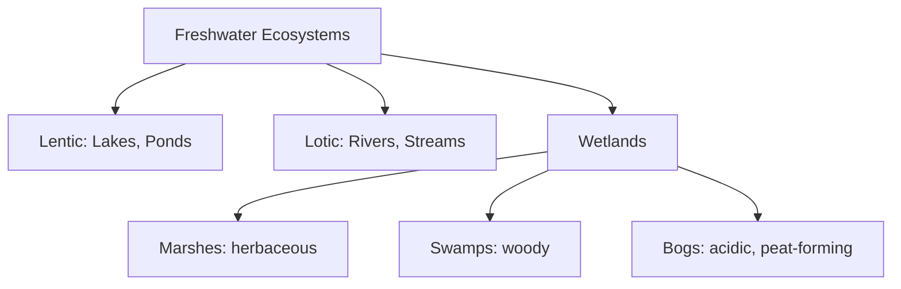
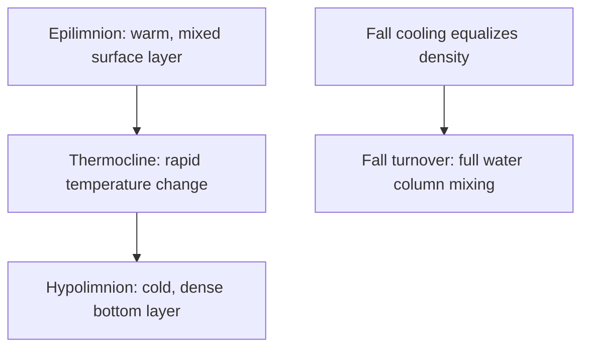
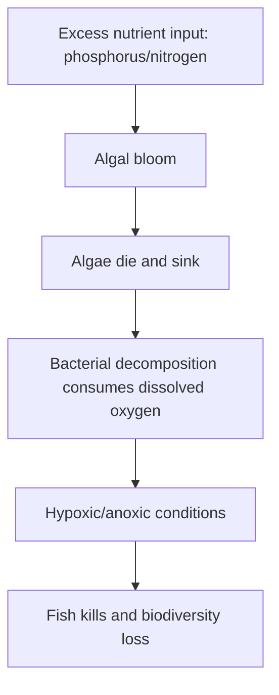

## Freshwater and Aquatic Ecosystems

### Overview

Freshwater and aquatic ecosystems encompass all water-based habitats containing low-salinity water — lakes, ponds, rivers, streams, and wetlands — as distinct from marine (saltwater) systems. Despite covering a relatively small fraction of Earth's surface area, freshwater ecosystems support disproportionately high biodiversity, provide essential ecosystem services (drinking water, flood regulation, nutrient cycling), and exhibit distinctive physical and ecological structuring driven by water movement, light penetration, temperature stratification, and nutrient availability.

### Classification of Freshwater Ecosystems

**Key Points**

- **Lentic (standing water) systems**: lakes, ponds, and reservoirs, characterized by relatively still water and often pronounced vertical stratification.
- **Lotic (flowing water) systems**: rivers and streams, characterized by continuous unidirectional water flow, which strongly structures physical habitat and species adaptations.
- **Wetlands**: transitional ecosystems between terrestrial and aquatic systems, including marshes (herbaceous vegetation), swamps (woody vegetation), and bogs (acidic, often peat-accumulating, nutrient-poor systems).
- Freshwater ecosystems are further distinguished from marine systems primarily by **salinity** (typically less than 0.5 parts per thousand dissolved salts, versus ~35 ppt in open ocean seawater).

### Lake Zonation

**Key Points**

Lakes are structured into distinct horizontal and vertical zones based on light penetration and depth.

**Horizontal (light-based) zones:**

- **Littoral zone**: shallow, near-shore area where light reaches the bottom, supporting rooted aquatic plants and high biodiversity.
- **Limnetic zone**: open-water surface layer, extending as far as sunlight penetrates effectively; dominated by phytoplankton and free-swimming organisms.
- **Profundal zone**: deep-water zone below the effective light penetration depth, where photosynthesis cannot occur; supported by organic matter sinking from above.

**Vertical (depth-based) zones (particularly relevant to deeper lakes):**

- **Epilimnion**: warm, well-mixed surface layer.
- **Thermocline (metalimnion)**: transitional layer of rapid temperature change with depth.
- **Hypolimnion**: cold, dense bottom layer, often lower in dissolved oxygen, especially in productive lakes.

**Example**

Many temperate lakes undergo **seasonal thermal stratification and turnover**: in summer, warm surface water (epilimnion) floats above cooler, denser deep water (hypolimnion), separated by a thermocline; as surface water cools in autumn to match deep-water temperature, density differences disappear, and wind-driven mixing causes a **fall turnover**, redistributing oxygen and nutrients throughout the water column. A parallel **spring turnover** can occur in temperate lakes that also stratify under winter ice cover, though the specific stratification and turnover pattern depends on lake depth, latitude, and local climate. [Inference: not all lakes undergo the classic dimictic (two-turnover) pattern — stratification behavior varies by lake depth, latitude, and climate, and is a well-documented area of limnological classification.]

### Lotic (River and Stream) Ecosystems

**Key Points**

- Defined by continuous, often variable, **unidirectional flow**, which shapes both physical habitat structure (riffles, pools, substrate composition) and the adaptations of resident organisms.
- **River Continuum Concept**: describes how ecological characteristics change predictably from headwaters to river mouth — headwater streams are often narrow, shaded, and dependent on terrestrial leaf-litter input (allochthonous energy), while larger downstream reaches receive more sunlight and support greater in-stream primary production (autochthonous energy) before becoming more turbid and detritus-dominated again near the river mouth. [Inference: while the River Continuum Concept remains a widely taught foundational framework in stream ecology, subsequent research has noted it does not perfectly describe all river systems, particularly those with significant dam regulation, tributary inputs, or unusual watershed geomorphology.]
- Organisms in lotic systems often show adaptations to resist or exploit current: streamlined bodies, suckers/hooks for substrate attachment, and behavioral rheotaxis (orientation relative to current direction).
- **Riparian zones** (vegetated stream/river banks) play a critical structural role: stabilizing banks, moderating water temperature through shading, filtering runoff pollutants, and supplying organic matter input to the aquatic food web.

### Wetlands

**Key Points**

- Wetlands are characterized by **saturated or periodically inundated soils** supporting hydrophytic (water-adapted) vegetation, and are among the most productive ecosystems per unit area on Earth.
- Provide critical ecosystem services: **flood water storage and attenuation**, **water quality improvement** (nutrient and sediment filtration), **groundwater recharge**, and **carbon sequestration** (particularly in peat-accumulating bogs).
- **Marshes**: dominated by herbaceous emergent vegetation (cattails, reeds, sedges); often nutrient-rich and highly productive.
- **Swamps**: dominated by woody vegetation (trees and shrubs); found in both freshwater and, in some cases, tidally influenced settings.
- **Bogs**: characterized by acidic, nutrient-poor, often stagnant water conditions with slow decomposition rates, leading to significant peat (partially decomposed organic matter) accumulation over time; frequently dominated by sphagnum moss and specialized nutrient-poor-tolerant plant adaptations (e.g., carnivorous plants in some bog systems).

**Example**

Coastal wetlands and floodplain marshes provide substantial flood mitigation value by temporarily storing excess floodwater and slowing its release downstream; this ecosystem service has become a major consideration in modern flood management and climate adaptation planning, as wetland loss is associated with increased downstream flood severity in many studied watersheds. [Inference: the quantitative magnitude of flood mitigation value varies significantly by specific wetland type, size, and watershed context, and precise figures depend on the study and methodology used.]

### Trophic Structure in Aquatic Systems

**Key Points**

- **Phytoplankton** (free-floating photosynthetic algae and cyanobacteria) form the primary producer base of most open-water aquatic food webs, analogous to terrestrial plants but with much faster reproductive turnover rates.
- **Zooplankton** (small floating/weakly swimming animals, e.g., copepods, water fleas) serve as primary consumers, grazing on phytoplankton.
- **Benthic organisms**: species living on or in the sediment/substrate, including many invertebrates (aquatic insect larvae, mollusks, crustaceans) that play key roles in decomposition and nutrient cycling.
- Aquatic food webs frequently exhibit **inverted biomass pyramids** at the base, since phytoplankton standing biomass at any instant can be low relative to consumer biomass, despite very high phytoplankton productivity rates (a consequence of the mismatch between standing stock and turnover rate).

### Nutrient Dynamics and Eutrophication

**Key Points**

- **Phosphorus** is typically the primary limiting nutrient in most freshwater systems (in contrast to nitrogen limitation, which is more common in many marine systems), making phosphorus loading a central concern in freshwater water-quality management.
- **Eutrophication**: the process by which excess nutrient input (particularly phosphorus and nitrogen from agricultural runoff, wastewater, and fertilizer use) drives excessive algal and phytoplankton growth.
- Eutrophication can lead to **algal blooms**, followed by algal die-off and subsequent bacterial decomposition that consumes dissolved oxygen, potentially causing **hypoxia** (low oxygen) or **anoxia** (no oxygen) conditions harmful or lethal to fish and other aquatic organisms.
- **Cultural eutrophication** refers specifically to human-accelerated nutrient enrichment, distinguished from natural, typically much slower, background eutrophication processes that occur over geologic timescales as lakes gradually fill with sediment and organic matter.

### Aquatic Ecosystem Threats and Management

**Key Points**

- **Eutrophication** from agricultural and urban runoff remains one of the most widespread global threats to freshwater ecosystem health.
- **Habitat fragmentation**: dam construction disrupts river continuity, alters natural flow regimes, blocks fish migration routes, and changes sediment transport dynamics downstream.
- **Invasive species**: introduced aquatic species (e.g., zebra mussels, various invasive fish species) can dramatically alter native freshwater community structure and function.
- **Water withdrawal and diversion**: agricultural, industrial, and municipal water use can reduce flow volumes below levels needed to sustain healthy aquatic ecosystems, particularly in already water-stressed regions.
- **Climate change impacts**: altered precipitation patterns, changing thermal regimes, and shifts in ice-cover duration are documented to affect freshwater ecosystem structure and species distributions, with specific impacts varying considerably by region and system type. [Inference: while broad categories of climate impact on freshwater systems are well-established in the scientific literature, the specific magnitude and timeline of impacts for any given water body depend on local hydrology and are subject to ongoing research.]

### Comparative Summary: Lentic vs. Lotic Systems

| Feature | Lentic (Standing Water) | Lotic (Flowing Water) |
| --- | --- | --- |
| Water movement | Minimal/still | Continuous, directional |
| Example habitats | Lakes, ponds, reservoirs | Rivers, streams |
| Vertical structure | Pronounced stratification (in deep lakes) | Generally well-mixed |
| Dominant primary producers | Phytoplankton (open water), rooted plants (littoral) | Periphyton (attached algae), riparian vegetation input |
| Organism adaptations | Buoyancy control, vertical migration | Current resistance, substrate attachment |

### Diagram: Lake Zonation Cross-Section

<svg xmlns="http://www.w3.org/2000/svg" viewBox="0 0 700 460">
<text x="350" y="30" text-anchor="middle" font-size="18" font-weight="bold" fill="#1a1a1a">Lake Zonation (svg_diagram)</text>
<rect x="60" y="70" width="580" height="340" fill="#bcd9f0" stroke="#2b6ca3" stroke-width="2" />
<rect x="60" y="70" width="120" height="340" fill="#a3ceb0" opacity="0.5" />
<text x="120" y="60" text-anchor="middle" font-size="11" font-weight="bold">Littoral Zone</text>
<rect x="520" y="70" width="120" height="340" fill="#a3ceb0" opacity="0.5" />
<text x="580" y="60" text-anchor="middle" font-size="11" font-weight="bold">Littoral Zone</text>
<rect x="180" y="70" width="340" height="140" fill="#8ec4e8" opacity="0.6" />
<text x="350" y="145" text-anchor="middle" font-size="12" font-weight="bold">Limnetic Zone (light penetrates)</text>
<rect x="180" y="210" width="340" height="200" fill="#5a8cb5" opacity="0.7" />
<text x="350" y="315" text-anchor="middle" font-size="12" font-weight="bold" fill="white">Profundal Zone (no light)</text>
<line x1="180" y1="210" x2="520" y2="210" stroke="#333" stroke-width="1.5" stroke-dasharray="6,4" />
<text x="350" y="205" text-anchor="middle" font-size="10" fill="#333">Effective light penetration limit</text>

<text x="350" y="430" text-anchor="middle" font-size="11" fill="#666" font-style="italic">Littoral zones support rooted plants; profundal depths depend on sinking organic matter</text>

</svg>

### Common Misconceptions

**Key Points**

- Assuming all lakes stratify and turn over in the same seasonal pattern — stratification behavior varies substantially with lake depth, latitude, and climate.
- Believing eutrophication is always a purely human-caused problem — natural eutrophication also occurs over long geologic timescales, though human activity has dramatically accelerated the process in most affected systems (cultural eutrophication).
- Treating nitrogen as the universal limiting nutrient in aquatic systems — phosphorus is typically the primary limiting nutrient in freshwater systems specifically, while nitrogen limitation is more characteristic of many marine systems.
- Assuming river ecology is uniform along the entire length of a river — the River Continuum Concept highlights substantial, predictable ecological change from headwaters to mouth, further modified by human alterations such as dams.

### Related Topics

- Ecosystem structure and function
- Interactions among atmosphere, hydrosphere, lithosphere, and biosphere
- Biogeochemical cycling (phosphorus and nitrogen cycles)
- Eutrophication and water quality management
- Wetland restoration and conservation
- Marine and coastal ecosystems
- Invasive species and biodiversity impacts
- Climate change effects on hydrological systems