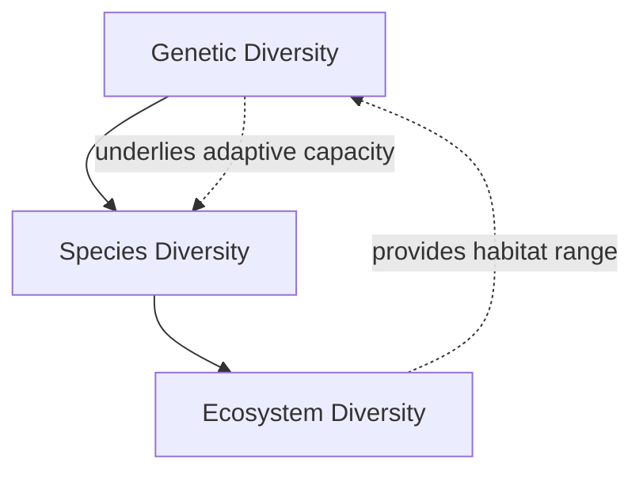
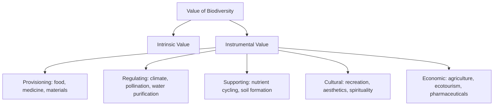

## Levels and Value of Biodiversity

### Overview

Biodiversity refers to the total variety of life on Earth, spanning multiple hierarchical levels of biological organization. Understanding biodiversity requires distinguishing between its different levels — genetic, species, and ecosystem — and appreciating why this variety matters, both for the intrinsic worth of life itself and for the practical benefits it provides to human societies. Biodiversity assessment and valuation form the conceptual foundation for conservation prioritization, environmental policy, and sustainable resource management.

### Levels of Biodiversity

**Key Points**

Biodiversity is commonly analyzed across three interconnected hierarchical levels.

- **Genetic diversity**: the variation in genes within a species or population, including allelic variation, which underlies a population's capacity to adapt to changing environmental conditions through natural selection.
- **Species diversity**: the variety of species within a given region or ecosystem, encompassing both **species richness** (total number of species) and **species evenness** (relative abundance distribution among species).
- **Ecosystem diversity**: the variety of distinct ecosystems, habitats, and biological communities within a given geographic area or across the planet as a whole.
- These levels are interdependent: genetic diversity underpins species' adaptive capacity and long-term persistence; species diversity contributes to ecosystem functioning and resilience; ecosystem diversity provides the range of habitats necessary to sustain overall species and genetic diversity.

### Genetic Diversity

**Key Points**

- Genetic diversity arises from mutation, recombination, and gene flow, and is maintained or reduced by selection, genetic drift, and population size dynamics.
- **Small, isolated populations** are particularly vulnerable to reduced genetic diversity through **genetic drift** and **inbreeding depression**, which can reduce fitness and adaptive potential.
- Genetic diversity is essential for **long-term species resilience**: populations with greater genetic variation are generally better equipped to adapt to environmental change, emerging diseases, or new selective pressures.
- Measured through metrics such as **heterozygosity**, **allelic richness**, and, increasingly, genome-wide sequencing approaches.

**Example**

The genetic bottleneck experienced by cheetah populations — attributed to a historical population crash — has resulted in unusually low genetic diversity across the species, documented through extremely high genetic similarity even between unrelated individuals; this reduced diversity is associated with concerns about disease susceptibility and reduced adaptive capacity. [Inference: while the cheetah genetic bottleneck is well-documented in the conservation genetics literature, some specific historical population size estimates and exact bottleneck timing remain subjects of ongoing scientific investigation.]

### Species Diversity

**Key Points**

- **Species richness**: a simple count of the number of distinct species present in a defined area or community.
- **Species evenness**: describes how evenly individuals are distributed among the species present; a community with many species but dominated overwhelmingly by one or two of them has low evenness despite potentially high richness.
- Combined richness-and-evenness metrics include the **Shannon diversity index** and **Simpson's diversity index**, which provide more complete pictures of community diversity than richness alone.
- **Alpha, beta, and gamma diversity**: a spatial framework distinguishing diversity within a single site (**alpha**), the turnover/difference in species composition between sites (**beta**), and total diversity across an entire landscape or region (**gamma**).

**Example**

Shannon diversity index:

$$H' = -\sum_{i=1}^{S} p_i \ln(p_i)$$

Two communities could have identical species richness ($S = 10$) but very different Shannon index values: one where all 10 species are equally abundant (high evenness, higher $H'$) versus one dominated by a single species comprising 90% of individuals with the remaining 9 species sharing the last 10% (low evenness, lower $H'$) — illustrating why richness alone is an incomplete diversity measure.

### Ecosystem Diversity

**Key Points**

- Refers to the range of distinct habitat types, community types, and ecological processes present within a landscape, region, or across the entire biosphere.
- High ecosystem diversity generally supports higher overall species and genetic diversity, since different ecosystem types provide distinct niches and selective environments.
- **Biodiversity hotspots**: regions identified as containing exceptionally high species richness and endemism (species found nowhere else), combined with significant habitat loss, making them global conservation priorities. [Inference: the specific list and boundaries of officially recognized biodiversity hotspots reflect a defined methodology developed by conservation organizations and may be periodically revised as new data becomes available.]
- Landscape-level ecosystem diversity is also influenced by **habitat heterogeneity** (variation in topography, soil type, microclimate) across a given area.

### Measuring Biodiversity

**Key Points**

- **Species richness surveys**: field-based counting/sampling methods (transects, quadrats, camera traps, environmental DNA sampling) to estimate the number of species present in an area.
- **Diversity indices** (Shannon, Simpson) provide standardized quantitative comparisons of community diversity across sites or over time.
- **Rarefaction curves**: statistical tools used to compare species richness estimates across samples of different sizes, correcting for the fact that larger samples tend to detect more species simply due to greater sampling effort.
- **Remote sensing and satellite data**: increasingly used to estimate ecosystem diversity and habitat extent at landscape to global scales.

### Intrinsic Value of Biodiversity

**Key Points**

- The **intrinsic value** perspective holds that species and ecosystems have inherent worth independent of any utility or benefit they provide to humans — a philosophical and ethical position rather than a strictly empirical claim.
- This view underlies much conservation ethics and legal frameworks (e.g., endangered species protections) that aim to prevent extinction regardless of a species' known economic or ecological utility to humans.
- Intrinsic value arguments are often grounded in ethical frameworks emphasizing the moral considerability of non-human life, and are distinct from, though often complementary to, instrumental value arguments.

### Instrumental (Utilitarian) Value of Biodiversity

**Key Points**

Biodiversity provides substantial direct and indirect benefits to human societies, commonly categorized using an ecosystem services framework.

- **Provisioning value**: biodiversity is the source of food crops, livestock, timber, fiber, and medicinal compounds — a substantial proportion of modern pharmaceuticals were originally derived from or inspired by natural compounds found in diverse organisms. [Inference: specific percentage estimates of pharmaceuticals derived from natural sources vary across studies and time periods and are not a single fixed figure.]
- **Regulating value**: biodiversity contributes to climate regulation, water purification, pollination services (critical for a substantial share of global food crop production), pest control, and disease regulation.
- **Supporting value**: biodiversity underlies fundamental ecosystem processes including nutrient cycling, soil formation, and primary production, all of which sustain the broader ecosystem services described above.
- **Cultural value**: biodiversity provides recreational, aesthetic, spiritual, and educational value, and is deeply embedded in many cultural traditions and identities worldwide.
- **Economic value**: biodiversity underpins substantial economic sectors including agriculture, fisheries, forestry, ecotourism, and pharmaceutical development; some economic valuation studies have attempted to quantify the total economic value of global ecosystem services, though such valuations involve significant methodological challenges and contested assumptions. [Inference: aggregate global economic valuations of biodiversity/ecosystem services vary widely across different studies depending on methodology, and are understood in the environmental economics literature as useful but imprecise estimates rather than precisely verified figures.]

### The Insurance Hypothesis and Ecosystem Stability

**Key Points**

- The **insurance hypothesis** proposes that higher biodiversity provides greater ecosystem functional redundancy, buffering ecosystems against disturbance or environmental change because multiple species can perform similar functional roles.
- If one species declines or is lost, functionally similar species may partially compensate, helping maintain overall ecosystem function (though not necessarily preventing all consequences of the loss).
- Empirical support for the diversity-stability relationship is substantial in many studied systems, though the strength and universality of the relationship across all ecosystem types and disturbance regimes remains an area of ongoing ecological research. [Inference: while diversity-stability relationships are broadly supported across a substantial body of ecological literature, the precise mechanisms and their generality across different ecosystem types continue to be actively debated and refined.]

### Endemism and Rarity

**Key Points**

- **Endemic species**: species found naturally in only one geographic region and nowhere else on Earth, often the result of geographic isolation (islands, isolated mountain ranges, unique habitat types).
- High endemism combined with significant habitat threat is a primary criterion used in identifying global biodiversity hotspots for conservation prioritization.
- Endemic species are often particularly vulnerable to extinction, since their entire population exists within a limited geographic range, offering no opportunity for range-wide population buffering against localized threats.

### Comparative Summary: Levels and Value of Biodiversity

| Level/Value Type | Description | Example Metric/Concept |
| --- | --- | --- |
| Genetic diversity | Variation within species/populations | Heterozygosity, allelic richness |
| Species diversity | Variety of species in an area | Shannon index, species richness |
| Ecosystem diversity | Variety of habitat/community types | Biodiversity hotspots, habitat heterogeneity |
| Intrinsic value | Inherent worth independent of human use | Conservation ethics, endangered species law |
| Instrumental value | Practical benefits to human societies | Ecosystem services framework |

### Diagram: Three Levels of Biodiversity

<svg xmlns="http://www.w3.org/2000/svg" viewBox="0 0 700 420">
<text x="350" y="30" text-anchor="middle" font-size="18" font-weight="bold" fill="#1a1a1a">Three Levels of Biodiversity (svg_diagram)</text>
<rect x="60" y="90" width="180" height="220" fill="#bcd9f0" stroke="#2b6ca3" stroke-width="2" />
<text x="150" y="120" text-anchor="middle" font-size="13" font-weight="bold" fill="#123a5c">Genetic Diversity</text>
<circle cx="110" cy="180" r="8" fill="#2b6ca3" />
<circle cx="150" cy="200" r="8" fill="#4a8ec9" />
<circle cx="190" cy="170" r="8" fill="#7ab0e0" />
<circle cx="130" cy="240" r="8" fill="#2b6ca3" />
<circle cx="180" cy="260" r="8" fill="#4a8ec9" />
<text x="150" y="295" text-anchor="middle" font-size="10">Variation within a species</text>
<rect x="260" y="90" width="180" height="220" fill="#cfe0a6" stroke="#5f7a2b" stroke-width="2" />
<text x="350" y="120" text-anchor="middle" font-size="13" font-weight="bold" fill="#33420f">Species Diversity</text>
<text x="300" y="180" font-size="20">🐦</text>
<text x="340" y="180" font-size="20">🐸</text>
<text x="380" y="180" font-size="20">🦋</text>
<text x="300" y="220" font-size="20">🐛</text>
<text x="340" y="220" font-size="20">🐌</text>
<text x="380" y="220" font-size="20">🐝</text>
<text x="350" y="295" text-anchor="middle" font-size="10">Variety of species in an area</text>
<rect x="460" y="90" width="180" height="220" fill="#e0c9a6" stroke="#8a5a2b" stroke-width="2" />
<text x="550" y="120" text-anchor="middle" font-size="13" font-weight="bold" fill="#4a3115">Ecosystem Diversity</text>
<rect x="480" y="150" width="60" height="50" fill="#8fbf8a" />
<text x="510" y="180" text-anchor="middle" font-size="8">Forest</text>
<rect x="550" y="150" width="60" height="50" fill="#5a8cb5" />
<text x="580" y="180" text-anchor="middle" font-size="8">Wetland</text>
<rect x="480" y="215" width="60" height="50" fill="#d3c877" />
<text x="510" y="245" text-anchor="middle" font-size="8">Grassland</text>
<rect x="550" y="215" width="60" height="50" fill="#c9a86a" />
<text x="580" y="245" text-anchor="middle" font-size="8">Desert</text>
<text x="550" y="295" text-anchor="middle" font-size="10">Variety of habitats/ecosystems</text>
</svg>

### Common Misconceptions

**Key Points**

- Equating biodiversity solely with species richness — genetic and ecosystem diversity are equally important and interdependent levels, not secondary considerations.
- Assuming instrumental value is the only justification for conservation — intrinsic value arguments form a distinct and, for many conservation ethics frameworks, foundational rationale independent of utilitarian benefit.
- Treating diversity indices (Shannon, Simpson) as interchangeable with simple species counts — richness alone ignores the evenness component that these indices explicitly incorporate.
- Assuming all species contribute equally to ecosystem function — some species (keystone, foundation species) exert disproportionate influence relative to their abundance, meaning biodiversity loss impacts are not uniform across species.

### Related Topics

- Threats to biodiversity (habitat loss, invasive species, overexploitation, climate change)
- Conservation strategies and protected area design
- Endangered species and extinction risk assessment
- Ecosystem services valuation
- Community ecology and species interactions
- Levels of ecological organization
- Biodiversity hotspots and global conservation prioritization
- Genetic conservation and population viability analysis