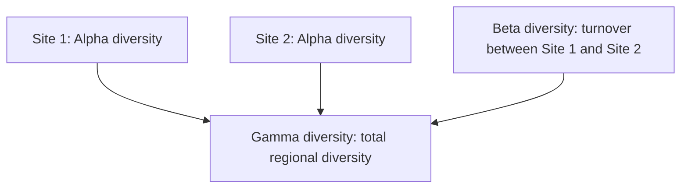
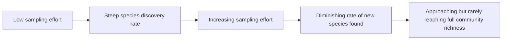

## Measuring and Mapping Biodiversity

### Overview

Measuring and mapping biodiversity involves the quantitative methods, sampling strategies, and spatial tools used to assess how much biological variation exists in a given area and how it is distributed across landscapes. These techniques are essential for conservation prioritization, tracking ecosystem health over time, detecting biodiversity loss, and informing land-use and policy decisions. The field combines field-based ecological sampling, statistical diversity metrics, and increasingly sophisticated remote sensing and molecular technologies.

### Fundamental Diversity Metrics

**Key Points**

- **Species richness**: the simplest measure — a count of the total number of distinct species present in a defined sampling area or community.
- **Species abundance**: the number of individuals of each species present, providing the data needed to assess relative dominance and evenness.
- **Species evenness**: describes how equally individuals are distributed among the species present; communities with the same richness can have very different evenness.
- **Shannon diversity index ($H'$)**: incorporates both richness and evenness into a single value.

  $$H' = -\sum_{i=1}^{S} p_i \ln(p_i)$$
- **Simpson's diversity index ($D$)**: emphasizes dominance, giving greater weight to common species.

  $$D = 1 - \sum_{i=1}^{S} p_i^2$$

  where $S$ is species richness and $p_i$ is the proportional abundance of species $i$ in both formulas.

### Alpha, Beta, and Gamma Diversity

**Key Points**

- **Alpha diversity**: species diversity within a single, localized site or sample (local-scale diversity).
- **Beta diversity**: the degree of species turnover or compositional difference between two or more sites, reflecting how distinct communities are from one another across a landscape.
- **Gamma diversity**: the total species diversity across an entire landscape or region, encompassing multiple sites/communities.
- The relationship is often expressed conceptually as:

  $$\gamma = \bar{\alpha} \times \beta$$

  where gamma diversity results from the combination of average local (alpha) diversity and the degree of variation (beta) between sites. [Inference: this multiplicative relationship represents one commonly used framework in diversity partitioning literature; alternative additive partitioning approaches also exist and are used depending on the specific research context and statistical assumptions.]

### Field Sampling Methods

**Key Points**

- **Quadrat sampling**: placing standardized-size sampling frames (quadrats) at defined or randomized locations to count and identify species within a bounded area — commonly used for plants, sessile organisms, and slow-moving invertebrates.
- **Transect sampling**: establishing a line or belt across a habitat gradient and recording species encountered at defined intervals, useful for capturing how community composition changes across an environmental gradient (e.g., elevation, distance from shore).
- **Mark-recapture methods**: used primarily for estimating mobile animal population sizes — individuals are captured, marked, released, and a subsequent capture sample is used to estimate total population size based on the proportion of marked individuals recaptured.
- **Camera trapping**: motion-triggered cameras used to survey elusive, nocturnal, or wide-ranging animal species without direct human disturbance, increasingly standard in mammal and some bird biodiversity surveys.
- **Point counts and acoustic monitoring**: widely used in bird and bat surveys, recording species detected by sight or characteristic call within a fixed time period at a given point, or using automated acoustic recorders to detect calls over extended periods.

### Rarefaction and Sampling Effort

**Key Points**

- **Rarefaction curves**: statistical tools that plot the cumulative number of species detected against sampling effort (e.g., number of individuals or samples collected), allowing fair comparison of species richness estimates across sites sampled with different levels of effort.
- As sampling effort increases, rarefaction curves typically show diminishing returns — the rate of new species discovery slows as most of the accessible community has already been sampled, though the curve rarely reaches a true, complete plateau in highly diverse systems.
- **Species accumulation curves** are closely related tools showing how total observed richness increases with additional sampling units, used to assess whether sampling effort has been sufficient to characterize a community adequately.
- **Extrapolation estimators** (e.g., Chao1, Chao2) use patterns in rare species detection to estimate total species richness, including species likely present but not yet detected in the actual sample.

### Molecular and Genetic Biodiversity Assessment

**Key Points**

- **DNA barcoding**: uses short, standardized genetic sequences to identify species, particularly useful for distinguishing morphologically similar or cryptic species that are difficult to differentiate visually.
- **Environmental DNA (eDNA) sampling**: detects genetic material shed by organisms into their environment (water, soil, air), allowing species detection without directly observing or capturing the organism — increasingly used for monitoring aquatic biodiversity, including rare or elusive species.
- **Metabarcoding**: applies high-throughput sequencing to simultaneously identify many species present in a mixed environmental sample (e.g., all fish species present in a water sample), providing a more comprehensive community-level assessment than traditional single-species eDNA detection.
- These molecular approaches have substantially expanded biodiversity monitoring capability, particularly for hard-to-observe, rare, or cryptic taxa, though [Inference: eDNA and metabarcoding methods have specific technical limitations — including detection sensitivity, genetic reference database completeness, and potential for false positives/negatives — that are actively being refined and are not yet considered fully equivalent replacements for traditional field surveys across all applications.]

### Remote Sensing and Satellite-Based Biodiversity Mapping

**Key Points**

- **Satellite imagery** (e.g., Landsat, Sentinel, MODIS) enables large-scale mapping of habitat type, land cover change, and vegetation structure as proxies for ecosystem and habitat diversity across broad spatial extents.
- **Normalized Difference Vegetation Index (NDVI)**: a widely used remote sensing metric derived from satellite reflectance data, used as a proxy for vegetation health, productivity, and cover — indirectly informing habitat quality assessments relevant to biodiversity.
- **LiDAR (Light Detection and Ranging)**: provides detailed three-dimensional structural data on vegetation canopy height and complexity, which correlates with habitat structural diversity and, in many studied systems, species diversity (particularly for forest-dependent taxa).
- **Species distribution modeling (SDM)**: statistical/machine-learning approaches that combine known species occurrence records with environmental variables (climate, elevation, land cover) to predict potential species distributions across unsampled areas — widely used for identifying priority conservation areas and modeling range shifts under climate change scenarios.

### Biodiversity Databases and Global Monitoring Initiatives

**Key Points**

- **Global Biodiversity Information Facility (GBIF)**: an international data infrastructure aggregating species occurrence records from museums, research institutions, and citizen science platforms, providing open-access biodiversity data at a global scale.
- **IUCN Red List**: a globally recognized system assessing extinction risk for species, providing standardized conservation status categories (e.g., Least Concern, Vulnerable, Endangered, Critically Endangered, Extinct).
- **Citizen science platforms** (e.g., iNaturalist, eBird): enable large-scale, crowdsourced biodiversity data collection, substantially expanding the spatial and temporal coverage of biodiversity monitoring beyond what professional survey efforts alone could achieve, though data quality and observer bias require careful statistical handling.
- **Biodiversity indicators**: standardized metrics (e.g., the Living Planet Index, tracking vertebrate population trends over time) used by international bodies to monitor global biodiversity trends and report on conservation targets.

### Mapping Biodiversity Hotspots

**Key Points**

- **Biodiversity hotspot** designation (as formalized by Conservation International) requires both **high endemism** (at least 1,500 endemic vascular plant species) and **significant habitat loss** (having lost at least 70% of original habitat), identifying regions of exceptionally high conservation priority. [Inference: these specific numerical thresholds reflect the particular methodology established by the organization that popularized the hotspot concept; other conservation frameworks may use different specific criteria for prioritization.]
- **Species-area relationship**: a foundational ecological pattern describing how species richness increases with sampled area, typically modeled as:

  $$S = cA^z$$

  where $S$ is species richness, $A$ is area, and $c$ and $z$ are constants fitted empirically for a given taxonomic group and region.
- Mapping combines occurrence data, habitat suitability modeling, and threat assessment (deforestation rates, land-use change projections) to identify priority areas for conservation investment.

### Comparative Summary of Biodiversity Measurement Approaches

| Method | Scale | Primary Use | Key Limitation |
| --- | --- | --- | --- |
| Quadrat/transect sampling | Local | Plant/sessile species surveys | Labor-intensive, limited spatial extent |
| Mark-recapture | Local to regional | Mobile animal population estimation | Requires repeated sampling effort |
| Camera trapping/acoustic monitoring | Local to landscape | Elusive/nocturnal species detection | Species identification challenges, equipment cost |
| eDNA/metabarcoding | Local to regional | Aquatic and cryptic species detection | Reference database gaps, detection sensitivity |
| Remote sensing/satellite | Regional to global | Habitat/ecosystem diversity mapping | Indirect proxy, limited species-level resolution |
| Species distribution modeling | Regional to global | Predicting distributions, climate impact scenarios | Model uncertainty, data quality dependence |

### Diagram: Biodiversity Measurement Scale Continuum

<svg xmlns="http://www.w3.org/2000/svg" viewBox="0 0 700 380">
<text x="350" y="30" text-anchor="middle" font-size="18" font-weight="bold" fill="#1a1a1a">Biodiversity Measurement Across Spatial Scales (svg_diagram)</text>
<line x1="60" y1="200" x2="650" y2="200" stroke="#333" stroke-width="2" />
<text x="355" y="230" text-anchor="middle" font-size="12" fill="#333">Spatial Scale: Local -&gt; Regional -&gt; Global</text>
<circle cx="110" cy="200" r="8" fill="#2a7a54" />
<text x="110" y="160" text-anchor="middle" font-size="10" font-weight="bold">Quadrat/Transect</text>
<text x="110" y="175" text-anchor="middle" font-size="9">Sampling</text>
<circle cx="230" cy="200" r="8" fill="#2b6ca3" />
<text x="230" y="160" text-anchor="middle" font-size="10" font-weight="bold">Camera Traps/</text>
<text x="230" y="175" text-anchor="middle" font-size="9">Acoustic Monitoring</text>
<circle cx="350" cy="200" r="8" fill="#8a5a2b" />
<text x="350" y="160" text-anchor="middle" font-size="10" font-weight="bold">eDNA/</text>
<text x="350" y="175" text-anchor="middle" font-size="9">Metabarcoding</text>
<circle cx="470" cy="200" r="8" fill="#c0392b" />
<text x="470" y="160" text-anchor="middle" font-size="10" font-weight="bold">Species Distribution</text>
<text x="470" y="175" text-anchor="middle" font-size="9">Modeling</text>
<circle cx="590" cy="200" r="8" fill="#a3890b" />
<text x="590" y="160" text-anchor="middle" font-size="10" font-weight="bold">Satellite Remote</text>
<text x="590" y="175" text-anchor="middle" font-size="9">Sensing</text>

<text x="350" y="290" text-anchor="middle" font-size="11" fill="#666" font-style="italic">Methods are typically combined (multi-method integration) for comprehensive biodiversity assessment</text>

</svg>

### Common Misconceptions

**Key Points**

- Treating species richness as a complete measure of biodiversity — evenness, genetic diversity, and ecosystem diversity are equally important dimensions not captured by richness counts alone.
- Assuming eDNA and remote sensing methods can fully replace traditional field surveys — these methods have specific technical limitations and are generally used as complementary tools rather than complete substitutes.
- Believing rarefaction curves eventually reach a definitive "complete" species count — in highly diverse systems, curves often continue rising slowly even at substantial sampling effort, meaning true total richness frequently must be statistically estimated rather than directly observed.
- Assuming citizen science data is equivalent in reliability to professionally collected survey data — citizen science substantially expands coverage but often requires statistical correction for observer bias and uneven sampling effort across space and time.

### Related Topics

- Levels and value of biodiversity
- Biodiversity hotspots and conservation prioritization
- Species distribution modeling and climate change range shifts
- IUCN Red List and extinction risk assessment
- Community ecology sampling methods
- GIS and remote sensing applications in ecology
- Citizen science and community-based monitoring