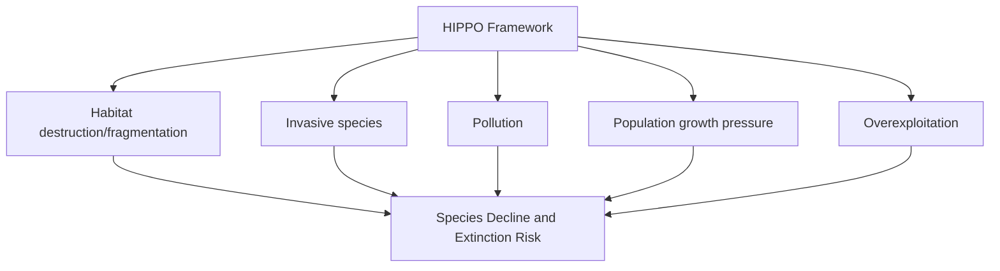

## Causes and Patterns of Species Extinction

### Overview

Extinction — the permanent loss of a species — is a natural process that has shaped life on Earth throughout its history, but the current rate and drivers of extinction are of particular concern to conservation biology. Understanding the causes and patterns of extinction, from historical mass extinction events to contemporary human-driven biodiversity loss, provides essential context for assessing extinction risk, prioritizing conservation efforts, and evaluating the scale of the present-day biodiversity crisis.

### Background Extinction Rate

**Key Points**

- **Background extinction rate**: the "normal," relatively constant rate at which species go extinct over geological time in the absence of mass extinction events, estimated from the fossil record.
- Commonly cited background extinction rate estimates fall in the range of roughly **0.1 to 1 extinction per million species-years**, though precise figures vary depending on taxonomic group and methodology used to reconstruct historical rates from the fossil record. [Inference: background extinction rate estimates are inherently derived from incomplete fossil records and modeling assumptions, and specific published figures vary meaningfully across studies.]
- Comparing current extinction rates to this historical background rate is the primary method conservation biologists use to assess whether contemporary extinction constitutes an anomalous, elevated pattern (often termed the "sixth mass extinction" or biodiversity crisis) rather than typical background turnover. [Inference: while a substantial body of scientific literature supports the conclusion that current extinction rates significantly exceed background rates, specific quantitative multiplier estimates (e.g., "100 times" or "1,000 times" background rate) vary across studies and remain subject to ongoing refinement as data and methods improve.]

### The Five Historical Mass Extinctions

**Key Points**

The fossil record documents five major mass extinction events, each eliminating a substantial proportion of contemporaneous species over a geologically brief period.

| Event | Approximate Timing | Estimated Extent | Leading Hypothesized Cause(s) |
| --- | --- | --- | --- |
| End-Ordovician | ~443 million years ago | Substantial marine species loss | Glaciation and sea-level change |
| Late Devonian | ~372-359 million years ago | Substantial marine species loss | Possible ocean anoxia, climate change |
| End-Permian ("The Great Dying") | ~252 million years ago | Most severe of the five events | Massive volcanism (Siberian Traps), ocean acidification, anoxia |
| End-Triassic | ~201 million years ago | Substantial marine and terrestrial loss | Volcanic activity, climate disruption |
| End-Cretaceous (K-Pg) | ~66 million years ago | Ended non-avian dinosaur lineage | Asteroid impact (Chicxulub), possibly combined with volcanic activity |

[Inference: specific percentage extinction estimates for each event vary across paleontological studies and are generally expressed as ranges rather than precise figures, given the inherent limitations of fossil record completeness; the causal mechanisms for several events, particularly the earlier ones, remain areas of active scientific research and some continued debate.]

### The "Sixth Mass Extinction" Hypothesis

**Key Points**

- Many conservation biologists and paleontologists argue that current extinction rates, driven predominantly by human activity, constitute a contemporary mass extinction event comparable in scale (if not yet in total magnitude) to the five historical events.
- Unlike the historical five mass extinctions — driven by causes such as asteroid impact, massive volcanism, and long-term climate/sea-level shifts — the proposed sixth extinction is attributed primarily to a **single species' activities** (habitat destruction, overexploitation, pollution, climate change, invasive species introduction).
- [Inference: while the characterization of a human-driven "sixth mass extinction" is widely discussed and supported by a substantial body of biodiversity decline research, the precise framing, timing of onset, and ultimate eventual magnitude compared to the historical "Big Five" remain topics of ongoing scientific discussion and are not settled with the same certainty as the well-documented historical fossil record events.]

### The IUCN "HIPPO" Framework of Extinction Drivers

**Key Points**

A widely used mnemonic framework (attributed to biologist E.O. Wilson) organizes the primary anthropogenic drivers of contemporary species extinction and decline.

- **H — Habitat destruction/fragmentation**: widely regarded as the single largest driver of contemporary biodiversity loss, through deforestation, agricultural conversion, urbanization, and wetland drainage.
- **I — Invasive species**: introduced non-native species that outcompete, prey upon, or otherwise disrupt native species and ecosystems, particularly devastating on island ecosystems with historically low predator/competitor diversity.
- **P — Pollution**: chemical contamination (pesticides, industrial pollutants, plastic waste, nutrient runoff) degrading habitat quality and directly harming organisms.
- **P — Population (human population growth)**: increasing human population and per-capita resource consumption intensify pressure across all other extinction driver categories.
- **O — Overexploitation**: unsustainable hunting, fishing, and harvesting of wild species beyond their capacity to naturally replenish population numbers.

### Habitat Destruction and Fragmentation

**Key Points**

- **Habitat loss** eliminates the physical space and resources species require for survival and reproduction, and is broadly documented across the conservation literature as the leading driver of contemporary extinction risk across most taxonomic groups.
- **Habitat fragmentation**: breaking continuous habitat into smaller, isolated patches, which can reduce effective population sizes, limit gene flow between subpopulations, increase edge effects, and elevate local extinction risk even in cases where total habitat area loss is comparatively modest.
- **Species-area relationship**: extinction risk following habitat loss can be estimated using the empirical relationship between habitat area and species richness, though translating area loss into precise extinction predictions involves substantial modeling uncertainty and depends on numerous ecosystem-specific factors. [Inference: while the species-area relationship is a well-established ecological pattern, using it to generate precise numerical extinction predictions from specific habitat loss scenarios involves methodological assumptions that are actively debated within conservation biology.]

### Invasive Species

**Key Points**

- Invasive species can drive native species extinction through **direct predation**, **competitive exclusion**, **disease introduction**, and **habitat alteration**.
- **Island ecosystems** are disproportionately vulnerable to invasive species impacts, since native island species frequently evolved in the absence of mammalian predators or intense competitive pressure, leaving them poorly defended against introduced threats.
- Documented cases of invasive-species-driven extinction include introduced predators (rats, cats, snakes) on island bird populations and introduced pathogens affecting previously unexposed native species.

**Example**

The introduction of the brown tree snake to Guam (accidentally, via military cargo transport following World War II) is a well-documented case of invasive species impact: the snake, encountering native bird species with no evolved defense against an arboreal snake predator, is associated with the extirpation or severe decline of numerous native forest bird species on the island. [Inference: exact historical timelines and precise species-by-species extinction attribution have been documented across multiple ecological studies, though some specific figures on total species impact vary slightly between sources.]

### Overexploitation

**Key Points**

- Occurs when harvesting rates (hunting, fishing, logging, wildlife trade) exceed a population's capacity for natural replacement, driving population decline toward extinction if unaddressed.
- Historical documented examples include the extinction of the passenger pigeon (driven to extinction through unsustainable commercial hunting in North America) and numerous documented cases of severe population collapse in commercially harvested fish stocks.
- **Illegal wildlife trade** remains a significant ongoing driver of extinction risk for numerous species, particularly those targeted for traditional medicine markets, exotic pet trade, or high-value products (ivory, rhino horn).

### Pollution as an Extinction Driver

**Key Points**

- **Chemical pollutants** (pesticides, heavy metals, industrial chemicals) can cause direct toxicity, reproductive impairment, or bioaccumulation/biomagnification through food webs.
- **Plastic pollution**, particularly in marine environments, poses ingestion and entanglement risks to a wide range of species.
- **Nutrient pollution** (agricultural runoff) drives eutrophication, degrading aquatic habitat quality and contributing to biodiversity loss in freshwater and coastal marine ecosystems.
- Historical case: **DDT** pesticide use was documented to cause eggshell thinning in birds of prey (including bald eagles and peregrine falcons), contributing to severe population declines before the pesticide was banned in several countries, after which affected raptor populations showed substantial recovery.

### Climate Change as an Emerging Extinction Driver

**Key Points**

- Climate change is increasingly recognized as a significant and growing contributor to extinction risk, operating through mechanisms including shifting species ranges beyond historical tolerance zones, altered timing of seasonal biological events (phenological mismatch), increased frequency/severity of extreme weather events, and ocean acidification/warming effects on marine species.
- Species with limited dispersal ability, narrow climatic tolerance ranges, or those confined to isolated habitats (mountaintops, islands) with no available range to shift into face particularly elevated climate-driven extinction risk. [Inference: while the general mechanisms of climate-driven extinction risk are well-supported in the scientific literature, specific quantitative extinction risk projections for particular species or regions vary across different climate and ecological modeling studies and carry meaningful uncertainty.]

### Extinction Vulnerability Traits

**Key Points**

Certain biological and ecological traits are associated with elevated extinction vulnerability across taxa.

- **Small population size**: reduces genetic diversity and increases susceptibility to stochastic events (demographic and environmental stochasticity).
- **Narrow geographic range or habitat specialization**: limits a species' ability to persist if its specific habitat is disturbed or lost.
- **Low reproductive rate**: (K-selected life history traits) slows population recovery following decline.
- **Large body size**: often correlates with lower population density, larger area requirements, and historically higher vulnerability to overexploitation.
- **Endemism**: species restricted to a single, limited geographic area have no alternative range to buffer against localized threats.

### Comparative Summary: Extinction Drivers

| Driver | Primary Mechanism | Example |
| --- | --- | --- |
| Habitat destruction | Loss of living space/resources | Deforestation, wetland drainage |
| Invasive species | Predation, competition, disease | Brown tree snake on Guam |
| Pollution | Toxicity, habitat degradation | DDT and raptor population decline |
| Overexploitation | Unsustainable harvest | Passenger pigeon extinction |
| Climate change | Range shifts, phenological mismatch | Mountain/island species range loss |

### Diagram: Extinction Risk Escalation Pathway

<svg xmlns="http://www.w3.org/2000/svg" viewBox="0 0 700 400">
<text x="350" y="30" text-anchor="middle" font-size="18" font-weight="bold" fill="#1a1a1a">Pathway from Threat to Extinction (svg_diagram)</text>
<rect x="40" y="80" width="140" height="60" fill="#cfe0a6" stroke="#5f7a2b" stroke-width="2" />
<text x="110" y="115" text-anchor="middle" font-size="11">Stable population</text>
<line x1="180" y1="110" x2="230" y2="110" stroke="#333" stroke-width="2" />
<text x="205" y="100" text-anchor="middle" font-size="9">HIPPO threat</text>
<rect x="230" y="80" width="140" height="60" fill="#f1c40f" stroke="#a3890b" stroke-width="2" />
<text x="300" y="115" text-anchor="middle" font-size="11">Population decline</text>
<line x1="370" y1="110" x2="420" y2="110" stroke="#333" stroke-width="2" />
<rect x="420" y="80" width="140" height="60" fill="#e67e22" stroke="#a35b17" stroke-width="2" />
<text x="490" y="115" text-anchor="middle" font-size="11">Small, fragmented population</text>
<line x1="490" y1="140" x2="490" y2="190" stroke="#333" stroke-width="2" />
<rect x="420" y="190" width="140" height="60" fill="#c0392b" stroke="#7a2418" stroke-width="2" />
<text x="490" y="215" text-anchor="middle" font-size="11" fill="white">Genetic erosion,</text>
<text x="490" y="230" text-anchor="middle" font-size="11" fill="white">stochastic risk</text>
<line x1="490" y1="250" x2="490" y2="300" stroke="#333" stroke-width="2" />
<rect x="420" y="300" width="140" height="60" fill="#7a2418" stroke="#4a1710" stroke-width="2" />
<text x="490" y="335" text-anchor="middle" font-size="11" fill="white">Extinction</text>
</svg>

### Common Misconceptions

**Key Points**

- Assuming extinction is always sudden and catastrophic — many extinctions, particularly contemporary ones, result from gradual population decline over years to decades rather than a single dramatic event.
- Believing habitat destruction and climate change are the only significant extinction drivers — invasive species, overexploitation, and pollution remain independently significant and often interact synergistically with habitat and climate pressures.
- Treating the five historical mass extinctions as having identical causes — each event is associated with distinct (and in some cases still-debated) causal mechanisms rather than a single universal extinction trigger.
- Assuming small, isolated populations face only demographic risk — genetic erosion (inbreeding depression, loss of adaptive capacity) compounds demographic vulnerability in small populations.

### Related Topics

- Levels and value of biodiversity
- Measuring and mapping biodiversity
- IUCN Red List and extinction risk assessment categories
- Conservation strategies and protected area design
- Habitat fragmentation and landscape ecology
- Climate change impacts on species distributions
- Invasive species management
- Minimum viable population and population viability analysis