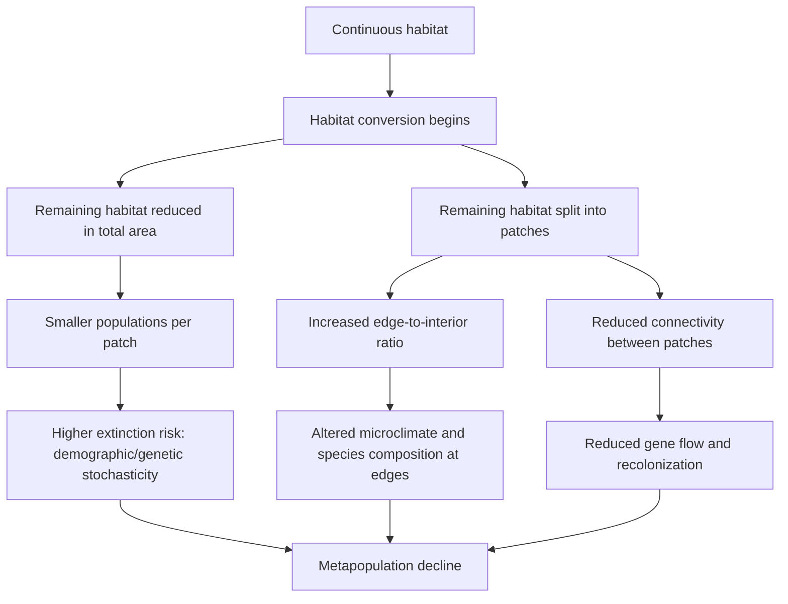
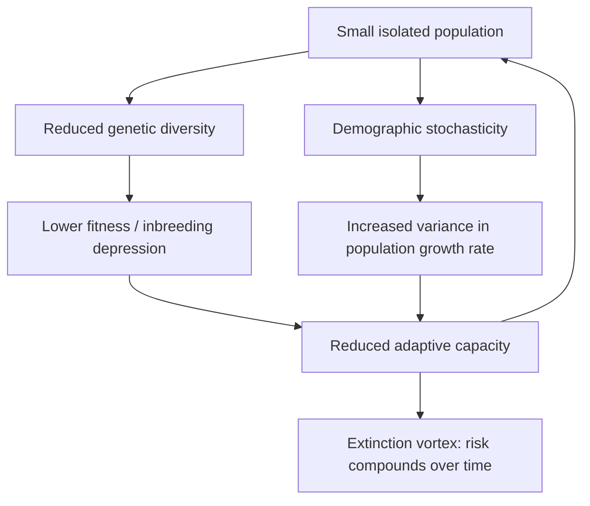

## Habitat Loss and Fragmentation

### Overview

Habitat loss and fragmentation are among the most significant drivers of biodiversity decline globally, frequently cited as the leading direct cause of species extinction and population decline across terrestrial and freshwater ecosystems. While often discussed together, habitat loss (reduction in total habitat area) and habitat fragmentation (breaking of continuous habitat into smaller, isolated patches) are distinct processes with overlapping but non-identical ecological consequences.

### Core Definitions

**Key Points**

- **Habitat loss**: The outright destruction or conversion of natural habitat to a non-habitat state (e.g., forest cleared for agriculture), reducing total habitat area available to a species.
- **Habitat fragmentation**: The process by which a large, continuous habitat area is divided into smaller, more isolated patches, often (but not always) accompanied by habitat loss.
- **Habitat degradation**: Reduction in habitat quality without necessarily reducing area (e.g., pollution, invasive species, altered fire regimes) — related but conceptually distinct from loss/fragmentation.
- Habitat loss and fragmentation frequently co-occur but can be analytically separated: it is possible to fragment a habitat without net area loss (e.g., a road bisecting a forest) or lose habitat area without fragmenting the remainder (e.g., uniform edge retreat of a large patch).

### Distinguishing Habitat Loss from Fragmentation Per Se

**Key Points**

- Ecologist Lenore Fahrig's influential body of work distinguishes "habitat amount" effects from "fragmentation per se" (the spatial arrangement of a given amount of habitat, independent of total area).
- Meta-analyses examining fragmentation per se (holding habitat amount constant) have found mixed and often weak effects, in contrast to the consistently strong negative effects of habitat amount/loss. [Inference — this remains an active and debated area of landscape ecology; findings vary by taxon, spatial scale, and study design, and the "habitat amount hypothesis" is not universally accepted]
- Regardless of this ongoing debate, habitat loss itself is uncontroversially recognized as a primary driver of biodiversity decline; the debate concerns the *additional, independent* effect of patch configuration/fragmentation beyond simple area reduction.

### Mechanisms and Consequences of Fragmentation

**Patch Size Effects**

- Smaller patches support smaller populations, which are more vulnerable to stochastic extinction (demographic, environmental, and genetic stochasticity).
- Species-area relationships predict that smaller patches support fewer species, following approximately:

$$S = cA^z$$

Where $S$ is species richness, $A$ is habitat area, and $c$, $z$ are constants (typically $z \approx 0.15$–$0.35$ for most terrestrial systems, though this varies substantially by taxon and region).

**Edge Effects**

- Fragmentation increases the ratio of edge to interior habitat, exposing more of the remaining habitat to altered microclimate (wind, light, temperature, humidity) and biotic conditions (invasive species, nest predation, altered pollinator/seed disperser activity) originating from the adjacent matrix.
- Edge-sensitive ("interior") species decline disproportionately, while edge-tolerant generalists may increase — often producing a net biodiversity shift rather than uniform decline.

**Isolation and Connectivity Loss**

- Fragmented patches become increasingly isolated from one another, reducing dispersal, gene flow, and recolonization potential following local extinction.
- This isolation underlies **metapopulation dynamics**, where regional persistence depends on a balance between local extinction (in individual patches) and recolonization (via dispersal between patches).

### Genetic and Demographic Consequences

**Key Points**

- Small, isolated populations experience increased **genetic drift** and reduced effective population size ($N_e$), accelerating loss of genetic diversity.
- Isolation limits gene flow, increasing risk of **inbreeding depression**, particularly in species with historically large, well-connected populations now reduced to fragmented remnants.
- Small populations face heightened extinction risk from an **extinction vortex** — a self-reinforcing feedback loop where reduced genetic diversity, demographic instability, and environmental/catastrophic stochasticity compound to drive populations toward extinction.

### Species-Specific Vulnerability

Susceptibility to fragmentation effects varies by species traits:

- **Area-sensitive species** (large home range, low population density, e.g., large carnivores) are disproportionately affected since fragments may fall below minimum viable patch size.
- **Habitat specialists** with narrow ecological tolerances suffer more than generalists able to exploit matrix or edge habitat.
- **Poor dispersers** (limited mobility, e.g., many amphibians, some invertebrates) are especially vulnerable to isolation effects, as they cannot easily recolonize or exchange genes between patches.
- **Interior-dependent species** (requiring core forest/habitat conditions away from edges) decline as edge-to-interior ratio increases with fragmentation.

### Landscape Connectivity and Corridors

**Key Points**

- **Habitat corridors**: Linear or stepping-stone habitat elements connecting otherwise isolated patches, intended to facilitate dispersal, gene flow, and recolonization.
- **Landscape matrix quality**: The character of the non-habitat area surrounding patches (e.g., intensive monoculture vs. low-intensity agroforestry) significantly affects effective isolation — a "soft" matrix permits more movement than a "hard" (highly hostile) matrix.
- **Stepping-stone habitats**: Smaller, non-contiguous patches that, while insufficient for permanent residence, facilitate movement between larger core patches.
- Corridor effectiveness varies by taxon, corridor width/quality, and landscape context; corridors are not a universal solution and can in some cases facilitate spread of invasive species, disease, or fire alongside their intended connectivity benefits. [Inference — corridor cost-effectiveness relative to alternative strategies like patch enlargement is context-dependent and remains a live research and management question]

### Minimum Viable Population and Patch Size

Conservation planning often incorporates **Minimum Viable Population (MVP)** concepts — the smallest population size with an acceptable probability of long-term persistence given demographic, genetic, and environmental stochasticity — to inform minimum patch size requirements for target species. Reserve design theory (informed by island biogeography) generally favors:

- Larger patches over smaller ones (supports larger populations, more interior habitat)
- Fewer, larger patches over many small ones for area-sensitive species, though multiple smaller patches (SLOSS debate: "Single Large Or Several Small") can better preserve overall species richness under certain conditions, particularly for less area-sensitive taxa
- Patches closer together over more distant ones (facilitates dispersal)
- Corridors connecting patches where feasible

### Global Patterns and Drivers

**Key Points**

- **Agricultural expansion** is the dominant global driver of habitat loss, particularly in tropical forest biomes.
- **Urbanization and infrastructure development** (roads, transmission corridors) are major fragmentation agents, creating both physical barriers and edge effects even without complete habitat removal.
- **Resource extraction** (logging, mining, oil and gas) fragments habitats even in nominally "intact" biomes like boreal forest.
- Tropical forest biomes and temperate grasslands have experienced disproportionately high historical rates of habitat loss due to high agricultural suitability (see Major Terrestrial Biomes).

### Worked Example

**Example**

A 10,000-hectare contiguous forest is bisected by a highway and subsequently developed at its margins, leaving two disconnected 3,000-hectare fragments (total habitat area reduced to 6,000 ha, a 40% loss).

- **Area effect**: Species richness is expected to decline following the species-area relationship, independent of fragmentation — a straightforward consequence of losing 4,000 ha.
- **Fragmentation effect**: The two remaining fragments now have substantially more edge habitat relative to their combined interior area than the original single 10,000 ha patch, and populations of area-sensitive or poor-dispersing species in each fragment are now demographically and genetically isolated from one another by the highway barrier.
- **Combined risk**: A large carnivore requiring a 5,000 ha home range can no longer be supported by either fragment alone, whereas before fragmentation the original patch could have supported two overlapping home ranges.

### Mitigation and Management Strategies

- **Protected area designation and enlargement**: Prioritizing large, intact patches and buffer zones around them.
- **Corridor and connectivity restoration**: Reconnecting fragmented patches via habitat corridors or landscape-scale connectivity planning.
- **Matrix management**: Improving the permeability of the surrounding landscape (e.g., wildlife-friendly agriculture, reduced-impact logging) to lower effective isolation even without formal corridors.
- **Edge effect mitigation**: Buffer zones and gradual habitat transitions to reduce abrupt edge contrast.
- **Assisted gene flow / translocation**: Direct human-mediated movement of individuals between isolated populations to counteract genetic isolation where natural dispersal is insufficient.

### Common Misconceptions

- Habitat fragmentation and habitat loss are often conflated in casual usage, but they are analytically distinct processes with a genuine (if debated) scientific literature examining their separate effects.
- Fragmentation is not always unambiguously negative for total biodiversity — the SLOSS debate demonstrates that patch configuration effects can depend heavily on taxon and spatial scale, even though habitat *loss* itself is essentially universally harmful.
- Corridors are not a guaranteed conservation solution; their effectiveness depends on species-specific dispersal behavior, corridor design, and matrix context, and should be evaluated rather than assumed.

**Related Topics**

- Island Biogeography Theory
- Metapopulation Dynamics
- Minimum Viable Population and Population Viability Analysis
- Species-Area Relationships
- Edge Effects and Landscape Ecology
- Extinction Risk and the Extinction Vortex
- Protected Area Design and Reserve Networks
- Major Terrestrial Biomes
- Climate Change and Range Shifts