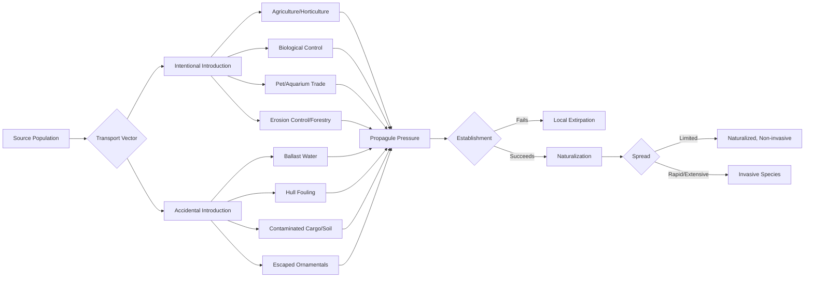
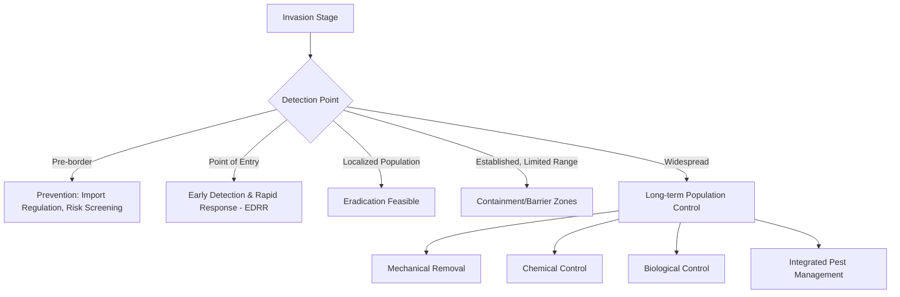

## Invasive Species and Biological Threats

### Definitions and Conceptual Framework

An **invasive species** is an organism introduced, intentionally or accidentally, outside its native range that establishes, spreads, and causes ecological, economic, or human harm in the new environment. Three criteria distinguish invasiveness from mere non-nativeness:

1. **Non-native origin** — introduced via human-mediated pathways rather than natural range expansion
2. **Establishment** — the population becomes self-sustaining without continued reintroduction
3. **Spread with demonstrable harm** — ecological disruption, economic loss, or health impacts

Not all non-native species are invasive. A species can be non-native and benign (**naturalized**), while a small fraction of introductions become aggressively invasive. This is formalized in the **tens rule** [Inference — widely cited heuristic, not a strict law]: roughly 10% of introduced species establish, and roughly 10% of those become invasive, yielding an overall ~1% invasion rate from total introductions.

Related terms:

- **Alien/exotic species**: any non-native species, regardless of impact
- **Naturalized species**: non-native, self-sustaining, but not causing significant harm
- **Native invasive**: a native species whose population explodes to damaging levels due to anthropogenic disturbance (e.g., native bark beetles under climate stress)

### Invasion Pathways

**Propagule pressure** — the number of individuals introduced, the number of introduction events, and genetic diversity of introduced stock — is the single strongest predictor of establishment success across taxa.

### The Invasion Process: Stages

| Stage | Description | Key Bottleneck |
| --- | --- | --- |
| Transport | Movement across a biogeographic barrier | Survival during transit |
| Introduction | Release/escape into a new environment | Arrival in suitable habitat |
| Establishment | Formation of a self-sustaining population | Minimum viable population, mate-finding (Allee effects) |
| Spread | Range expansion from the establishment point | Dispersal ability, landscape connectivity, climate match |
| Impact | Measurable ecological/economic effects | Interaction strength with native community |

### Why Some Introductions Succeed: Theoretical Models

**Enemy Release Hypothesis (ERH)**: Species escape co-evolved predators, parasites, and pathogens in the new range, allowing populations to grow unchecked.

**Novel Weapons Hypothesis**: Invaders possess biochemical or competitive traits (e.g., allelopathic compounds) that native competitors have no evolved resistance to. Example: *Alliaria petiolata* (garlic mustard) releases glucosinolates that disrupt mycorrhizal fungi networks essential to native plant seedlings.

**Empty Niche Hypothesis**: Invaders exploit unused resources or vacant ecological roles. [Inference — contested; many successful invaders instead displace natives from occupied niches rather than filling empty ones].

**Disturbance Hypothesis**: Human-altered, disturbed habitats (roadsides, cleared land, eutrophied waters) have reduced biotic resistance, favoring opportunistic invaders with r-selected traits (fast growth, high fecundity, broad tolerance).

**Biotic Resistance Hypothesis**: Diverse, intact native communities more fully utilize available resources and are more resistant to invasion than species-poor communities — an argument for the protective value of biodiversity itself.

### Characteristic Traits of Successful Invaders

- Broad environmental tolerance (eurytopic physiology)
- Rapid reproductive rate, early sexual maturity, high fecundity
- Efficient dispersal mechanisms (wind, water, human transport, seed dormancy)
- Phenotypic plasticity and, in plants, frequent polyploidy or clonal reproduction
- Generalist diet or pollination strategy
- Prior invasion history in comparable climates (strong predictor)

### Ecological Impacts

**Key Points**

- **Competitive displacement**: direct resource competition with natives (light, nutrients, prey, nesting sites)
- **Predation**: introduced predators lacking co-evolved prey defenses cause disproportionate mortality (e.g., brown tree snake, *Boiga irregularis*, extirpating native Guam bird species that evolved without arboreal snake predators)
- **Hybridization/genetic swamping**: introgression that erodes native gene pools (e.g., *Oncorhynchus mykiss* hybridizing with native cutthroat trout)
- **Disease introduction**: pathogens or parasites carried by the invader to which natives have no resistance (e.g., chytrid fungus *Batrachochytrimyces dendrobatidis* in amphibians)
- **Ecosystem engineering**: physical alteration of habitat structure (e.g., *Tamarix* spp. altering soil salinity and hydrology; zebra mussels altering water clarity and nutrient cycling)
- **Food web restructuring**: trophic cascades from altered predator-prey or plant-herbivore dynamics
- **Facilitation of further invasion** ("invasional meltdown"): one invader modifies conditions to favor subsequent invaders

### Case Studies

**Case Study — Zebra Mussel (*Dreissena polymorpha*)**

Introduced to the Great Lakes via ballast water discharge in the late 1980s. Filter-feeding at extremely high rates (up to 1 liter/day per individual) increases water clarity, which paradoxically triggers algal blooms at greater depths and shifts nutrient loads toward benthic zones, disrupting pelagic food webs. Colonizes hard substrates including water intake pipes, causing severe infrastructure and economic costs.

**Case Study — Burmese Python (*Python bivittatus*)**

Established in the Florida Everglades from escaped/released pets since the 1980s–1990s. Documented to cause severe declines in mid-sized mammal populations (raccoons, opossums, bobcats) through direct predation, with surveys showing steep declines correlating with python range expansion. [Unverified — precise causal attribution versus other concurrent stressors remains an active research question in some studies].

**Case Study — Cane Toad (*Rhinella marina*)**

Introduced to Australia in 1935 as a biological control agent for cane beetles; the biological control failed (toads cannot jump high enough to reach the beetles on the cane stalks), while the toads themselves spread rapidly. Their parotoid gland toxins (bufotoxins) are lethal to native predators (quolls, goannas, snakes) that attempt to consume them, causing region-wide predator population crashes. This is a canonical case of failed biocontrol becoming the invasive threat itself.

**Case Study — Lionfish (*Pterois volitans/miles*)**

Native to the Indo-Pacific, introduced to the Western Atlantic and Caribbean (likely aquarium releases in the 1980s–1990s). Voracious generalist predators with venomous spines deterring native predators; documented to reduce native reef fish recruitment substantially on invaded reefs, threatening reef fish community structure.

### Biological Control (Biocontrol): Mechanisms and Risk

Biocontrol introduces a natural enemy (predator, parasitoid, pathogen, herbivore) of the target invasive species. Approaches:

- **Classical biocontrol**: introducing a co-evolved natural enemy from the invader's native range (permanent establishment intended)
- **Augmentative biocontrol**: periodic release of natural enemies to boost existing populations (not for establishment)
- **Conservation biocontrol**: modifying habitat to favor existing natural enemies

**Modern risk-assessment protocol** (post-cane-toad-era standard):

1. Host-range testing under quarantine — the candidate agent is exposed to a battery of non-target native species to confirm dietary/reproductive specificity
2. Centrifugal phylogenetic testing — testing taxonomically related non-target species most likely to be attacked
3. Climate matching between native and target range
4. Regulatory review (in the U.S., through APHIS; internationally, IPPC standards)

Failures like the cane toad predate modern host-specificity testing protocols; contemporary classical biocontrol programs (e.g., using host-specific weevils or gall-forming insects against invasive weeds) have substantially lower non-target impact rates when rigorous testing is followed. [Inference — success rates vary considerably by taxon and are not universally guaranteed even with testing].

### Economic Impacts

Global economic cost estimates for invasive species run into the hundreds of billions of dollars annually across agriculture, forestry, fisheries, infrastructure, and public health sectors, though methodologies and figures vary substantially between studies and regions [Unverified — cite current primary sources such as the InvaCost database for up-to-date figures, as estimates are periodically revised].

Cost categories:

- Direct crop/livestock losses
- Control and eradication expenditures
- Infrastructure damage (e.g., zebra mussel biofouling of pipes)
- Reduced property values
- Public health costs (vector-borne disease spread, e.g., *Aedes albopictus* mosquito)
- Lost ecosystem services (pollination, water filtration, flood control)

### Management Strategies

**Management hierarchy (in order of cost-effectiveness)**:

1. **Prevention**: border biosecurity, ballast water treatment standards (IMO Ballast Water Management Convention), import risk screening, quarantine protocols. Generally the most cost-effective intervention because post-establishment costs escalate non-linearly with time and range size.
2. **Early Detection and Rapid Response (EDRR)**: surveillance networks, citizen science reporting, rapid eradication of newly detected populations while numbers remain low
3. **Eradication**: feasible only for spatially limited, early-stage invasions (e.g., island eradications of invasive rodents using rodenticide-baited stations)
4. **Containment**: physical or chemical barriers preventing further spread (e.g., electric barriers on the Chicago Sanitary and Ship Canal against Asian carp)
5. **Long-term control/suppression**: mechanical removal (hand-pulling, trapping), chemical control (herbicides, piscicides), biological control, integrated pest management (IPM) combining multiple tactics
6. **Restoration**: post-control native habitat rehabilitation to prevent re-invasion and support ecosystem recovery

### Policy and Regulatory Frameworks

- **Convention on Biological Diversity (CBD)**, Article 8(h): calls on parties to prevent introduction of, control, or eradicate alien species that threaten ecosystems
- **International Maritime Organization (IMO) Ballast Water Management Convention**: regulates ballast water discharge standards to reduce marine species transport
- **International Plant Protection Convention (IPPC)**: phytosanitary standards for agricultural trade
- **National frameworks**: e.g., U.S. Lacey Act (prohibits interstate transport of injurious wildlife), Executive Order 13112 establishing the National Invasive Species Council; EU Regulation 1143/2014 on invasive alien species

### Illustrative Diagram: Invasion Impact Pathway (svg_diagram)

<svg xmlns="http://www.w3.org/2000/svg" viewBox="0 0 800 320">
\<style\>
.box { fill: #eef3f8; stroke: #2c3e50; stroke-width: 1.5; }
.arrow { stroke: #2c3e50; stroke-width: 1.5; marker-end: url(#arrowhead); fill: none; }
.label { font-family: sans-serif; font-size: 13px; fill: #1a1a1a; text-anchor: middle; }
.title { font-family: sans-serif; font-size: 15px; font-weight: bold; fill: #1a1a1a; text-anchor: middle; }
\</style\>
<text x="400" y="24" class="title">Invasive Species Impact Pathway (svg_diagram)</text>
<rect x="20" y="60" width="140" height="55" rx="6" class="box" />
<text x="90" y="85" class="label">Introduction</text>
<text x="90" y="102" class="label">(vector/pathway)</text>
<rect x="200" y="60" width="140" height="55" rx="6" class="box" />
<text x="270" y="85" class="label">Establishment</text>
<text x="270" y="102" class="label">(self-sustaining pop.)</text>
<rect x="380" y="60" width="140" height="55" rx="6" class="box" />
<text x="450" y="85" class="label">Spread</text>
<text x="450" y="102" class="label">(range expansion)</text>
<rect x="560" y="60" width="200" height="55" rx="6" class="box" />
<text x="660" y="85" class="label">Ecological Impact</text>
<text x="660" y="102" class="label">(competition, predation)</text>
<line x1="160" y1="87" x2="198" y2="87" class="arrow" />
<line x1="340" y1="87" x2="378" y2="87" class="arrow" />
<line x1="520" y1="87" x2="558" y2="87" class="arrow" />
<rect x="200" y="180" width="140" height="55" rx="6" class="box" />
<text x="270" y="205" class="label">Economic Impact</text>
<text x="270" y="222" class="label">(agriculture, infra.)</text>
<rect x="380" y="180" width="140" height="55" rx="6" class="box" />
<text x="450" y="205" class="label">Human Health</text>
<text x="450" y="222" class="label">(vector, allergen)</text>
<rect x="560" y="180" width="200" height="55" rx="6" class="box" />
<text x="660" y="205" class="label">Ecosystem Service Loss</text>
<text x="660" y="222" class="label">(pollination, water)</text>
<line x1="660" y1="115" x2="660" y2="178" class="arrow" />
<line x1="450" y1="115" x2="450" y2="178" class="arrow" />
<line x1="270" y1="115" x2="270" y2="178" class="arrow" />
<rect x="300" y="270" width="240" height="40" rx="6" class="box" />
<text x="420" y="295" class="label">Management Response (EDRR, Control)</text>
<line x1="270" y1="235" x2="380" y2="268" class="arrow" />
<line x1="450" y1="235" x2="440" y2="268" class="arrow" />
<line x1="660" y1="235" x2="500" y2="268" class="arrow" />
</svg>

### Worked Example: Population Growth Under Enemy Release

A simplified logistic growth comparison illustrating why enemy release accelerates invader population growth relative to native-range dynamics:

$$\frac{dN}{dt} = rN\left(1 - \frac{N}{K}\right)$$

Where $N$ is population size, $r$ is intrinsic growth rate, and $K$ is carrying capacity. Enemy release effectively increases the realized $r$ (by removing predation/parasitism mortality) and can increase $K$ (by freeing resources previously partitioned with natural enemies or competitors), producing steeper initial growth curves and higher equilibrium densities compared to the native range. [Inference — a simplified conceptual illustration; real invasion dynamics involve stochasticity, Allee effects, and spatial spread (reaction-diffusion models) not captured by simple logistic growth].

### Common Misconceptions

- **"All non-native species are harmful"** — false; most naturalized species have negligible ecological impact
- **"Eradication is always the goal"** — not always feasible or cost-effective once a species is widely established; containment or suppression may be the realistic target
- **"Native species are always at a disadvantage"** — biotic resistance from diverse native communities can and does repel many introductions
- **"Biocontrol agents are risk-free"** — historical failures (cane toad, mongoose in Hawaii/Caribbean) demonstrate the need for rigorous host-specificity testing

**Related Topics**

- Island biogeography theory and vulnerability of insular ecosystems to invasion
- Climate change and range shifts of invasive species
- Trophic cascades and keystone species disruption
- Genetic methods in invasion biology (eDNA detection, population genomics for source-tracking)
- Restoration ecology following invasive species removal
- Assisted migration and native species translocation ethics
- Wildlife disease ecology and emerging infectious diseases (EIDs)
- International trade policy and biosecurity risk assessment frameworks