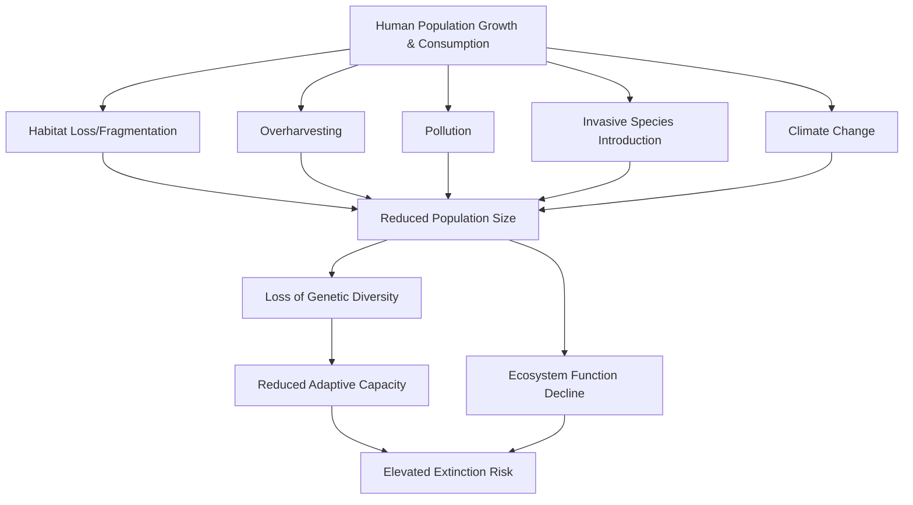
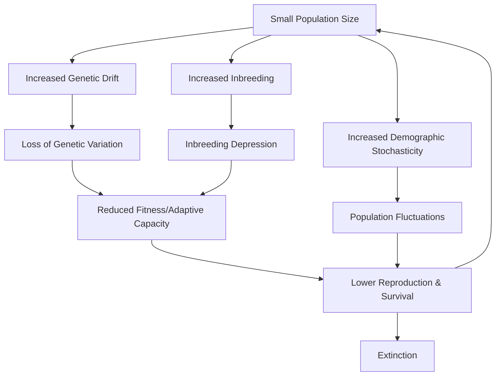

## Principles of Conservation Biology

### Overview

Conservation biology is a synthetic, crisis-oriented discipline that integrates population genetics, ecology, evolutionary biology, biogeography, and social science to address the loss of biological diversity. It emerged formally in the 1980s, distinguished from traditional natural resource management by its explicit normative commitment to the persistence of biodiversity as a value, combined with rigorous empirical and theoretical grounding. The discipline is often described as a "crisis discipline," analogous to emergency medicine: decisions must frequently be made under time pressure and incomplete information, prioritizing action based on the best available evidence rather than waiting for complete certainty.

### Foundational Premises

Michael Soulé's foundational papers (1985, 1986) articulated a set of normative postulates that continue to underpin the field:

- **Diversity of organisms is good.** Biological diversity has intrinsic value independent of its utilitarian worth to humans.
- **Ecological complexity is good.** Complex, interconnected ecological communities are preferable to simplified ones.
- **Evolution is good.** The evolutionary process itself — the capacity of lineages to continue diversifying and adapting — merits protection.
- **Biological diversity has intrinsic value.** This is distinguished from instrumental value (diversity's usefulness to humans, e.g., ecosystem services, pharmaceuticals, aesthetics).

These postulates position conservation biology as a mission-driven science: it does not merely describe biodiversity loss but is oriented toward preventing it.

### Core Levels of Biodiversity

Conservation biology addresses diversity across nested hierarchical levels, each requiring distinct measurement approaches and conservation strategies:

- **Genetic diversity** — variation in alleles and genotypes within and among populations, which underlies adaptive potential and long-term evolutionary resilience.
- **Species diversity** — the variety of species within a region, commonly quantified via richness (count) and evenness (relative abundance) metrics.
- **Ecosystem/community diversity** — variation in habitat types, community assemblages, and the ecological processes that structure them.
- **Landscape diversity** — the spatial arrangement, connectivity, and heterogeneity of ecosystems across a region.

Loss at any one level can cascade to others; for example, reduced genetic diversity can compromise a species' capacity to persist, which in turn can restructure the communities it participates in.

### Principal Drivers of Biodiversity Loss

The mnemonic **HIPPO**, popularized by E.O. Wilson, orders the primary anthropogenic threats by approximate global impact:

1. **Habitat destruction, fragmentation, and degradation** — generally considered the leading driver of extinction risk worldwide.
2. **Invasive species** — non-native species that outcompete, prey upon, or hybridize with native taxa, particularly devastating on islands.
3. **Pollution** — chemical contamination, eutrophication, plastic waste, and other anthropogenic inputs that degrade habitat quality.
4. **Population growth (human)** — the underlying driver amplifying resource consumption and land conversion.
5. **Overharvesting/overexploitation** — unsustainable hunting, fishing, and logging.

Climate change is increasingly treated as a distinct and rapidly intensifying sixth driver, interacting synergistically with the others (e.g., habitat fragmentation reduces species' ability to shift ranges in response to warming).

### Population Genetics in Conservation

Small, isolated populations face genetic erosion processes that elevate extinction risk independent of ecological threats:

- **Genetic drift** — random allele frequency changes that are proportionally stronger in small populations, leading to loss of genetic variation regardless of selective value.
- **Inbreeding depression** — reduced fitness (survival, fecundity) resulting from increased homozygosity of deleterious recessive alleles in small, closed populations.
- **Loss of adaptive potential** — reduced standing genetic variation limits a population's capacity to respond to novel selective pressures such as disease or climate shifts.
- **Outbreeding depression** — a less common but documented risk in which crossing genetically or locally adapted, divergent populations produces offspring with reduced fitness, relevant when planning translocations or genetic rescue.

**Effective population size ($N_e$)** is a central concept, representing the size of an idealized population that would experience genetic drift or inbreeding at the same rate as the actual (census) population. $N_e$ is typically substantially smaller than census population size ($N$) due to unequal sex ratios, variance in reproductive success, and population fluctuations:

$$N_e = \frac{4N_mN_f}{N_m + N_f}$$

where $N_m$ and $N_f$ are the number of breeding males and females, respectively. The widely cited "50/500 rule" [Inference: this is a historically influential guideline, not a universally validated threshold] suggests $N_e \geq 50$ to avoid short-term inbreeding depression and $N_e \geq 500$ to maintain long-term evolutionary potential; contemporary genetics literature has proposed revised thresholds (e.g., 100/1000) as more precautionary, though the appropriate values remain context- and species-dependent [Unverified — subject to ongoing debate in the literature].

### Population Viability Analysis (PVA)

PVA is a quantitative modeling framework used to estimate the probability that a population will persist for a specified time horizon, typically expressed as extinction probability over a defined period (e.g., "5% probability of extinction within 100 years"). PVA models incorporate:

- **Demographic stochasticity** — random variation in individual births/deaths, most impactful in small populations.
- **Environmental stochasticity** — year-to-year variation in environmental conditions affecting vital rates.
- **Genetic factors** — inbreeding depression and loss of adaptive potential.
- **Catastrophes** — low-probability, high-impact events (fires, disease outbreaks, extreme weather).

The **Minimum Viable Population (MVP)** is the smallest population size estimated to have a specified probability of persistence over a given time frame. MVP estimates are highly sensitive to model assumptions and input parameters, so results should be interpreted as order-of-magnitude guidance rather than precise thresholds [Inference].

### The Extinction Vortex

Small populations can enter a self-reinforcing decline known as the **extinction vortex**, in which ecological and genetic factors interact synergistically to accelerate decline toward extinction:

This positive feedback loop explains why small populations frequently decline faster than deterministic models predict, and underscores why early intervention — before a population becomes critically small — is disproportionately effective.

### Island Biogeography Theory and Habitat Fragmentation

MacArthur and Wilson's **Theory of Island Biogeography** (1967) models species richness on islands (or habitat fragments functioning as "islands" in a matrix of unsuitable habitat) as a dynamic equilibrium between immigration and extinction rates:

$$S = cA^z$$

where $S$ is species richness, $A$ is island/fragment area, and $c$ and $z$ are fitted constants (with $z$ typically between 0.20 and 0.35 empirically [Inference: value varies substantially by taxon and region]). Two central relationships follow:

- **Species-area relationship** — larger islands/fragments support more species, both because they intercept more colonizers and because they can sustain larger, more extinction-resistant populations.
- **Distance effect** — islands/fragments closer to a mainland source pool receive higher immigration rates and thus reach equilibrium richness faster and at a higher level.

Applied to fragmented terrestrial landscapes, this theory underlies core reserve design principles:

- **Edge effects** — altered microclimate, light, and biotic interactions near fragment boundaries, which penetrate inward and reduce effective "core" habitat, disproportionately affecting small fragments (high edge-to-area ratio).
- **SLOSS debate** ("Single Large Or Several Small") — an ongoing discussion regarding whether one large reserve or several small reserves of equivalent total area better conserves biodiversity; the optimal answer is context-dependent on species' dispersal ability, habitat specificity, and disturbance regimes [Unverified — no universal rule; empirical support exists for both configurations depending on taxa].
- **Corridors and connectivity** — habitat corridors linking fragments can facilitate gene flow, recolonization after local extinction, and range shifts under climate change, though they may also facilitate disease or invasive species spread.

### Metapopulation Dynamics

Levins' **metapopulation model** describes a "population of populations" — spatially discrete local populations (patches) connected by occasional dispersal, in which local extinctions are balanced by recolonization from other patches:

$$\frac{dp}{dt} = cp(1-p) - ep$$

where $p$ is the proportion of occupied patches, $c$ is the colonization rate coefficient, and $e$ is the local extinction rate coefficient. Key metapopulation concepts relevant to conservation:

- **Source-sink dynamics** — source patches produce a surplus of individuals that emigrate and sustain sink patches, which have negative intrinsic growth rates and would go locally extinct without immigration.
- **Rescue effect** — immigration into small, declining local populations that reduces their local extinction probability.
- **Patch connectivity** — the functional (not merely geographic) linkage between patches, mediated by the dispersal capacity of the focal species and the permeability of the intervening matrix.

### Species-Level Conservation Concepts

- **Keystone species** — species whose impact on community structure is disproportionately large relative to their abundance (e.g., sea otters controlling sea urchin populations that would otherwise overgraze kelp forests).
- **Umbrella species** — species whose habitat requirements are broad enough that protecting them incidentally protects many co-occurring species.
- **Flagship species** — charismatic species used to garner public support and funding for broader conservation initiatives, not necessarily ecologically pivotal themselves.
- **Indicator species** — species whose presence, absence, or condition reflects the health of the broader ecosystem or specific environmental conditions.
- **Foundation species** — species (often primary producers or ecosystem engineers, e.g., corals, kelp) that structure the physical habitat and community, distinct from keystone species in that their effect derives from sheer biomass/abundance rather than a trophic control mechanism.

These categories are not mutually exclusive; a single species can occupy several roles simultaneously.

### Conservation Prioritization Frameworks

- **Biodiversity hotspots** (Myers et al., 2000) — regions meeting two criteria: (1) at least 1,500 endemic vascular plant species, and (2) having lost ≥70% of original habitat. This framework prioritizes conservation investment toward areas of high endemism under high threat.
- **IUCN Red List categories** — a standardized extinction-risk classification system (Extinct, Extinct in the Wild, Critically Endangered, Endangered, Vulnerable, Near Threatened, Least Concern, Data Deficient, Not Evaluated), based on quantitative criteria including population size, rate of decline, geographic range, and probability of extinction.
- **Evolutionarily Significant Units (ESUs) and Distinct Population Segments (DPSs)** — sub-species-level units used to prioritize conservation of genetically and ecologically distinct populations, particularly relevant in fisheries and wildlife management.
- **Phylogenetic diversity prioritization** — approaches (e.g., EDGE — Evolutionarily Distinct and Globally Endangered) that weight conservation priority by a species' unique evolutionary history, aiming to preserve the "tree of life" rather than species counts alone.

### In Situ and Ex Situ Conservation Strategies

- **In situ conservation** — protecting species within their natural habitat, considered generally preferable as it preserves ongoing ecological and evolutionary processes. Mechanisms include protected area networks, community-based natural resource management, and habitat corridors.
- **Ex situ conservation** — conservation outside the natural habitat, including zoos, botanical gardens, seed banks, and captive breeding programs. Typically serves as a supplementary safeguard against extinction (an "insurance policy") or a source for reintroduction, rather than a substitute for habitat protection, since ex situ populations often experience genetic adaptation to captivity and reduced genetic diversity over generations.
- **Genetic rescue** — the deliberate introduction of new genetic material into a small, inbred population (e.g., translocating individuals from a genetically distinct population) to restore fitness and adaptive potential; a documented example is the translocation of Texas cougars into the Florida panther population.
- **Assisted migration/managed relocation** — the deliberate translocation of species to new geographic areas anticipated to become climatically suitable, used as a tool where natural dispersal cannot keep pace with climate change; it remains ecologically and ethically contested due to risks of introducing new invasives or disrupting recipient ecosystems [Unverified — actively debated in conservation practice].

### Reserve Design Principles

Effective protected area design integrates several evidence-based heuristics, though their relative weighting is context-dependent:

- Larger reserves generally support larger, more viable populations and lower extinction rates.
- Reserves closer together and connected by corridors facilitate gene flow and recolonization.
- Reserve shape affects edge-to-interior ratio; more circular/compact shapes minimize edge effects relative to elongated shapes of equal area.
- Buffer zones surrounding core protected areas can mitigate edge effects and accommodate compatible human use.
- Representation of multiple habitat types and environmental gradients within a reserve network improves resilience to environmental change and captures beta diversity.

### Human Dimensions and Applied Conservation

Conservation biology increasingly integrates social, economic, and political dimensions, recognizing that ecological success is frequently contingent on social legitimacy and equity:

- **Community-based conservation** — approaches that engage local and Indigenous communities as active stewards and beneficiaries rather than excluding them from protected landscapes.
- **Payments for Ecosystem Services (PES)** — economic instruments compensating landholders for maintaining ecosystem services (carbon sequestration, watershed protection, biodiversity).
- **Human-wildlife conflict management** — strategies (compensation schemes, physical barriers, land-use planning) to reduce conflict between wildlife conservation and human livelihoods, particularly relevant for large carnivores and crop-raiding species.
- **Traditional Ecological Knowledge (TEK)** — Indigenous and local knowledge systems increasingly recognized as complementary to Western scientific approaches in conservation planning.

### Illustrative Example: Extinction Vortex in a Case Population

**Example:** A population of an endangered carnivore is reduced from 2,000 to 50 individuals by habitat loss. At $N=50$, genetic drift accelerates, and observed heterozygosity declines measurably over several generations. Reduced heterozygosity correlates with lower juvenile survival (a signature of inbreeding depression), further reducing effective population size below the census count due to skewed reproductive success among a few dominant breeders. The population's PVA-modeled extinction probability over 50 years rises sharply as these factors compound — illustrating the extinction vortex operating in real time, and the rationale for early genetic rescue intervention rather than waiting until the population reaches critically low numbers.

### Simplified Reserve Network Schematic (svg_diagram)

<svg xmlns="http://www.w3.org/2000/svg" viewBox="0 0 700 380">
<text x="350" y="28" font-size="18" font-weight="bold" text-anchor="middle" fill="#1a1a1a">Reserve Connectivity Network (svg_diagram)</text>
<rect x="40" y="60" width="620" height="280" fill="#eef6ee" stroke="#7a9e7a" stroke-width="1" />
<circle cx="140" cy="140" r="45" fill="#4a8f4a" opacity="0.8" />
<text x="140" y="145" font-size="13" text-anchor="middle" fill="#ffffff">Core Reserve A</text>
<text x="140" y="200" font-size="11" text-anchor="middle" fill="#333">(Source patch)</text>
<circle cx="420" cy="110" r="55" fill="#3a7a3a" opacity="0.85" />
<text x="420" y="108" font-size="13" text-anchor="middle" fill="#ffffff">Core Reserve B</text>
<text x="420" y="126" font-size="13" text-anchor="middle" fill="#ffffff">(Large)</text>
<circle cx="560" cy="250" r="28" fill="#8fbf8f" opacity="0.8" />
<text x="560" y="254" font-size="10" text-anchor="middle" fill="#1a1a1a">Patch C</text>
<text x="560" y="296" font-size="10" text-anchor="middle" fill="#333">(Sink)</text>
<circle cx="230" cy="280" r="22" fill="#a9d3a9" opacity="0.8" />
<text x="230" y="284" font-size="9" text-anchor="middle" fill="#1a1a1a">Patch D</text>
<line x1="180" y1="150" x2="375" y2="118" stroke="#5a7a3a" stroke-width="6" opacity="0.5" />
<line x1="460" y1="145" x2="545" y2="225" stroke="#5a7a3a" stroke-width="4" opacity="0.5" />
<line x1="165" y1="175" x2="220" y2="262" stroke="#5a7a3a" stroke-width="3" opacity="0.4" stroke-dasharray="4,3" />

<text x="270" y="115" font-size="10" fill="`#3a5a2a`">Corridor (high gene flow)</text>

<text x="520" y="180" font-size="10" fill="`#3a5a2a`">Corridor</text>

<text x="150" y="230" font-size="9" fill="`#5a7a4a`">Weak/fragmented link</text>

<rect x="50" y="340" width="14" height="14" fill="#3a7a3a" />
<text x="70" y="352" font-size="10" fill="#333">Larger reserve = higher richness &amp; lower extinction rate (species-area relationship)</text>
</svg>

### Related Topics

- Landscape ecology and connectivity modeling (least-cost path, circuit theory)
- Ecosystem services valuation and natural capital accounting
- Restoration ecology and rewilding
- Climate change adaptation strategies for protected area networks
- Marine protected area design and fisheries management
- Wildlife disease ecology and its interaction with small population viability
- Environmental law and policy instruments (CBD, CITES, Endangered Species Act)
- Applied population genomics (SNP-based monitoring, eDNA surveillance)
- Conservation economics and cost-effectiveness prioritization (e.g., Zonation, Marxan software)