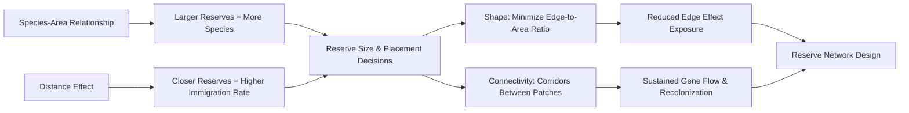
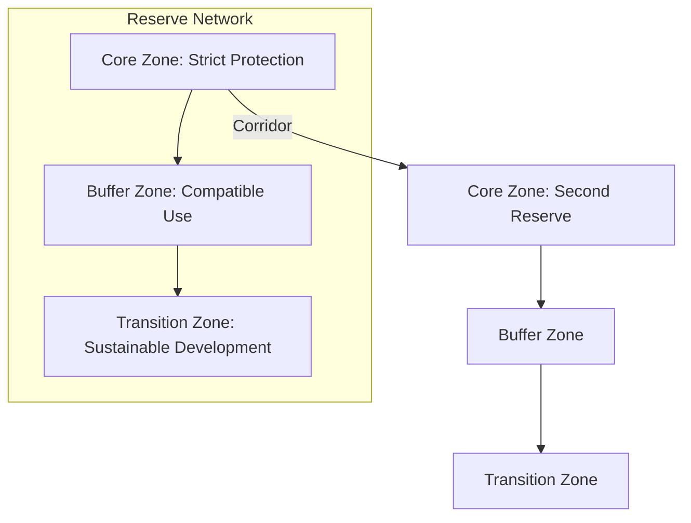

## Protected Areas and Reserve Design

### Overview

Protected areas are geographically defined spaces recognized, dedicated, and managed to achieve the long-term conservation of nature and associated ecosystem services and cultural values. Reserve design is the applied science of determining the size, shape, placement, and connectivity of these areas to maximize biodiversity persistence given ecological, social, and financial constraints. The discipline draws directly on island biogeography theory, metapopulation ecology, and landscape ecology, while increasingly incorporating climate resilience and human-dimensions considerations.

### IUCN Protected Area Categories

The IUCN defines a protected area as a clearly defined geographical space, recognized, dedicated and managed, through legal or other effective means, to achieve the long-term conservation of nature with associated ecosystem services and cultural values. Six management categories are recognized, differentiated primarily by permitted human use intensity:

- **Category Ia — Strict Nature Reserve.** Areas set aside to protect biodiversity and geological/geomorphological features, with strictly controlled and limited human visitation, use, and impact.
- **Category Ib — Wilderness Area.** Large unmodified or slightly modified areas retaining natural character and influence, without permanent or significant human habitation, managed to preserve their natural condition.
- **Category II — National Park.** Large natural or near-natural areas protecting large-scale ecological processes, with characteristic species and ecosystems, providing a foundation for environmentally and culturally compatible spiritual, scientific, educational, recreational, and visitor opportunities.
- **Category III — Natural Monument or Feature.** Areas set aside to protect a specific natural monument (landform, sea mount, marine cavern, geological feature, or a living feature such as an ancient grove).
- **Category IV — Habitat/Species Management Area.** Areas requiring active, targeted intervention to maintain habitats or meet the requirements of particular species.
- **Category V — Protected Landscape/Seascape.** Areas where the interaction of people and nature over time has produced a distinct character with significant ecological, biological, cultural, and scenic value, and where safeguarding this interaction is vital to protecting the area.
- **Category VI — Protected Area with Sustainable Use of Natural Resources.** Areas conserving ecosystems and habitats along with associated cultural values and traditional natural resource management systems, generally with low-level non-industrial natural resource use compatible with conservation as a principal objective.

Governance types (state-governed, shared governance, private, and Indigenous/community-conserved) are recorded orthogonally to these categories, reflecting who holds authority and responsibility rather than management intensity.

### Ecological Principles Underlying Reserve Design

Reserve design translates theoretical ecology into spatial planning rules. The foundational heuristics, largely derived from island biogeography theory and subsequent empirical work, include:

- **Larger reserves are generally preferable to smaller ones**, supporting larger populations with lower stochastic extinction risk and accommodating more species per the species-area relationship $S = cA^z$.
- **A single large reserve versus several small reserves of equal total area (SLOSS)** remains context-dependent: single large reserves better support area-sensitive species with large home ranges and minimize edge effects, while several small reserves can capture greater habitat heterogeneity and provide insurance against a single catastrophic event (e.g., fire, disease) affecting the entire population [Unverified — outcome depends on taxon dispersal ability, disturbance regime, and habitat specificity; no universal rule applies].
- **Reserves positioned closer together facilitate higher rates of gene flow and recolonization** than distant reserves, all else equal.
- **Connectivity via corridors between reserves** supports metapopulation persistence and enables range shifts, though corridors can also facilitate the spread of invasive species, pathogens, and fire.
- **Compact, circular reserve shapes minimize edge-to-area ratio** relative to elongated or irregular shapes of equivalent area, reducing exposure to edge effects.
- **Buffer zones surrounding core protected habitat** attenuate edge effects and can accommodate compatible human use, reducing conflict pressure on the core.

### Edge Effects

Edge effects are the ecological alterations occurring at the boundary between two habitat types, typically where a natural habitat meets human-modified land. Key edge-associated changes include:

- **Abiotic changes** — altered light penetration, wind exposure, temperature, and humidity relative to interior habitat.
- **Biotic changes** — shifts in species composition favoring edge-tolerant or generalist species, increased predation and nest parasitism (e.g., elevated brood parasitism by brown-headed cowbirds in fragmented North American forests), and altered plant community structure due to increased light and wind disturbance.
- **Edge penetration depth** — the distance edge effects extend into a fragment interior varies by variable measured and taxon, but can range from tens to several hundred meters, meaning small or narrow fragments may contain effectively no true "core" habitat.

The ratio of edge to interior habitat scales unfavorably with decreasing reserve size and increasingly elongated or irregular shape, which is a central quantitative argument for the "bigger and more compact is generally better" reserve design heuristic.

### Core-Buffer-Corridor Model

A widely applied conceptual framework for reserve network design, particularly formalized in UNESCO Biosphere Reserves, structures protected landscapes into concentric functional zones:

- **Core zone** — strictly protected area preserving representative ecosystems with minimal human disturbance, functioning as the primary source of biodiversity and ecological processes.
- **Buffer zone** — surrounds or adjoins the core, permitting activities compatible with conservation objectives (e.g., research, environmental education, low-impact recreation, sustainable resource use), functioning to absorb and mitigate edge effects and human pressure before they reach the core.
- **Transition (or cooperation) zone** — the outermost zone where sustainable human settlement, agriculture, and resource use occur, managed collaboratively with local communities and stakeholders.
- **Corridors** — linear or stepping-stone habitat linkages connecting core areas across the broader landscape matrix, maintaining functional connectivity for dispersal, gene flow, and climate-driven range shifts.

### Systematic Conservation Planning

Modern reserve network design relies on systematic, quantitative prioritization rather than ad hoc placement, following a structured workflow:

1. **Define conservation targets** — species, habitats, or ecological processes to be represented (e.g., a target percentage of each vegetation type's original extent).
2. **Assess current representation** — evaluate the extent to which existing protected areas already capture each target.
3. **Set quantitative representation goals** — e.g., "protect at least 17% of each ecoregion" (aligned with international targets such as the Convention on Biological Diversity's Kunming-Montreal Global Biodiversity Framework, which sets a 30% by 2030 target for terrestrial and marine areas).
4. **Identify priority areas via optimization algorithms** — software tools such as Marxan and Zonation use complementarity-based algorithms to identify the minimum-area (or minimum-cost) set of sites that meets representation targets, explicitly accounting for irreplaceability (how essential a site is to meeting targets) and vulnerability (imminence of threat).
5. **Incorporate cost and feasibility constraints** — land acquisition cost, opportunity cost to competing land uses, and social/political feasibility.
6. **Implement, monitor, and adaptively manage** — reserve networks are revisited iteratively as new ecological data, climate projections, and land-use pressures emerge.

**Complementarity** is a central concept in this workflow: rather than selecting sites solely by species richness, complementarity-based selection prioritizes sites that add the greatest marginal contribution of unrepresented species or habitat types to the existing network, which more efficiently achieves representation targets with less total area.

### Climate Change Considerations in Reserve Design

Contemporary reserve design increasingly incorporates climate resilience principles, since static protected area boundaries drawn under historical climate assumptions may not remain suitable for their target species as conditions shift:

- **Climate corridors and connectivity along environmental gradients** (e.g., elevational or latitudinal) to facilitate species range shifts as suitable climate envelopes move.
- **Protecting climate refugia** — areas buffered from regional climate change trends by topography, hydrology, or microclimate (e.g., north-facing slopes, riparian zones, high-elevation areas).
- **Representing environmental heterogeneity** rather than only current species distributions, since protecting diverse abiotic conditions (geophysical stage) provides a more climate-robust conservation strategy than targeting current occurrences alone.
- **Dynamic/adaptive reserve boundaries** — some frameworks propose flexible or expandable reserve boundaries, though this raises significant governance and land-tenure implementation challenges [Unverified — implementation remains largely at pilot/proposal stage in most jurisdictions].

### Marine Protected Areas (MPAs) — Design Considerations

Marine reserve design shares core principles with terrestrial reserve design but requires additional considerations due to the three-dimensional, highly connected nature of marine systems:

- **Larval dispersal distances** determine appropriate spacing between no-take zones to maintain population connectivity via larval transport.
- **No-take zones** (fully protected from extraction) generally produce stronger biomass and biodiversity recovery than multiple-use MPAs, though multiple-use zones can achieve broader stakeholder buy-in and compliance.
- **Spillover effects** — the net export of adult and juvenile individuals from no-take zones into adjacent fished areas, which can benefit local fisheries and is often used as an argument for MPA establishment with fishing communities.
- **Habitat representation across depth gradients and substrate types** (reef, seagrass, mangrove, open water) is necessary since marine biodiversity is highly stratified by depth and habitat type.

### Effectiveness Metrics and Management Evaluation

Protected area effectiveness is assessed along multiple, sometimes independent, dimensions:

- **Management effectiveness** — whether the reserve is being actively and adequately managed (staffing, funding, enforcement capacity), commonly assessed via frameworks such as the IUCN's Management Effectiveness Tracking Tool (METT).
- **Ecological effectiveness** — whether the reserve is actually achieving measurable biodiversity outcomes (species trends, habitat condition), which requires long-term ecological monitoring distinct from administrative management assessment.
- **"Paper parks"** — a term for protected areas that are legally designated but lack effective on-the-ground management, enforcement, or funding, resulting in minimal or no real conservation benefit despite formal protected status.
- **Additionality** — the degree to which a protected area's outcomes exceed what would have occurred in its absence (i.e., counterfactual analysis), an increasingly emphasized rigor standard in evaluating protected area impact.

### Illustrative Example: Comparing Reserve Configurations

**Example:** Consider 400 km² of contiguous forest habitat available for protection under two design options: (a) one 400 km² reserve, or (b) four separate 100 km² reserves distributed across the landscape. For a wide-ranging carnivore requiring large contiguous territories, option (a) likely better sustains a viable single population due to lower edge-to-area ratio and larger core habitat. For a set of habitat specialists with patchy microhabitat requirements and short dispersal distances, option (b) may capture greater habitat heterogeneity and provide redundancy against a localized catastrophic event (e.g., a disease outbreak or fire in one reserve). This trade-off illustrates why the SLOSS question does not have a universal answer and must be resolved based on the ecology of the target taxa and the disturbance regime of the region.

### Reserve Shape and Edge-to-Area Comparison (svg_diagram)

<svg xmlns="http://www.w3.org/2000/svg" viewBox="0 0 700 320">
<text x="350" y="28" font-size="18" font-weight="bold" text-anchor="middle" fill="#1a1a1a">Reserve Shape and Edge Effects (svg_diagram)</text>
<circle cx="170" cy="170" r="90" fill="#4a8f4a" opacity="0.75" stroke="#2a5a2a" stroke-width="2" />
<circle cx="170" cy="170" r="60" fill="#2a5a2a" opacity="0.6" />
<text x="170" y="175" font-size="12" text-anchor="middle" fill="#ffffff">Core habitat</text>
<text x="170" y="280" font-size="13" text-anchor="middle" fill="#333">Compact shape</text>
<text x="170" y="298" font-size="11" text-anchor="middle" fill="#555">Low edge-to-area ratio</text>
<rect x="420" y="110" width="240" height="60" fill="#8fbf6f" opacity="0.75" stroke="#5a7a3a" stroke-width="2" />
<rect x="450" y="122" width="180" height="36" fill="#5a7a3a" opacity="0.6" />
<text x="540" y="145" font-size="12" text-anchor="middle" fill="#ffffff">Core</text>
<text x="540" y="280" font-size="13" text-anchor="middle" fill="#333">Elongated shape</text>
<text x="540" y="298" font-size="11" text-anchor="middle" fill="#555">High edge-to-area ratio</text>

<text x="350" y="215" font-size="11" text-anchor="middle" fill="`#7a3a3a`">Same total area — different edge exposure</text>

</svg>

### Related Topics

- Island biogeography theory and species-area relationships
- Metapopulation dynamics and source-sink theory
- Systematic conservation planning software (Marxan, Zonation, Prioritizr)
- Landscape connectivity modeling (least-cost path analysis, circuit theory, graph-based connectivity metrics)
- Convention on Biological Diversity and the Kunming-Montreal Global Biodiversity Framework (30x30 target)
- Indigenous and Community Conserved Areas (ICCAs) and co-management governance models
- Transboundary conservation areas (peace parks)
- Rewilding and large-scale ecological restoration
- Climate-adaptive conservation planning and assisted migration