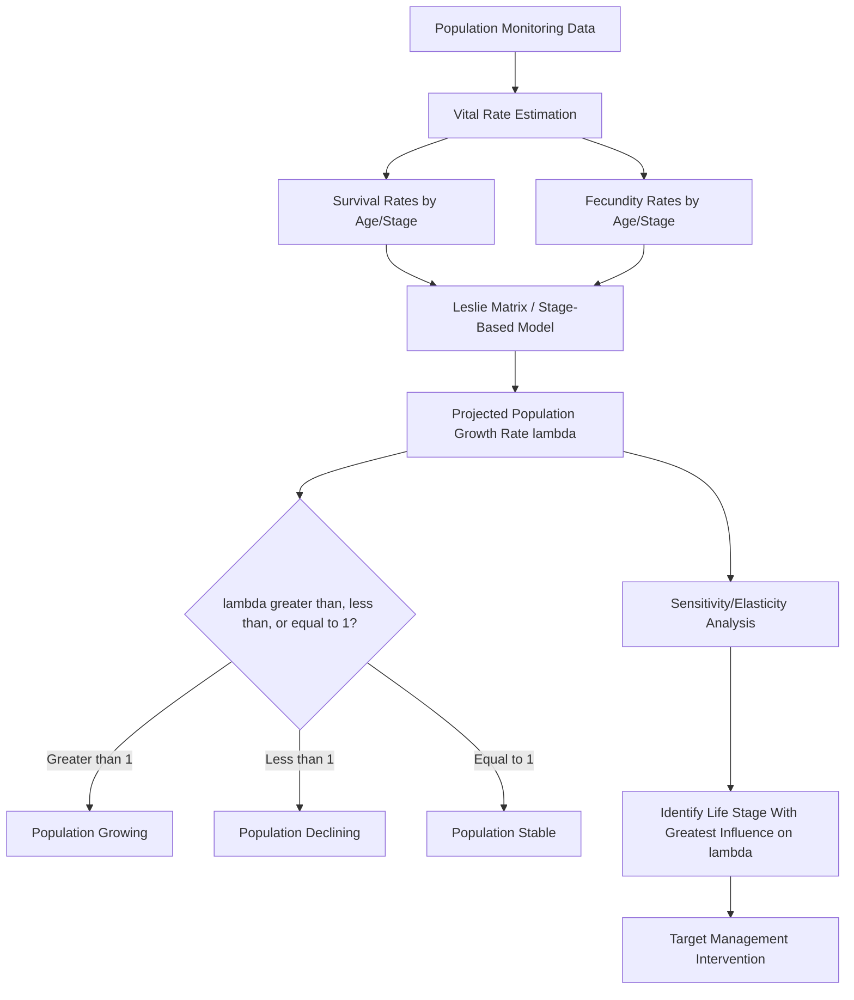
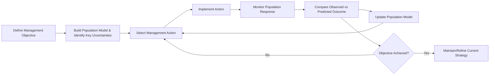

## Wildlife Population Management

### Overview

Wildlife population management is the applied practice of monitoring, manipulating, and regulating animal populations to achieve specific ecological, conservation, or human-use objectives. It draws on population ecology, demography, and quantitative modeling to translate theoretical understanding of population dynamics into actionable management interventions — ranging from protecting critically small populations from extinction to controlling overabundant or invasive populations that threaten ecosystem integrity or human interests.

### Population Growth Models

Quantitative population models form the analytical foundation for management decisions, providing a baseline against which observed dynamics and intervention outcomes are evaluated.

**Exponential growth** describes unconstrained population growth under unlimited resources:

$$\frac{dN}{dt} = rN$$

where $N$ is population size, $t$ is time, and $r$ is the intrinsic rate of increase. This model is rarely realistic over the long term but is useful for characterizing early-stage growth (e.g., invasive species establishment or post-reintroduction recovery) and for estimating maximum potential growth rates.

**Logistic growth** incorporates density dependence via carrying capacity ($K$), the maximum population size an environment can sustain given available resources:

$$\frac{dN}{dt} = rN\left(1 - \frac{N}{K}\right)$$

As $N$ approaches $K$, growth rate slows due to resource limitation, competition, and other density-dependent factors, producing a sigmoidal growth curve. Management applications frequently reference $K$ as a target or ceiling — for example, setting harvest quotas relative to the population's position on the logistic curve.

**Density-dependent versus density-independent factors** distinguish regulatory mechanisms:

- **Density-dependent factors** — intensify in effect as population density increases (e.g., intraspecific competition for food or nesting sites, density-dependent disease transmission, predation focused disproportionately on abundant prey).
- **Density-independent factors** — affect population vital rates regardless of density (e.g., severe weather events, catastrophic habitat loss).

Most real populations are regulated by a combination of both, and disentangling their relative contributions is central to diagnosing the cause of a population decline or irruption.

### Demographic Parameters and Life Tables

Effective management requires quantifying the vital rates governing population change:

- **Natality (birth rate)**, **mortality (death rate)**, **immigration**, and **emigration** collectively determine net population change: $\Delta N = (B + I) - (D + E)$.
- **Age-structured (Leslie matrix) models** project population trajectories by tracking age- or stage-specific survival and fecundity rates, enabling identification of which life stages most strongly influence overall population growth rate ($\lambda$) via sensitivity and elasticity analysis.
- **Survivorship curves** classify species by the pattern of mortality across the lifespan:
  - **Type I** — low mortality early and mid-life, sharply increasing mortality in old age (typical of large mammals, including humans).
  - **Type II** — roughly constant mortality rate across the lifespan (typical of some birds and small mammals).
  - **Type III** — high early mortality that declines sharply for survivors (typical of species with high fecundity and minimal parental investment, e.g., many fish and invertebrates).
- **Life tables** tabulate age-specific survival ($l_x$) and fecundity ($m_x$) values, from which the net reproductive rate ($R_0 = \sum l_x m_x$) and generation time can be derived.

### Carrying Capacity Concepts in Management

Carrying capacity is applied in management practice through several related but distinct formulations:

- **Ecological carrying capacity ($K$)** — the population size an environment can sustainably support given food, water, shelter, and space, as used in logistic growth models.
- **Economic carrying capacity** — a management-imposed population threshold, typically below ecological $K$, set to balance wildlife populations against competing economic or land-use interests (e.g., agricultural damage thresholds).
- **Cultural (social) carrying capacity** — the population level a human community is willing to tolerate, which can be substantially lower than either ecological or economic capacity and is often the binding constraint in human-dominated landscapes (e.g., tolerance thresholds for large carnivores near settlements).

Management targets frequently reflect a negotiated balance among these three capacities rather than ecological carrying capacity alone.

### Harvest Management Models

For populations subject to legal or subsistence harvest (hunting, fishing), sustainable yield theory provides the quantitative basis for setting harvest quotas:

- **Maximum Sustainable Yield (MSY)** — under the logistic model, the harvest rate that can be sustained indefinitely is maximized at $N = K/2$, where population growth rate is highest. Harvesting at this population level theoretically allows the largest continuous yield without depleting the population over time.

$$\text{Yield}_{MSY} = \frac{rK}{4}$$

- **Fixed quota harvest** — removing a constant number of individuals per period, which carries risk of population collapse if applied during a period of natural decline, since it does not adjust to population size.
- **Fixed effort (proportional) harvest** — removing a constant proportion of the population per period, which self-adjusts (in absolute numbers) as population size changes and is generally more robust to population fluctuations than fixed quota harvest [Inference: this comparative robustness is a well-established result in harvest theory, though real-world effectiveness depends on accurate population estumates].
- **Adaptive harvest management** — an iterative framework (formalized extensively in North American waterfowl management) that sets harvest regulations based on current population models, monitors outcomes, and updates both regulations and the underlying models as new data accumulate, explicitly incorporating model uncertainty into decision-making.

The MSY concept, while foundational, has been substantially critiqued: it assumes a stable, well-characterized $K$ and $r$, ignores age/sex structure and genetic considerations, and can produce unstable or unsustainable outcomes when population estimates are uncertain or environmental conditions are non-stationary [Inference — this critique reflects broad consensus in contemporary fisheries and wildlife management literature].

### Population Monitoring and Survey Methods

Reliable management decisions depend on accurate abundance and demographic estimates, obtained through methods selected based on species detectability, mobility, and habitat:

- **Mark-recapture (capture-mark-recapture, CMR)** — individuals are captured, marked, released, and resampled; population size is estimated from the ratio of marked to unmarked individuals in subsequent samples (e.g., the Lincoln-Petersen estimator for closed populations, or more complex models such as Jolly-Seber for open populations with births, deaths, immigration, and emigration).

$$\hat{N} = \frac{n_1 \times n_2}{m_2}$$

where $n_1$ is the number marked in the first sample, $n_2$ is the total captured in the second sample, and $m_2$ is the number of marked individuals recaptured in the second sample.

- **Distance sampling (line transect / point transect)** — estimates density by modeling the declining probability of detecting an individual or group as perpendicular distance from a transect line or point increases.
- **Camera trapping** — used for density/occupancy estimation, particularly for individually identifiable species (e.g., via unique coat patterns) through spatially explicit capture-recapture (SECR) models, or for occupancy modeling in non-identifiable species.
- **Occupancy modeling** — estimates the proportion of sites occupied by a species while explicitly accounting for imperfect detection probability, distinguishing "true absence" from "not detected."
- **Aerial and ground counts** — direct counts (total or sample-block counts) commonly used for large, visible mammals in open habitats, subject to detectability and observer bias corrections.
- **Genetic/eDNA sampling** — non-invasive genetic sampling (scat, hair) for individual identification and abundance estimation, and environmental DNA sampling of water or soil for species presence detection, particularly valuable for cryptic or aquatic species.

### Overabundance and Population Control

When populations exceed ecological, economic, or cultural carrying capacity — often due to predator loss, habitat alteration, or introduction to novel ranges — management shifts toward reduction strategies:

- **Regulated hunting/culling** — direct lethal removal, calibrated via harvest models to reduce population toward a target level.
- **Fertility control** — chemical or immunocontraceptive methods (e.g., porcine zona pellucida vaccines used in some deer and horse populations) that reduce reproduction without lethal removal, generally slower-acting and more resource-intensive than culling but preferred where lethal control faces social or ethical opposition.
- **Translocation** — physically relocating individuals to reduce local density, though this is often logistically costly, can produce high post-release mortality, and can create management problems in receiving areas.
- **Predator restoration/reintroduction** — reintroducing extirpated top predators to restore top-down regulation, a strategy documented most prominently in trophic cascade research (e.g., wolf reintroduction and its cascading effects on elk behavior and riparian vegetation in Yellowstone) [Inference — trophic cascade magnitude and mechanism remain an area of active ecological research and some debate regarding relative contribution of density versus behavioral effects].

### Small/Endangered Population Management

Management of critically small or declining populations emphasizes genetic and demographic rescue rather than reduction:

- **Captive breeding and reintroduction programs** — structured breeding to maximize retained genetic diversity (often guided by studbooks and mean kinship minimization algorithms), followed by reintroduction to restore wild populations.
- **Genetic rescue** — introducing individuals from a genetically distinct population to increase heterozygosity and reduce inbreeding depression in a small, isolated population.
- **Headstarting** — captive-rearing individuals through their most vulnerable early life stage (e.g., turtle hatchlings) before release, to boost survivorship past the highest-mortality period.
- **Supplemental feeding and predator control** — short-term interventions to boost survival or reproduction during critical population bottlenecks, generally used cautiously given risks of creating management dependency or unintended ecological side effects.
- **Population Viability Analysis (PVA)** — used iteratively to evaluate the projected effect of candidate management interventions (e.g., comparing extinction probability under a genetic rescue scenario versus a do-nothing baseline) before committing management resources.

### Invasive Species Population Management

Invasive or introduced species require management approaches emphasizing early detection and, where eradication is infeasible, long-term suppression:

- **Prevention and biosecurity** — the most cost-effective intervention point, preventing establishment before it occurs.
- **Early Detection and Rapid Response (EDRR)** — intensive monitoring for new incursions combined with rapid, aggressive control while population size and spatial extent remain small (and thus eradication remains feasible).
- **Eradication** — complete removal, generally only feasible for populations that are small, geographically contained (e.g., islands), and detectable at low density; requires eliminating the population faster than it can reproduce, meaning eradication effort must exceed a threshold intensity throughout the entire treatment area.
- **Long-term suppression/containment** — for widely established invasives where eradication is infeasible, management shifts to sustained population suppression below a damage threshold, or containment to prevent further spread into uninvaded areas.
- **Biological control** — introducing a natural enemy (predator, parasite, pathogen) of the invasive species, which carries its own ecological risk assessment burden given historical cases of biocontrol agents themselves becoming invasive or attacking non-target native species.

### Adaptive Management Framework

Because wildlife populations are dynamic and management interventions carry inherent uncertainty, **adaptive management** is widely adopted as an overarching decision framework: management actions are explicitly treated as experiments, outcomes are monitored systematically, and both the population model and future management actions are revised based on observed results. This iterative "learning by doing" approach is distinguished from simple trial-and-error by its structured, hypothesis-driven monitoring design intended to reduce specific, pre-identified sources of uncertainty.

### Illustrative Example: Setting a Sustainable Harvest Quota

**Example:** A deer population is estimated at $N = 3{,}000$ individuals via aerial distance sampling, with a locally estimated intrinsic growth rate $r = 0.25$ and carrying capacity $K = 5{,}000$ (from historical habitat-based estimates). Applying the MSY formula: $\text{Yield}_{MSY} = rK/4 = (0.25 \times 5{,}000)/4 = 312.5$ individuals per year, achieved when the population is maintained near $N = K/2 = 2{,}500$. Since the current population (3,000) is above this target, a manager might set an initial harvest quota moderately above the MSY estimate to move the population toward $K/2$, then transition to a fixed-effort quota (e.g., harvesting a fixed 10% of the estimated population annually) once the target density is reached — combined with continued mark-recapture or distance-sampling monitoring to update population estimates each season under an adaptive management framework, since a static quota based on initial parameter estimates risks under- or over-harvest if $r$ or $K$ were misestimated or shift due to environmental change.

### Logistic Growth Curve and MSY Point (svg_diagram)

<svg xmlns="http://www.w3.org/2000/svg" viewBox="0 0 700 380">
<text x="350" y="26" font-size="18" font-weight="bold" text-anchor="middle" fill="#1a1a1a">Logistic Growth and Maximum Sustainable Yield (svg_diagram)</text>
<line x1="70" y1="330" x2="640" y2="330" stroke="#333" stroke-width="2" />
<line x1="70" y1="330" x2="70" y2="50" stroke="#333" stroke-width="2" />
<text x="355" y="365" font-size="13" text-anchor="middle" fill="#333">Population Size (N)</text>
<text x="30" y="190" font-size="13" text-anchor="middle" fill="#333" transform="rotate(-90 30 190)">Growth Rate (dN/dt)</text>
<path d="M 70 330 Q 250 60 420 190 T 640 330" fill="none" stroke="#2a6a4a" stroke-width="3" />
<line x1="355" y1="330" x2="355" y2="80" stroke="#a33" stroke-width="1.5" stroke-dasharray="5,4" />
<circle cx="355" cy="80" r="6" fill="#a33" />
<text x="380" y="75" font-size="12" fill="#a33">MSY point (N = K/2)</text>
<line x1="640" y1="330" x2="640" y2="300" stroke="#555" stroke-width="1" />
<text x="640" y="345" font-size="12" text-anchor="middle" fill="#555">K</text>
<line x1="70" y1="330" x2="70" y2="330" stroke="#555" />
<text x="70" y="345" font-size="12" text-anchor="middle" fill="#555">0</text>

<text x="355" y="355" font-size="11" text-anchor="middle" fill="#555">K/2</text>

</svg>

### Related Topics

- Population Viability Analysis and extinction risk modeling
- Trophic cascades and predator-prey dynamics
- Wildlife disease ecology and epidemiological modeling
- Human-wildlife conflict mitigation strategies
- Fisheries stock assessment methods
- Genetic management of small and captive populations
- Invasive species risk assessment frameworks
- Structured decision making in conservation