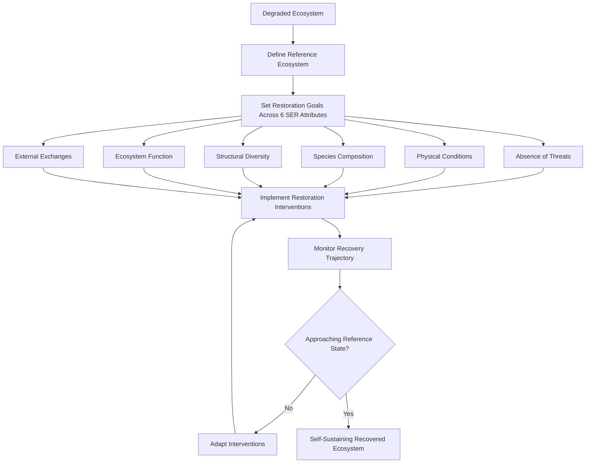

## Restoration Ecology

### Overview

Restoration ecology is the scientific discipline underpinning ecological restoration: the process of assisting the recovery of an ecosystem that has been degraded, damaged, or destroyed. It is distinguished from related practices (reclamation, rehabilitation) by its explicit goal of returning a site as closely as possible to a historical or reference ecological trajectory — including its structure, composition, and function — rather than merely stabilizing a degraded site or optimizing it for a single human use. The Society for Ecological Restoration (SER) defines the field's guiding standards through the SER International Standards for the Practice of Ecological Restoration, widely used as the discipline's applied reference framework.

### Restoration Versus Related Concepts

Precise terminology distinguishes restoration from adjacent land management practices, which is important both scientifically and for regulatory/mitigation contexts:

- **Ecological restoration** — assisting the recovery of a degraded, damaged, or destroyed ecosystem toward a historical or reference trajectory, targeting structure, composition, and function.
- **Rehabilitation** — repairing degraded ecosystem functions and services without necessarily returning the system to its pre-disturbance historical condition (e.g., restoring soil stability and productivity without reestablishing the original native plant community).
- **Reclamation** — converting a severely disturbed site (e.g., a mine site) into a stable, functioning landscape, often prioritizing engineering stability and erosion control over ecological fidelity to a historical reference.
- **Mitigation** — compensatory habitat creation, restoration, or enhancement required to offset unavoidable ecological damage from development elsewhere, frequently governed by regulatory frameworks (e.g., wetland mitigation banking).
- **Rewilding** — a related but distinct approach emphasizing the restoration of natural processes and, often, trophic complexity (including apex predators) with reduced ongoing human management, sometimes over larger and less spatially constrained areas than traditional site-based restoration.

### Reference Ecosystems and Historical Trajectory

A **reference ecosystem** is the model — drawn from historical records, relict/undisturbed remnant sites, or paleoecological data — that guides restoration targets for species composition, structure, and ecological function. Selecting an appropriate reference ecosystem is a foundational and often contested step, complicated by several factors:

- **Shifting baselines** — the tendency for each generation of ecologists and managers to accept the ecological conditions they first observed as the normal or natural baseline, potentially underestimating the degree of historical degradation and setting insufficiently ambitious restoration targets.
- **No-analog communities** — some historical reference conditions may be ecologically unattainable under current climate, altered disturbance regimes, or novel species interactions (e.g., invasive species, pathogens now present in the landscape), requiring restoration targets to be reconsidered under a **novel ecosystems** framework.
- **Climate change non-stationarity** — historical reference conditions may not be climatically appropriate for a site's future trajectory, prompting some practitioners to advocate restoration toward a "future-adapted" rather than strictly historical reference state [Unverified — an actively debated position within the discipline, not a settled consensus].

### The SER Five-Star Recovery Framework

The SER standards define ecosystem recovery across six ecosystem attributes, often visualized as a "recovery wheel" or "five-star" system tracking progress from a degraded starting point toward the reference ecosystem across:

1. **Absence of threats** — removal or control of the disturbance factors that caused degradation (e.g., invasive species, altered hydrology, pollution sources).
2. **Physical conditions** — substrate, hydrology, and landform restored to conditions capable of sustaining the target ecosystem.
3. **Species composition** — presence of native species characteristic of the reference ecosystem, and absence or control of undesirable invasive/exotic species.
4. **Structural diversity** — reestablishment of the physical structure characteristic of the reference ecosystem (e.g., canopy layers, coarse woody debris, soil horizon development).
5. **Ecosystem function** — recovery of functional processes such as nutrient cycling, pollination, trophic interactions, and productivity.
6. **External exchanges with the surrounding landscape** — reestablishment of connectivity and exchange processes (species dispersal, water flow, gene flow) with the surrounding landscape.

Progress across these six attributes is often depicted on a five-point scale (0–5 stars) per attribute, providing a standardized, semi-quantitative tool for evaluating restoration progress against the reference ecosystem over time.

### Succession Theory and Restoration

Restoration practice is grounded in ecological succession theory, since recovering ecosystems typically pass through successional stages en route to a target community state:

- **Primary succession** — colonization of a substrate previously devoid of life (e.g., bare rock, volcanic deposits, glacial retreat), beginning with pioneer species capable of establishing on unweathered substrate.
- **Secondary succession** — recovery following disturbance of a site that retains soil and often a residual seed bank or propagule source, generally proceeding faster than primary succession due to the presence of soil structure and nutrients.
- **Facilitation, tolerance, and inhibition models** (Connell and Slatyer, 1977) describe alternative mechanisms by which early-successional species influence the establishment of later-successional species: facilitation (early species improve conditions for later species), tolerance (early species neither help nor hinder later species, which establish based on their own tolerance of prevailing conditions), and inhibition (early species actively suppress establishment of later species, requiring disturbance or senescence to permit succession to proceed).
- **Alternative stable states** — some degraded ecosystems can become "locked" in a persistent, self-reinforcing degraded state (e.g., a shrub-dominated state resistant to tree recolonization due to altered fire regime or soil chemistry) that will not spontaneously revert to the reference trajectory without active intervention to overcome the stabilizing feedback.

### Restoration Techniques

Restoration interventions are selected based on the degree of degradation, the specific limiting factors preventing natural recovery, and resource availability:

- **Passive restoration (natural regeneration)** — removing the disturbance factor (e.g., grazing, invasive species pressure) and allowing natural successional processes to proceed without active planting, generally the lowest-cost approach and preferred where propagule sources and appropriate physical conditions remain intact.
- **Active restoration** — direct intervention including planting, seeding, and structural modification, required when natural regeneration is limited by seed source scarcity, competitive exclusion by invasives, or severely altered physical conditions.
- **Assisted natural regeneration** — an intermediate approach combining minimal targeted interventions (e.g., protecting existing natural regeneration from further disturbance, removing barriers to recruitment) with reliance on natural recruitment processes rather than full-scale planting.
- **Soil and hydrology restoration** — reestablishing appropriate soil structure, mycorrhizal associations, nutrient cycling, and hydrological regime (e.g., dam removal, culvert replacement, wetland hydrology restoration), often a necessary precondition for successful vegetation establishment.
- **Species reintroduction** — direct planting/seeding of native flora, or translocation/reintroduction of native fauna, guided by genetic provenance considerations (see below).
- **Invasive species removal** — mechanical, chemical, or biological control of invasive species that impede native recovery, frequently an ongoing management requirement rather than a one-time intervention.
- **Prescribed fire and disturbance regime restoration** — reintroducing historical disturbance regimes (fire, flooding, grazing) that many ecosystems depend on for structure and species composition maintenance.

### Genetic and Provenance Considerations in Restoration Planting

Sourcing plant material for restoration involves genetic considerations analogous to those in conservation genetics:

- **Local provenance ("local is best") principle** — historically the dominant paradigm, prioritizing seed/plant sourcing from local populations to maximize local adaptation and minimize risk of outbreeding depression or disruption of local genetic structure.
- **Climate-adjusted provenancing** — an increasingly adopted alternative that deliberately sources some plant material from populations adapted to warmer or drier conditions anticipated under climate change, aiming to pre-adapt restored populations to future rather than historical climate [Unverified — actively debated regarding the appropriate balance between local adaptation risk and climate-readiness].
- **Genetic diversity of restoration stock** — restoration plantings sourced from a narrow genetic base (e.g., limited parent trees) risk establishing populations with reduced long-term adaptive capacity, analogous to genetic bottleneck concerns in conservation genetics.

### Restoration in Specific Ecosystem Types

Restoration techniques and challenges vary substantially by ecosystem type:

- **Forest restoration** — includes reforestation (replanting a previously forested site) and afforestation (establishing forest on a site not recently forested), with increasing emphasis on native species mixes, structural complexity, and avoiding monoculture plantations that provide limited biodiversity value relative to natural forest.
- **Wetland restoration** — frequently centers on hydrology restoration (reestablishing appropriate water table depth and flooding regime) as the primary limiting factor, since restored hydrology often triggers substantial passive vegetation recovery from residual seed banks.
- **Grassland/prairie restoration** — often requires reintroduction of historical disturbance regimes (fire, grazing) to prevent woody encroachment and maintain characteristic grassland species composition.
- **Stream and river restoration** — includes channel reconfiguration, riparian vegetation restoration, and removal of barriers (dams, culverts) to restore natural hydrological and sediment transport processes and reconnect aquatic habitat.
- **Coral reef restoration** — includes coral fragment propagation and outplanting (often via coral "nurseries"), substrate stabilization, and increasingly the selection or breeding of heat-tolerant coral genotypes given accelerating marine heatwave frequency.
- **Mine site reclamation/restoration** — typically begins with substrate stabilization and soil reconstruction before vegetation establishment, representing some of the most physically and chemically degraded starting conditions restoration ecology addresses.

### Monitoring and Adaptive Management in Restoration

Restoration projects require structured, long-term monitoring to evaluate progress and inform adaptive adjustment, mirroring the adaptive management framework used in wildlife population management:

- **Baseline and reference site monitoring** — establishing pre-restoration conditions and comparable reference ecosystem benchmarks against which recovery is measured.
- **Indicator selection** — choosing measurable, ecologically meaningful indicators (e.g., native species cover, soil organic matter, macroinvertebrate community composition) aligned with the SER six-attribute framework.
- **Trajectory analysis** — evaluating not just current condition but the rate and direction of change over time relative to the reference ecosystem trajectory, since restoration is inherently a long-term, multi-decade process for most ecosystem types (particularly forests).
- **Adaptive management** — using monitoring results to adjust ongoing interventions (e.g., supplemental planting, additional invasive control) rather than treating the initial restoration design as fixed.

### Illustrative Example: Wetland Restoration Sequencing

**Example:** A former agricultural field, historically a freshwater marsh drained via tile drainage decades earlier, is targeted for restoration. Rather than beginning with planting, the restoration plan first addresses hydrology: tile drains are removed or plugged, and a berm is reestablished to restore the historical water table depth and seasonal flooding regime, aligned with the SER "physical conditions" attribute. Monitoring after one growing season reveals substantial passive recruitment of native wetland plant species from the residual soil seed bank, reducing the need for active planting in the restored hydrology zone (illustrating passive restoration triggered by removing the limiting factor, rather than active restoration). In drier upland-transition zones where the seed bank was depleted by decades of tillage, active seeding of native prairie species is required. Multi-year monitoring tracks native cover, invasive species presence (particularly reed canary grass, a common wetland invasive competitor), and use by target wildlife indicator species (e.g., wetland-obligate bird species) as a proxy for ecosystem function recovery.

### Restoration Recovery Trajectory (svg_diagram)

<svg xmlns="http://www.w3.org/2000/svg" viewBox="0 0 700 380">

<text x="350" y="26" font-size="18" font-weight="bold" text-anchor="middle" fill="`#1a1a1a`">Ecosystem Recovery Trajectory (svg_diagram)</text>

<line x1="70" y1="330" x2="640" y2="330" stroke="#333" stroke-width="2" />

<line x1="70" y1="330" x2="70" y2="50" stroke="#333" stroke-width="2" />

<text x="355" y="365" font-size="13" text-anchor="middle" fill="#333">Time Since Intervention</text>

<text x="30" y="190" font-size="13" text-anchor="middle" fill="#333" transform="rotate(-90 30 190)">Ecological Condition</text>

<line x1="70" y1="90" x2="640" y2="90" stroke="`#2a6a2a`" stroke-width="2" stroke-dasharray="6,4" />

<text x="600" y="82" font-size="11" fill="`#2a6a2a`">Reference ecosystem</text>

<path d="M 70 320 C 200 300, 280 200, 380 140 S 560 100, 640 92" fill="none" stroke="`#3a6a9a`" stroke-width="3" />

<text x="450" y="180" font-size="11" fill="`#3a6a9a`">Active restoration trajectory</text>

<path d="M 70 320 C 250 310, 400 260, 640 200" fill="none" stroke="`#a3722a`" stroke-width="3" stroke-dasharray="3,3" />

<text x="470" y="235" font-size="11" fill="`#a3722a`">Passive/no intervention</text>

<circle cx="70" cy="320" r="6" fill="`#7a2a2a`" />

<text x="95" y="325" font-size="11" fill="`#7a2a2a`">Degraded start</text>

</svg>

### Related Topics

- Ecological succession theory and disturbance ecology
- Novel ecosystems and no-analog community frameworks
- Rewilding and trophic rewilding
- Wetland mitigation banking and regulatory restoration policy
- Seed bank ecology and native plant propagation
- Soil microbiome and mycorrhizal restoration
- Coral reef restoration and assisted evolution
- Long-term ecological monitoring design (BACI, trajectory analysis)