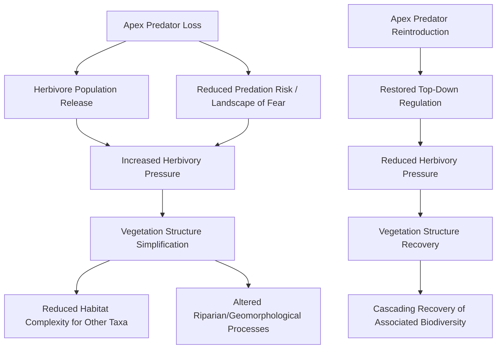
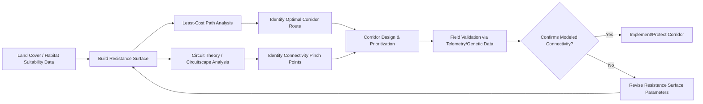

## Rewilding and Landscape Connectivity

### Overview

Rewilding is a conservation approach oriented toward restoring self-regulating, functionally complete ecosystems by reinstating natural ecological processes and, where feasible, trophic complexity, while progressively reducing the intensity of ongoing human management. It is often distinguished from conventional restoration ecology by its emphasis on process over prescribed compositional endpoints, larger spatial scale, and reduced long-term management intensity as a stated goal rather than a resource constraint. Landscape connectivity — the degree to which a landscape facilitates or impedes movement of organisms, genes, and ecological processes across space — is both a frequent objective of rewilding initiatives and an independent, foundational concept in landscape ecology and reserve network design.

### Core Concepts and Terminology

- **Rewilding** — restoring natural processes and reducing human management intensity to allow ecosystems to self-organize, often (though not always) including the restoration of missing trophic levels, particularly large herbivores and apex predators.
- **Trophic rewilding** — a specific rewilding strategy centered on restoring functionally important species interactions, especially top-down trophic regulation by large carnivores and the ecological effects of large herbivores, based on the premise that the loss of these species has caused cascading ecosystem simplification.
- **Passive rewilding** — allowing natural succession and process recovery to proceed with minimal active intervention, typically following removal or reduction of a limiting disturbance (e.g., abandonment of agricultural land).
- **Active rewilding** — deliberate reintroduction of species (herbivores, predators, ecosystem engineers) or restoration of specific processes (natural hydrology, fire regimes) to accelerate or enable recovery that would not proceed passively within a relevant timeframe.
- **Pleistocene rewilding** — a more speculative and contested proposal advocating the introduction of extant close ecological analogues of extinct Pleistocene megafauna (e.g., using African elephants as analogues for extinct proboscideans) to restore ecological functions lost since the late Pleistocene extinctions [Unverified/Speculation — this remains a minority position within the field, widely debated on ecological, feasibility, and risk grounds].
- **Landscape connectivity** — the degree to which landscape structure facilitates or impedes movement between habitat patches, commonly decomposed into structural connectivity (physical arrangement and configuration of habitat) and functional connectivity (how a specific organism actually responds to and moves through that structure, which depends on species-specific dispersal behavior and habitat permeability).

### Trophic Cascades and the Ecological Rationale for Rewilding

The central ecological argument for trophic rewilding rests on trophic cascade theory: the removal of apex predators can release herbivore populations from top-down control, leading to cascading effects on vegetation structure, other trophic levels, and even physical landscape processes (e.g., stream geomorphology via altered riparian vegetation). Two complementary mechanisms are typically invoked:

- **Density-mediated trophic cascades** — predators reduce prey abundance directly through predation, reducing herbivory pressure on vegetation.
- **Behaviorally-mediated trophic cascades (the "landscape of fear")** — the mere presence and predation risk posed by predators alters prey behavior (habitat use, vigilance, foraging patterns), which can independently affect vegetation even without large changes in prey population size.

The Yellowstone wolf reintroduction (beginning 1995) is the most widely cited case study for trophic cascade-driven rewilding outcomes, with reported effects on elk behavior and riparian vegetation recovery; however, the relative magnitude and mechanism of these effects (density-mediated versus behaviorally-mediated, and the extent of confounding factors such as concurrent climate variation and changing elk hunting pressure outside the park) remain subjects of ongoing scientific debate [Unverified — the popular "landscape of fear" narrative for this system in particular has been contested in subsequent peer-reviewed literature, and the scientific consensus on effect magnitude is less settled than commonly portrayed in general media].

### Landscape Connectivity: Structural vs. Functional

A critical distinction in connectivity science is that physical proximity or visible habitat linkage does not guarantee functional connectivity for a given species:

- **Structural connectivity** is measured directly from landscape spatial pattern (e.g., patch adjacency, corridor width, gap distances) independent of any particular organism's behavior.
- **Functional connectivity** depends on species-specific traits: dispersal ability, habitat specificity, perceptual range, and behavioral response to the intervening landscape matrix. A landscape structurally connected for a highly mobile, generalist species (e.g., many bird species) may be functionally fragmented for a poor-disperser or habitat specialist (e.g., many amphibians or forest-floor invertebrates).

This distinction has direct management implications: connectivity interventions (corridors, stepping stones) must be designed with reference to the dispersal ecology of specific target taxa, since a single corridor design will not achieve functional connectivity equally for all species in a landscape.

### Connectivity Modeling Approaches

Quantitative connectivity assessment underpins both rewilding corridor planning and broader reserve network design:

- **Least-cost path (LCP) analysis** — models landscape permeability as a "resistance surface" (a grid where each cell is assigned a movement cost based on habitat suitability, land cover, or known species response data), then computes the lowest cumulative-cost path between habitat patches, representing the most likely or efficient movement route.
- **Circuit theory (e.g., Circuitscape)** — models the landscape as an electrical circuit, treating habitat patches as nodes and resistance surface cells as resistors, which — unlike a single least-cost path — captures multiple possible movement routes simultaneously and identifies pinch points (areas of concentrated, non-redundant flow, analogous to high current density) that represent particularly critical and vulnerable connectivity bottlenecks.
- **Graph-theoretic connectivity metrics** — represent the landscape as a network graph of habitat patches (nodes) connected by edges weighted by connectivity strength (e.g., dispersal probability), enabling calculation of network-level metrics such as the Probability of Connectivity (PC) index and identification of patches whose removal would most severely fragment the network.
- **Corridor width and stepping-stone design** — corridors must be sized and spaced according to the dispersal ecology, edge sensitivity, and predation risk tolerance of target species; narrow corridors may function adequately for highly mobile species but fail to support movement of edge-avoidant interior species due to edge effect penetration across the corridor's width.

### Empirical Validation of Connectivity

Modeled connectivity requires empirical grounding and validation, since resistance surface parameters are frequently based on expert opinion or indirect proxies rather than direct movement data:

- **GPS/satellite telemetry** — direct tracking of individual animal movement paths, used both to parameterize resistance surfaces (by relating observed movement or habitat selection to landscape variables via step-selection functions or resource selection functions) and to validate whether modeled corridors correspond to actual movement routes.
- **Landscape genetics** — analyzing spatial patterns of genetic differentiation among individuals or populations to infer realized functional connectivity, under the premise that populations connected by frequent gene flow will show lower genetic differentiation than populations separated by resistant landscape features; techniques include isolation-by-distance and isolation-by-resistance modeling.
- **Camera trap networks** — documenting presence and movement of species (including at candidate corridor pinch points or wildlife crossing structures) to validate whether a designed connectivity feature is being used as intended.

### Rewilding Interventions and Techniques

- **Large herbivore reintroduction/restoration** — reintroducing or restoring functional densities of native large herbivores (e.g., bison, wild horses, tapirs) to restore grazing/browsing disturbance regimes that structure vegetation communities and create habitat heterogeneity.
- **Apex predator reintroduction** — reintroducing extirpated large carnivores to restore top-down trophic regulation, requiring careful assessment of prey base adequacy, habitat connectivity to support viable predator ranging behavior, and human-wildlife conflict mitigation planning given the typically large and politically sensitive footprint of carnivore reintroduction programs.
- **Ecosystem engineer restoration** — reintroducing species whose activities physically restructure habitat (e.g., beavers, whose dam-building restores wetland hydrology and creates habitat heterogeneity disproportionate to their own biomass).
- **Natural process restoration** — reinstating hydrological, fire, and flood disturbance regimes rather than (or in addition to) species reintroduction, on the premise that restoring process can be more tractable and durable than restoring specific species assemblages.
- **Land abandonment / passive succession management** — in some regions (notably parts of Europe), agricultural land abandonment is leveraged as a passive rewilding opportunity, allowing natural succession to proceed on former farmland with minimal intervention.
- **Wildlife crossing structures** — overpasses, underpasses, and culverts engineered to restore functional connectivity across major linear infrastructure barriers (highways, railways), a direct, infrastructure-scale connectivity intervention distinct from vegetative corridor restoration.

### Rewilding Spectrum and Management Intensity

Rewilding initiatives vary substantially in intervention intensity and spatial scale, often conceptualized along a spectrum rather than a single defined practice:

- **Small-scale, high-intervention** — reintroducing specific missing species or processes within an existing, actively managed reserve (closer to conventional restoration ecology in practice).
- **Landscape-scale, moderate-intervention** — large reintroduction programs spanning multiple land tenures, often requiring extensive stakeholder engagement and connectivity planning across a mixed-use landscape (e.g., large carnivore recovery across multi-jurisdictional ranges).
- **Continental-scale, low-intervention** — aspirational large-scale connectivity and rewilding networks (e.g., proposed wildlife corridor megaprojects spanning multiple countries), which face substantial governance, land tenure, and political feasibility challenges alongside their ecological ambition [Inference — feasibility at this scale is widely regarded as the primary constraint rather than ecological design, per the conservation planning literature].

### Social and Governance Dimensions

Rewilding, particularly involving large herbivore or carnivore reintroduction, carries distinct social dimensions relative to passive habitat protection:

- **Human-wildlife conflict** — reintroduced large herbivores and carnivores can generate direct economic costs (livestock predation, crop damage) and safety concerns for local communities, requiring proactive conflict mitigation (compensation schemes, non-lethal deterrents, land-use planning) integrated into rewilding program design.
- **Land tenure and stakeholder engagement** — landscape-scale connectivity and rewilding initiatives frequently span multiple private and public land tenures, requiring voluntary landholder participation, easements, or land-use agreements rather than relying solely on formal protected area designation.
- **Cultural and Indigenous perspectives** — rewilding narratives centered on "wilderness" absent human presence have been critiqued for overlooking long histories of Indigenous land stewardship and the ecological role of historical human management in shaping the very ecosystems used as restoration references [Unverified — an active area of critique and revision within contemporary rewilding discourse].

### Illustrative Example: Corridor Prioritization Between Two Reserves

**Example:** Two protected core reserves, 40 km apart, are separated by a matrix of agricultural land, a two-lane highway, and a narrow band of remnant riparian forest. A connectivity assessment for a forest-dependent, medium-sized carnivore begins by building a resistance surface: agricultural land is assigned high resistance (poor habitat, avoidance behavior), the highway is assigned very high resistance plus an explicit mortality risk factor, and the riparian forest band is assigned low resistance. Circuit theory analysis (e.g., via Circuitscape) identifies the point where the riparian corridor crosses the highway as a severe pinch point — nearly all modeled current flow is forced through this single narrow crossing. GPS telemetry data from radio-collared individuals confirms this location as a genuine, frequently used crossing point, but also reveals elevated road-mortality incidents there. This combined evidence prioritizes the site for a wildlife crossing structure (underpass) as the single highest-value connectivity intervention in the landscape, illustrating how structural, functional, and empirical connectivity evidence converge to guide investment.

### Structural vs. Functional Connectivity Comparison (svg_diagram)

<svg xmlns="http://www.w3.org/2000/svg" viewBox="0 0 700 360">
<text x="350" y="26" font-size="18" font-weight="bold" text-anchor="middle" fill="#1a1a1a">Structural vs. Functional Connectivity (svg_diagram)</text>
<circle cx="130" cy="150" r="55" fill="#3a7a4a" opacity="0.8" />
<text x="130" y="155" font-size="12" text-anchor="middle" fill="#fff">Patch A</text>
<circle cx="560" cy="150" r="55" fill="#3a7a4a" opacity="0.8" />
<text x="560" y="155" font-size="12" text-anchor="middle" fill="#fff">Patch B</text>
<rect x="185" y="135" width="370" height="30" fill="#7a9e5a" opacity="0.6" />
<text x="350" y="120" font-size="11" text-anchor="middle" fill="#3a5a2a">Continuous forest band (structurally connected)</text>

<text x="130" y="240" font-size="12" text-anchor="middle" fill="#333">Generalist bird species:</text>

<text x="130" y="258" font-size="11" text-anchor="middle" fill="`#2a6a2a`">Functionally connected</text>

<line x1="200" y1="290" x2="500" y2="290" stroke="#a33" stroke-width="3" stroke-dasharray="6,4" />
<text x="350" y="315" font-size="12" text-anchor="middle" fill="#333">Forest-floor amphibian:</text>
<text x="350" y="333" font-size="11" text-anchor="middle" fill="#a33">Functionally fragmented (edge-avoidant, poor disperser)</text>
</svg>

### Related Topics

- Trophic cascade theory and top-down/bottom-up regulation
- Least-cost path and circuit theory connectivity modeling (Circuitscape)
- Landscape genetics and isolation-by-resistance
- Large carnivore reintroduction and human-wildlife conflict management
- Ecosystem engineers and keystone species interactions
- Protected area network design and reserve connectivity
- Climate change adaptation corridors and range-shift facilitation
- Indigenous land stewardship and co-management in conservation