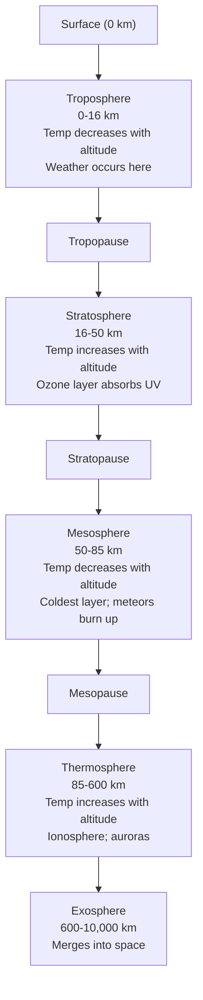

## Composition and Structure of the Atmosphere

### Overview

The atmosphere is the gaseous envelope surrounding Earth, held in place by gravity and structured into distinct layers based on temperature gradients, composition, and physical behavior. It is the medium in which weather occurs, the shield against harmful solar radiation, and the reservoir of gases essential for life. Understanding its composition and vertical structure underpins nearly all subsequent topics in atmospheric science, climatology, and meteorology.

### Chemical Composition of the Atmosphere

**Key Points**

- The atmosphere is a mixture of gases, not a single compound, and its composition is treated in two categories: permanent (constant) gases and variable gases.
- Composition is typically reported by volume for dry air (excluding water vapor), since water vapor concentration varies drastically by location and time.

#### Permanent Gases

These maintain a nearly constant ratio up to about 80 km altitude (the homosphere) because turbulent mixing dominates over gravitational settling.

| Gas | Chemical Formula | Approx. % by Volume (dry air) |
| --- | --- | --- |
| Nitrogen | $N_2$ | 78.08% |
| Oxygen | $O_2$ | 20.95% |
| Argon | $Ar$ | 0.93% |
| Neon | $Ne$ | 0.0018% |
| Helium | $He$ | 0.0005% |
| Hydrogen | $H_2$ | 0.00006% |

Nitrogen and oxygen together account for approximately 99% of dry air by volume. Nitrogen is largely inert in the atmosphere but is chemically vital to life via the nitrogen cycle. Oxygen supports respiration and combustion and is the product of photosynthetic activity accumulated over geologic time.

#### Variable Gases

These fluctuate in concentration across time and location due to natural cycles, biological activity, and anthropogenic sources.

| Gas | Chemical Formula | Approx. % by Volume | Notes |
| --- | --- | --- | --- |
| Water Vapor | $H_2O$ | 0–4% | Highly variable; concentrated near the surface and in the tropics |
| Carbon Dioxide | $CO_2$ | ~0.042% (420 ppm) | Rising due to fossil fuel combustion; key greenhouse gas |
| Methane | $CH_4$ | ~0.00019% (1.9 ppm) | Potent greenhouse gas from wetlands, agriculture, fossil fuels |
| Ozone | $O_3$ | Trace, concentrated in stratosphere | Absorbs UV radiation |
| Nitrous Oxide | $N_2O$ | ~0.00003% (330 ppb) | Greenhouse gas from soils, agriculture |

**[Inference]** The precise $CO_2$ figure above reflects observed atmospheric monitoring data (e.g., Mauna Loa records) as of recent years; exact current values should be checked against live monitoring stations since concentrations rise year over year.

#### Aerosols and Particulates

Though not gases, aerosols (dust, sea salt, volcanic ash, soot, pollen, sulfate particles) are suspended in the atmosphere and significantly influence radiative balance, cloud formation (acting as cloud condensation nuclei), and air quality. Their concentration is highly variable spatially and temporally, spiking after volcanic eruptions, wildfires, or dust storms.

### Vertical Structure: Compositional Division

The atmosphere can be divided vertically by **composition** into two broad zones:

- **Homosphere** (surface to ~80 km): Well-mixed by turbulence; the ratio of major gases (N₂, O₂, Ar) remains essentially constant, though water vapor and ozone still vary regionally within it.
- **Heterosphere** (above ~80 km): Gases separate by molecular weight under gravity's influence (diffusive separation) rather than remaining mixed; lighter gases like hydrogen and helium dominate at greater heights, while heavier species like atomic oxygen dominate in intermediate zones.

### Vertical Structure: Thermal Division

The more commonly taught structural division is based on temperature profile with altitude. Each layer is bounded by a "pause," a transition zone where the temperature trend reverses.

#### 1. Troposphere (Surface to ~8–16 km)

- Contains approximately 75–80% of the atmosphere's total mass and nearly all water vapor and weather phenomena (clouds, precipitation, storms).
- Temperature generally **decreases with altitude** at an average environmental lapse rate of about $6.5\,°C/km$, due to surface heating from below (solar radiation absorbed by the ground, then re-radiated/convected upward).
- Thickness varies by latitude and season: thicker (~16–18 km) at the equator due to convective heating, thinner (~8–9 km) at the poles.
- Bounded above by the **tropopause**, where temperature stabilizes, acting as a "lid" that traps most weather and moisture below it.

#### 2. Stratosphere (~8–16 km to ~50 km)

- Temperature **increases with altitude**, an inversion caused by the absorption of ultraviolet (UV) radiation by the **ozone layer**, concentrated roughly between 15–35 km.
- This stability (warm air over cool air) suppresses vertical mixing, making the stratosphere very stable—commercial jet aircraft often cruise in the lower stratosphere to avoid turbulent weather.
- Bounded above by the **stratopause**, near the temperature maximum caused by peak ozone-UV absorption.

#### 3. Mesosphere (~50 km to ~85 km)

- Temperature **decreases with altitude** again, reaching the coldest temperatures in the entire atmosphere (as low as $-90\,°C$) at the **mesopause**.
- This is the layer where most meteors burn up due to atmospheric friction.
- Least well-studied layer historically due to being too high for weather balloons and too low for orbiting satellites.

#### 4. Thermosphere (~85 km to ~600 km, boundary is diffuse)

- Temperature **increases dramatically with altitude**, reaching over $1000\,°C$ or higher, driven by absorption of high-energy solar X-ray and extreme UV radiation by sparse molecules.
- **[Inference]** Despite the high kinetic temperature, this layer would feel extremely cold to a human body because air density is so low that there are too few molecules to transfer significant heat via conduction.
- Contains the **ionosphere** (overlapping the mesosphere and thermosphere, roughly 60–1000 km), a region where solar radiation ionizes atoms and molecules, enabling radio wave propagation and producing auroras (aurora borealis/australis) via charged particle interactions with atmospheric gases.
- The International Space Station orbits within the upper thermosphere.

#### 5. Exosphere (~600 km to ~10,000 km)

- The outermost layer, gradually thinning into the vacuum of space; often considered the boundary between the atmosphere and interplanetary space.
- Gas molecules are so sparse that they rarely collide; some with sufficient velocity can escape Earth's gravity entirely.
- Dominated by light gases like hydrogen and helium.

### Structural Diagram

### Vertical Temperature Profile (svg_diagram)

<svg xmlns="http://www.w3.org/2000/svg" viewBox="0 0 640 520" font-family="Helvetica, Arial, sans-serif">
<rect x="0" y="0" width="640" height="520" fill="#ffffff" />
<text x="320" y="24" text-anchor="middle" font-size="16" font-weight="bold" fill="#111111">Atmospheric Temperature Profile by Altitude (svg_diagram)</text>

<line x1="90" y1="60" x2="90" y2="470" stroke="#333333" stroke-width="2" />
<line x1="90" y1="470" x2="580" y2="470" stroke="#333333" stroke-width="2" />
<text x="30" y="270" font-size="13" fill="#111111" transform="rotate(-90 30 270)" text-anchor="middle">Altitude (km)</text>
<text x="335" y="500" font-size="13" fill="#111111" text-anchor="middle">Temperature (relative, colder ← → warmer)</text>

<rect x="90" y="380" width="490" height="90" fill="#fde2c8" opacity="0.6" />
<rect x="90" y="270" width="490" height="110" fill="#dbeeff" opacity="0.6" />
<rect x="90" y="150" width="490" height="120" fill="#ffe0e6" opacity="0.6" />
<rect x="90" y="60" width="490" height="90" fill="#e3f7e0" opacity="0.6" />

<text x="580" y="430" font-size="12" text-anchor="end" fill="`#7a4a1a`">Troposphere</text>

<text x="580" y="330" font-size="12" text-anchor="end" fill="`#1a5a8a`">Stratosphere</text>

<text x="580" y="215" font-size="12" text-anchor="end" fill="`#a11a3a`">Mesosphere</text>

<text x="580" y="105" font-size="12" text-anchor="end" fill="`#1a7a2a`">Thermosphere</text>

<line x1="90" y1="380" x2="580" y2="380" stroke="#888888" stroke-dasharray="4,3" />
<text x="95" y="376" font-size="10" fill="#555555">Tropopause</text>
<line x1="90" y1="270" x2="580" y2="270" stroke="#888888" stroke-dasharray="4,3" />
<text x="95" y="266" font-size="10" fill="#555555">Stratopause</text>
<line x1="90" y1="150" x2="580" y2="150" stroke="#888888" stroke-dasharray="4,3" />
<text x="95" y="146" font-size="10" fill="#555555">Mesopause</text>

<polyline points="300,470 200,380 320,270 220,150 480,60" fill="none" stroke="`#c0392b`" stroke-width="3" />

<circle cx="300" cy="470" r="4" fill="`#c0392b`" />

<circle cx="200" cy="380" r="4" fill="`#c0392b`" />

<circle cx="320" cy="270" r="4" fill="`#c0392b`" />

<circle cx="220" cy="150" r="4" fill="`#c0392b`" />

<circle cx="480" cy="60" r="4" fill="`#c0392b`" />

<text x="80" y="474" font-size="11" text-anchor="end" fill="`#333333`">0</text>

<text x="80" y="384" font-size="11" text-anchor="end" fill="`#333333`">~16</text>

<text x="80" y="274" font-size="11" text-anchor="end" fill="`#333333`">~50</text>

<text x="80" y="154" font-size="11" text-anchor="end" fill="`#333333`">~85</text>

<text x="80" y="64" font-size="11" text-anchor="end" fill="`#333333`">~600</text>

</svg>

### The Ozone Layer

**Key Points**

- Concentrated in the stratosphere (~15–35 km), ozone ($O_3$) forms through the **Chapman cycle**, where UV radiation splits $O_2$ into atomic oxygen, which then combines with other $O_2$ molecules to form $O_3$.
- The layer absorbs the majority of harmful UV-B and UV-C radiation, protecting surface life from mutagenic and carcinogenic effects.
- Anthropogenic chlorofluorocarbons (CFCs) catalytically destroyed stratospheric ozone, causing the well-documented "ozone hole" over Antarctica; the Montreal Protocol (1987) phased out CFC production, and recovery has been observed in subsequent decades.

**[Unverified]** The exact projected year of full ozone layer recovery to pre-1980 levels varies across scientific assessments and should be checked against the latest WMO/UNEP ozone assessment reports for current projections.

### Atmospheric Pressure and Density with Altitude

- Both pressure and density **decrease exponentially with altitude**, following approximately the barometric formula:

$$P(h) = P_0 \, e^{-h/H}$$

where $P_0$ is sea-level pressure (~1013.25 hPa), $h$ is altitude, and $H$ is the scale height (~8 km for Earth's lower atmosphere).

- Roughly 50% of atmospheric mass lies below ~5.5 km, and about 99% lies below ~32 km (upper stratosphere)—illustrating how thin the atmosphere is relative to Earth's radius.
- This pressure decline explains phenomena such as the need for pressurized cabins in high-altitude aircraft and the physiological effects of altitude sickness.

### Functional/Other Layer Classifications

Beyond thermal layers, other functional divisions are commonly referenced:

- **Ozonosphere**: The ozone-rich sublayer within the stratosphere.
- **Ionosphere**: Overlapping the mesosphere/thermosphere; classified into D, E, and F sub-regions based on ionization density, critical for radio communication.
- **Planetary Boundary Layer (PBL)**: The lowest part of the troposphere (surface to roughly 1–2 km, varying diurnally) directly influenced by surface friction, heat exchange, and turbulence; important in air pollution dispersion and local weather.
- **Magnetosphere**: Not part of the atmosphere itself but the magnetic field-dominated region beyond the exosphere that deflects solar wind and shapes auroral activity.

### Practical Example: Estimating Layer Boundaries by Lapse Rate

**Example**

Given a surface temperature of $15\,°C$ and an average tropospheric environmental lapse rate of $6.5\,°C/km$, the temperature at the tropopause (assume ~11 km, a standard reference altitude) can be estimated:

$$T = 15 - (6.5 \times 11) = 15 - 71.5 = -56.5\,°C$$

This closely matches the standard atmosphere's accepted tropopause temperature of approximately $-56.5\,°C$, illustrating how the lapse rate model predicts real observed conditions. **[Inference]** Actual measured tropopause temperature and altitude vary daily and by latitude/season, so this is a standard-atmosphere approximation, not a universal constant.

### Relevance to Environmental Science

- Composition changes (rising $CO_2$, $CH_4$, $N_2O$) directly drive the enhanced greenhouse effect and global climate change.
- Stratospheric ozone depletion and recovery is a landmark case study in international environmental policy success.
- Tropospheric composition and boundary layer dynamics govern air quality, pollutant dispersion, and human health exposure.
- Vertical structure controls atmospheric circulation patterns, which in turn drive climate zones, weather systems, and biogeochemical cycling (carbon, nitrogen, water) between the atmosphere, biosphere, and hydrosphere.

**Next Steps**

- Atmospheric Pressure, Density, and the Barometric Equation
- Solar Radiation and the Earth's Energy Budget
- The Greenhouse Effect and Radiative Forcing
- Global Atmospheric Circulation Patterns (Hadley, Ferrel, Polar Cells)
- The Ozone Layer: Formation, Depletion, and the Montreal Protocol
- Air Quality, Pollutants, and the Planetary Boundary Layer
- Weather Systems and the Role of the Troposphere
- The Ionosphere and Space Weather Effects on Communication