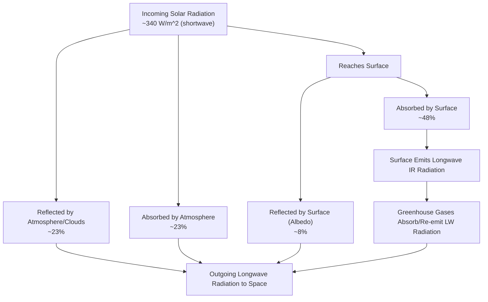

## Solar Radiation and the Planetary Heat Balance

### Overview

Solar radiation is the primary external energy source driving Earth's climate system, atmospheric circulation, and weather. The planetary heat balance (or Earth's energy budget) describes how incoming solar energy is absorbed, reflected, and re-emitted, maintaining a long-term equilibrium temperature. Disruptions to this balance—natural or anthropogenic—are the fundamental mechanism behind climate variability and change.

### The Electromagnetic Spectrum and Solar Radiation

**Key Points**

- The Sun emits electromagnetic radiation across a broad spectrum, approximated as a blackbody radiator at ~5778 K.
- Solar radiation ("shortwave radiation") peaks in the visible range (~0.4–0.7 μm) but also includes significant ultraviolet (UV, ~0.1–0.4 μm) and infrared (IR, >0.7 μm) components.
- Roughly 43% of incoming solar energy is visible light, ~49% is infrared, and ~7% is ultraviolet.

The relationship between temperature and peak emission wavelength is governed by **Wien's Displacement Law**:

$$\lambda_{max} = \frac{b}{T}$$

where $b \approx 2898\, \mu m\cdot K$ and $T$ is absolute temperature in Kelvin. This explains why the hot Sun emits mostly shortwave radiation, while the cooler Earth (~288 K average surface temperature) re-emits mostly longwave infrared radiation.

Total energy radiated is governed by the **Stefan-Boltzmann Law**:

$$E = \sigma T^4$$

where $\sigma \approx 5.67 \times 10^{-8}\, W/m^2K^4$ is the Stefan-Boltzmann constant.

### The Solar Constant

- The **solar constant** ($S_0$) is the average solar energy received per unit area perpendicular to the Sun's rays at the top of Earth's atmosphere, measured at Earth's mean distance from the Sun.
- Accepted value: approximately $1361\, W/m^2$ (satellite-measured "Total Solar Irradiance").
- **[Inference]** This value fluctuates slightly (roughly ±0.1%) over the ~11-year solar cycle and varies with Earth-Sun distance across the year due to orbital eccentricity, so "constant" is a simplification rather than a literal fixed number.

Because Earth is a sphere, incoming solar radiation must be averaged over the entire spherical surface area (not just the disk facing the Sun), which reduces the effective average insolation:

$$\bar{S} = \frac{S_0}{4} \approx 340\, W/m^2$$

This division by 4 arises because the area of a sphere ($4\pi r^2$) is four times the area of the disk ($\pi r^2$) intercepting solar rays.

### Earth's Energy Budget

The energy budget tracks the fate of incoming solar radiation as it interacts with the atmosphere, clouds, and surface.

**Key Points**

- Of the ~340 W/m² average incoming solar radiation:
  - Approximately 29–31% is reflected back to space (this fraction is Earth's **albedo**).
  - The remainder is absorbed by the atmosphere and surface, ultimately balanced by outgoing longwave radiation for the system to remain in equilibrium.
- At equilibrium, energy absorbed ≈ energy emitted back to space, maintaining a relatively stable average global temperature over climatological timescales.

#### Fate of Incoming Solar Radiation (Approximate Global Averages)

| Process | Approx. % of Incoming Solar Radiation |
| --- | --- |
| Reflected by clouds, aerosols, atmosphere | ~20–23% |
| Reflected by Earth's surface | ~7–9% |
| Absorbed by atmosphere (gases, aerosols, clouds) | ~20–23% |
| Absorbed by Earth's surface | ~47–51% |

**[Inference]** Exact percentages vary slightly between sources (e.g., NASA CERES-based budgets vs. older Kiehl-Trenberth diagrams) due to differing measurement methods and updated satellite data; the values above represent commonly cited approximate ranges rather than a single fixed authoritative split.

### Albedo

**Key Points**

- Albedo is the fraction of incoming radiation reflected by a surface, expressed as a value between 0 (perfect absorber) and 1 (perfect reflector).
- Earth's average (planetary) albedo is approximately 0.29–0.31.

| Surface Type | Approximate Albedo |
| --- | --- |
| Fresh snow | 0.80–0.90 |
| Sea ice | 0.50–0.70 |
| Desert sand | 0.30–0.45 |
| Grassland | 0.20–0.25 |
| Forest (dense) | 0.10–0.15 |
| Open ocean | 0.05–0.10 |
| Clouds (thick) | 0.60–0.90 |

Albedo plays a critical role in climate feedback loops. The **ice-albedo feedback** is a key example: melting ice/snow exposes darker ocean or land surfaces, which absorb more solar radiation, causing further warming and further melting—a positive (self-reinforcing) feedback loop.

### Radiation Balance Diagram

### The Greenhouse Effect

**Key Points**

- Earth's surface absorbs shortwave solar radiation and re-emits it as **longwave (infrared) radiation** due to its much lower temperature (Wien's Law).
- Greenhouse gases ($H_2O$, $CO_2$, $CH_4$, $N_2O$, $O_3$) are largely transparent to incoming shortwave solar radiation but strongly absorb and re-emit outgoing longwave radiation.
- This absorption and re-emission (in all directions, including back toward the surface) traps heat within the lower atmosphere, raising the effective surface temperature above what it would be without an atmosphere.

Without any greenhouse effect, Earth's theoretical **effective radiating temperature** can be calculated by balancing absorbed solar energy against blackbody emission:

$$(1-\alpha)\frac{S_0}{4} = \sigma T_e^4$$

Solving with $\alpha \approx 0.30$ (albedo) and $S_0 = 1361\, W/m^2$ yields an effective temperature of approximately $255\, K$ ($-18\,°C$). Since Earth's actual observed average surface temperature is about $288\, K$ ($15\,°C$), the difference of roughly $33\,°C$ is attributed to the natural greenhouse effect.

**[Inference]** This 33°C figure is a widely cited standard approximation in atmospheric science textbooks; precise values depend on the exact albedo and constants used in the calculation.

### Latitudinal Variation in Solar Heating

**Key Points**

- Solar radiation is not evenly distributed across Earth's surface due to the **angle of incidence**, which varies with latitude, season, and time of day.
- At the equator, sunlight strikes more directly (higher solar angle), concentrating energy over a smaller surface area.
- At the poles, sunlight strikes at a shallow angle, spreading the same energy over a much larger surface area and passing through more atmosphere (greater atmospheric path length, increasing scattering/absorption losses).

This latitudinal energy imbalance—net radiative surplus in the tropics, net deficit at the poles—is the fundamental driver of:

- Global atmospheric circulation (Hadley, Ferrel, Polar cells)
- Oceanic circulation and heat transport
- The general poleward flow of heat via winds, ocean currents, and storm systems

### Seasonal Variation: Axial Tilt

- Earth's axial tilt (obliquity), approximately 23.5°, causes the angle of solar incidence at any given latitude to change throughout the year as Earth orbits the Sun, producing seasons.
- This is distinct from (and a much larger effect than) the minor variation in Earth-Sun distance due to orbital eccentricity.
- The subsolar point (where the Sun is directly overhead) migrates between the Tropic of Cancer (23.5°N) at the June solstice and the Tropic of Capricorn (23.5°S) at the December solstice, crossing the equator at the equinoxes.

### Diurnal (Day-Night) Cycle

- Earth's rotation on its axis (~24-hour period) creates the day-night cycle, alternating direct solar heating with radiative cooling at any given location.
- Surface temperature typically lags peak solar input, reaching daily maximum in the afternoon rather than at solar noon, due to the time required for accumulated heat to overcome ongoing longwave radiative loss (thermal lag).

### Heat Transfer Mechanisms in the Atmosphere-Surface System

**Key Points**

Beyond radiation, energy is also redistributed via non-radiative processes:

- **Conduction**: Direct molecular heat transfer at the surface-air boundary; significant only in the shallow layer immediately adjacent to the surface.
- **Convection**: Bulk vertical movement of heated air parcels, transporting heat upward through the troposphere; a dominant mechanism in the boundary layer and in generating thunderstorms.
- **Latent heat transfer**: Energy absorbed during evaporation at the surface (using solar energy to convert liquid water to vapor) is released as sensible heat when water vapor condenses into clouds at altitude—a major mechanism for vertically redistributing energy and powering storm systems.
- **Advection**: Horizontal transport of heat via wind and ocean currents, redistributing energy between latitudes.

### Practical Example: Calculating Effective Radiating Temperature

**Example**

Using the energy balance equation with Earth's parameters:

$$T_e = \left[\frac{(1-\alpha)S_0}{4\sigma}\right]^{1/4}$$

Substituting $\alpha = 0.30$, $S_0 = 1361\, W/m^2$, $\sigma = 5.67\times10^{-8}\, W/m^2K^4$:

$$T_e = \left[\frac{(0.70)(1361)}{4 \times 5.67\times10^{-8}}\right]^{1/4} \approx 255\, K$$

This demonstrates quantitatively how albedo and solar constant values directly determine the baseline planetary temperature before accounting for greenhouse warming.

### Anthropogenic Disruption of the Heat Balance

- Increased concentrations of greenhouse gases (primarily $CO_2$, $CH_4$, $N_2O$) enhance the atmosphere's longwave absorption capacity, increasing **radiative forcing**—a net positive imbalance between absorbed solar energy and emitted longwave energy.
- This forcing is measured in $W/m^2$; the Intergovernmental Panel on Climate Change (IPCC) periodically publishes updated estimates of total anthropogenic radiative forcing.
- **[Unverified]** Precise current radiative forcing values change with each IPCC assessment cycle and should be checked against the latest IPCC Assessment Report for up-to-date figures.
- Aerosols (from industrial pollution, biomass burning) can partially offset warming through increased reflection (negative forcing/"global dimming") but also interact complexly with cloud formation.

### Relevance to Environmental Science

- The energy budget framework is the foundation for climate modeling, general circulation models (GCMs), and projections of future warming.
- Albedo feedbacks (ice melt, deforestation, urbanization/heat islands) are central to understanding climate feedback loops and tipping points.
- Understanding radiation balance is essential for interpreting remote sensing data, solar energy resource assessment, and urban heat island mitigation strategies.
- Latitudinal and seasonal solar variation underlies the classification of global climate zones and biomes.

**Next Steps**

- The Greenhouse Effect and Radiative Forcing in Detail
- Global Atmospheric Circulation (Hadley, Ferrel, Polar Cells)
- Ocean-Atmosphere Heat Transport and Currents
- Climate Feedback Loops (Ice-Albedo, Water Vapor, Cloud Feedbacks)
- Milankovitch Cycles and Long-Term Climate Variation
- Urban Heat Islands and Surface Energy Balance
- Remote Sensing of Earth's Radiation Budget (e.g., CERES)