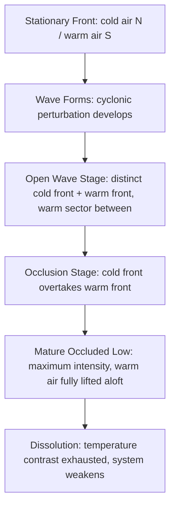

## Weather Systems and Air Masses

### Overview

Weather systems and air masses form the organizational framework of atmospheric science, describing how large volumes of air with distinct physical properties develop, move, interact, and produce the day-to-day weather experienced at Earth's surface. An air mass is a large body of air with fairly uniform temperature and humidity characteristics throughout, while weather systems are the dynamic structures (fronts, cyclones, anticyclones) that form at the boundaries between or within these air masses. Understanding this topic is foundational to synoptic meteorology, forecasting, and climate-related environmental science applications such as air quality prediction, storm hazard assessment, and agricultural planning.

### Air Masses: Definition and Formation

**Key Points**

- An air mass forms when air remains stationary or moves slowly over a large, physically uniform surface (a "source region") long enough to acquire the temperature and moisture characteristics of that surface.
- Source regions must be extensive, flat, and have uniform surface properties, and must be associated with persistent high-pressure or light-wind conditions that allow prolonged contact between air and surface.
- The time required for an air mass to form ("conditioning period") typically ranges from several days to about a week, depending on the intensity of surface-atmosphere heat and moisture exchange.

**Primary Source Regions**

Ideal source regions include high-latitude oceans and continents, subtropical oceans, and subtropical deserts. Mid-latitudes are generally poor source regions because the prevailing westerlies and frequent passage of frontal systems prevent air from stagnating long enough to homogenize.

### Air Mass Classification

Air masses are classified using a two-letter (sometimes three-letter) system describing moisture source and thermal origin.

**Moisture Characteristics (first letter, lowercase)**

- **c** — continental (dry, formed over land)
- **m** — maritime (moist, formed over ocean)

**Thermal Characteristics (second letter, uppercase)**

- **T** — Tropical (warm, formed in low latitudes)
- **P** — Polar (cold, formed in high latitudes)
- **A** — Arctic/Antarctic (extremely cold, formed over ice/snow-covered polar regions)
- **E** — Equatorial (formed near the equator, very warm and humid)
- **S** — Superior (dry, formed by subsidence, usually aloft)

**Common Combined Classifications**

| Symbol | Name | Typical Characteristics | Example Source Region |
| --- | --- | --- | --- |
| cA | Continental Arctic | Extremely cold, very dry | Arctic Basin, Greenland ice sheet |
| cP | Continental Polar | Cold, dry | Interior Canada, Siberia |
| mP | Maritime Polar | Cool, moist | North Pacific, North Atlantic |
| cT | Continental Tropical | Hot, dry | Sahara Desert, southwestern U.S./Mexico |
| mT | Maritime Tropical | Warm, moist | Gulf of Mexico, Caribbean Sea, tropical oceans |
| mE | Maritime Equatorial | Very warm, very humid | Equatorial oceans |

A third letter, **k** (colder than the underlying surface) or **w** (warmer than the underlying surface), is sometimes appended to describe stability: e.g., cPk indicates a continental polar air mass that is colder than the surface it now overlies, which promotes instability and low-level heating from below.

### Air Mass Modification

As an air mass leaves its source region, it undergoes **modification**, gradually taking on characteristics of the new surface it travels over. Key modification mechanisms include:

- **Thermodynamic modification**: heating or cooling from below (e.g., cP air moving over the relatively warm Great Lakes becomes destabilized and picks up moisture, producing lake-effect snow).
- **Mechanical modification**: mixing and lifting caused by terrain (orographic effects) or turbulence.
- **Radiative modification**: gradual warming or cooling due to solar heating or nighttime radiational cooling as the air mass ages.

The rate of modification depends on wind speed (faster movement modifies air less before it affects a region), the temperature/moisture contrast between the air mass and the underlying surface, and the type of surface traversed (land vs. ocean, vegetated vs. bare, snow-covered vs. ice-free).

### Fronts: Boundaries Between Air Masses

A **front** is the transition zone between two air masses of different density (usually due to temperature and/or moisture contrasts). Fronts are the primary sites of weather activity, including cloud formation, precipitation, and wind shifts.

**Cold Front**

- Denser, colder air actively advances and undercuts warmer air ahead of it.
- Steep frontal slope (typically 1:50 to 1:100) causes rapid lifting.
- Associated with narrow bands of intense weather: cumulonimbus clouds, thunderstorms, heavy but short-lived precipitation, gusty winds, and a sharp temperature drop after passage.
- Moves faster than warm fronts (average 30–40 km/h, though can be faster).

**Warm Front**

- Warmer air actively advances and rises gradually over retreating colder, denser air.
- Shallow frontal slope (typically 1:100 to 1:300) causes gradual lifting over a wide area.
- Associated with a broad shield of stratiform clouds (cirrus → cirrostratus → altostratus → nimbostratus) and prolonged, steady, light-to-moderate precipitation extending hundreds of kilometers ahead of the surface front.
- Moves more slowly than cold fronts (average 15–25 km/h).

**Stationary Front**

- Boundary between two air masses where neither is advancing significantly; the front remains nearly stationary for a day or more.
- Can produce prolonged periods of cloudiness and precipitation along the boundary.

**Occluded Front**

- Forms when a faster-moving cold front catches up to and overtakes a slower-moving warm front, lifting the warm air mass entirely off the surface.
- Two types:
  - **Cold-type occlusion**: the overtaking air is colder than the air ahead of the warm front (common in North America).
  - **Warm-type occlusion**: the overtaking air is less cold than the air ahead of the warm front (common in maritime climates like the UK).
- Marks the mature-to-dissipating stage of a mid-latitude cyclone.

**Frontal Symbols (Standard Meteorological Convention)**

- Cold front: solid line with triangles pointing in the direction of movement
- Warm front: solid line with semicircles pointing in the direction of movement
- Stationary front: alternating triangles and semicircles on opposite sides of the line
- Occluded front: alternating triangles and semicircles on the same side of the line

**Cross-Section of a Frontal System (svg_diagram)**

<svg xmlns="http://www.w3.org/2000/svg" viewBox="0 0 800 420" font-family="Arial, sans-serif">

<text x="400" y="25" text-anchor="middle" font-size="18" font-weight="bold">Cold Front and Warm Front Cross-Section (svg_diagram)</text>

<line x1="40" y1="360" x2="760" y2="360" stroke="black" stroke-width="2" />

<text x="20" y="365" font-size="12">Sfc</text>

<polygon points="120,360 260,360 120,120" fill="#7FB3D5" opacity="0.6" />

<line x1="120" y1="360" x2="120" y2="120" stroke="#1B4F72" stroke-width="3" />

<text x="60" y="200" font-size="14" fill="#1B4F72" font-weight="bold">Cold Air</text>

<text x="60" y="220" font-size="12" fill="#1B4F72">(advancing, dense)</text>

<polygon points="120,360 132,352 132,368" fill="black" />

<polygon points="150,360 162,352 162,368" fill="black" />

<polygon points="180,360 192,352 192,368" fill="black" />

<polygon points="260,360 620,360 500,180 120,120" fill="#F5CBA7" opacity="0.5" />

<text x="330" y="330" font-size="14" fill="#B9770E" font-weight="bold">Warm Sector</text>

<text x="330" y="350" font-size="12" fill="#B9770E">(mT air mass)</text>

<polygon points="620,360 760,360 500,180" fill="#F9E79F" opacity="0.7" />

<line x1="620" y1="360" x2="500" y2="180" stroke="#B9770E" stroke-width="3" />

<text x="650" y="260" font-size="14" fill="#7D6608" font-weight="bold">Cool Air</text>

<text x="650" y="280" font-size="12" fill="#7D6608">(retreating)</text>

<circle cx="640" cy="352" r="10" fill="black" />

<circle cx="670" cy="338" r="10" fill="black" />

<circle cx="700" cy="324" r="10" fill="black" />

<ellipse cx="500" cy="175" rx="30" ry="10" fill="#D5DBDB" />

<ellipse cx="560" cy="220" rx="45" ry="14" fill="#D5DBDB" />

<ellipse cx="610" cy="280" rx="60" ry="18" fill="#AEB6BF" />

<ellipse cx="120" cy="115" rx="20" ry="30" fill="#5D6D7E" />

<ellipse cx="140" cy="140" rx="25" ry="35" fill="#5D6D7E" />

<line x1="120" y1="390" x2="200" y2="390" stroke="black" stroke-width="2" marker-end="url(#arrow)" />

<text x="130" y="405" font-size="11">Cold front motion</text>

<line x1="700" y1="390" x2="620" y2="390" stroke="black" stroke-width="2" marker-end="url(#arrow)" />

<text x="600" y="405" font-size="11">Warm front motion</text>

</svg>

### Mid-Latitude Cyclones (Extratropical Cyclones)

**Formation Mechanism**

Mid-latitude cyclones develop through a process historically described by the **Norwegian Cyclone Model** (Bjerknes and Solberg, 1922) and refined by modern **baroclinic instability theory**. Key ingredients include:

- A pre-existing **polar front** separating contrasting air masses.
- **Baroclinicity**: horizontal temperature gradients combined with vertical wind shear, which provide the energy source for cyclogenesis.
- Upper-level **divergence** aloft (often associated with the jet stream, particularly the right-entrance and left-exit regions of jet streaks), which removes air faster than it converges at the surface, allowing surface pressure to fall.

**Life Cycle Stages (Norwegian Cyclone Model)**

1. **Stationary/Frontal Stage** — a stationary front exists between cold and warm air masses with no closed circulation.
2. **Wave/Cyclogenesis Stage** — a small perturbation forms, creating an incipient low-pressure center with distinct cold and warm fronts.
3. **Open Wave/Mature Stage** — the low deepens, fronts become well-defined, and a clear warm sector exists between them.
4. **Occlusion Stage** — the faster cold front catches the warm front, lifting the warm sector aloft and forming an occluded front; the storm reaches maximum intensity around this stage.
5. **Dissolution Stage** — the temperature contrast driving the system is exhausted, and the cyclone weakens and dissipates.

**Modern Refinement: The Shapiro–Keyser Model**

Some rapidly deepening oceanic cyclones (especially over the North Atlantic and North Pacific) follow a different evolution in which the cold front separates from the warm front, forming a "bent-back" front and a warm seclusion, rather than a classic occlusion. [Inference] Whether a given cyclone follows the Norwegian or Shapiro–Keyser evolution depends on the strength and structure of the ambient baroclinic zone and is typically diagnosed case-by-case using upper-air and surface analyses.

**Cyclone Structure (Mermaid Diagram)**

**Associated Weather**

- **Northeast quadrant** (ahead of warm front, Northern Hemisphere): steady precipitation, overcast stratiform clouds.
- **Warm sector**: mild temperatures, sometimes scattered showers or thunderstorms.
- **Southwest quadrant** (behind cold front): showers, thunderstorms, gusty and often northwesterly winds, clearing skies following passage.
- **Northwest quadrant**: cold, often includes wraparound precipitation or snow in winter systems.

### Anticyclones (High-Pressure Systems)

- Characterized by sinking (subsiding) air, divergence at the surface, and convergence aloft — essentially the dynamical opposite of a cyclone.
- Subsidence leads to adiabatic warming and drying, typically producing clear skies, light winds, and stable atmospheric conditions.
- **Northern Hemisphere**: winds circulate clockwise around a high-pressure center due to the Coriolis effect (counterclockwise in the Southern Hemisphere).
- Persistent anticyclones ("blocking highs") can cause prolonged heat waves, droughts, or cold air outbreaks, and are also linked to air quality degradation because subsidence traps pollutants near the surface (temperature inversions).

### Pressure Gradient, Coriolis Effect, and Geostrophic Wind

Air motion within weather systems is governed by the balance of forces:

- **Pressure Gradient Force (PGF)**: drives air from high to low pressure; proportional to the spacing of isobars (tightly packed isobars indicate a strong PGF and higher wind speeds).
- **Coriolis Effect**: an apparent deflective force caused by Earth's rotation, deflecting moving air to the right in the Northern Hemisphere and to the left in the Southern Hemisphere; magnitude increases with latitude and wind speed and is zero at the equator.
- **Geostrophic Wind**: the theoretical wind that results when the PGF and Coriolis force are in balance, flowing parallel to straight isobars.

The geostrophic wind speed can be approximated as:

$$V_g = \frac{1}{\rho f} \frac{\Delta p}{\Delta n}$$

where $V_g$ is geostrophic wind speed, $\rho$ is air density, $f$ is the Coriolis parameter ($f = 2\Omega\sin\phi$, with $\Omega$ Earth's angular velocity and $\phi$ latitude), and $\Delta p/\Delta n$ is the pressure gradient (change in pressure per unit horizontal distance).

Near the surface, **friction** reduces wind speed and causes air to cross isobars at an angle toward lower pressure (inflow into lows, outflow from highs), rather than flowing purely parallel to them as in the geostrophic case.

### Jet Streams and Upper-Level Steering

- The **polar jet stream** forms along the boundary of the polar front, where temperature contrasts between polar and mid-latitude air are strongest; typically located near the tropopause at 9–12 km altitude.
- The **subtropical jet stream** forms near 30° latitude, associated with the poleward branch of the Hadley cell.
- Jet streams steer surface weather systems and are closely tied to cyclogenesis: **jet streaks** (local wind maxima within the jet) produce regions of upper-level divergence and convergence that respectively favor or suppress surface cyclone development.
- The jet stream's latitude and amplitude (degree of meandering, often described via **Rossby waves**) strongly influence the frequency and intensity of mid-latitude storm tracks and the polarity of blocking patterns.

### Tropical Weather Systems (Contrast with Mid-Latitude Systems)

Although air-mass and frontal theory applies primarily to mid-latitudes, tropical weather systems are relevant for comparison:

- **Tropical cyclones** (hurricanes/typhoons) form within a single warm, moist air mass (mE/mT) rather than at a frontal boundary; they are driven by latent heat release from condensation rather than baroclinic temperature contrasts, giving them a **warm-core** structure (versus the **cold-core** structure of mature mid-latitude cyclones).
- Because tropical cyclones lack fronts, they do not exhibit the organized frontal precipitation bands typical of extratropical systems; instead, they exhibit largely axisymmetric rainbands around an eyewall.
- Development requires sea-surface temperatures generally above about 26–27°C, low vertical wind shear, sufficient Coriolis force (hence rarely forming within about 5° of the equator), and pre-existing atmospheric disturbances.

### Regional and Seasonal Manifestations

- **Lake-effect snow**: cP or cA air moving over relatively warmer, unfrozen lake water (e.g., the Great Lakes) is destabilized and gains moisture, producing intense, localized snow bands downwind.
- **Nor'easters** (U.S. East Coast): intense mid-latitude cyclones fueled by the temperature contrast between cold continental air and the warm Gulf Stream, producing heavy snow/rain and strong onshore winds.
- **Santa Ana / Föhn-type winds**: form when continental air subsides and warms adiabatically while descending mountain slopes, drastically lowering humidity (relevant to wildfire risk).
- **Cold air outbreaks**: occur when a strong cA or cP air mass is advected far equatorward, often associated with a deep upper-level trough and sometimes linked to stratospheric polar vortex disruptions.

### Relevance to Environmental Science

- **Air quality**: stagnant anticyclonic conditions and temperature inversions trap pollutants (particulate matter, ozone precursors) near the surface, degrading air quality; frontal passages typically ventilate and disperse pollution.
- **Precipitation and water resources**: the position and frequency of storm tracks determine regional precipitation patterns, directly affecting water availability, drought risk, and flood hazards.
- **Climate variability linkages**: shifts in jet stream position and mid-latitude storm tracks are studied in connection with larger climate oscillations (e.g., El Niño–Southern Oscillation, the Arctic Oscillation), which modulate air mass source strength and frontal activity across seasons. [Inference] The specific magnitude of these linkages varies by region and study methodology, and remains an active area of ongoing atmospheric research.
- **Agriculture and hazard planning**: frost/freeze risk from cP/cA outbreaks, severe thunderstorm and tornado risk along cold fronts and drylines, and flood risk from stalled frontal boundaries are all core applications of air mass and frontal analysis.

### Example: Tracing a Winter Storm Event

1. A **cP** air mass builds over central Canada under a strong surface anticyclone.
2. Simultaneously, **mT** air streams northward from the Gulf of Mexico ahead of an approaching upper-level trough.
3. The collision of these air masses along the polar front, combined with upper-level divergence beneath a jet streak, triggers **cyclogenesis** over the central United States.
4. A well-defined **warm front** advances northeastward ahead of the low, producing widespread stratiform precipitation (rain or snow, depending on the thermal profile).
5. The trailing **cold front** sweeps through with a sharp wind shift, temperature drop, and potentially a squall line of thunderstorms if the warm sector was sufficiently unstable.
6. As the cold front overtakes the warm front, the system **occludes**, cutting off the warm sector and marking peak storm intensity (often producing the most significant snowfall on the storm's northwest side).

### Common Misconceptions

- Fronts are not simply "lines" but three-dimensional sloped surfaces extending through the troposphere.
- A "cold front passage" does not always bring precipitation immediately at the surface boundary; convective activity can be organized in a pre-frontal squall line ahead of the surface front, particularly in strongly sheared environments.
- High pressure does not always mean "good weather" universally; persistent highs can also produce hazardous conditions such as fog, temperature inversions with trapped pollution, or extreme heat during blocking events.

**Related Topics**

- Atmospheric stability and lapse rates (dry/moist adiabatic processes)
- Temperature inversions and their role in air pollution episodes
- Jet stream dynamics and Rossby wave patterns
- Tropical cyclone formation, structure, and intensification
- Synoptic weather map analysis and isobar/isotherm interpretation
- El Niño–Southern Oscillation (ENSO) and its influence on storm tracks
- Severe convective storms: supercells, squall lines, and drylines
- Climatology of regional storm tracks and seasonal air mass patterns