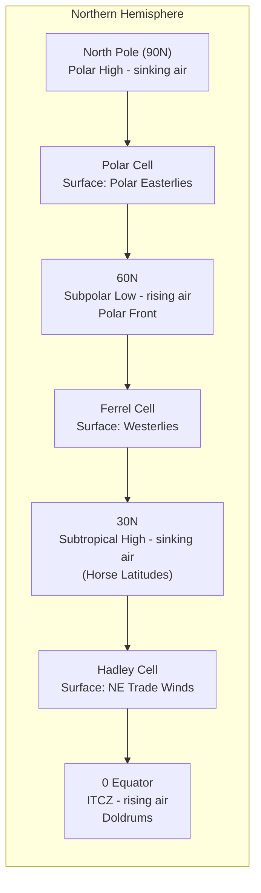

## Global Atmospheric Circulation Patterns

### Overview

Global atmospheric circulation refers to the large-scale movement of air that redistributes solar energy from the equator toward the poles, driven fundamentally by the latitudinal imbalance in incoming solar radiation. This circulation, modified by Earth's rotation, establishes the planet's major wind belts, pressure zones, and climate regions, and forms the backdrop against which regional weather systems develop.

### The Driving Mechanism: Differential Heating

**Key Points**

- The equator receives more direct, concentrated solar radiation than the poles due to the angle of incidence, creating a persistent energy surplus in the tropics and a deficit at the poles.
- If Earth did not rotate, this imbalance would theoretically produce a single, simple convective cell in each hemisphere: warm air rising at the equator, flowing poleward aloft, sinking at the poles, and returning equatorward at the surface.
- In reality, Earth's rotation breaks this simple pattern into three distinct circulation cells per hemisphere due to the **Coriolis effect**, which deflects moving air (and all free-moving objects) to the right in the Northern Hemisphere and to the left in the Southern Hemisphere.

### The Coriolis Effect

- An apparent force resulting from Earth's rotation, causing moving air (and ocean currents) to be deflected relative to the rotating surface reference frame rather than following a straight path relative to space.
- Magnitude is zero at the equator and increases with latitude, reaching a maximum at the poles.
- Governs the direction of rotation of large-scale weather systems (cyclones rotate counterclockwise in the Northern Hemisphere, clockwise in the Southern Hemisphere) and the overall bending of the three-cell circulation pattern into distinct wind belts.

### The Three-Cell Model

**Key Points**

Each hemisphere is divided into three primary circulation cells:

#### 1. Hadley Cell (0°–30° latitude)

- Warm, moist air rises near the equator in the **Intertropical Convergence Zone (ITCZ)**, where converging trade winds from both hemispheres meet, producing persistent low pressure, heavy convective rainfall, and towering cumulonimbus clouds.
- Rising air moves poleward at high altitude, cools, and descends around 30° latitude, creating the **subtropical high-pressure belt**—a zone of sinking, dry, stable air.
- At the surface, air flows back toward the equator, deflected by the Coriolis effect into the **trade winds** (northeast trades in the Northern Hemisphere, southeast trades in the Southern Hemisphere).
- The Hadley cell is the strongest and most thermally direct of the three cells.

#### 2. Ferrel Cell (30°–60° latitude)

- A weaker, indirect (partly mechanically driven) circulation cell sandwiched between the Hadley and Polar cells.
- At the surface, air flows poleward from the subtropical high (30°) toward the subpolar low (60°), deflected by the Coriolis effect into the prevailing **westerlies**.
- Considered "indirect" because its surface flow (equator-to-pole direction at the surface) runs opposite to the thermally direct sense of the Hadley and Polar cells; it is driven largely by the eddies and pressure patterns generated at its boundaries rather than by direct thermal convection.

#### 3. Polar Cell (60°–90° latitude)

- A thermally direct cell: cold, dense air sinks at the poles, creating the **polar high-pressure** zone.
- At the surface, air flows equatorward from the polar high, deflected by the Coriolis effect into the **polar easterlies**.
- Air converges with the warmer westerlies around 60° latitude at the **subpolar low**, where it rises, often along the **polar front**—the boundary between cold polar air and milder mid-latitude air, a key zone for mid-latitude cyclone formation.

### Three-Cell Circulation Diagram

### Surface Pressure Belts and Wind Systems

**Key Points**

| Latitude Zone | Pressure/Feature | Surface Winds | Characteristics |
| --- | --- | --- | --- |
| 0° (Equator) | ITCZ / Equatorial Low | Doldrums (light, variable) | Rising air, heavy rainfall, low pressure |
| 0°–30° | — | Trade Winds (NE/SE) | Converge toward ITCZ |
| ~30° | Subtropical High | Horse Latitudes (light, variable) | Sinking air, arid, many deserts located here |
| 30°–60° | — | Westerlies | Prevailing surface winds of mid-latitudes |
| ~60° | Subpolar Low | Polar Front | Rising air, storm formation zone |
| 60°–90° | — | Polar Easterlies | Cold, dry surface flow from polar high |
| 90° (Poles) | Polar High | — | Sinking air, very cold, dry |

**[Inference]** The pressure belts described are climatological averages; their exact latitudinal position shifts seasonally (following the sun's declination, generally north in the Northern Hemisphere summer and south in its winter) and can be significantly disrupted by land-sea distribution and interannual variability such as El Niño-Southern Oscillation (ENSO).

### Semi-Permanent Pressure Systems

While the three-cell model describes idealized zonal (latitude-band) circulation, in practice the pattern is broken into distinct semi-permanent high- and low-pressure cells by the uneven distribution of continents and oceans:

- **Subtropical highs** manifest as identifiable oceanic high-pressure cells (e.g., the Azores/Bermuda High in the North Atlantic, the North Pacific High), which strongly influence regional climate, including the dry-summer Mediterranean climate pattern and monsoon dynamics.
- **Subpolar lows** manifest as cells such as the Icelandic Low and Aleutian Low, key storm-generating regions for the Northern Hemisphere mid-latitudes.
- **Continental thermal lows/highs**: Land masses heat and cool faster than oceans, producing seasonal pressure systems (e.g., strong continental highs over Siberia in winter, thermal lows over Asia in summer) that are central to monsoon circulation.

### The Jet Streams

**Key Points**

- Narrow bands of very strong westerly winds found in the upper troposphere (~9–16 km altitude), formed by strong horizontal temperature gradients between adjacent air masses, consistent with the **thermal wind** relationship.
- **Polar jet stream**: Located near the boundary between the Ferrel and Polar cells (around 50°–60° latitude), associated with the polar front; highly variable in position and strongly influences mid-latitude weather and storm tracks.
- **Subtropical jet stream**: Located near the boundary between the Hadley and Ferrel cells (around 30° latitude), generally steadier and less directly tied to surface storm development than the polar jet.
- Jet streams steer surface weather systems, and their wave-like meanders (**Rossby waves**) determine the persistence of weather patterns, including blocking patterns that can cause prolonged heat waves or cold spells.

### Rossby Waves

- Large-scale meanders in the jet stream and upper-tropospheric flow, arising from the conservation of potential vorticity as air parcels move across latitudes (changing Coriolis parameter).
- Characterized by alternating ridges (poleward bulges, associated with warmer, high-pressure conditions at the surface) and troughs (equatorward dips, associated with cooler, low-pressure/stormy conditions at the surface).
- **[Inference]** Some research links a wavier, slower-moving jet stream pattern to Arctic amplification (faster Arctic warming reducing the pole-to-equator temperature gradient), though this remains an active area of ongoing scientific study rather than a fully settled consensus.

### Monsoon Circulation

**Key Points**

- A large-scale seasonal reversal of wind direction, driven primarily by differential heating/cooling rates between continents and oceans rather than by the three-cell model directly.
- **Summer monsoon**: The continental interior heats faster than the adjacent ocean, creating a thermal low over land that draws in moist oceanic air, producing heavy seasonal rainfall (e.g., the South Asian summer monsoon).
- **Winter monsoon**: The continental interior cools faster than the ocean, creating a high-pressure cell over land that drives dry offshore winds.
- The South Asian monsoon system is the most prominent example, critically important for regional agriculture and water resources, but analogous (generally weaker) monsoon patterns occur in West Africa, East Asia, Australia, and North America.

### Ocean-Atmosphere Interaction: ENSO

- **El Niño-Southern Oscillation (ENSO)** is a coupled ocean-atmosphere phenomenon centered in the tropical Pacific that periodically disrupts normal circulation patterns.
- **El Niño phase**: Weakening of the normal easterly trade winds allows warm surface water to spread eastward across the Pacific, shifting the location of the ITCZ's rising branch and associated rainfall, with far-reaching global weather effects (teleconnections).
- **La Niña phase**: Strengthening of the trade winds intensifies the normal pattern, pushing warm water further west and typically enhancing upwelling of cold water off South America.
- ENSO is a primary source of interannual (year-to-year) climate variability, affecting rainfall, drought, and storm patterns across many regions of the globe.

**[Unverified]** Specific ENSO phase timing and strength for any given year are inherently variable and forecast-dependent; current status should be checked against real-time monitoring from agencies such as NOAA's Climate Prediction Center.

### Practical Example: Explaining Desert Locations

**Example**

Many of the world's major deserts (Sahara, Arabian, Mojave, Kalahari, Australian Outback) are located near 30° latitude in both hemispheres. This is directly explained by the Hadley cell: air that rose and lost most of its moisture through condensation and precipitation near the equator (ITCZ) descends at 30° latitude as dry, warming (adiabatically compressed) air, suppressing cloud formation and producing the persistent aridity characteristic of the subtropical high-pressure "horse latitude" belt.

### Relevance to Environmental Science

- Global circulation patterns fundamentally determine the distribution of Earth's climate zones and biomes (rainforests near the ITCZ, deserts near 30°, temperate zones in the westerlies belt).
- Understanding circulation is essential for interpreting regional climate change projections, including potential shifts in Hadley cell width (tropical expansion) and jet stream behavior.
- Monsoon and ENSO variability directly affects global food security, water resources, and disaster risk (droughts, floods).
- Circulation patterns govern the long-range transport of pollutants, aerosols, and greenhouse gases around the globe.

**Next Steps**

- Ocean Currents and Thermohaline Circulation
- El Niño-Southern Oscillation (ENSO) in Depth
- Monsoon Systems and Regional Climate Impacts
- Climate Zones and Köppen Climate Classification
- Jet Streams, Rossby Waves, and Blocking Patterns
- Regional Weather Systems and Air Masses
- Climate Change Impacts on Global Circulation Patterns