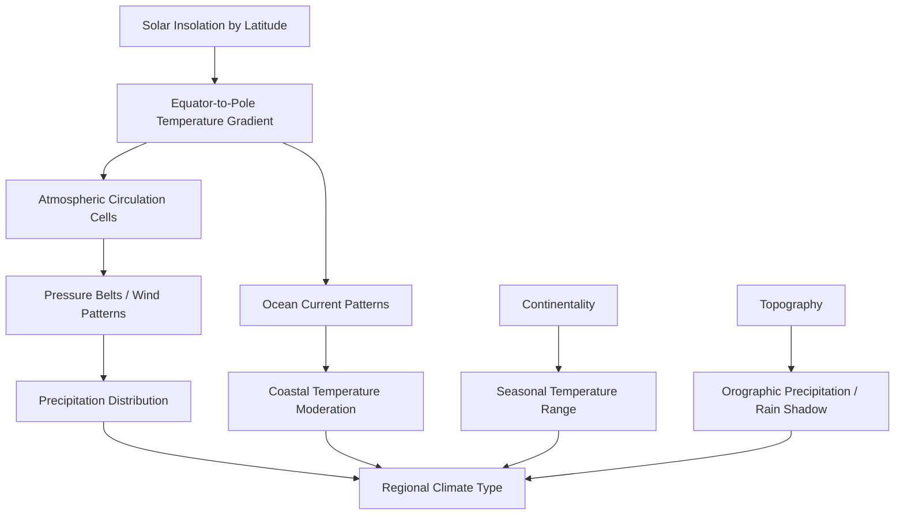

## Climate Classification and Controls

### Overview

Climate classification is the systematic categorization of Earth's regional climates based on measurable, recurring patterns of temperature, precipitation, and seasonality. Climate itself is defined as the statistical aggregate of weather conditions over an extended period (conventionally 30 years, per WMO climate normals), distinguishing it from weather, which describes atmospheric state at a single point in time. Climate controls are the physical mechanisms that produce and differentiate these patterns across the planet.

### Climate Controls (Primary Drivers)

**Latitude and Solar Insolation**

The angle of incoming solar radiation varies systematically with latitude due to Earth's curvature. Near the equator, sunlight strikes at a near-perpendicular angle, concentrating energy over a smaller surface area. At higher latitudes, the same amount of radiation spreads over a larger area and passes through more atmosphere, reducing intensity. This produces the fundamental equator-to-pole temperature gradient that underlies nearly all other climate controls.

$$Q = S_0 \cos(\theta) \cdot A$$

where $Q$ is received solar energy, $S_0$ is the solar constant, $\theta$ is the solar zenith angle, and $A$ is the atmospheric transmission factor.

**Atmospheric Circulation (General Circulation Patterns)**

Global wind belts arise from differential heating and the Coriolis effect, organizing into three circulation cells per hemisphere:

- Hadley cell (0°–30°): thermally direct, driven by equatorial convection, produces the Intertropical Convergence Zone (ITCZ) and subtropical high-pressure belts
- Ferrel cell (30°–60°): thermally indirect, mechanically driven by the adjacent cells
- Polar cell (60°–90°): thermally direct, driven by polar cooling and subsidence

These cells govern the latitudinal distribution of precipitation: rising air at the ITCZ and 60° latitude produces wet zones, while sinking air at 30° and the poles produces arid zones.

**Ocean Currents and Thermohaline Circulation**

Warm currents (e.g., Gulf Stream, Kuroshio) transport heat poleward along western ocean boundaries and moderate coastal climates; cold currents (e.g., Humboldt, Benguela, California) run equatorward along eastern boundaries and contribute to coastal aridity through upwelling and atmospheric stabilization. The global thermohaline circulation ("ocean conveyor belt") redistributes heat on centennial timescales via density differences driven by temperature and salinity.

**Continentality and Distance from Water Bodies**

Water has a much higher specific heat capacity than land, so large water bodies heat and cool more slowly, moderating nearby air temperatures (maritime climates: narrow annual temperature range). Interior continental locations, lacking this thermal buffering, experience much larger seasonal temperature swings (continental climates: wide annual temperature range). This effect is termed continentality.

**Topography and Orographic Effects**

Mountain ranges force air masses to rise, cool adiabatically, and precipitate on the windward side, while the descending, warmed, dried air on the leeward side produces a rain shadow. Elevation also directly reduces temperature via the environmental lapse rate (~6.5°C/km average).

**Air Mass Source Regions and Frontal Activity**

Distinct air masses (maritime tropical, continental polar, etc.) form over source regions with uniform surface characteristics and carry those properties into the regions they migrate to. Frontal boundaries between air masses of contrasting temperature and moisture generate much of midlatitude storm activity and seasonal precipitation variability.

**Albedo and Surface Feedbacks**

Surface reflectivity (ice, snow, vegetation, desert, ocean) modulates the fraction of insolation absorbed versus reflected, feeding back into local and regional energy budgets (e.g., ice-albedo feedback amplifying polar warming or cooling trends).

### Diagram: Climate Control Interaction (svg_diagram)

### Major Classification Systems

**Köppen-Geiger System**

The most widely used empirical classification, developed by Wladimir Köppen (1900, revised 1918) and later modified by Rudolf Geiger. It uses threshold values of temperature and precipitation, correlated to natural vegetation boundaries, to assign a letter code.

Primary groups:

| Code | Group | Defining Criterion |
| --- | --- | --- |
| A | Tropical | Coldest month ≥ 18°C |
| B | Arid/Dry | Evaporation exceeds precipitation (threshold formula-based) |
| C | Temperate/Mesothermal | Coldest month between 0°C and 18°C, warmest month > 10°C |
| D | Continental/Microthermal | Coldest month < 0°C, warmest month > 10°C |
| E | Polar | Warmest month < 10°C |

Second-letter subtypes (seasonality of precipitation): f (no dry season), m (monsoon), w (dry winter), s (dry summer)

Third-letter subtypes (thermal intensity): a (hot summer), b (warm summer), c (cool summer), d (very cold winter), h (hot arid), k (cold arid)

Example composite codes: Af (tropical rainforest), BWh (hot desert), Cfa (humid subtropical), Dfb (warm-summer humid continental), ET (tundra).

The B-group aridity threshold uses a formula incorporating mean annual temperature and the seasonal distribution of precipitation:

$$P_{threshold} = 20T + \begin{cases} 0 & \text{if } \geq 70\% \text{ precip in winter half-year} \\ 280 & \text{if } \geq 70\% \text{ precip in summer half-year} \\ 140 & \text{otherwise} \end{cases}$$

where $T$ is mean annual temperature (°C) and $P_{threshold}$ is in mm; a location is classified arid (B) if annual precipitation falls below this threshold.

**Thornthwaite System**

Developed by C.W. Thornthwaite (1931, revised 1948), this system emphasizes the water balance rather than raw temperature/precipitation thresholds. It introduces potential evapotranspiration (PET) — the water that would evaporate and transpire given unlimited moisture availability — and computes a moisture index comparing actual precipitation to PET. It is considered more physically grounded for agricultural and hydrological applications but is computationally more demanding and less commonly used for general reference than Köppen.

$$I_m = \frac{100(P - PET)}{PET}$$

where $I_m$ is the moisture index, $P$ is precipitation, and $PET$ is potential evapotranspiration.

**Genetic Classification Systems**

Rather than classifying by observed temperature/precipitation statistics, genetic systems classify by causal atmospheric mechanism — e.g., air mass climatology (Bergeron classification) or circulation-based schemes that group climates by dominant pressure systems and air mass frequency. These are less standardized but offer stronger explanatory (rather than merely descriptive) power.

**Holdridge Life Zones**

Used primarily in ecology, this system classifies climate zones using biotemperature, precipitation, and a humidity province ratio, producing a triangular classification diagram widely applied in tropical ecosystem and biodiversity studies.

### Applied Example: Classifying a Station

**Example**

Station data: mean annual temperature 16°C, coldest month 6°C, warmest month 26°C, annual precipitation 1100 mm, fairly even monthly distribution.//

- Coldest month (6°C) falls between 0°C and 18°C → group C
- Warmest month (26°C) > 22°C and at least 4 months > 10°C → subtype a
- Precipitation is evenly distributed (no month < 30 mm, no strong seasonal dry period) → subtype f
- Resulting classification: **Cfa** (humid subtropical climate) — consistent with cities such as Atlanta, Shanghai, or Buenos Aires.

### Climate Classification Map Structure (svg_diagram)

<svg xmlns="http://www.w3.org/2000/svg" viewBox="0 0 640 260">
<text x="20" y="24" font-size="14" font-weight="bold" fill="#222">Köppen-Geiger Latitudinal Zonation (svg_diagram)</text>
<rect x="20" y="40" width="600" height="30" fill="#c0392b" />
<text x="30" y="60" font-size="12" fill="#fff">A — Tropical (0–15° lat)</text>
<rect x="20" y="72" width="600" height="30" fill="#e67e22" />
<text x="30" y="92" font-size="12" fill="#fff">B — Arid (15–35° lat, subtropical highs)</text>
<rect x="20" y="104" width="600" height="30" fill="#27ae60" />
<text x="30" y="124" font-size="12" fill="#fff">C — Temperate (30–50° lat)</text>
<rect x="20" y="136" width="600" height="30" fill="#2980b9" />
<text x="30" y="156" font-size="12" fill="#fff">D — Continental (40–70° lat, N. Hemisphere interiors)</text>
<rect x="20" y="168" width="600" height="30" fill="#7f8c8d" />
<text x="30" y="188" font-size="12" fill="#fff">E — Polar (60–90° lat)</text>
<text x="20" y="220" font-size="11" fill="#555">Zones are idealized bands; actual boundaries shift with continentality,</text>
<text x="20" y="236" font-size="11" fill="#555">ocean currents, and topography rather than following strict latitude lines.</text>
</svg>

### Key Points

- Climate controls are causal mechanisms (insolation, circulation, ocean currents, continentality, topography); climate classifications are descriptive/statistical frameworks built from their measurable outcomes.
- Köppen-Geiger remains the dominant reference system due to its correlation with natural vegetation and ease of application from standard climate station data.
- Thornthwaite's water-balance approach is generally preferred in applied hydrology and agronomy contexts where evapotranspiration dynamics matter more than raw thresholds.
- No classification system perfectly captures transitional or highly localized microclimates; boundary zones (ecotones) frequently show mixed characteristics. [Inference]

### Related Topics

- Atmospheric General Circulation and Pressure Belts
- Air Masses and Frontal Systems
- Ocean-Atmosphere Interactions (ENSO, PDO, AMO)
- Köppen Subtype Deep Dive (Second and Third Letter Criteria)
- Paleoclimatology and Climate Classification Shifts (Köppen Shift Studies)
- Microclimates and Urban Heat Island Effects
- Biome-Climate Correspondence (Whittaker Diagram)