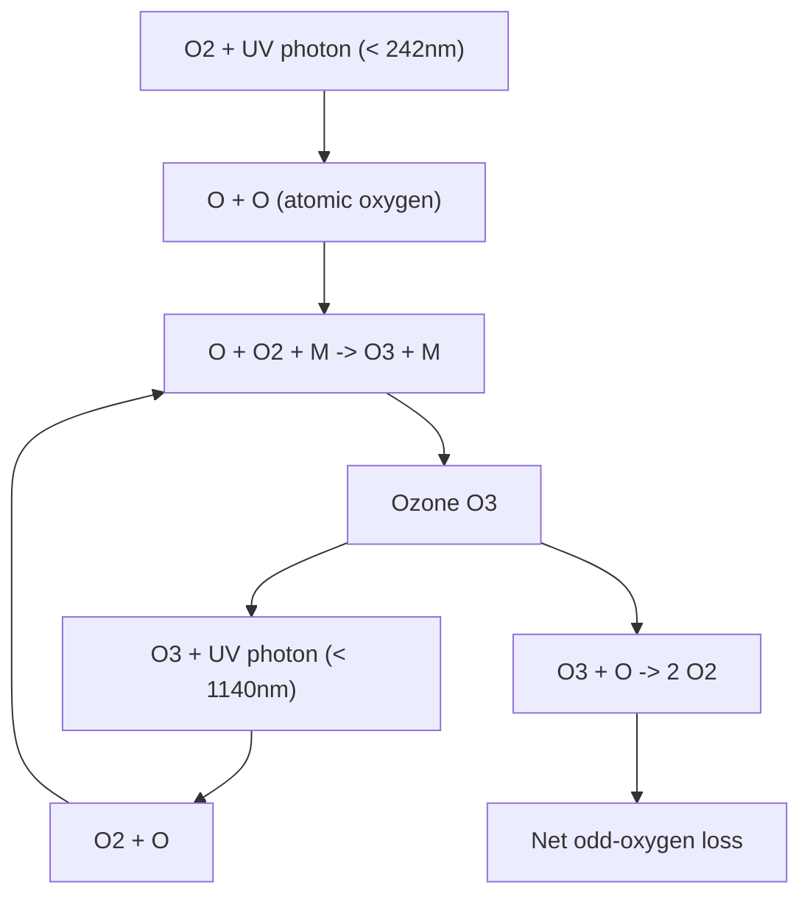
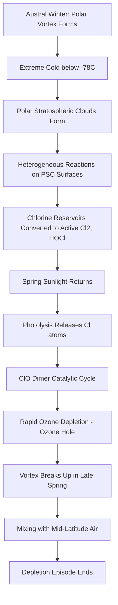

## Stratospheric Ozone Formation and Depletion

### Overview

Stratospheric ozone ($O_3$) forms a diffuse layer roughly 15–35 km above Earth's surface, concentrated within the stratosphere. It absorbs the majority of incoming solar ultraviolet-B (UV-B) and UV-C radiation, protecting surface life from mutagenic radiation damage and providing the thermal structure that defines the stratosphere itself (temperature increases with altitude there, unlike the troposphere, due to UV absorption by ozone).

### Ozone Formation: The Chapman Cycle

Ozone formation and destruction in an unperturbed stratosphere is described by the Chapman mechanism, proposed by Sydney Chapman in 1930. It consists of four reactions:

**Photolysis of molecular oxygen**

$$O_2 + h\nu \ (\lambda < 242\text{ nm}) \rightarrow O + O$$

**Ozone formation**

$$O + O_2 + M \rightarrow O_3 + M$$

where $M$ is a third body (typically $N_2$ or $O_2$) that absorbs excess vibrational energy, stabilizing the product.

**Ozone photolysis**

$$O_3 + h\nu \ (\lambda < 1140\text{ nm}) \rightarrow O_2 + O$$

**Ozone destruction (odd-oxygen recombination)**

$$O_3 + O \rightarrow 2O_2$$

The first two reactions produce ozone; the latter two convert it back to molecular oxygen while conserving "odd oxygen" ($O_x = O + O_3$). In steady state, formation and destruction rates balance, producing the natural ozone layer. The Chapman cycle alone overpredicts stratospheric ozone concentrations relative to observations, indicating that additional catalytic destruction cycles (below) are needed to explain the observed steady-state abundance. [Inference — this discrepancy is well documented in atmospheric chemistry literature and motivated the catalytic-cycle research described next]

### Diagram: Chapman Cycle (svg_diagram)

### Catalytic Destruction Cycles

Trace species act as catalysts, destroying many ozone molecules per catalyst molecule before being removed from the stratosphere. The general catalytic cycle form is:

$$X + O_3 \rightarrow XO + O_2$$

$$XO + O \rightarrow X + O_2$$

$$\text{Net: } O_3 + O \rightarrow 2O_2$$

where $X$ is regenerated and can repeat the cycle thousands to hundreds of thousands of times, depending on the catalyst.

**Major catalytic families:**

- **$HO_x$ (hydrogen radicals: OH, HO₂)** — naturally occurring, derived from water vapor and methane oxidation; dominant in the upper stratosphere and mesosphere.
- **$NO_x$ (nitrogen oxides: NO, NO₂)** — derived naturally from N₂O oxidation and from aviation/rocket exhaust; historically the subject of 1970s SST (supersonic transport) ozone-depletion concerns.
- **$ClO_x$ (chlorine radicals: Cl, ClO)** — derived primarily from anthropogenic chlorofluorocarbons (CFCs) and other halocarbons; the dominant driver of the Antarctic ozone hole.
- **$BrO_x$ (bromine radicals)** — derived from halons and methyl bromide; per-atom roughly 45–60× more efficient at ozone destruction than chlorine due to more favorable catalytic cycling. [Unverified — exact efficiency multiplier varies by altitude and study; order-of-magnitude figure is well established]

### The Antarctic Ozone Hole Mechanism

The seasonal Antarctic ozone hole (first documented by Farman, Gardiner, and Shanklin in 1985) results from a combination of chemistry and unique polar meteorology, not chlorine chemistry alone.

**Sequence of events:**

1. **Polar vortex formation** — during austral autumn/winter, a strong circumpolar westerly wind system isolates Antarctic stratospheric air from mid-latitude mixing.
2. **Polar Stratospheric Cloud (PSC) formation** — extreme cold (below approximately −78°C) within the vortex allows nitric acid trihydrate and water-ice clouds to form.
3. **Heterogeneous chemistry on PSC surfaces** — reactions on PSC particle surfaces convert relatively inert chlorine reservoir species (HCl, ClONO₂) into photochemically active forms (Cl₂, HOCl).
4. **Springtime photolysis** — as sunlight returns in September (Southern Hemisphere spring), these active chlorine species photolyze rapidly, releasing Cl atoms.
5. **Catalytic destruction via the ClO dimer cycle** — at high ClO concentrations, an additional cycle dominates:

$$2(ClO + ClO + M \rightarrow Cl_2O_2 + M)$$

$$Cl_2O_2 + h\nu \rightarrow Cl + ClOO$$

$$ClOO + M \rightarrow Cl + O_2 + M$$

$$\text{Net: } 2O_3 \rightarrow 3O_2$$

This ClO-dimer ("Molina-Rowland") cycle requires no atomic oxygen, unlike the standard catalytic cycle, allowing it to proceed efficiently even in the cold, low-actinic-flux polar lower stratosphere.

6. **Vortex breakup** — by late spring/early summer, the polar vortex weakens and dissipates, allowing ozone-depleted air to mix with mid-latitude air, ending the acute depletion episode for the season.

### Diagram: Antarctic Ozone Hole Formation Sequence (svg_diagram)

### Ozone-Depleting Substances (ODS)

| Category | Examples | Primary Historical Use | Ozone Depletion Potential (relative to CFC-11 = 1.0) |
| --- | --- | --- | --- |
| CFCs | CFC-11, CFC-12 | Refrigerants, aerosol propellants, foam blowing | ~0.6–1.0 |
| Halons | Halon-1301, Halon-1211 | Fire suppression | ~10–16 |
| HCFCs | HCFC-22 | Transitional refrigerants | ~0.02–0.1 |
| Carbon tetrachloride | CCl₄ | Industrial solvent | ~0.73 |
| Methyl chloroform | CH₃CCl₃ | Industrial solvent | ~0.1 |
| Methyl bromide | CH₃Br | Agricultural fumigant | ~0.4–0.6 |

ODS values are approximate WMO/UNEP reference figures; exact ODP values vary slightly across assessment reports. [Unverified — precise figures should be checked against the current WMO Scientific Assessment of Ozone Depletion for authoritative values]

### Measurement and Metrics

**Dobson Unit (DU)** — the standard measure of total column ozone. One DU corresponds to a 0.01 mm thick layer of pure ozone gas at standard temperature and pressure. Typical global average total column ozone is approximately 300 DU; the Antarctic ozone hole is conventionally defined as the region where total column ozone falls below 220 DU.

**Total Ozone Mapping Spectrometer (TOMS) / Ozone Monitoring Instrument (OMI)** — satellite-based instruments used since the late 1970s/2000s respectively to produce global total-column ozone maps via backscattered UV radiance measurements.

### Policy Response: The Montreal Protocol

The Montreal Protocol on Substances that Deplete the Ozone Layer (1987, entered into force 1989) is widely regarded as the most successful international environmental treaty to date, achieving universal ratification. It established phased, binding reduction schedules for CFCs, halons, and related compounds, later strengthened by subsequent amendments (London 1990, Copenhagen 1992, Montreal 1997, Beijing 1999, Kigali 2016 — the Kigali Amendment specifically addressing HFCs, which are not ozone-depleting but are potent greenhouse gases used as CFC/HCFC replacements).

**Example**

Observed outcome: atmospheric concentrations of major ODS have been declining since the late 1990s, and current scientific assessments project the Antarctic ozone hole could return to 1980 (pre-depletion) levels around the 2060s–2070s, with the global ozone layer generally recovering earlier. Exact recovery timelines depend on ongoing emissions, atmospheric dynamics, and are periodically revised in WMO/UNEP quadrennial assessments. [Unverified — recovery-date projections should be checked against the most recent assessment report rather than treated as fixed]

### Key Points

- The Chapman cycle explains basic photochemical ozone formation/destruction but underestimates the role of catalytic cycles in setting the actual steady-state ozone abundance.
- Catalytic cycles ($HO_x$, $NO_x$, $ClO_x$, $BrO_x$) destroy far more ozone per active molecule than the simple Chapman odd-oxygen reaction.
- The Antarctic ozone hole requires the specific combination of polar vortex isolation, PSC-enabled heterogeneous chemistry, and returning sunlight — this is why depletion is seasonal and geographically concentrated over Antarctica rather than uniform globally.
- The Montreal Protocol is a frequently cited example of successful evidence-based international environmental policy, though full ozone layer recovery is a multi-decade process still in progress.

### Related Topics

- Stratospheric Temperature Structure and the Tropopause
- Polar Stratospheric Clouds: Types I and II
- Halogen Reservoir and Activation Chemistry
- Arctic vs. Antarctic Ozone Depletion Asymmetry
- HFCs, Kigali Amendment, and Ozone-Climate Policy Interactions
- UV Index and Surface UV-B Exposure Impacts
- Stratosphere-Troposphere Exchange Processes